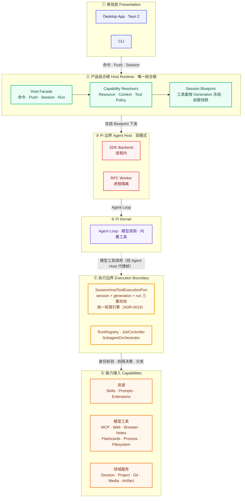

# piwin 产品架构（v2 正式版）

> 本文档是 piwin 的**正式架构基准**。后续功能开发、模块接入、契约变更均以此架构为准。
> 详细设计见 [`docs/architecture.md`](./docs/architecture.md) 与各 ADR。

## 一、架构图

## 二、六层职责与开发准则

### ① 表现层 Presentation

- 只与 Host 交互（命令 / Push / Session / Run），**永不导入 Pi 包**。
- Desktop 优先复用 `@piwin/ui-kit`；CLI 与 Desktop 共用同一 Host 与配置根 `~/.piwin`。

### ② 产品组合根 Host Runtime（`@piwin/host-runtime`）

- **全产品唯一组合根**：应用包、执行权威、双后端都在此处组合。
- `Capability Resolvers` 将设置、项目信任、资源目录、MCP 目录编译为能力快照；
- `Session Blueprint` 按 Runtime Generation 一次性冻结工具面与权限快照，**创建后模块不得自行修改**；
- 只允许一个工具组合点：`buildSessionHostTools`。

### ③ Pi 边界 Agent Host（`@piwin/agent-host`）

- 仓库中**唯一允许依赖 Pi 的包**；SDK（进程内）与 RPC（进程隔离）双模式实现同一组契约；
- 只做 Pi 适配与事件归一，不拥有产品权限策略、不读取产品设置。

### ④ Pi Kernel

- Agent Loop 与模型调用；内置工具（bash / write / edit 等）受 Host 门禁包装。

### ⑤ 执行边界 Execution Boundary

- `SessionHostToolExecutionPort` 是**模型调用 Host 自定义工具的唯一入口**：
  `sessionId + runtimeGenerationId + runId` 三重校验 + 统一权限引擎（ADR-0019）；
- `RunRegistry` / `JobController` / `SubagentOrchestrator` 构成单一 Run 树与取消路径。

### ⑥ 能力接入 Capabilities

- 按类型接入：资源（Skills / Prompts / Extensions）、模型工具（MCP / Web / Browser /
  Notes / Flashcards / Process / Filesystem）、领域服务（Session / Project / Git /
  Media / Artifact）；
- 能力包在 ② 注册（唯一事实源），执行统一经 ⑤ 分发；领域服务不强行改造成模型工具。

## 三、铁律（不妥协项）

1. **工具面单一事实源**：所有工具名单（family / policy / ceiling / manifest）从
   `buildSessionHostTools` 组合结果派生，禁止手写枚举；
2. **身份三分**：`sessionId` / `runtimeGenerationId` / `runId` 永远分离，工具调用、
   Worker 帧、Job owner、事件归属一律使用真实 `runId`；
3. **权限声明与决策分离**：descriptor 声明风险与所需权限事实，`allow/ask/deny` 由
   Host 规则引擎按运行时参数决定（ADR-0019）；
4. **无第二活路径**：新权威就绪即删除旧路径，不做转发兼容；
5. **依赖方向**：`apps/* → host-runtime → 应用包 + agent-host → contracts`，
   `agent-host` 是唯一 Pi 依赖点（详见 `AGENTS.md` §2）。
