<div align="center">

# Piwin 砚

<p align="center">
  
</p>

**A personal Coding Agent desktop built on Pi**

<sub><i>An inkstone grinds the ink and lets it settle — the best of many tools, gathered on one desk.</i></sub>

<p align="center">
  <a href="https://github.com/mimimaster/piwin/releases"></a>
  <a href="https://github.com/earendil-works/pi"></a>
  <a href="./docs/architecture.md"></a>
  <a href="https://docs.piwinwin.com"></a>
  
  
  <a href="./LICENSE"></a>
</p>

<p align="center">
  <a href="https://docs.piwinwin.com"><b>📖 Docs</b></a> ·
  <a href="#-quick-start"><b>⚡ Quick start</b></a> ·
  <a href="#-highlights"><b>✨ Highlights</b></a> ·
  <a href="#-architecture"><b>🏛️ Architecture</b></a> ·
  <a href="./docs/adr/"><b>📐 ADR</b></a>
</p>

<p align="center">
  <a href="./README.md">简体中文</a> | <b>English</b>
</p>

<br />

<p align="center">
  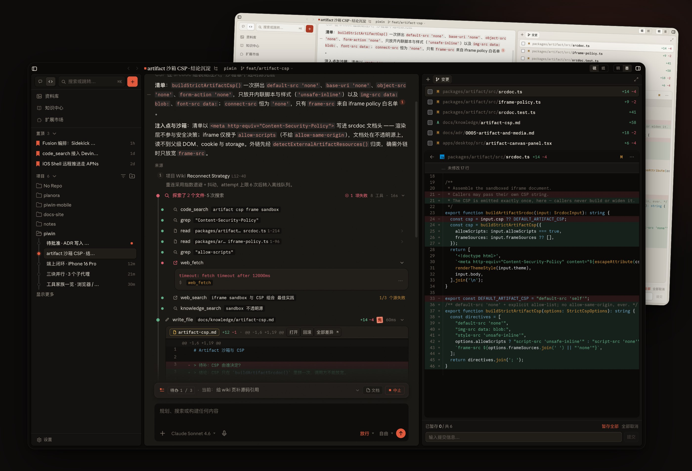
</p>

</div>

Piwin is a desktop Coding Agent built on the Pi SDK (v0.84.2). With Pi you stay in control of features, prompts and tool integrations; Piwin adds the GUI, one-click configuration and multi-device access on top — the client is separate from the Host Runtime, Desktop / Web / Mobile can all connect, and every byte of data stays on your machine.

> The screenshots below show the Simplified Chinese UI.

---

## ⚡ Quick start

Run every command from the repository root. Do **not** run the all-in-one app and a standalone Host on the same machine at the same time — both claim `~/.piwin` (point one of them at a different directory if you want several Hosts).

| Entry | Use case | Develop | Package / run |
| :--- | :--- | :--- | :--- |
| **Desktop** | All-in-one app, works out of the box | `pnpm dev:tauri` | `pnpm package:desktop` → install the dmg / exe |
| **Web** | Browser access, frontend and backend on one port | `pnpm dev:host` + `pnpm dev:web` | `pnpm package:web` → `./dist/piwin-host/start-host.sh` → `http://127.0.0.1:8787` |
| **Desktop Shell** | Lightweight desktop shell for a remote Host | `pnpm dev:tauri:shell` | `pnpm package:desktop-shell` → enter the `ws://` address |
| **Host** | Standalone backend for other clients | `pnpm dev:host` | `pnpm package:host` → `./dist/piwin-host/start-host.sh` |

### Download an installer (no setup required)

Grab the latest build from **[GitHub Releases](https://github.com/mimimaster/piwin/releases)**:

- **macOS**: `piwinwin_<version>_aarch64.dmg` — drag it into Applications
- **Windows**: `piwinwin_<version>_x64-setup.exe` — follow the installer; [Git Bash](https://git-scm.com/downloads/win) is recommended

The installers bundle Node 22 LTS, the Host sidecar, LanceDB and Tauri 2 — nothing else to install.

### Build from source

```bash
git clone https://github.com/mimimaster/piwin.git && cd piwin
pnpm install
pnpm check          # typecheck + architecture rules + unit tests
pnpm dev:tauri      # start the desktop app in dev mode
```

**Requirements**: Node ≥ 22 · pnpm ≥ 9 · Rust ≥ 1.75 (for the desktop build)

### Web deployment

```bash
pnpm install && pnpm package:web
./dist/piwin-host/start-host.sh   # http://127.0.0.1:8787
```

To expose it beyond localhost, put a TLS reverse proxy in front (Caddy / nginx / Tailscale Serve):

```bash
export PIWIN_HOST_BIND=127.0.0.1
export PIWIN_HOST_PORT=8787
export PIWIN_HOST_TOKEN='replace-with-a-long-random-secret'
export PIWIN_HOST_ALLOWED_ORIGINS='https://ui.example.com'
./start-host.sh
```

---

## ✨ Highlights

These are the things Piwin sets out to do well, each packaged as a ready-to-use product experience:

| # | Highlight | In one line |
| :-: | :--- | :--- |
| 1 | [**Hot-install Pi extensions**](#1-hot-install-pi-extensions) | Install from the marketplace, Git or a local path; active on the next turn — no restart, no lost session |
| 2 | [**Subagent orchestration**](#2-subagent-orchestration-ultra-code--fusion--reviewed-delivery) | Built-in Ultra Code, Fusion and Reviewed Delivery schemes, switched from the composer |
| 3 | [**Full-duplex voice**](#3-full-duplex-voice) | Talk it through while the Agent works in the background; interrupt any time |
| 4 | [**Models by capability**](#4-models-by-capability) | Reasoning, vision, image, video, realtime voice, embedding and reranker configured separately |
| 5 | [**One-click web search**](#5-one-click-web-search) | Start without an API key; switch search sources and page fetchers any time |
| 6 | [**Vision delegation**](#6-vision-delegation) | Text-only models can "see": a lightweight multimodal model digests screenshots |
| 7 | [**code_search**](#7-code_search) | A Host built-in code search tool that keeps the search process out of the main context |

<table>
  <tr>
    <td width="50%" valign="top">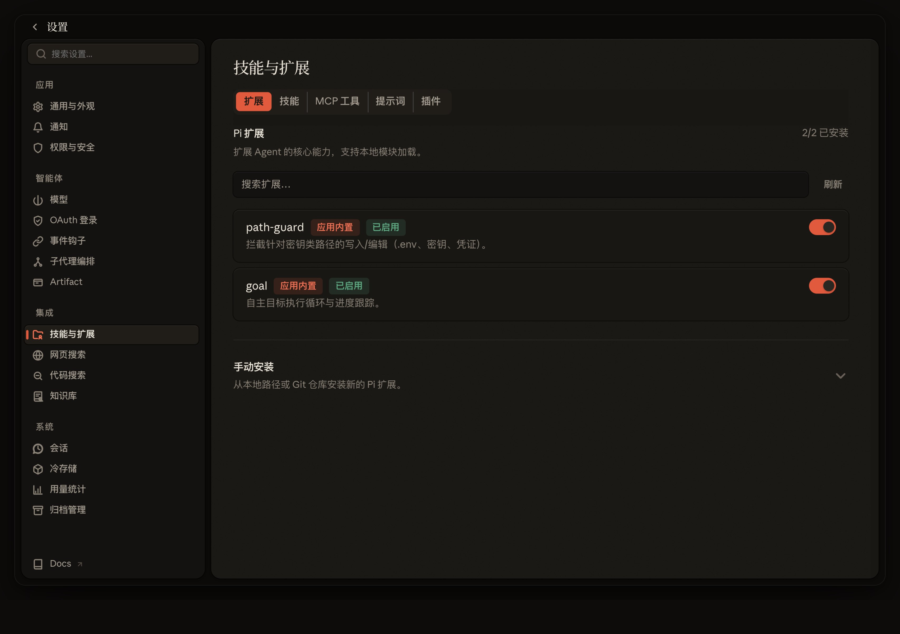<br /><sub><b>1 · Hot-install Pi extensions</b></sub></td>
    <td width="50%" valign="top">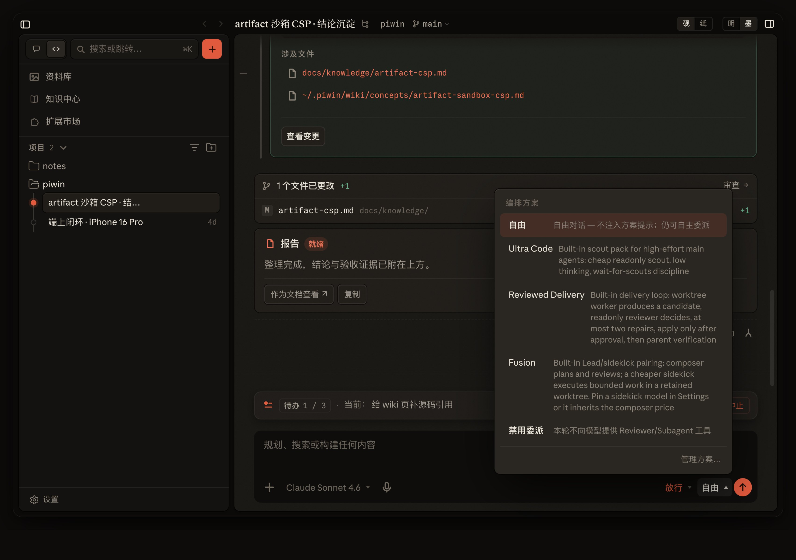<br /><sub><b>2 · Subagent orchestration: switch schemes from the composer</b></sub></td>
  </tr>
  <tr>
    <td width="50%" valign="top">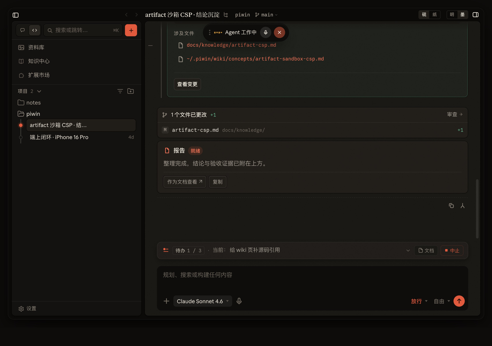<br /><sub><b>3 · Full-duplex voice: the Agent keeps working during the call</b></sub></td>
    <td width="50%" valign="top">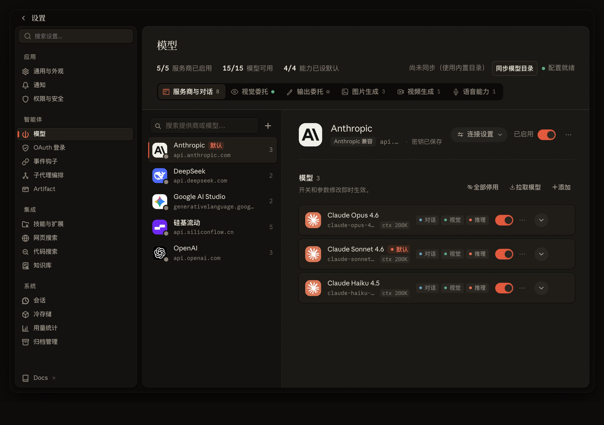<br /><sub><b>4 · Models by capability</b></sub></td>
  </tr>
  <tr>
    <td width="50%" valign="top">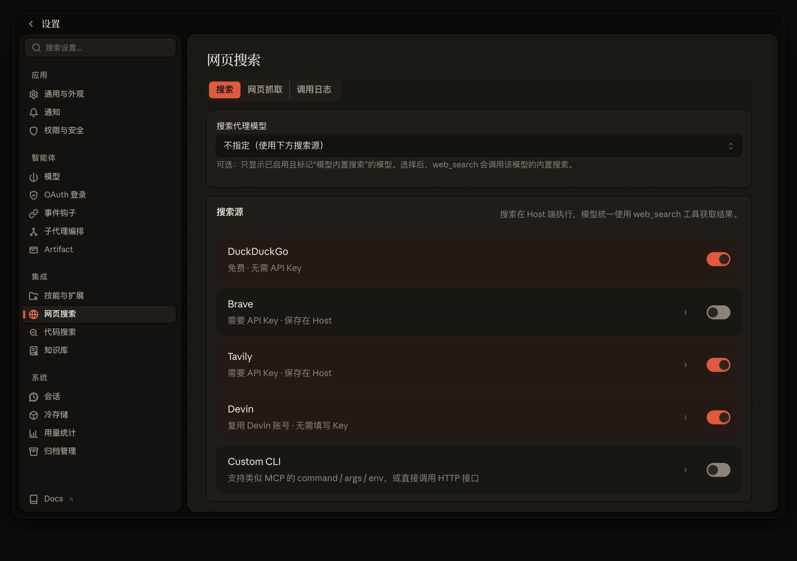<br /><sub><b>5 · One-click web search</b></sub></td>
    <td width="50%" valign="top">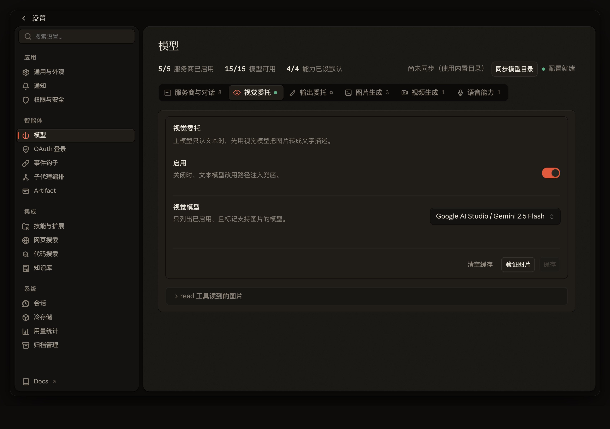<br /><sub><b>6 · Vision delegation</b></sub></td>
  </tr>
  <tr>
    <td width="50%" valign="top">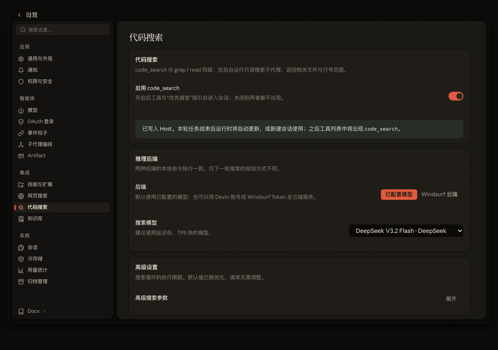<br /><sub><b>7 · code_search</b></sub></td>
    <td width="50%" valign="top">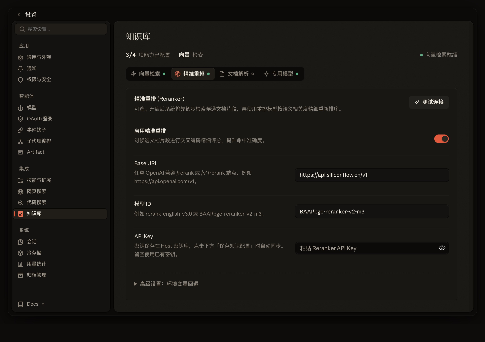<br /><sub><b>Knowledge base: embedding and reranker configured separately</b></sub></td>
  </tr>
</table>

### 1. Hot-install Pi extensions

- **Three ways to install**: search the extension marketplace, load from a Git URL or local path, or just ask the Agent in chat — it calls `extension_install` for you.
- **Hot activation**: a running task is never interrupted. Once the current Run finishes, the next turn mounts the new extension automatically; the session tree and chat history stay intact, and the client never restarts.
- **Coverage**: extension Tools, event Hooks, custom Providers and confirm / select / input dialogs all work in the desktop app; terminal-only TUI extensions are flagged up front instead of breaking after install.
- Extensions live under `~/.piwin/extensions/`; the Host manages their versions and enabled state.

### 2. Subagent orchestration: Ultra Code / Fusion / Reviewed Delivery

Switch schemes from the composer's orchestration picker. All three built-in schemes are implemented from public technical write-ups and product material:

| Scheme | Solves | How |
| :--- | :--- | :--- |
| **Ultra Code** | Context rot in the main session | Implemented after the Chinese article *Saving 5.6 Sol* and its breakdown of Codex Ultra: the main agent hands broad searches, research and verification to read-only **Scout** subagents. Raw grep output, file dumps and dead ends stay in a disposable child context; only the distilled conclusion flows back. Scouts can be pinned to a cheap model so they don't inherit the main model and burn through your quota |
| **Fusion** | Lower cost without losing quality | Modeled on Cognition's Devin Fusion: the current session is the **Lead** (a frontier model) and only plans, resolves ambiguity and does the final review; mechanical implementation goes to a cheaper, reusable **Sidekick** child session. The two exchange only briefs and results — **never the full conversation history** — so each keeps its own prompt cache warm |
| **Reviewed Delivery** | Merge quality | A **Worker** produces a candidate change in its own Git worktree; a read-only **Reviewer** returns a structured verdict, and only then is it merged back |

You can also build your own schemes: custom roles (scout / coder / reviewer / tester …), the model for each role, concurrency limits and the main agent's discipline — all edited visually in Settings.

### 3. Full-duplex voice

This is not speech-to-text dropped into the input box — **talking and working are separate**:

- The **speaking side** handles the live conversation: discuss the approach, correct course, interrupt at any time.
- When code needs changing or tests need running, it **hands a task brief to the Agent in the session**, which does the work and reports the result back in a sentence.

Keep your eyes on the page and direct the work out loud while the Agent moves it forward. Supports **Codex Live** (ChatGPT subscription), **Gemini Live** and any **OpenAI Realtime-compatible** endpoint.

### 4. Models by capability

Instead of one long list of models grouped by vendor, each model is configured by what it is used for, and every capability has its own default model and a test call:

| Capability | Used for |
| :--- | :--- |
| Chat / reasoning | Your main coding model, in Chat and Agent modes |
| Vision delegation | Reading images on behalf of text-only models (see below) |
| Reply writer | Optional: a lightweight model rewrites the final reply |
| Image generation | The `image_gen` tool; results land in the local library |
| Video generation | The `video_gen` tool; text-to-video / image-to-video |
| Realtime voice | The Live full-duplex voice channel |
| Embedding / reranker | Knowledge base vectorization and reranking |
| code_search backend | A configured model, or a Devin account / Windsurf token |

- **Providers**: any OpenAI-compatible endpoint (BYOK), or one-click OAuth for official subscriptions (Kimi Coding / Codex / Claude / Grok / Copilot / Devin).
- **Applies immediately**: the Host pushes settings changes, and running sessions pick them up on the next turn.

### 5. One-click web search

- **Search sources**: DuckDuckGo (no API key — works right after install), Brave, Tavily, Devin, or a local CLI.
- **Page fetching**: supermarkdown, Jina or Firecrawl.
- Switching sources never interrupts a session; `web_search` / `web_fetch` stay available.

### 6. Vision delegation

Attach a lightweight multimodal model to a text-only or expensive reasoning model: pasted screenshots are OCR'd and summarized automatically, and the main model only receives the condensed text — saving 70–90% of the context tokens. Platforms such as OpenRouter, SiliconFlow and GLM offer free multimodal models you can use right away.

### 7. code_search

A **Host built-in tool** on the same level as `read` / `grep`, modeled on Devin (Windsurf) Fast Context. The search runs in a separate read-only process and only the matching file paths, definitions and call relationships come back to the main model — thousands of irrelevant lines never flood the main context, so the Agent stays sharp on long tasks. Reuse your Devin account, or point it at a model you have already configured.

---

## 🧰 More

<table>
  <tr>
    <td width="50%" valign="top">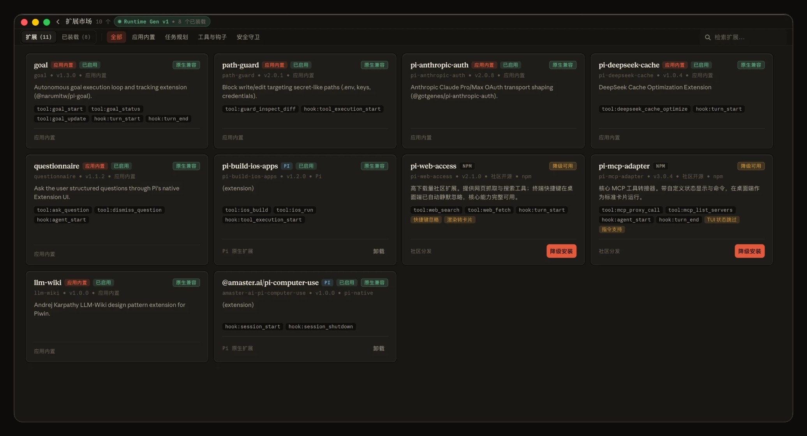<br /><sub><b>Extension marketplace: built-in, Pi-native and community extensions, labeled by compatibility</b></sub></td>
    <td width="50%" valign="top">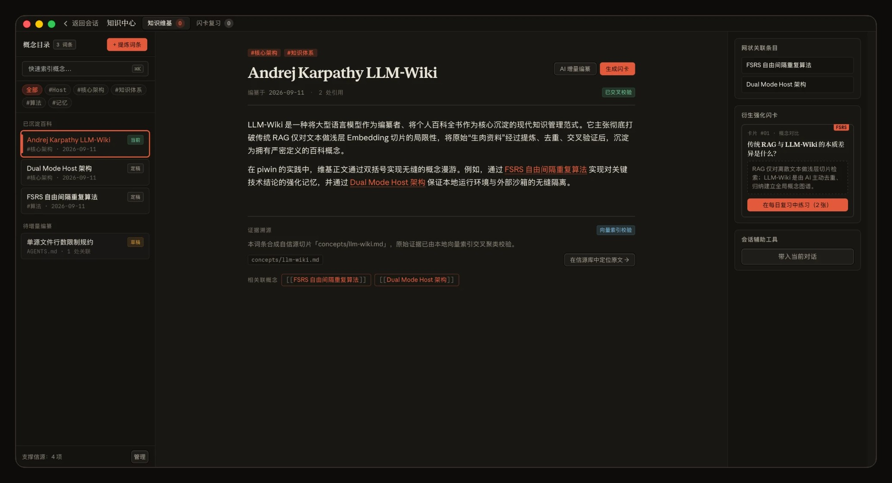<br /><sub><b>Knowledge center: LLM Wiki entries, linked concepts and derived flashcards</b></sub></td>
  </tr>
  <tr>
    <td width="50%" valign="top">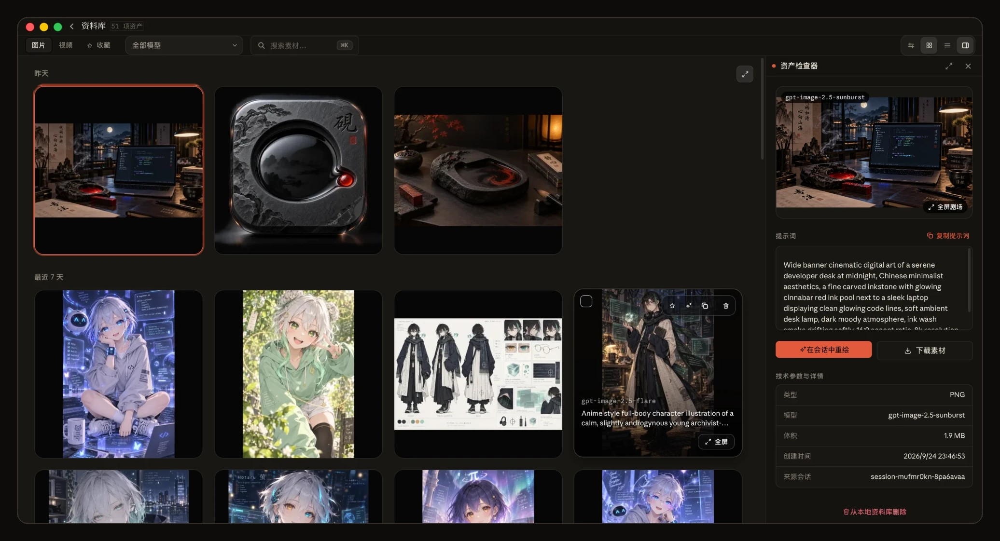<br /><sub><b>Library: generated images and videos in one place, with prompts and source sessions</b></sub></td>
    <td width="50%" valign="top">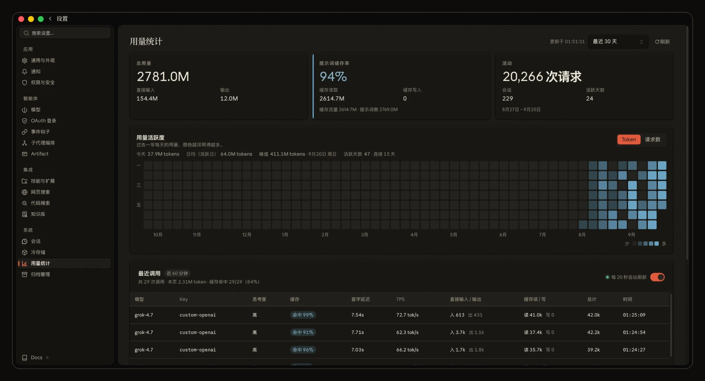<br /><sub><b>Usage: cache hit rate, activity heatmap and per-call details</b></sub></td>
  </tr>
</table>

<p align="center">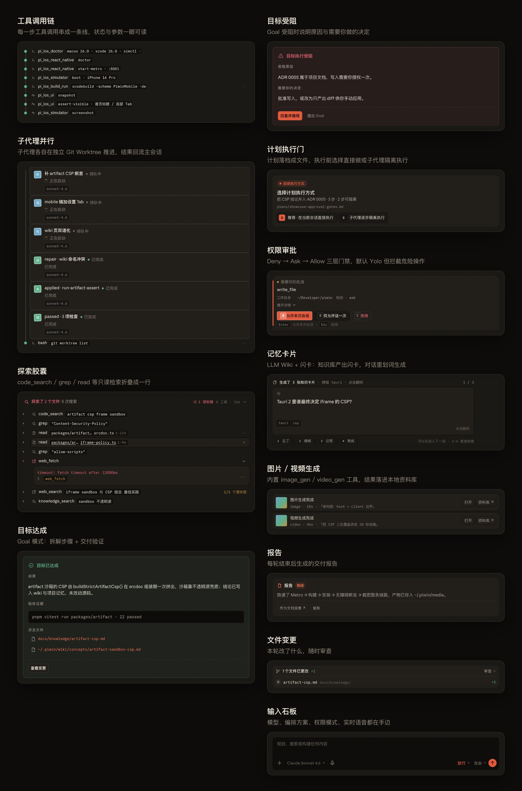</p>

| Capability | Details |
| :--- | :--- |
| **Native Pi SDK integration** | Built on Pi SDK v0.84.2, follows Pi's design principles (Yolo first, no Plan mode — plans are written to files) |
| **Artifact rendering** | Inline in the chat or in a separate Canvas panel; iframe + CSP sandbox; renders live while streaming |
| **Permission engine** | Three gates — Deny → Ask → Allow; Yolo by default while still blocking dangerous commands such as `rm`; per-project command allow-lists |
| **Built-in tools** | Terminal, browser, Canvas, Notes and more, covering the whole development loop |

- **Chat / Agent split** — Chat mode injects less context, is read-only and responds fast; Agent mode is the full toolset
- **Session tree** — persisted in SQLite; fork / clone / truncate and roll back; safe across power loss
- **Goal mode** — `/goal` opens a structured task panel: step breakdown plus delivery verification
- **LLM Wiki + flashcards** — the knowledge base produces flashcards; select text in the chat to create one; manage them in one place
- **Cache extension** — raises the prompt cache hit rate and lowers token spend
- **Flexible deployment** — client and Host are separate: all-in-one app, split frontend/backend or a remote server; an iOS shell is in development
- **Cold storage / usage statistics / Codex pet** — and more details to discover as you use it

---

## ⚙️ Configuration cheat sheet

| Module | Recommended setup | Docs (Chinese) |
| :--- | :--- | :--- |
| Official subscriptions (OAuth) | Settings → OAuth login; one-click authorization for Kimi / Codex / Claude / Grok | [Guide](https://docs.piwinwin.com/oauth-login.html) |
| Models & vision delegation | DeepSeek V3 / Claude 3.7 + Gemini Flash for vision | [Guide](https://docs.piwinwin.com/model-config.html) |
| Code Search | Reuse your Devin OAuth login, or paste a Devin token (free and fast) | [Guide](https://docs.piwinwin.com/token-acquisition.html) |
| Web Search | Start with keyless DuckDuckGo; Tavily API (1,000 free calls/month) / Devin key | [Guide](https://docs.piwinwin.com/web-search.html) |
| Realtime voice | Codex Live / Gemini Live / OpenAI Realtime protocol | [Guide](https://docs.piwinwin.com/realtime-voice.html) |
| Multi-device networking | Tailscale encrypted mesh; host the Host on a NAS | [Guide](https://docs.piwinwin.com/deployment.html) |

---

## 🏛️ Architecture

Clients → one Host authority → local data, with frontend and backend separated.

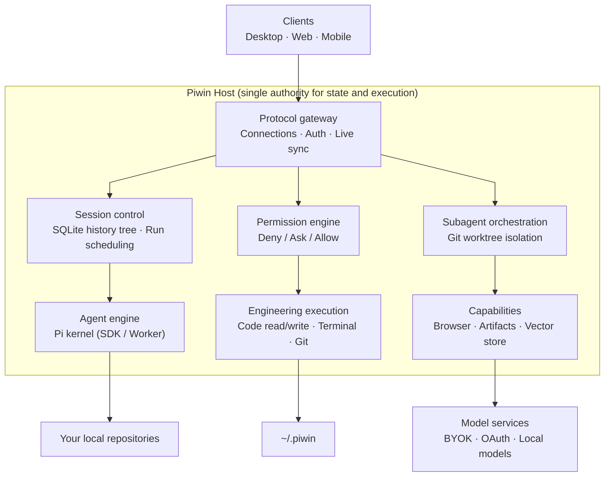

### Layers

| Layer | Location | Responsibility |
| :--- | :--- | :--- |
| Client presentation | `apps/desktop` · `mobile` | UI only; **never imports Pi packages** |
| Protocol & transport | `packages/contracts` · `host-client` · `host-transport` · `host-server` | Bidirectional stdio / WebSocket with replay on reconnect |
| Host composition root | `apps/host` · `packages/host-runtime` | The single source of truth for sessions, permissions and scheduling |
| Agent boundary | `packages/agent-host` | Drives Pi in SDK / RPC mode; the only entry point to the kernel |
| Capabilities | `packages/browser` · `mcp` · `git` · `artifact` · `doc-rag`, etc. | Browser, knowledge retrieval, media and artifacts, composed on demand |
| Local data | Repositories · `~/.piwin` · keychain | 100% local, nothing uploaded |

---

## 🗂️ Repository layout

```text
piwin/
├── apps/
│   ├── desktop/          # Tauri 2 desktop app (React 19 + Vite + Mantine)
│   ├── cli/              # Node.js terminal CLI (experimental, not guaranteed to work)
│   ├── host/             # Standalone Host server (WebSocket)
│   ├── mobile/           # Mobile shell (iOS / Android)
│   └── docs/             # Docs site (VitePress)
├── packages/
│   ├── contracts/        # Shared types & IPC protocol (pure leaf package)
│   ├── host-runtime/     # Product composition root + permission engine
│   ├── host-server/      # WebSocket service & connection management
│   ├── host-client/      # Client communication wrapper
│   ├── host-transport/   # WebSocket / stdio transport
│   ├── agent-host/       # Pi kernel adapter (SDK / RPC)
│   ├── browser/          # Playwright browser streaming
│   ├── doc-rag/          # LanceDB vector store + FSRS memory retrieval
│   ├── artifact/         # HTML/SVG artifact sandbox
│   ├── mcp/              # MCP process supervision & tool dispatch
│   ├── session/          # SQLite session tree & cold-storage archive
│   ├── git/              # Git operations & worktree isolation
│   ├── process/          # Child process management & reaping
│   ├── media/            # Multimodal asset storage
│   ├── tools-web/        # Web search & page cleanup
│   └── ui-kit/           # Shared Mantine UI component library
├── scripts/              # Build / notarization / packaging scripts
├── docs/                 # Architecture · ADRs · specs
└── AGENTS.md             # Rules for AI agents working in this repo
```

---

## 📐 Architecture rules

Every change must follow [`AGENTS.md`](./AGENTS.md). The core rules:

1. `apps/*` **must not** import Pi packages; go through `@piwin/contracts` or the Host protocol
2. `packages/host-runtime` is the **only composition root**
3. **Strict DAG dependencies**: the whole repository forms a directed acyclic graph flowing one way down — `apps → host-runtime → packages/* + agent-host → contracts`. CI checks it and rejects any reverse edge
4. No empty `catch (e) {}`; async work must have timeouts and cleanup
5. New cross-cutting capabilities start as contracts in `@piwin/contracts`

---

## 🤝 Contributing & community

- **Docs**: [docs.piwinwin.com](https://docs.piwinwin.com)
- **Repository**: [github.com/mimimaster/piwin](https://github.com/mimimaster/piwin)
- **Feedback & PRs**: [GitHub Issues](https://github.com/mimimaster/piwin/issues)

---

## 友情链接 / Links

[Linux.Do](https://linux.do) — 新的理想型社区

---

### License

[MIT](./LICENSE) — source code, session history and credentials stay on your machine by default. Your code and your data are yours.
