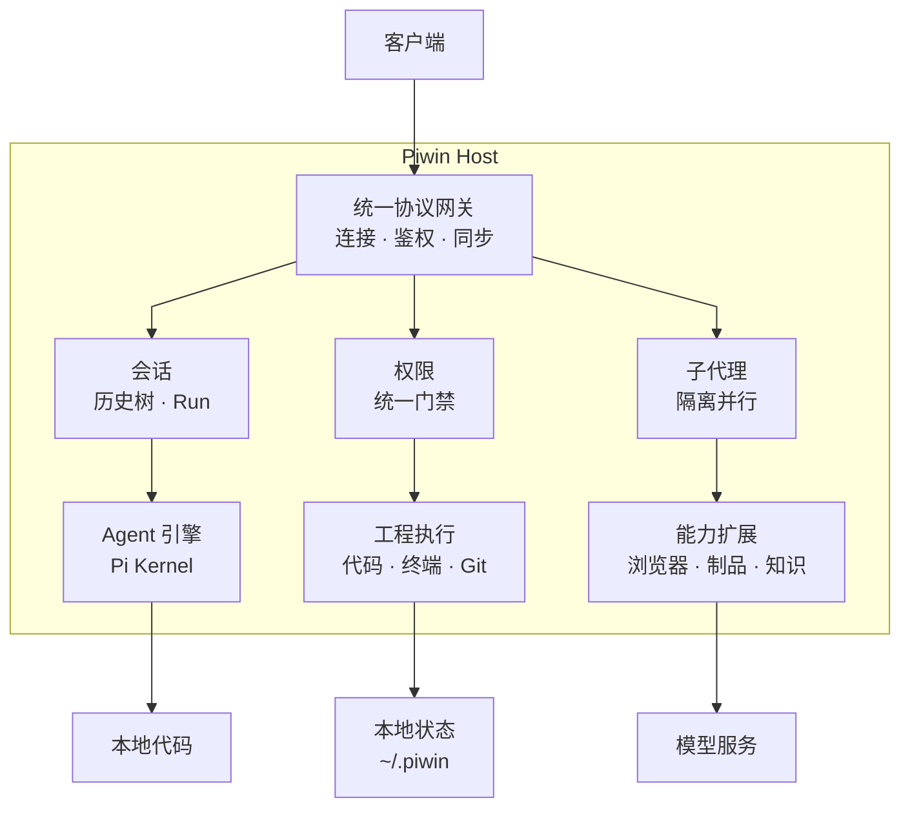

# piwin

> **私有化、现代化的高性能智能编程 Agent 工作台与操作系统**  
> 构筑于 Pi 内核之上，具备清晰分层、独立可部署的 Host 权威、多端解耦契约以及模块化扩展生态。

[English](./docs/en/README.md) · **简体中文** · [架构设计](./ARCHITECTURE.md) · [开发规则](./AGENTS.md) · [打包指南](./docs/release-desktop.md)

---

## 🚀 第一版桌面一体包正式版 (v1.0 All-in-One Desktop)

**当前发布版本为 macOS（Apple Silicon）全功能一体化桌面正式版**。

- **开箱即用，零环境依赖**：普通用户无需在电脑上配置 Node.js、pnpm、Python 或 Rust 等开发环境。安装包内置独立沙盒化的 **Node 22 LTS 运行时、Host Sidecar 守护进程、LanceDB 原生向量引擎与 Tauri 2 桌面应用**。
- **直接下载安装**：前往仓库右侧 **[Releases](https://github.com/mimimaster/piwin/releases)** 下载最新版本的 `piwinwin_<version>_aarch64.dmg`，双击拖入「应用程序（Applications）」文件夹即可使用。
  > *初次打开提示*：由于未购买商业开发者证书，首次启动若系统提示「无法验证开发者」，前往 macOS「系统设置 → 隐私与安全性」点击「仍要打开」即可正常启动。
- **后续规划**：Windows 原生安装包、Linux AppImage 及移动端外壳正按规划推进中。

---

## 📖 项目简介

`piwin` 是一个专为严肃软件工程打造的**私有化智能编程 Agent 宿主环境（Coding-Agent Shell / Workbench）**。

与传统的“套壳对话框”或“强侵入式 IDE 插件”不同，`piwin` 采用**内核与表现层解耦**的架构：前端客户端只负责呈现和人机交互，所有的代码读写、Shell 执行、模型调用、权限审查、子代理编排均由自主可控的 **Host 运行时** 统一管理。

无论是在日常编码、系统排错、复杂需求拆解、全栈架构重构，还是在基于浏览器的前端调优场景中，`piwin` 都能提供沉稳、可靠、零污染且可追溯的 Agent 协作体验。

---

## 整体架构

`piwin` 采用 **客户端接入、单一 Host 权威、数据留在本地** 的产品架构。



### 架构解读

| 产品层 | 关键代码位置 | 对外职责 |
| :--- | :--- | :--- |
| **多端体验** | `apps/desktop` · `apps/cli` · `apps/mobile` | 提供不同终端下的一致 Agent 体验；客户端只负责交互与呈现。 |
| **连接与同步** | `packages/contracts` · `packages/host-client` · `packages/host-transport` · `packages/host-server` | 以统一协议连接本机或远程 Host，完成鉴权、命令、实时推送与断线重放。 |
| **Host 控制面** | `apps/host` · `packages/host-runtime` | 全产品唯一组合根和状态权威，统一管理会话、运行、权限、调度、工具与子代理。 |
| **Agent 执行引擎** | `packages/agent-host` · Pi Kernel | 通过进程内 SDK 或隔离 Worker 驱动模型与 Agent Loop；这是仓库中唯一接触 Pi 的边界。 |
| **能力生态** | `packages/browser` · `packages/mcp` · `packages/git` · `packages/doc-rag` · `packages/artifact` 等 | 将工程执行、浏览器、知识、媒体和扩展能力按需组合进 Host，不污染客户端与 Agent 内核。 |
| **数据与基础设施** | 本地项目 · `~/.piwin` · 模型提供方 | 代码、会话和配置默认由用户掌控；模型支持订阅、BYOK 与本地兼容服务。 |

**四个核心设计原则：**

1. **一个 Host，多端共享**：Desktop、CLI、Mobile / Future Web 连接同一份会话、状态与执行环境。
2. **客户端与内核解耦**：所有客户端只依赖公开契约，不直接调用 Pi 或操作 Host 文件系统。
3. **控制面统一收口**：权限、Run、工具、子代理和持久化全部由 Host Runtime 编排，没有第二条旁路。
4. **能力可插拔、数据私有化**：功能以独立包接入；项目、配置、会话与媒体默认保留在用户自己的机器上。

---

## ✨ 核心特性

### 1. 多窗格智能工作台（Agent Window & Multi-Pane）
- **灵活分屏**：单窗口支持 1 / 2 / 4 / 8 独立会话窗格自由切分（Split Right/Down），保持各子任务独立流式输出与上下文隔离。
- **对话树分支系统**：基于 SQLite 构建的完整会话历史树，支持分支分叉（Fork）、完整克隆（Duplicate）、阶段截断回滚与状态持久化。
- **Goal 目标模式**：通过 `/goal` 唤起任务目标追踪栏，结构化管理任务拆解、阻塞等待与最终交付验证。

### 2. 安全高效的子代理并发编排（Subagent Orchestrator）
- **Git Worktree 物理隔离**：写操作子任务自动派生至独立的临时 Git Worktree 分支并行编码，主工作区不受未完成代码污染。
- **原子审查与集成**：任务结束后自动冻结变更集，支持主工程自动集成（Integrate）或人工审查比对，具备全流程原子级 Undo / Redo 回滚能力。

### 3. 主动式 HTML / SVG 制品沙箱（Artifact Runtime）
- **流式安全渲染**：支持在对话流中直接解析预览 HTML、SVG、React 原生可视化组件，提供 Inline 内嵌视图与独立 Canvas 宽屏工作区视图。
- **严格安全防御**：移植成熟的安全沙箱策略，隔离运行任意生成的 Web 应用或图表，防止脚本提权与外部非受信资源访问。

### 4. 主机级浏览器工作台（Browser Workbench）
- **Playwright 原生驱动**：Host 统一管理专属 Chromium 实例，支持 AI 视线级交互与操作（点击、表单填充、滚动、网络监听、控制台捕获）。
- **Aria Snapshot 语义定位**：采用无坐标偏差的无障碍语义树映射算法，精准定位并操作网页元素。
- **低延迟实时镜像**：桌面端右侧面板可实时推流显示浏览器画面，支持人机协同接管控制（Agent / User 锁机制）。

### 5. 本地私有化知识库与 Doc-RAG
- **混合向量检索**：基于 `@lancedb/lancedb` 原生向量数据库构建，融合向量语义搜索与 BM25 全文分词检索（Hybrid RRF 融合）。
- **知识抽取与记忆沉淀**：支持文件夹文档即时检索、本地 Markdown 笔记库管理与 FSRS 算法驱动的智能复习抽认卡（Flashcards）。

### 6. 企业级统一权限决策引擎（Permission Engine）
- **Deny → Ask → Allow 三层门禁**：遵循最高安全规范，拒绝任何违规操作隐式放行；严格阻断对 `.ssh/`、`.env`、密钥等敏感系统目录的越权修改。
- **免打扰工程记忆**：支持项目维度的常用命令记忆与安全白名单放行，保障敏捷开发的同时防范毁灭性指令（如误删、非预期 force push）。

---

## 💻 开发者二次开发与构建

如果你需要基于源码定制或自行编译开发：

### 环境要求
- **操作系统**：macOS (Apple Silicon 推荐)、Linux
- **依赖工具**：Node.js `>= 22.0.0`、pnpm `>= 9.0.0`、Rust `>= 1.75.0`

### 本地编译步骤

```bash
# 1. 克隆代码库
git clone git@github.com:mimimaster/piwin.git
cd piwin

# 2. 安装全部依赖
pnpm install

# 3. 启动开发模式（UI + 本地调试 Host）
pnpm dev:desktop

# 4. 本地打包完整 macOS 一体化安装包 (.dmg)
pnpm package:desktop
```

生成的安装包将存放在：
```text
apps/desktop/src-tauri/target/release/bundle/dmg/piwinwin_<version>_aarch64.dmg
```

---

## 🛠️ 持续集成与发布 (CI / CD)

本仓库已配置高度自动化的 GitHub Actions 流水线：

- **自动化质量门禁 (`.github/workflows/ci.yml`)**：
  每次代码推送到 `main` 时，自动运行全量单测、类型检查（TypeScript strict）与架构规则校验。
- **macOS 云端打包与发布 (`.github/workflows/package-macos.yml`)**：
  - **自动发版流水线**：向仓库推送 `v*` 格式的 Git 标签时，自动在云端 macOS 运行机上编译生成 DMG，并在 GitHub Releases 自动创建对应的发布草稿（Draft Release）并挂载附件：
    ```bash
    git tag v0.1.0
    git push origin v0.1.0
    ```

---

## 📂 仓库目录结构

```text
piwin/
├── apps/                        # 客户端与应用外壳
│   ├── desktop/                 # Tauri 2 桌面端主应用 (React + Mantine)
│   ├── cli/                     # Node.js 交互式命令行工具
│   ├── mobile/                  # Tauri 移动端外壳
│   └── docs/                    # VitePress 技术文档站
├── packages/                    # 领域包与能力库
│   ├── contracts/               # 全局共享类型定义、IPC 协议与事件规范 (底层叶子包)
│   ├── host-runtime/            # 全局唯一产品组合根、权限引擎与调度器
│   ├── agent-host/              # Pi 内核适配层 (SDK / RPC 双模式)
│   ├── browser/                 # Playwright 浏览器会话与实时推流服务
│   ├── doc-rag/                 # LanceDB 本地向量知识库与检索服务
│   ├── artifact/                # HTML / SVG 制品解析与安全预览沙箱
│   ├── mcp/                     # Model Context Protocol 进程监督者
│   ├── session/                 # 会话历史存储 (SQLite 树形存储) 与冷存归档
│   ├── git/                     # Git 仓库操作与 Worktree 并发管理
│   ├── process/                 # 跨平台子进程树管理与自动收割
│   ├── media/                   # 剪贴板/多模态图片资产管理
│   ├── tools-web/               # 网络搜索与网页提取服务
│   └── ui-kit/                  # 桌面端共享 Mantine UI 组件库
├── scripts/                     # 自动化构建、公证、校验与打包脚本
├── docs/                        # 架构说明 (ADR)、产品设计 (PRD) 与规格手册
└── AGENTS.md                    # 专为 AI Agent 与人类协作者制定的核心架构开发红线
```

---

## 🛡️ 架构红线 (Anti-Shitpile 准则)

为了保证系统长期演进的整洁度与高可靠性，所有提交必须严格遵守 [`AGENTS.md`](./AGENTS.md) 中的铁律：

1. **绝对禁止跨层污染**：表现层（`apps/*`）严禁直接导入 Pi 相关包，必须通过 `@piwin/contracts` 或 Host 契约交互。
2. **唯一组合根**：`packages/host-runtime` 是全仓库唯一允许装配能力与业务逻辑的中心，禁止在子包内建立暗道。
3. **单向依赖图**：依赖严格向下流动：`apps → host-runtime → packages/* + agent-host → contracts`。
4. **单文件硬上限 1000 行**：任何单文件接近 400 行时必须规划职责拆分，超过 1000 行直接判定违规。
5. **严禁静默异常**：禁止任何形式的空 `catch(e) {}` 捕获，所有异步通道必须具备超时与显式销毁机制。

---

## 📄 开源与隐私声明

- 配置文件与用户状态默认存储于 `~/.piwin`，敏感凭证依托本地安全存储，绝对保证用户本地代码与隐私安全。
- 架构设计文档、变更决策记录（ADR）完整归档于 [`docs/adr/`](./docs/adr/)。
