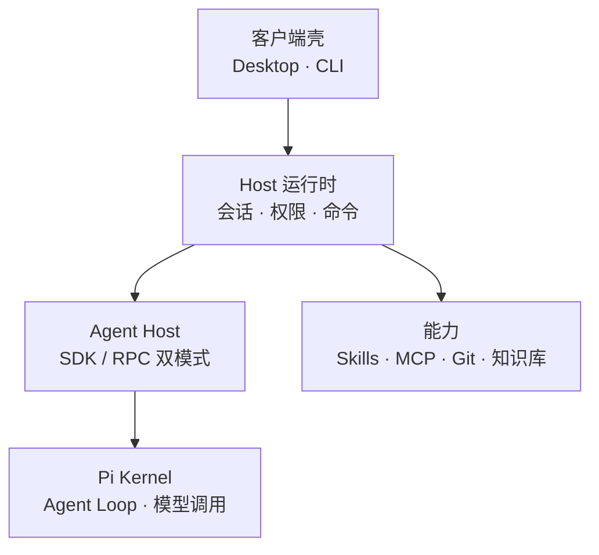

# piwin

还在开发中。

第一版只保证 **Mac 综合包**（Host + 桌面壳）。Windows、iOS、安卓后面再做。移动壳现在不打包。

## 架构



| 层 | 位置 | 职责 |
| --- | --- | --- |
| 客户端壳 | `apps/desktop`、`apps/cli` | 只跟 Host 通信，不直接依赖 Pi |
| Host 运行时 | `packages/host-runtime` | 唯一组合根：组装能力、管会话、做权限决策 |
| Agent Host | `packages/agent-host` | 唯一依赖 Pi 的边界，进程内与进程隔离两种模式 |
| Pi Kernel | 外部内核 | Agent Loop、模型调用、内置工具 |
| 能力 | `packages/*` | Skills、MCP、Git、媒体、知识库等 |

配置根为 `~/.piwin`，Desktop 与 CLI 共用同一个 Host。完整分层与约束见 [`ARCHITECTURE.md`](./ARCHITECTURE.md)。

## 怎么用

自己在本机打总包：

```bash
pnpm install
pnpm package:desktop
```

打出来的 DMG 在 `apps/desktop/src-tauri/target/release/bundle/dmg/`。拖到「应用程序」再打开。

本机磁盘紧或上次残留临时 DMG 时，同一个命令会清挂载并尝试补签/补打，结束时打印路径。

GitHub Actions 工作流 `package-macos` 可以远程打同一份一体包（手动触发或 `v*` tag → draft Release）。详见 [`docs/guides/package-macos-ci.md`](./docs/guides/package-macos-ci.md)。打出来的包目前没有 Apple 公证。第一次打开如果系统提示「无法验证开发者」，到「系统设置 → 隐私与安全性」选「仍要打开」。

## 运行环境

- macOS（Apple Silicon）
- 需要本机有 Node / pnpm；打桌面包还要 Rust
- 配置目录：`~/.piwin`

## 说明

项目还不稳定，接口和界面都可能变。有问题开 Issue。
