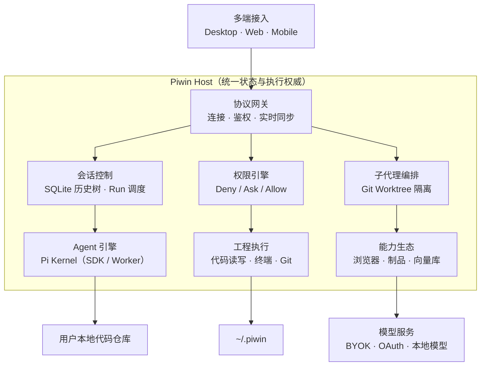

<div align="center">

# Piwin 砚

<p align="center">
  
</p>

**基于 Pi 的面向个人的 Coding Agent Desktop**

<p align="center">
  <a href="https://github.com/mimimaster/piwin/releases"></a>
  <a href="./docs/architecture.md"></a>
  <a href="https://docs.piwinwin.com"></a>
  
  
  <a href="./LICENSE"></a>
</p>

<p align="center">
  <a href="https://docs.piwinwin.com"><b>📖 文档</b></a> ·
  <a href="#-快速上手"><b>⚡ 快速上手</b></a> ·
  <a href="#-功能矩阵"><b>✨ 功能矩阵</b></a> ·
  <a href="#-架构总览"><b>🏛️ 架构</b></a> ·
  <a href="./docs/adr/"><b>📐 ADR</b></a>
</p>

<p align="center">
  <b>简体中文</b> | <a href="./docs/en/README.md">English (Coming Soon)</a>
</p>

<br />

<p align="center">
  
</p>

</div>

---

## 为什么做这个

现在各类coding agent层出不穷，功能也天天迭代，是否看的眼花缭乱？是否担心自己的数据被遥测？ Pi 其实是可以解决大家问题的首选 Coding Agent，自己把控功能，自己决定提示词和工具接入；
但对于不习惯终端操作、嫌弃配置麻烦、偏好桌面端的用户，一个生态足够丰富、功能齐全的desktop也是很重要的

Piwin 就是这样的桌面端应用 —— 基于 Pi SDK，客户端与 Host Runtime 分离，支持 Desktop / Web / Mobile 多端接入，所有数据留在本地。

> *砚者，研墨沉淀、静水流深。集百家之所长，归于一案之间。*

---

## ⚡ 快速上手

所有命令在仓库根目录执行。一体包和独立 Host **不要在同一台机器同时开**（会抢 `~/.piwin`，可以自己额外指向目录从而达成多host配置）。

| 入口 | 场景 | 开发 | 打包 / 使用 |
| :--- | :--- | :--- | :--- |
| **Desktop** | 一体包，开箱即用 | `pnpm dev:tauri` | `pnpm package:desktop` → 安装 dmg / exe |
| **Web** | 浏览器访问，前后端同端口 | `pnpm dev:host` + `pnpm dev:web` | `pnpm package:web` → `./dist/piwin-host/start-host.sh` → `http://127.0.0.1:8787` |
| **Desktop Shell** | 轻量桌面壳，连远程 Host | `pnpm dev:tauri:shell` | `pnpm package:desktop-shell` → 填 `ws://` 地址 |
| **Host** | 独立后端，供其他客户端连接 | `pnpm dev:host` | `pnpm package:host` → `./dist/piwin-host/start-host.sh` |

### 下载安装包（零环境门槛）

前往 **[GitHub Releases](https://github.com/mimimaster/piwin/releases)** 下载最新版：

- **macOS**：`piwinwin_<version>_aarch64.dmg` — 拖入 Applications 即可
- **Windows**：`piwinwin_<version>_x64-setup.exe` — 按指引安装，推荐预装 [Git Bash](https://git-scm.com/downloads/win)

安装包内置 Node 22 LTS + Host Sidecar + LanceDB + Tauri 2，无需额外环境。

### 从源码开发

```bash
git clone https://github.com/mimimaster/piwin.git && cd piwin
pnpm install
pnpm check          # 类型检查 + 架构红线 + 单测
pnpm dev:tauri      # 启动桌面端开发
```

**环境要求**：Node ≥ 22 · pnpm ≥ 9 · Rust ≥ 1.75（桌面端编译）

### Web 部署

```bash
pnpm install && pnpm package:web
./dist/piwin-host/start-host.sh   # http://127.0.0.1:8787
```

对外暴露时，在前面放 TLS 反代（Caddy / nginx / Tailscale Serve）：

```bash
export PIWIN_HOST_BIND=127.0.0.1
export PIWIN_HOST_PORT=8787
export PIWIN_HOST_TOKEN='换成长随机口令'
export PIWIN_HOST_ALLOWED_ORIGINS='https://ui.example.com'
./start-host.sh
```

---

## ✨ 功能矩阵

### 核心能力

| 能力 | 说明 |
| :--- | :--- |
| **Pi SDK 原生集成** | 遵循 Pi 设计原则（Yolo First，无 Plan 模式——落档成计划文件） |
| **Code Search** | 参考 Devin Fast-Context 实现的代码语义检索工具，与 grep / read 同级，防止上下文腐烂，提升 Agent 决策质量 |
| **子代理编排** | 自定义子代理派发方式，内置 **Ultra Code**（侦察兵 + 精准打击）和 **Fusion**（SOTA 规划 + 高性价比执行）两种编排，详见下文 |
| **Artifact 渲染** | Inline 内嵌 + Canvas 独立面板双模态，iframe + CSP 安全沙箱，流式实时渲染 |
| **BYOK 配置** | 极其自由的配置方式，覆盖文本模型、音视频模型、embedding、reranker 等各类模型的配置与委托；支持自定义端点 + OAuth 一键登录官方订阅（Kimi Coding / Codex / Claude / Grok / Copilot / Devin） |
| **视觉委托** | 给纯文本模型挂轻量多模态节点，粘贴截图自动 OCR + 特征提炼，省 70–90% 上下文 Token（OpenRouter / 硅基流动 / GLM 等平台提供免费多模态模型可直接使用） |
| **全双工语音** | 边聊天边 Coding 的语音托管，支持 OpenAI Realtime / Codex Live / Grok 语音通道 |
| **权限引擎** | Deny → Ask → Allow 三层门禁，默认 Yolo 但拦截 rm 等危险操作，支持项目级命令白名单 |
| **扩展生态** | 支持 Agent Runtime 级别的 Pi 扩展热插拔，内置扩展市场，可分级安装扩展，无需重启客户端 |
| **内置工具集** | Terminal、浏览器、画布（Canvas）、Note 等多工具配合使用，覆盖开发全流程 |

### 更多亮点

- **Chat / Agent 分离** — Chat 模式更少上下文注入、只读、响应快；Agent 模式更专业
- **会话树** — SQLite 持久化，支持分叉 / 克隆 / 截断回滚 / 断电安全
- **Goal 模式** — `/goal` 唤起结构化任务面板，拆解步骤 + 交付验证
- **LLM Wiki + 闪卡** — 知识库产出闪卡，对话区域划词生成，支持闪卡管理
- **缓存扩展** — 提高提示词缓存命中率，降低 Token 消费
- **多媒体生成** — 内置 `image_gen`（Flux / DALL-E）+ `video_gen` 工具契约
- **灵活部署** — 客户端与 Host 分离，一体包 / 前后端分离 / 远程服务器均可，iOS Shell 开发中
- **冷存储 / 用量统计 / Codex 宠物** — 更多细节在使用中发现

---

### 子代理编排详解

**Ultra Code（侦察兵 + 精准打击）**

先派只读 Scout 子代理完成全代码库的依赖梳理与影响面分析，输出结构化蓝图；主模型在纯净上下文中精准落实修改。零上下文注意力稀释，结合 Code Search 效果更佳。

**Fusion（SOTA 规划 + 高性价比执行）**

参考 Devin 公开资料实现。规划与执行解耦 —— Lead 用顶尖模型把握架构，Sidekick 配高速轻量模型处理机械编码。所有写入在 Git Worktree 临时分支中并发实测与编译自愈，测试通过后原子级合入主分支，Token 成本降低 60%+。

---

## ⚙️ 配置速查

| 模块 | 推荐方案 | 文档 |
| :--- | :--- | :--- |
| OAuth 官方订阅 | 设置 → OAuth 登录，一键授权 Kimi / Codex / Claude / Grok | [指南](https://docs.piwinwin.com/oauth-login.html) |
| 模型 & 视觉委托 | DeepSeek V3 / Claude 3.7 + Gemini Flash 视觉 | [指南](https://docs.piwinwin.com/model-config.html) |
| Code Search | Devin OAuth 登录后直接复用，或手动填入 Devin Token（免费极速） | [指引](https://docs.piwinwin.com/token-acquisition.html) |
| Web Search | Tavily API（1000 次/月免费）/ Devin Key | [指南](https://docs.piwinwin.com/web-search.html) |
| 实时语音 | OpenAI Codex Live / Realtime 协议 | [指南](https://docs.piwinwin.com/realtime-voice.html) |
| 多端组网 | Tailscale 加密组网，Host 托管 NAS | [指南](https://docs.piwinwin.com/deployment.html) |

---

## 🏛️ 架构总览

客户端 → Host 单一权威 → 本地数据，前后端分离。



### 分层职责

| 层 | 位置 | 职责 |
| :--- | :--- | :--- |
| 多端表现层 | `apps/desktop` · `mobile` | UI 呈现，**不导入 Pi 包** |
| 协议与传输 | `packages/contracts` · `host-client` · `host-transport` · `host-server` | stdio / WebSocket 双向通讯，断线重放 |
| Host 组合根 | `apps/host` · `packages/host-runtime` | 唯一状态权威，统筹会话 / 权限 / 调度 |
| Agent 边界 | `packages/agent-host` | Pi SDK / RPC 双模式驱动，接触内核的唯一入口 |
| 能力生态 | `packages/browser` · `mcp` · `git` · `artifact` · `doc-rag` 等 | 浏览器 / 知识检索 / 媒体 / 制品按需装配 |
| 本地数据 | 代码库 · `~/.piwin` · 密钥管理器 | 100% 本地，零数据上传 |

---

## 🗂️ 仓库结构

```text
piwin/
├── apps/
│   ├── desktop/          # Tauri 2 桌面端 (React 19 + Vite + Mantine)
│   ├── cli/              # Node.js 终端 CLI (实验性，暂不保证可用)
│   ├── host/             # 独立 Host 服务端 (WebSocket)
│   ├── mobile/           # 移动端 Shell (iOS / Android)
│   └── docs/             # 文档站 (VitePress)
├── packages/
│   ├── contracts/        # 共享类型 & IPC 协议 (纯叶子包)
│   ├── host-runtime/     # 产品组合根 + 权限引擎
│   ├── host-server/      # WebSocket 服务 & 连接管理
│   ├── host-client/      # Client 通信封装
│   ├── host-transport/   # WebSocket / stdio 传输
│   ├── agent-host/       # Pi 内核适配 (SDK / RPC)
│   ├── browser/          # Playwright 浏览器推流
│   ├── doc-rag/          # LanceDB 向量库 + FSRS 记忆检索
│   ├── artifact/         # HTML/SVG 制品沙箱
│   ├── mcp/              # MCP 进程监督 & 工具分发
│   ├── session/          # SQLite 会话树 & 冷存归档
│   ├── git/              # Git 操作 & Worktree 隔离
│   ├── process/          # 子进程管理 & 回收
│   ├── media/            # 多模态资产存储
│   ├── tools-web/        # 网络检索 & 网页清洗
│   └── ui-kit/           # 共享 Mantine UI 组件库
├── scripts/              # 构建 / 公证 / 打包脚本
├── docs/                 # 架构设计 · ADR · Specs
└── AGENTS.md             # AI Agent 协作规范
```

---

## 📐 架构红线

所有代码变更必须遵守 [`AGENTS.md`](./AGENTS.md)，核心规则：

1. `apps/*` **禁止**导入 Pi 包，必须经 `@piwin/contracts` 或 Host 协议
2. `packages/host-runtime` 是**唯一组合根**
3. **严格 DAG 依赖拓扑**：全仓库依赖关系构成有向无环图，单向向下流动 `apps → host-runtime → packages/* + agent-host → contracts`，CI 自动校验，任何反向边直接拒绝合入
4. 禁止空 `catch (e) {}`，异步任务必须有超时和清理
5. 新跨域能力先在 `@piwin/contracts` 定义契约

---

## 🤝 参与 & 社区

- **文档站**：[docs.piwinwin.com](https://docs.piwinwin.com)
- **代码仓库**：[github.com/mimimaster/piwin](https://github.com/mimimaster/piwin)
- **反馈 & PR**：[GitHub Issues](https://github.com/mimimaster/piwin/issues)

### License

[MIT](./LICENSE) — 所有源码、会话记录与凭证默认存储于用户本地，尊重代码主权与数据隐私。
