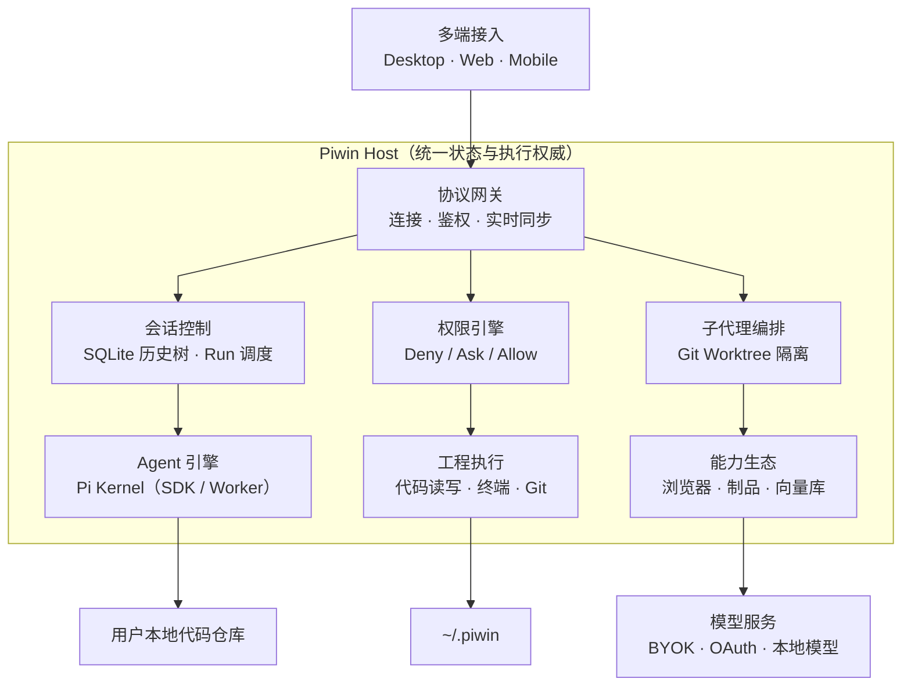

<div align="center">

# Piwin 砚

<p align="center">
  
</p>

**基于 Pi 的面向个人的 Coding Agent Desktop**

<sub><i>砚者，研墨沉淀、静水流深。集百家之所长，归于一案之间。</i></sub>

<p align="center">
  <a href="https://github.com/mimimaster/piwin/releases"></a>
  <a href="./docs/architecture.md"></a>
  <a href="https://docs.piwinwin.com"></a>
  
  
  <a href="./LICENSE"></a>
</p>

<p align="center">
  <a href="https://docs.piwinwin.com"><b>📖 文档</b></a> ·
  <a href="#-快速上手"><b>⚡ 快速上手</b></a> ·
  <a href="#-核心特色"><b>✨ 核心特色</b></a> ·
  <a href="#-架构总览"><b>🏛️ 架构</b></a> ·
  <a href="./docs/adr/"><b>📐 ADR</b></a>
</p>

<p align="center">
  <b>简体中文</b> | <a href="./README.en.md">English</a>
</p>

<br />

<p align="center">
  
</p>

</div>

Piwin 是基于 Pi SDK 的桌面端 Coding Agent。Pi 的功能、提示词和工具接入都由你自己掌控；Piwin 在它之上补齐图形界面、一键配置和多端访问——客户端与 Host Runtime 分离，支持 Desktop / Web / Mobile 接入，所有数据留在本地。

---

## ⚡ 快速上手

所有命令在仓库根目录执行。一体包和独立 Host **不要在同一台机器同时开**（会抢 `~/.piwin`，可以自己额外指向目录从而达成多host配置）。

| 入口 | 场景 | 开发 | 打包 / 使用 |
| :--- | :--- | :--- | :--- |
| **Desktop** | 一体包，开箱即用 | `pnpm dev:tauri` | `pnpm package:desktop` → 安装 dmg / exe |
| **Web** | 浏览器访问，前后端同端口 | `pnpm dev:host` + `pnpm dev:web` | `pnpm package:web` → `./dist/piwin-host/start-host.sh` → `http://127.0.0.1:8787` |
| **Desktop Shell** | 轻量桌面壳，连远程 Host | `pnpm dev:tauri:shell` | `pnpm package:desktop-shell` → 填 `ws://` 地址 |
| **Host** | 独立后端，供其他客户端连接 | `pnpm dev:host` | `pnpm package:host` → `./dist/piwin-host/start-host.sh` |

### 下载安装包（零环境门槛）

前往 **[GitHub Releases](https://github.com/mimimaster/piwin/releases)** 下载最新版：

- **macOS**：`piwinwin_<version>_aarch64.dmg` — 拖入 Applications 即可
- **Windows**：`piwinwin_<version>_x64-setup.exe` — 按指引安装，推荐预装 [Git Bash](https://git-scm.com/downloads/win)

安装包内置 Node 22 LTS + Host Sidecar + LanceDB + Tauri 2，无需额外环境。

### 从源码开发

```bash
git clone https://github.com/mimimaster/piwin.git && cd piwin
pnpm install
pnpm check          # 类型检查 + 架构红线 + 单测
pnpm dev:tauri      # 启动桌面端开发
```

**环境要求**：Node ≥ 22 · pnpm ≥ 9 · Rust ≥ 1.75（桌面端编译）

### Web 部署

```bash
pnpm install && pnpm package:web
./dist/piwin-host/start-host.sh   # http://127.0.0.1:8787
```

对外暴露时，在前面放 TLS 反代（Caddy / nginx / Tailscale Serve）：

```bash
export PIWIN_HOST_BIND=127.0.0.1
export PIWIN_HOST_PORT=8787
export PIWIN_HOST_TOKEN='换成长随机口令'
export PIWIN_HOST_ALLOWED_ORIGINS='https://ui.example.com'
./start-host.sh
```

---

## ✨ 核心特色

Piwin 真正想做好的就这几件事，每一件都封装成了开箱即用的产品体验：

| # | 特色 | 一句话 |
| :-: | :--- | :--- |
| 1 | [**Pi 扩展热安装**](#1-pi-扩展热安装) | 市场 / Git / 本地一键装，下一轮对话即生效，不重启、不丢会话 |
| 2 | [**子代理编排**](#2-子代理编排ultra-code--fusion--reviewed-delivery) | 内置 Ultra Code、Fusion、Reviewed Delivery 三套方案，输入框里一键切换 |
| 3 | [**全双工语音**](#3-全双工语音) | 一边语音聊，一边让 Agent 在后台干活，随时插话 |
| 4 | [**按能力类型配模型**](#4-按能力类型配模型) | 推理、视觉、生图、视频、实时语音、Embedding、Reranker 分开配 |
| 5 | [**Web Search 一键配置**](#5-web-search-一键配置) | 免 Key 起步，搜索源与网页抓取随时切换 |
| 6 | [**视觉委托**](#6-视觉委托) | 纯文本模型也能看图，截图交给轻量多模态模型提炼 |
| 7 | [**code_search**](#7-code_search) | Host 内置的代码检索工具，搜索过程不进主上下文 |

<table>
  <tr>
    <td width="50%" valign="top"><br /><sub><b>1 · Pi 扩展热安装</b></sub></td>
    <td width="50%" valign="top"><br /><sub><b>2 · 子代理编排：输入框一键切换方案</b></sub></td>
  </tr>
  <tr>
    <td width="50%" valign="top"><br /><sub><b>3 · 全双工语音：通话中 Agent 在后台工作</b></sub></td>
    <td width="50%" valign="top"><br /><sub><b>4 · 按能力类型配模型</b></sub></td>
  </tr>
  <tr>
    <td width="50%" valign="top"><br /><sub><b>5 · Web Search 一键配置</b></sub></td>
    <td width="50%" valign="top"><br /><sub><b>6 · 视觉委托</b></sub></td>
  </tr>
  <tr>
    <td width="50%" valign="top"><br /><sub><b>7 · code_search</b></sub></td>
    <td width="50%" valign="top"><br /><sub><b>知识库：Embedding / Reranker 单独配置</b></sub></td>
  </tr>
</table>

### 1. Pi 扩展热安装

- **三种装法**：扩展市场搜索安装、Git URL / 本地路径加载，或者直接在对话里让 Agent 调 `extension_install` 帮你装。
- **热生效**：正在跑的任务不会被打断——当前 Run 结束后，下一轮对话自动挂载新扩展；会话树和聊天记录原样保留，不用重启客户端。
- **能力覆盖**：扩展提供的 Tools、事件 Hook、自定义 Provider、确认 / 选择 / 输入类对话框都能在桌面端直接用；纯终端 TUI 类扩展会被标记出来，不会装上就坏。
- 扩展统一放在 `~/.piwin/extensions/`，由 Host 管理版本与启用状态。

### 2. 子代理编排：Ultra Code / Fusion / Reviewed Delivery

在输入框的「编排方案」里一键切换，三套内置方案都是根据公开的技术文章与产品资料实现的：

| 方案 | 解决什么 | 怎么做 |
| :--- | :--- | :--- |
| **Ultra Code** | 主上下文腐烂 | 依据《拯救 5.6 Sol》对 Codex Ultra 的拆解实现：主代理把广搜、调研、核验派给只读 **Scout** 子代理，原始的 grep 结果、文件内容、死路都留在用完即弃的子上下文里，只有蒸馏后的结论回流；Scout 可以钉一个便宜模型，避免“子代理继承主模型”把额度烧光 |
| **Fusion** | 降本且不掉智 | 对照 Cognition 的 Devin Fusion 实现：当前会话是 **Lead**（前沿模型），只做计划、解释歧义和终审；机械实现交给一条可复用的便宜 **Sidekick** 子会话。两边只交换 brief 与 result，**从不传完整对话历史**，各自的提示词缓存都能保住 |
| **Reviewed Delivery** | 合入质量 | **Worker** 在独立 Git Worktree 里产出候选改动，**Reviewer** 只读审查并给出结构化裁决，通过后才合回主工程 |

也可以自建方案：自定义角色（scout / coder / reviewer / tester …）、每个角色用什么模型、并发上限和主代理纪律，全部在设置里可视化编辑。

### 3. 全双工语音

不是把语音转成文字塞进输入框，而是**说话和干活分开**：

- **说话面**负责实时对话——聊方案、纠正思路，随时插话打断；
- 需要改代码、跑测试时，说话面把任务简报**交接给会话里的 Agent** 去执行，做完再用一句话告诉你结论。

你可以一边盯着页面一边口头指挥，Agent 在后台推进。支持 **Codex Live**（ChatGPT 订阅）、**Gemini Live** 和 **OpenAI Realtime 兼容协议**。

### 4. 按能力类型配模型

不是按厂商堆一个模型列表，而是按“这个模型用来干什么”分开配置，每一类都有默认模型和调用测试：

| 能力 | 用途 |
| :--- | :--- |
| 对话 / 推理 | 主力 Coding 模型，Chat 与 Agent 模式 |
| 视觉委托 | 替纯文本模型看图（见下文） |
| 输出委托 | 可选，用轻量模型改写最终回复 |
| 图片生成 | `image_gen` 工具，结果落进本地资料库 |
| 视频生成 | `video_gen` 工具，文生视频 / 图生视频 |
| 实时语音 | Live 全双工语音通道 |
| Embedding / Reranker | 知识库向量化与重排序 |
| code_search 后端 | 已配置模型，或 Devin 账号 / Windsurf Token |

- **接入方式**：任意 OpenAI 兼容端点（BYOK），或 OAuth 一键登录官方订阅（Kimi Coding / Codex / Claude / Grok / Copilot / Devin）。
- **改完即生效**：设置由 Host 统一下发，正在进行的会话在下一轮自动用上新配置。

### 5. Web Search 一键配置

- **搜索源**：DuckDuckGo（免 Key，装完就能用）、Brave、Tavily、Devin，或者调用本机 CLI；
- **网页抓取**：supermarkdown、Jina、Firecrawl 可选；
- 切换搜索源不会打断会话，`web_search` / `web_fetch` 始终可用。

### 6. 视觉委托

给纯文本或昂贵的推理模型挂一个轻量多模态模型：粘贴截图后自动 OCR + 特征提炼，主模型只收精简后的文字结论，省下 70–90% 的上下文 Token。OpenRouter / 硅基流动 / GLM 等平台都有免费多模态模型可以直接用。

### 7. code_search

与 `read` / `grep` 同级的 **Host 内置工具**，参考 Devin（Windsurf）Fast-Context 实现：检索在独立的只读过程中完成，只把命中的文件路径、定义和调用关系回传给主模型——几千行无关代码不会冲进主上下文，长任务里 Agent 也不容易“变笨”。可以直接复用 Devin 账号，也可以用已经配置好的模型。

---

## 🧰 更多能力

<table>
  <tr>
    <td width="50%" valign="top"><br /><sub><b>扩展市场：内置 / Pi 原生 / 社区扩展，标注兼容程度</b></sub></td>
    <td width="50%" valign="top"><br /><sub><b>知识中心：LLM Wiki 词条、网状关联与衍生闪卡</b></sub></td>
  </tr>
  <tr>
    <td width="50%" valign="top"><br /><sub><b>资料库：生成的图片 / 视频集中管理，保留提示词与来源会话</b></sub></td>
    <td width="50%" valign="top"><br /><sub><b>用量统计：缓存命中率、活跃度热力图与逐次调用明细</b></sub></td>
  </tr>
</table>

<p align="center"></p>

| 能力 | 说明 |
| :--- | :--- |
| **Pi SDK 原生集成** | 遵循 Pi 设计原则（Yolo First，无 Plan 模式——落档成计划文件） |
| **Artifact 渲染** | Inline 内嵌 + Canvas 独立面板双模态，iframe + CSP 安全沙箱，流式实时渲染 |
| **权限引擎** | Deny → Ask → Allow 三层门禁，默认 Yolo 但拦截 rm 等危险操作，支持项目级命令白名单 |
| **内置工具集** | Terminal、浏览器、画布（Canvas）、Note 等多工具配合使用，覆盖开发全流程 |

- **Chat / Agent 分离** — Chat 模式更少上下文注入、只读、响应快；Agent 模式更专业
- **会话树** — SQLite 持久化，支持分叉 / 克隆 / 截断回滚 / 断电安全
- **Goal 模式** — `/goal` 唤起结构化任务面板，拆解步骤 + 交付验证
- **LLM Wiki + 闪卡** — 知识库产出闪卡，对话区域划词生成，支持闪卡管理
- **缓存扩展** — 提高提示词缓存命中率，降低 Token 消费
- **灵活部署** — 客户端与 Host 分离，一体包 / 前后端分离 / 远程服务器均可，iOS Shell 开发中
- **冷存储 / 用量统计 / Codex 宠物** — 更多细节在使用中发现

---

## ⚙️ 配置速查

| 模块 | 推荐方案 | 文档 |
| :--- | :--- | :--- |
| OAuth 官方订阅 | 设置 → OAuth 登录，一键授权 Kimi / Codex / Claude / Grok | [指南](https://docs.piwinwin.com/oauth-login.html) |
| 模型 & 视觉委托 | DeepSeek V3 / Claude 3.7 + Gemini Flash 视觉 | [指南](https://docs.piwinwin.com/model-config.html) |
| Code Search | Devin OAuth 登录后直接复用，或手动填入 Devin Token（免费极速） | [指引](https://docs.piwinwin.com/token-acquisition.html) |
| Web Search | DuckDuckGo 免 Key 起步；Tavily API（1000 次/月免费）/ Devin Key | [指南](https://docs.piwinwin.com/web-search.html) |
| 实时语音 | Codex Live / Gemini Live / OpenAI Realtime 协议 | [指南](https://docs.piwinwin.com/realtime-voice.html) |
| 多端组网 | Tailscale 加密组网，Host 托管 NAS | [指南](https://docs.piwinwin.com/deployment.html) |

---

## 🏛️ 架构总览

客户端 → Host 单一权威 → 本地数据，前后端分离。



### 分层职责

| 层 | 位置 | 职责 |
| :--- | :--- | :--- |
| 多端表现层 | `apps/desktop` · `mobile` | UI 呈现，**不导入 Pi 包** |
| 协议与传输 | `packages/contracts` · `host-client` · `host-transport` · `host-server` | stdio / WebSocket 双向通讯，断线重放 |
| Host 组合根 | `apps/host` · `packages/host-runtime` | 唯一状态权威，统筹会话 / 权限 / 调度 |
| Agent 边界 | `packages/agent-host` | Pi SDK / RPC 双模式驱动，接触内核的唯一入口 |
| 能力生态 | `packages/browser` · `mcp` · `git` · `artifact` · `doc-rag` 等 | 浏览器 / 知识检索 / 媒体 / 制品按需装配 |
| 本地数据 | 代码库 · `~/.piwin` · 密钥管理器 | 100% 本地，零数据上传 |

---

## 🗂️ 仓库结构

```text
piwin/
├── apps/
│   ├── desktop/          # Tauri 2 桌面端 (React 19 + Vite + Mantine)
│   ├── cli/              # Node.js 终端 CLI (实验性，暂不保证可用)
│   ├── host/             # 独立 Host 服务端 (WebSocket)
│   ├── mobile/           # 移动端 Shell (iOS / Android)
│   └── docs/             # 文档站 (VitePress)
├── packages/
│   ├── contracts/        # 共享类型 & IPC 协议 (纯叶子包)
│   ├── host-runtime/     # 产品组合根 + 权限引擎
│   ├── host-server/      # WebSocket 服务 & 连接管理
│   ├── host-client/      # Client 通信封装
│   ├── host-transport/   # WebSocket / stdio 传输
│   ├── agent-host/       # Pi 内核适配 (SDK / RPC)
│   ├── browser/          # Playwright 浏览器推流
│   ├── doc-rag/          # LanceDB 向量库 + FSRS 记忆检索
│   ├── artifact/         # HTML/SVG 制品沙箱
│   ├── mcp/              # MCP 进程监督 & 工具分发
│   ├── session/          # SQLite 会话树 & 冷存归档
│   ├── git/              # Git 操作 & Worktree 隔离
│   ├── process/          # 子进程管理 & 回收
│   ├── media/            # 多模态资产存储
│   ├── tools-web/        # 网络检索 & 网页清洗
│   └── ui-kit/           # 共享 Mantine UI 组件库
├── scripts/              # 构建 / 公证 / 打包脚本
├── docs/                 # 架构设计 · ADR · Specs
└── AGENTS.md             # AI Agent 协作规范
```

---

## 📐 架构红线

所有代码变更必须遵守 [`AGENTS.md`](./AGENTS.md)，核心规则：

1. `apps/*` **禁止**导入 Pi 包，必须经 `@piwin/contracts` 或 Host 协议
2. `packages/host-runtime` 是**唯一组合根**
3. **严格 DAG 依赖拓扑**：全仓库依赖关系构成有向无环图，单向向下流动 `apps → host-runtime → packages/* + agent-host → contracts`，CI 自动校验，任何反向边直接拒绝合入
4. 禁止空 `catch (e) {}`，异步任务必须有超时和清理
5. 新跨域能力先在 `@piwin/contracts` 定义契约

---

## 🤝 参与 & 社区

- **文档站**：[docs.piwinwin.com](https://docs.piwinwin.com)
- **代码仓库**：[github.com/mimimaster/piwin](https://github.com/mimimaster/piwin)
- **反馈 & PR**：[GitHub Issues](https://github.com/mimimaster/piwin/issues)

### License

[MIT](./LICENSE) — 所有源码、会话记录与凭证默认存储于用户本地，尊重代码主权与数据隐私。
