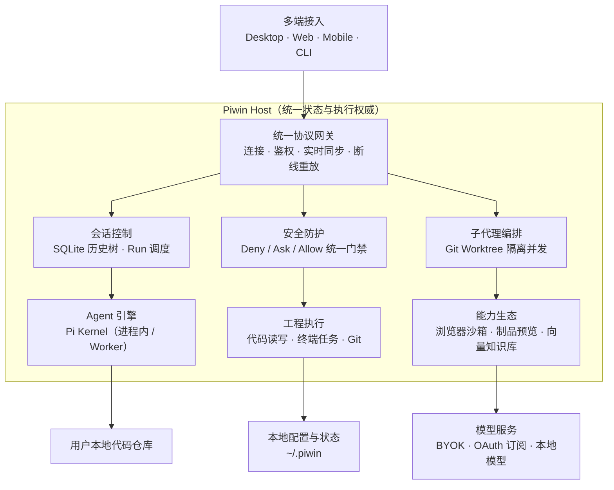

<div align="center">

# piwin

<p align="center">
  
</p>

**私有化、现代化的高性能智能编程 Agent 工作台与操作系统**  
构筑于 Pi 内核之上，具备清晰分层、独立可部署的 Host 权威、多端解耦契约以及模块化扩展生态。

[官方文档 (docs.planora.chat)](https://docs.planora.chat) · [GitHub Releases](https://github.com/mimimaster/piwin/releases) · [架构设计](./docs/architecture.md) · [开发规范](./AGENTS.md)

**简体中文** | [English](./docs/en/README.md)

</div>

---

`piwin` 是专为严肃软件工程打造的**私有化 AI 编程工作台**，提供桌面端应用（macOS / Windows）、Web 浏览器工作台与终端 Agent。本仓库包含客户端、后端服务、共享 UI 以及 Agent CLI 与运行时源码。

| 入口 | 用途 | 启动 / 开发命令 |
| :--- | :--- | :--- |
| **Desktop** | macOS / Windows 沉浸式桌面应用；支持开箱即用一体包或本地源码开发 | `pnpm dev:desktop` / `pnpm dev:tauri` |
| **Web 浏览器端** | 终端与浏览器工作台；将 Web 前端与独立 Host 后端通过 WebSocket 解耦连接 | `pnpm dev:host` + `pnpm dev:desktop` |
| **Agent CLI** | 在终端中使用交互式 `piwin`，提供轻量化命令行 Agent 运行时 | `pnpm dev:cli` |
| **Host 独立服务端** | 供 Web、移动端或远程连接的后端核心宿主服务（状态与执行权威） | `pnpm dev:host` |

---

## 快速使用指引

你可以根据使用场景选择**直接下载桌面一体安装包**（推荐，开箱即用）、**Web 浏览器模式**或**源码二次开发**：

### 方式一：下载桌面一体安装包（推荐 · 零环境依赖）

官方发布提供 **macOS（Apple Silicon）全功能一体化桌面正式版** 与 **Windows 一体化安装包**。

- **零环境门槛，开箱即用**：普通用户无需在电脑上配置 Node.js、pnpm、Python 或 Rust 等任何开发环境。安装包内置独立沙盒化的 **Node 22 LTS 运行时、Host Sidecar 守护进程、LanceDB 原生向量引擎与 Tauri 2 桌面客户端**。
- **下载与安装**：
  1. 前往仓库右侧 **[GitHub Releases](https://github.com/mimimaster/piwin/releases)** 下载最新版安装包：
     - **macOS**：下载 `piwinwin_<version>_aarch64.dmg`，双击后将 `piwin` 拖入「应用程序（Applications）」文件夹即可。
       > *macOS 首次打开提示*：由于未购买商业开发者证书，首次启动若系统提示「无法验证开发者」，前往 macOS「系统设置 → 隐私与安全性」点击「仍要打开」即可正常运行。
     - **Windows**：下载 `piwinwin_<version>_x64-setup.exe` 安装包，按引导安装完成后即可直接启动。
- **本地启动模式**：桌面端支持 **内置 Sidecar 模式**（自动随应用拉起后端）与 **远程 Attach 模式**（连接远程服务器上的 Host）。

---

### 方式二：Web 浏览器模式（Web / 远程部署）

`piwin` 采用前后端彻底解耦的架构，前端为纯 React 19 单页应用，支持在任何现代浏览器中直接访问，适合将 Host 部署在 NAS、开发机或远程 Linux 服务器上：

#### 1. 启动 Host 后端服务
Host 提供 Agent 核心调度、工具执行、会话持久化与 WebSocket 远程接口（默认监听 `8787` 端口）：
```bash
pnpm dev:host
# 或
pnpm --filter @piwin/host-app dev
```

#### 2. 启动 Web 前端服务
启动前端 Vite 服务（默认端口 `1420`）：
```bash
pnpm dev:desktop
# 或
pnpm --dir apps/desktop dev
```

#### 3. 浏览器访问与连接
1. 在浏览器中打开 `http://localhost:1420`。
2. 页面会自动识别非 Tauri 环境并呈现 **Host 连接网关（Host Connect Wall）**。
3. 输入 Host 地址：`ws://127.0.0.1:8787`（若配置了 Auth Token 则填入 Token），点击 **Connect** 即可进入完整工作台。

---

### 方式三：终端 Agent CLI 模式

如果你偏好在纯命令行终端中进行结对编程：

```bash
pnpm dev:cli
```
支持在终端内直接进行代码检索、编辑、子代理调度、工具执行与交互式对话。

---

### 方式四：开发者源码编译与全栈开发

如果你需要基于源码定制或自行编译打包：

#### 1. 环境准备
- **操作系统**：macOS (Apple Silicon 推荐)、Linux、Windows
- **依赖工具**：Node.js `>= 22.0.0`、pnpm `>= 9.0.0`、Rust `>= 1.75.0`（编译桌面端需具备）

#### 2. 本地初始化与常用命令

```bash
# 1. 克隆代码仓库
git clone https://github.com/mimimaster/piwin.git
cd piwin

# 2. 安装全部 workspace 依赖
pnpm install

# 3. 运行静态类型与规范检查
pnpm check

# 4. 启动对应入口开发
pnpm dev:desktop    # 启动桌面端 / Web 前端 (Vite)
pnpm dev:tauri      # 启动 Tauri 桌面端调试
pnpm dev:host       # 启动 Host 独立后端服务
pnpm dev:cli        # 启动终端命令行 CLI

# 5. 打包桌面一体安装包
pnpm package:desktop # 打包 macOS / Windows 桌面安装包
```

---

## 整体架构与工作原理

`piwin` 采用 **多端接入、单一 Host 权威、数据 100% 留在本地** 的系统设计：



### 核心分层设计

| 层次 | 模块位置 | 核心职责 |
| :--- | :--- | :--- |
| **多端体验** | `apps/desktop` · `apps/cli` · `apps/mobile` | 提供各终端一致的交互体验；客户端纯轻量，只负责 UI 呈现与用户交互。 |
| **连接与同步** | `packages/contracts` · `packages/host-client` · `packages/host-transport` · `packages/host-server` | 统一的双向协议与传输通道，支持 stdio、WebSocket 远程连接、状态流式推送与断线重放。 |
| **Host 控制面** | `apps/host` · `packages/host-runtime` | 全产品唯一组合根与状态权威，统一管理会话生命周期、权限控制、工具执行与子代理调度。 |
| **Agent 执行引擎** | `packages/agent-host` · Pi Kernel | 通过进程内 SDK 或独立 Worker 驱动模型与 Agent Loop，作为仓库接触 Pi 的唯一边界。 |
| **扩展能力生态** | `packages/browser` · `packages/mcp` · `packages/git` · `packages/doc-rag` · `packages/artifact` 等 | 将工程执行、浏览器、知识检索、媒体与制品渲染能力按需插拔装配进 Host。 |
| **数据与隐私** | 本地工程 · `~/.piwin` · 密钥管理器 | 代码、会话记录、日志与配置完全存储于用户本地；模型支持 BYOK、OAuth 订阅及私有模型。 |

---

## 核心特性亮点

### 1. 智能体语义代码搜索 (Code Search)
- **0-Token 上下文污染**：基于 Scout 架构派发独立只读子代理深入代码库勘探接口定义与调用链，仅向主会话回传高信噪比提炼报告。
- **一等公民工具**：在 Piwin 中与 `read_file`、`grep` 同级，随时随地由模型自主触发。
- **双模驱动**：支持配置高速低延迟模型，或直接使用 Devin 快速检索能力。

### 2. 多子代理编排协同 (Subagent Orchestrator)
- **Ultra Code 模式**：先派发 Scout 侦察兵摸清全局依赖与调用关系，再由主代理实施精准修改。
- **Fusion 模式**：“主规划模型 (Lead SOTA) + 高性价比执行节点 (Sidekick)”，规划与机械编码分工协作。
- **Git Worktree 物理隔离**：写操作子任务自动派生至独立的临时 Git Worktree 分支并发执行，支持主分支一键原子审查与合并。

### 3. 全双工实时语音 Live (Realtime Voice)
- **说话面与工作面解耦 (Spoken Contract)**：说话面负责闲聊、需求探讨与提炼 Brief，工作面负责具体写代码与跑测试，还原真实结对编程体验。
- **广泛通道兼容**：支持 OpenAI Codex 官方 Live 模型、OpenAI WebSocket Realtime 协议与 Grok 语音通道。

### 4. 双层模型配置与多模态委托 (BYOK & Multi-Account)
- **通道 (Provider) + 套餐账号 (OAuth Account)**：既支持填入任意 OpenAI / Anthropic / OpenRouter 兼容 API Key，也支持一键 OAuth 授权 Kimi Coding、Codex、Claude Pro/Max、xAI Grok、GitHub Copilot。
- **极速视觉委托 (Vision Delegation)**：为纯文本模型配备 Google Gemini Flash、硅基流动 Qwen-VL、Groq 或本地 Ollama 视觉模型，大幅节约 Token 与耗时。
- **原生多媒体生成**：内置 `image_gen` 与 `video_gen` 工具契约，原生渲染多媒体资产。

### 5. 多窗格智能工作台（Agent Window & Multi-Pane）
- **灵活分屏**：单窗口支持 1 / 2 / 4 / 8 独立会话窗格自由切分（Split Right/Down），保持各子任务独立流式输出与上下文隔离。
- **对话树分支系统**：基于 SQLite 构建的完整会话历史树，支持分支分叉（Fork）、完整克隆（Duplicate）、阶段截断回滚与状态持久化。
- **Goal 目标模式**：通过 `/goal` 唤起任务目标追踪栏，结构化管理任务拆解、阻塞等待与最终交付验证。

### 6. 主动式 HTML / SVG 制品沙箱（Artifact Runtime）
- **流式安全渲染**：支持在对话流中直接解析预览 HTML、SVG、React 原生可视化组件，提供 Inline 内嵌视图与独立 Canvas 宽屏工作区视图。
- **严格安全防御**：移植成熟的安全沙箱策略，隔离运行任意生成的 Web 应用或图表，防止脚本提权与外部非受信资源访问。

### 7. 主机级浏览器工作台（Browser Workbench）
- **Playwright 原生驱动**：Host 统一管理专属 Chromium 实例，支持 AI 视线级交互与操作（点击、表单填充、滚动、网络监听、控制台捕获）。
- **Aria Snapshot 语义定位**：采用无坐标偏差的无障碍语义树映射算法，精准定位并操作网页元素。
- **低延迟实时镜像**：桌面端右侧面板可实时推流显示浏览器画面，支持人机协同接管控制（Agent / User 锁机制）。

### 8. 本地私有化知识库与 Doc-RAG
- **混合向量检索**：基于 `@lancedb/lancedb` 原生向量数据库构建，融合向量语义搜索与 BM25 全文分词检索（Hybrid RRF 融合）。
- **知识抽取与记忆沉淀**：支持文件夹文档即时检索、本地 Markdown 笔记库管理与 FSRS 算法驱动的智能复习抽认卡（Flashcards）。

### 9. 企业级统一权限决策引擎（Permission Engine）
- **Deny → Ask → Allow 三层门禁**：遵循最高安全规范，拒绝任何违规操作隐式放行；严格阻断对 `.ssh/`、`.env`、密钥等敏感系统目录的越权修改。
- **免打扰工程记忆**：支持项目维度的常用命令记忆与安全白名单放行，保障敏捷开发的同时防范毁灭性指令。

### 10. 原生 Pi 扩展热加载生态 (Extensions)
- **会话中平滑热加载**：在任务执行时安装扩展，优雅等待当前轮次结束后下一轮自动激活，无需重启，保留完整上下文。
- **全方位支持**：支持 Agent 自定义工具、事件 Hook 与 Provider 扩展。

---

## 仓库目录结构

```text
piwin/
├── apps/                        # 客户端与应用外壳
│   ├── desktop/                 # Tauri 2 桌面端主应用 & Web 前端 (React + Vite + Mantine)
│   ├── cli/                     # Node.js 交互式命令行工具
│   ├── host/                    # 独立 Host 服务端可执行包 (WebSocket Server)
│   ├── mobile/                  # 移动端外壳 (iOS / Android)
│   └── docs/                    # 技术文档站 (VitePress)
├── packages/                    # 领域包与能力库
│   ├── contracts/               # 全局共享类型定义、IPC 协议与事件规范 (叶子包)
│   ├── host-runtime/            # 全局唯一产品组合根、权限引擎与调度器
│   ├── host-server/             # 远程 WebSocket 协议服务与连接管理
│   ├── host-client/             # 统一 Client 通信封装与状态恢复
│   ├── host-transport/          # 底层 WebSocket / stdio 传输通道
│   ├── agent-host/              # Pi 内核适配层 (SDK / RPC 双模式)
│   ├── browser/                 # Playwright 浏览器会话与实时推流服务
│   ├── doc-rag/                 # LanceDB 本地向量知识库与检索服务
│   ├── artifact/                # HTML / SVG 制品解析与安全预览沙箱
│   ├── mcp/                     # Model Context Protocol 进程监督者
│   ├── session/                 # 会话历史存储 (SQLite 树形存储) 与冷存归档
│   ├── git/                     # Git 仓库操作与 Worktree 并发管理
│   ├── process/                 # 跨平台子进程树管理与自动收割
│   ├── media/                   # 剪贴板/多模态图片资产管理
│   ├── tools-web/               # 网络搜索与网页提取服务
│   └── ui-kit/                  # 桌面端共享 Mantine UI 组件库
├── scripts/                     # 自动化构建、公证、校验与打包脚本
├── docs/                        # 架构说明 (ADR)、产品设计 (PRD) 与规格手册
└── AGENTS.md                    # 专为 AI Agent 与人类协作者制定的核心架构开发红线
```

---

## 架构红线 (Anti-Shitpile 准则)

为了保证系统长期演进的整洁度与高可靠性，所有提交必须严格遵守 [`AGENTS.md`](./AGENTS.md) 中的铁律：

1. **绝对禁止跨层污染**：表现层（`apps/*`）严禁直接导入 Pi 相关包，必须通过 `@piwin/contracts` 或 Host 契约交互。
2. **唯一组合根**：`packages/host-runtime` 是全仓库唯一允许装配能力与业务逻辑的中心，禁止在子包内建立暗道。
3. **单向依赖图**：依赖严格向下流动：`apps → host-runtime → packages/* + agent-host → contracts`。
4. **单文件硬上限 1000 行**：任何单文件接近 400 行时必须规划职责拆分，超过 1000 行直接判定违规。
5. **严禁静默异常**：禁止任何形式的空 `catch(e) {}` 捕获，所有异步通道必须具备超时与显式销毁机制。

---

## 开源与隐私声明

- 配置文件与用户状态默认存储于 `~/.piwin`，敏感凭证依托本地安全存储，绝对保证用户本地代码与隐私安全。
- 架构设计文档、变更决策记录（ADR）完整归档于 [`docs/adr/`](./docs/adr/)。
