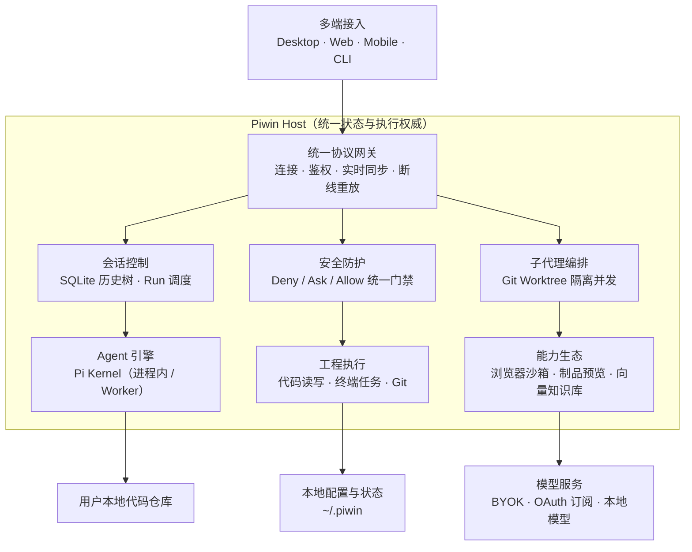

<div align="center">

# Piwin 砚

<p align="center">
  
</p>

### 沉静如砚，淬砺如锋

**面向个人、基于Pi的Coding Agent**

本地私有 · 拥抱Pi生态 · 灵活的部署方式 · 自带代码检索工具 · 先进的子代理编排模式 · 全双工实时语音

<p align="center">
  <a href="https://github.com/mimimaster/piwin/releases"></a>
  <a href="./docs/architecture.md"></a>
  <a href="https://docs.planora.chat"></a>
  
  
  <a href="./LICENSE"></a>
</p>

<p align="center">
  <a href="https://docs.planora.chat"><b>📖 在线文档站</b></a> ·
  <a href="#-快速上手与使用方式"><b>⚡ 快速安装</b></a> ·
  <a href="#-核心特性亮点"><b>✨ 功能矩阵</b></a> ·
  <a href="#-整体系统架构"><b>🏛️ 系统架构</b></a> ·
  <a href="#-架构红线与开发规范"><b>📐 开发红线</b></a> ·
  <a href="./docs/adr/"><b>变更决策 (ADR)</b></a>
</p>

<p align="center">
  <b>简体中文</b> | <a href="./docs/en/README.md">English (Coming Soon)</a>
</p>

<br />

<p align="center">
  
</p>

</div>

---

## 💡 诞生的初心与设计哲学

> *“砚者，研墨沉淀、静水流深。集百家之所长，归于一案之间。”*

在 AI 编程工具百花齐放的当下，从 Cursor、Devin、Windsurf，到 Claude Code、ChatGPT Codex、Kiro、Qoder，各类尝试层出不穷。然而在真实的复杂软件工程实践中，开发者往往面临难以妥协的痛点：

- **数据隐私隐忧**：商业云端平台闭源黑盒，核心商业代码与私有凭证上传云端存在不可控的合规风险；
- **长程上下文污染 (Attention Dilution)**：在大型代码库中，主模型频繁读取全量文件导致上下文极速膨胀，注意力被无关代码严重稀释，迅速引发幻觉与代码遗忘；
- **生态割裂与账号分散**：手里握着各大厂商的官方 OAuth 订阅或 API Key，却不得不为了不同模型频繁切换各个封闭客户端；
- **算力成本失衡**：用最昂贵的 SOTA 规划模型去逐行敲打机械的样板代码，成本高昂且缺乏并行效率。

**Piwin（砚 · Planora）** 应运而生。它是一款“吃百家饭”长大的私有化智能编程工作台 —— 汲取 **Devin** 的 Fast-Context 零污染检索、**Codex** 的 Ultra Code 侦察协同、**Astra** 级的全双工实时语音、**Cursor** 沉浸式多窗格交互，以及 **Pi** 强大的热插拔内核生态。

我们坚守三项核心追求：

1. **信（Fidelity & Security）**：**数据 100% 留在本地**。基于 Host 单一权威与 SQLite 完整会话历史树，敏感凭据全本地加密存储，源码与执行环境受到严格物理门禁防护；
2. **达（Ubiquity & Decoupling）**：**多端解耦，万端归一**。前后端彻底分离，桌面端（macOS/Windows）、Web 浏览器、移动端外壳均通过标准双向契约直连同一 Host，支持 Tailscale 组网跨端实时接续长程开发；
3. **雅（Aesthetics & Craftsmanship）**：**将工程美学融入每一次交互**。内嵌与宽屏双模制品预览沙箱（Artifacts）、Aria Snapshot 语义浏览器工作台、可视化目标追踪面板，重塑心手合一的结对编程体验。

---

## ✨ 核心特性亮点

### 1. 0-Token 污染的智能代码语义搜索 (Code Search)
- **智能体拓扑勘探**：灵感源自对 Devin (原 Windsurf) Fast-Context 机制的底层逆向与深度重构；
- **零上下文注意力稀释**：派发轻量独立的**只读 Scout 子代理**深入代码库梳理文件路径、接口定义与调用关系，**仅向主模型回传高信噪比提炼报告**，彻底告别几千行无关代码冲垮主会话长上下文的弊病；
- **一等公民核心工具**：在 Piwin 中与 `read_file`、`grep` 同级，主模型按需自主调用；
- **双模极速驱动**：支持绑定个人免费的 **Devin 专属 Token**（零额外开销、免费极速），亦支持配置高速轻量推理模型。

---

### 2. 工业级多子代理编排体系 (Subagent Orchestration)
在输入框（Composer）上方即可一键切换顶尖智能体协作范式：

- **Ultra Code 模式（侦察兵 + 精准打击）**：先派发只读 Scout 子代理完成全代码库的依赖梳理与潜在影响面分析，输出结构化蓝图；主模型审阅报告后在纯净的上下文中精准落实代码修改；
- **Fusion 模式（SOTA 规划 + 高性价比执行）**：
  - **规划与执行解耦**：主控会话（Lead）使用顶尖 SOTA 模型（Claude 3.7 Sonnet / DeepSeek V3）把握顶层架构与需求澄清；执行节点（Sidekick）配置高速轻量模型处理机械编码；
  - **Git Worktree 物理隔离**：所有代码写入均在临时的 Git Worktree 分支中并发实测与编译自愈，杜绝半成品污染主工作区；
  - **原子级合并与审查**：测试通过后生成 Candidate 候选集，经主控审查后原子级合入主分支，**Token 综合成本降低 60%+**。

---

### 3. 双层模型配置枢纽与极速视觉委托 (BYOK & Multi-Account)
- **通道层 (Channel) 与 套餐账号层 (OAuth) 彻底解耦**：
  - **通道层 (BYOK)**：原生支持 OpenAI、Anthropic、Google Gemini、OpenRouter 自定义 Base URL 与 API Key，以及本地 Ollama 私有化端点；
  - **套餐账号层 (OAuth)**：一键浏览器授权登录官方订阅（**Kimi Coding**、**OpenAI Codex**、**Claude Pro/Max**、**xAI Grok**、**GitHub Copilot**），凭证由本机 Host 安全托管；
- **毫秒级视觉委托 (Vision Delegation)**：
  - 为纯文本或昂贵的深度思考模型配备免费轻量多模态节点（Google Gemini 2.5 Flash / 硅基流动 Qwen2.5-VL / 本地 Ollama）；
  - 粘贴截屏或架构图时，自动完成图像特征提炼与 OCR，节约 **70%~90%** 的上下文 Token；
- **原生多媒体生成契约**：内置 `image_gen`（Flux / DALL-E）与 `video_gen` 工具契约，出图与视频资产原生沉淀至本地媒体库（`~/.piwin/media/`）。

---

### 4. 全双工实时语音 Live 结对编程 (Realtime Voice)
- **说话面与工作面契约分离 (Live Spoken Contract)**：
  - **说话面 (Speaking Face)**：负责自然的实时语音交互、寒暄、方案探讨与口误纠偏，提炼结构化 Brief 简报；
  - **工作面 (Chat Agent)**：在后台沉稳读写文件、执行构建与验证单测；完成后由说话面以极简的一句话回传关键 Takeaway；
- **全双工随时插话打断**：像真人坐在身旁一样边看屏幕边探讨方案；兼容 OpenAI Realtime 协议、Codex 官方 Live 与 Grok2API 语音通道。

---

### 5. 主动式 HTML / SVG 制品沙箱 (Artifact Runtime)
- **双模态无缝呈现**：
  - **Inline 内嵌视图**：对话流中紧凑渲染流程图、排版报表、交互卡片；
  - **Canvas 独立工作区视图**：复杂应用原型、数据可视化大屏、交付调研报告自动向右展开至全宽 Canvas 独立面板，对话区智能微调避让；
- **严格防御与流式预览**：移植成熟的安全沙箱（iframe + 严苛 CSP），阻断脚本提权与外部未受信网络请求，支持模型流式生成时毫秒级实时渲染。

---

### 6. 主机级无障碍语义浏览器工作台 (Browser Workbench)
- **Playwright 原生驱动**：Host 集中管理专属 Chromium 实例，具备点击、表单填充、滚动、网络监听与控制台捕获等全套工具；
- **Aria Snapshot 语义映射**：基于无障碍语义树定位网页元素，彻底规避脆弱的坐标猜测与易变的 DOM 选择器；
- **低延迟推流与双工锁**：桌面端右侧面板可实时推流显示浏览器画面，支持 Agent 自动操作与人工操作无缝交接（Lock 机制）。

---

### 7. 砚·多窗格桌面工作台与会话树 (Inkstone Multi-Pane & Tree)
- **多任务灵活切分**：单窗口支持 1 / 2 / 4 / 8 独立会话窗格自由切分（Split Right/Down），各任务具备独立的上下文流与执行管线；
- **SQLite 完整会话历史树**：支持会话无损分叉（Fork Branch）、完整克隆（Duplicate）、阶段截断回滚与断电安全持久化；
- **Goal 目标模式**：通过 `/goal` 唤起结构化任务面板，清晰掌握拆解步骤、阻塞等待与最终交付验证。

---

### 8. 企业级三层统一权限引擎 (Permission Engine)
- **Deny → Ask → Allow 严格门禁**：杜绝违规操作隐式放行；严格物理阻断对敏感目录（如 `.ssh/`、`.env`、密钥证书）的越权篡改；
- **免打扰工程记忆**：支持项目维度的常用命令记忆与安全白名单放行，保障敏捷开发的同时防范毁灭性指令（如误删库或强制推送）。

---

### 9. 原生扩展热装载生态 (Extensions & Skills)
- **无感平滑热加载**：在任务执行过程中一键安装社区扩展或编写本地 Skill，系统优雅等待当前轮次收尾后在下一轮自动激活，**无需重启客户端，完整保留对话上下文**；
- **全栈生态支持**：支持 Agent 自定义扩展工具、生命周期 Hook 以及 MCP (Model Context Protocol) 进程监督。

---

## 🏛️ 整体系统架构

`piwin` 采用 **“客户端表现层接入、单一 Host 权威控制、数据与代码完全本地化”** 的前后端分离架构：



### 核心分层与职责契约

| 层次 | 模块位置 | 核心职责 |
| :--- | :--- | :--- |
| **① 多端表现层** | `apps/desktop` · `apps/cli` · `apps/mobile` | 各终端一致的交互体验；客户端保持轻量，**绝不直接导入底层 Pi 包**，只负责 UI 呈现与用户交互。 |
| **② 协议与传输** | `packages/contracts` · `packages/host-client` · `packages/host-transport` · `packages/host-server` | 纯净的双向通讯协议通道，支持 stdio、WebSocket 远程连接、状态流式推送与断线重放。 |
| **③ Host 组合根** | `apps/host` · `packages/host-runtime` | **全产品唯一组合根与状态权威**，统筹会话生命周期、三层权限引擎、工具执行与子代理调度。 |
| **④ Agent 执行边界** | `packages/agent-host` · Pi Kernel | 通过进程内 SDK 或独立 RPC Worker 驱动模型与 Agent Loop，作为接触底层内核的唯一边界。 |
| **⑤ 扩展能力生态** | `packages/browser` · `packages/mcp` · `packages/git` · `packages/artifact` · `packages/doc-rag` | 将工程执行、浏览器、知识检索、媒体与制品渲染能力按需插拔装配进 Host。 |
| **⑥ 数据与本地隐私** | 本地代码库 · `~/.piwin` · 密钥管理器 | 源码、会话历史树、配置与日志 100% 留存于用户本地，杜绝未经授权的数据上传。 |

---

## 🚀 快速上手与使用方式

你可以根据实际使用场景选择**桌面一体安装包**（推荐 · 零环境门槛）、**Web 浏览器远程模式**、**终端 Agent CLI** 或 **开发者源码编译**：

### 方式一：下载桌面一体安装包（推荐 · 零环境门槛）

官方发布提供 **macOS（Apple Silicon）全功能一体化正式版** 与 **Windows 一体化安装包**：

- **零依赖开箱即用**：普通用户无需在本机配置 Node.js、pnpm、Python 或 Rust。安装包内置独立沙盒化的 **Node 22 LTS 运行时、Host Sidecar 守护进程、LanceDB 原生向量引擎与 Tauri 2 桌面客户端**；
- **下载与安装**：
  1. 前往 **[GitHub Releases](https://github.com/mimimaster/piwin/releases)** 下载最新版安装包：
     - **macOS**：下载 `piwinwin_<version>_aarch64.dmg`，双击后将 `piwin` 拖入 Applications（应用程序）文件夹即可；
       > *macOS 首次打开安全提示*：因未购买商业公证证书，若首次启动系统提示“无法验证开发者”，请前往 macOS「系统设置 → 隐私与安全性」点击「仍要打开」即可正常运行。
     - **Windows**：下载 `piwinwin_<version>_x64-setup.exe` 安装包，按指引完成安装后启动；
- **运行模式**：桌面端支持 **内置 Sidecar 模式**（随应用启动自动拉起本地 Host）与 **远程 Attach 模式**（连接远程主机或 NAS 上的 Host）。

---

### 方式二：Web 浏览器远程部署（NAS / 远程开发机）

前后端彻底解耦的设计允许你将 Host 部署在算力更强的家庭 NAS、开发服务器或云端主机上，利用 Tailscale 组网在任意设备的浏览器中随时访问：

#### 1. 启动 Host 后端服务（监听 `8787` 端口）
```bash
pnpm dev:host
# 或构建为独立服务端后启动
```

#### 2. 启动 Web 前端服务（监听 `1420` 端口）
```bash
pnpm dev:desktop
```

#### 3. 浏览器访问与连接
1. 在浏览器中打开 `http://localhost:1420`（或你的远程内网 IP）；
2. 页面自动呈现 **Host 连接网关（Host Connect Wall）**；
3. 输入 Host WebSocket 地址（如 `ws://127.0.0.1:8787` 或 Tailscale 节点地址），点击 **Connect** 即刻进入完整工作台。

---

### 方式三：终端 Agent CLI 模式

如果你偏好纯终端与 Vim 结对编程：

```bash
pnpm dev:cli
```
支持在终端中进行代码检索、文件编辑、子代理调度、工具执行与沉浸式交互。

---

### 方式四：开发者全栈编译与二次开发

如果你需要对 Piwin 进行功能定制或二次开发：

#### 1. 环境准备
- **操作系统**：macOS (Apple Silicon 推荐)、Linux、Windows
- **开发工具**：Node.js `>= 22.0.0`、pnpm `>= 9.0.0`、Rust `>= 1.75.0`（用于桌面端编译）

#### 2. 本地初始化与核心脚本
```bash
# 1. 克隆代码仓库
git clone https://github.com/mimimaster/piwin.git
cd piwin

# 2. 安装全部 workspace 依赖
pnpm install

# 3. 运行静态类型检查、架构红线与单元测试
pnpm check

# 4. 启动对应入口进行开发
pnpm dev:desktop    # 启动桌面端 / Web 前端 (Vite 极速热重载)
pnpm dev:tauri      # 启动完整 Tauri 2 桌面端调试
pnpm dev:host       # 启动 Host 独立后端服务
pnpm dev:cli        # 启动终端命令行 CLI

# 5. 编译打包桌面端安装包
pnpm package:desktop # 打包生成 macOS (.dmg) / Windows 一体化安装包
```

---

## ⚙️ 核心功能配置速查

| 配置模块 | 推荐接入方案 | 说明与指引文档 |
| :--- | :--- | :--- |
| **OAuth 官方订阅** | 一键授权 Kimi Code / Codex / Claude / Grok | 在「设置 ➔ OAuth 登录」中直连各平台套餐 · [查看指南](https://docs.planora.chat/oauth-login.html) |
| **模型与多模态** | DeepSeek V3 / Claude 3.7 + Gemini Flash 视觉 | 自带 API Key 或结合免费视觉委托，大幅降低成本 · [查看指南](https://docs.planora.chat/model-config.html) |
| **代码搜索 (Code Search)** | 提取 Devin 专属 Token（免费极速） | 零上下文污染的语义代码搜索，支持复用于 Web 检索 · [获取指引](https://docs.planora.chat/token-acquisition.html) |
| **网络搜索 (Web Search)** | Tavily API（每月 1000 次免费） / Devin Key | 专为 Agent 设计的干净网页清洗萃取 · [查看指南](https://docs.planora.chat/web-search.html) |
| **实时语音 (Live Voice)** | OpenAI Codex 官方 Live / Realtime 协议 | 开启 Composer 小麦克风体验全双工实时结对 · [查看指南](https://docs.planora.chat/realtime-voice.html) |
| **多端组网直连** | Tailscale 加密虚拟局域网 | 将 Host 托管于 NAS，手机与浏览器跨端随行 · [部署指南](https://docs.planora.chat/deployment.html) |

---

## 📐 架构红线与开发规范

为确保系统的长期演进质量与架构纯洁度，所有代码修改与 Pull Request 必须严格恪守 [`AGENTS.md`](./AGENTS.md) 规则：

1. **绝对禁止跨层污染**：表现层（`apps/*`）严禁直接导入底层 Pi 包，所有交互必须经由 `@piwin/contracts` 或 Host 协议；
2. **单一组合根**：`packages/host-runtime` 是全产品唯一允许装配领域服务与执行业务逻辑的中心，严禁在子包私设旁路；
3. **单向依赖图**：依赖关系严格向下单向流动：`apps → host-runtime → packages/* + agent-host → contracts`；
4. **单文件 1000 行硬上限**：生产代码单文件逼近 400 行时必须规划职责拆分，超过 1000 行直接判定违规；
5. **严禁静默异常**：严禁任何形式的空 `catch (e) {}`，所有异步任务与流通道必须具备超时与显式清理机制；
6. **契约先行**：新增跨领域能力必须先在 `@piwin/contracts` 定义规范，严禁侵入式魔改底层内核。

---

## 🗂️ 仓库目录导览

```text
piwin/
├── apps/                        # 客户端外壳与接入层
│   ├── desktop/                 # Tauri 2 桌面端主应用 & Web 前端 (React 19 + Vite + Mantine)
│   ├── cli/                     # Node.js 交互式终端命令行工具
│   ├── host/                    # 独立 Host 服务端可执行包 (WebSocket Server)
│   ├── mobile/                  # 移动端外壳 (iOS / Android 轻量直连外壳)
│   └── docs/                    # 技术文档站 (VitePress)
├── packages/                    # 领域能力包 (按职责高内聚低耦合拆分)
│   ├── contracts/               # 全局共享契约、类型定义与 IPC 协议 (纯叶子包)
│   ├── host-runtime/            # 全局唯一产品组合根、权限引擎与调度中心
│   ├── host-server/             # 远程 WebSocket 协议服务与连接管理
│   ├── host-client/             # 统一 Client 通信封装与状态恢复
│   ├── host-transport/          # 底层 WebSocket / stdio 传输通道
│   ├── agent-host/              # Pi 内核适配层 (SDK / RPC 双模式运行)
│   ├── browser/                 # Playwright 驱动的主机浏览器推流与无障碍映射
│   ├── doc-rag/                 # LanceDB 本地向量知识库与 FSRS 记忆检索
│   ├── artifact/                # HTML / SVG 制品解析与安全预览沙箱
│   ├── mcp/                     # Model Context Protocol 进程监督与工具分发
│   ├── session/                 # SQLite 会话树分支存储与冷存归档
│   ├── git/                     # Git 仓库操作与 Worktree 并发分支隔离
│   ├── process/                 # 跨平台子进程树管理与自动回收
│   ├── media/                   # 剪贴板与多模态资产存储管理
│   ├── tools-web/               # 网络检索与网页正文清洗萃取服务
│   └── ui-kit/                  # 桌面端共享 Mantine UI 组件库
├── scripts/                     # 自动化构建、公证、校验与打包脚本
├── docs/                        # 架构设计 (Architecture)、决策记录 (ADR) 与规格说明 (Specs)
└── AGENTS.md                    # 专为 AI Agent 与协作者制定的核心架构红线
```

---

## 🤝 社区、交流与开源

- **官方文档站**：[https://docs.planora.chat](https://docs.planora.chat)
- **代码仓库**：[https://github.com/mimimaster/piwin](https://github.com/mimimaster/piwin)
- **问题反馈与建议**：欢迎提交 [GitHub Issues](https://github.com/mimimaster/piwin/issues) 或 Pull Requests

### 开源许可

本项目遵循 [MIT License](./LICENSE) 开源协议。所有源码、会话树记录与敏感凭证默认存储于用户本地计算机，尊重每一位开发者的代码主权与数据隐私。
