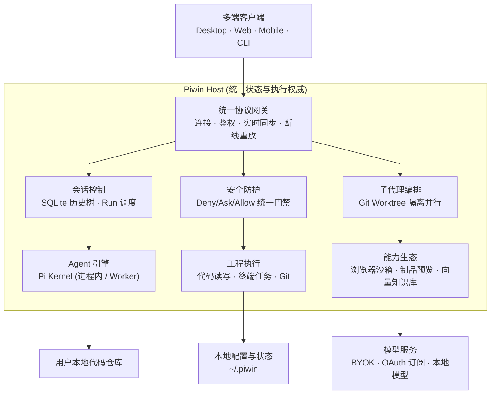

# 关于 Piwin · 架构起源与愿景

> **私有化、现代化的高性能智能编程 Agent 工作台与操作系统**  
> 构筑于 Pi 内核之上，具备清晰分层、独立可部署的 Host 权威、多端解耦契约以及模块化扩展生态。

---

## 1. 诞生的故事：“吃百家饭”长大的 Coding Agent

在智能体（AI Coding Agent）百花齐放的探索时期，市面上涌现了无数优秀的开发工具与尝试。作者最初在各种社区活动、体验试用与自费充值中体验了几乎所有主流产品：

- **广泛体验与技术探索**：深入体验了包括 Cursor、Devin、Windsurf、Grok Code / Build、Claude Code、Codex、Kiro、Qoder、ZCode 等十余款主流工具；
- **博采众长的交互与设计**：
  - 参考 **Devin / Windsurf** 的 Fast-Context 机制，推出了基于只读子代理的 [Code Search 代码语义检索](./code-search.md)；
  - 借鉴 **Codex Ultra Code** 的 Scout 机制与 Devin Fusion 设计，打造了支持灵活切换的 [子代理编排体系](./subagent-orchestration.md)；
  - 融合 **Astra** 级别的全双工实时交互理念，内置了无需打断编码的 [实时语音 Live 面板](./realtime-voice.md)；
  - 汲取多窗格分屏设计，实现了支持 1 / 2 / 4 / 8 独立窗格自由切分的桌面交互工作台；
  - 深度拥抱 **Pi SDK** 与扩展生态，支持[一键热加载社区能力](./extensions.md)。

与其在不同工具间频繁切换、忍受闭源平台对上下文的随意污染或割裂的收费模式，不如打造一款**真正属于开发者自己、数据 100% 留在本地、架构极致透明的私有化 Coding Agent 工作台**。这就是 Piwin（砚 · Planora）的由来。

---

## 2. 整体系统架构

Piwin 采用 **“客户端表现层接入、单一 Host 权威控制、数据与代码完全本地化”** 的前后端分离架构。



---

## 3. 四大核心设计原则

| 原则                  | 核心含义                                                   | 工程落地                                         |
| :------------------ | :----------------------------------------------------- | :------------------------------------------- |
| **1. 一个 Host，多端共享** | 无论是 macOS / Windows 桌面端、移动端壳子还是 Web 浏览器，连接的都是同一个 Host。 | 会话进度、临时文件、执行状态完全同步，切换终端无需重复配置。               |
| **2. 客户端与内核绝对解耦**   | 表现层（`apps/*`）只负责用户交互与视图渲染，绝不直接调用底层模型或操作文件系统。           | 所有操作均经由 `@piwin/contracts` 契约协议请求 Host，安全可控。 |
| **3. 控制面统一收口**      | 会话状态机、三层权限引擎、子智能体调度和持久化全部由 Host Runtime 统一调度。          | 杜绝任何旁路操作，敏感目录（如 `.ssh/`, `.env`）受绝对防护。       |
| **4. 能力可插拔、数据私有化**  | 各项工程能力（浏览器、向量库、Git、制品）封装为独立包按需装配。                      | 源码、会话树、凭证默认存放在本地 `~/.piwin`，绝不上传私有数据。        |

---

## 4. 关键架构模块与职责映射

```text
piwin/
├── apps/                        # 表现层与多端外壳
│   ├── desktop/                 # Tauri 2 桌面端应用 (React + Mantine + Inkstone 美学)
│   ├── cli/                     # Node.js 终端交互命令行工具（不可用，我没用过）
│   ├── mobile/                  # Tauri 移动端外壳
│   └── docs/                    # VitePress 文档站 (https://docs.planora.chat)
├── packages/                    # 领域能力包 (按职责解耦)
│   ├── contracts/               # 底层共享契约、类型定义与 IPC 协议 (纯叶子包)
│   ├── host-runtime/            # 全局唯一产品组合根、权限引擎与调度中心
│   ├── agent-host/              # Pi 内核适配层 (SDK / RPC 双模式运行)
│   ├── browser/                 # Playwright 驱动的浏览器工作台与推流服务
│   ├── doc-rag/                 # LanceDB 本地向量数据库与 FSRS 闪卡记忆引擎
│   ├── artifact/                # HTML / SVG 制品解析与安全预览沙箱
│   ├── mcp/                     # Model Context Protocol 进程监督与工具分发
│   ├── session/                 # SQLite 会话树分支存储与冷存归档
│   ├── git/                     # Git 操作与 Worktree 并发工作区分离
│   ├── process/                 # 原生子进程管理与自动回收
│   ├── media/                   # 截图、多模态媒体与剪贴板资产存储
│   └── tools-web/               # 网络检索与网页正文清洗萃取
```

---

## 5. 快速导航

- [快速起步与核心概念](./getting-started.md)：了解 BYOK、套餐账号与快速上手；
- [多端部署指南](./deployment.md)：下载 macOS 一体包、Windows 包或进行服务器私有化部署；
- [Code Search 代码检索](./code-search.md)：了解如何进行无上下文污染的架构级代码搜索；
- [子代理编排模式](./subagent-orchestration.md)：掌握 Ultra Code 与 Fusion 高级协作。
