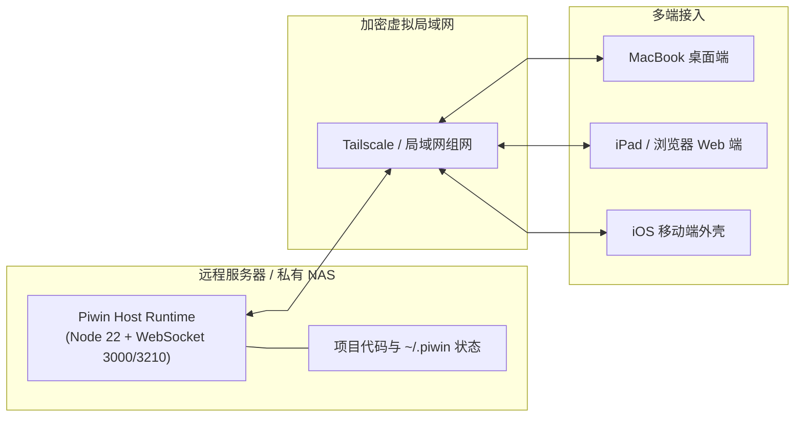

# 多端部署与私有化运行指南

Piwin 采用**前后端分离、单一 Host 权威**的现代化架构。你可以将负责核心计算、会话状态与代码执行的 **Host Runtime（后端）** 部署在任意受信任的物理机、自建服务器或家庭 NAS 上，然后通过各类**多端外壳（Desktop / Web / Mobile / CLI）**进行访问。

本文档将为你介绍桌面一体包、Web 远程访问、iOS 移动端以及二次开发构建指引。

---

## 1. 客户端外壳支持一览

| 客户端形式           | 适用平台                       | 运行模式              | 特性亮点                                      |
| :-------------- | :------------------------- | :---------------- | :---------------------------------------- |
| **macOS 一体包**   | macOS (Apple Silicon 推荐)   | 本地内置 Sidecar Host | 免配环境，内置 Node 22、LanceDB 向量引擎与 Tauri 2 桌面端 |
| **Windows 一体包** | Windows 10/11              | 本地内置 Sidecar Host | 双击运行，开箱即用                                 |
| **Web 远程端**     | 任意现代浏览器 (Chrome/Safari)    | 远程直连 Host         | 自适应布局，结合 Tailscale 实现随时随地远程访问             |
| **iOS 移动端**     | iPhone / iPad              | 移动端轻量壳子直连 Host    | 随身查看长程任务执行状态与下发需求                         |


---

## 2. 桌面一体包快速安装 (开箱即用)

对于绝大多数普通用户，推荐直接使用一体化安装包：

1. 前往 GitHub 仓库右侧 **[Releases (github.com/mimimaster/piwin/releases)](https://github.com/mimimaster/piwin/releases)**；
2. 下载最新发布包：
   - macOS 用户下载：`piwinwin_<version>_aarch64.dmg`（双击打开后将图标拖入 Applications 文件夹）；
   - Windows 用户下载对应安装压缩包；

---

## 3. 私有化与远程部署推荐方案 (Tailscale + Host)

如果你希望将 Host 部署在算力更强的远程服务器或常开的 NAS 上，并在户外或手机上随时访问：



### 3.1 组网与连接步骤
1. **组网配置**：在服务器与客户端设备上同时安装并登录 [Tailscale](https://tailscale.com/)（iOS 端也可使用支持 Tailscale 协议的 Shadowrocket）；
2. **启动 Host**：在服务器上通过 Docker 或直接以 Node 启动 `apps/host`；
3. **客户端连接**：在客户端启动参数或连接设置中填入服务器的 Tailscale IP 与 WebSocket 端口，即可实现零配置、端到端加密的远程直连。

---

## 4. 开发者二次开发与本地构建

如果你需要自行定制功能或基于源码进行编译：

### 4.1 环境要求
- **Node.js**：`>= 22.0.0`
- **pnpm**：`>= 9.0.0`
- **Rust**：`>= 1.75.0` (用于编译 Tauri 2 桌面端)

### 4.2 常用开发指令
```bash
# 1. 克隆代码仓库
git clone https://github.com/mimimaster/piwin.git
cd piwin

# 2. 安装全部依赖
pnpm install

# 3. 运行全量类型检查与单元测试
pnpm typecheck
pnpm test

# 4. 启动桌面端开发调试模式
pnpm dev:desktop

# 5. 启动 CLI 命令行开发模式
pnpm dev:cli

# 6. 本地打包生成 macOS 完整安装包 (.dmg)
pnpm package:desktop
```

---

## 5. 关联文档

- [关于 Piwin 与整体架构](./about.md)
- [快速起步概览](./getting-started.md)
- [OAuth 登录与多账号体系](./oauth-login.md)
