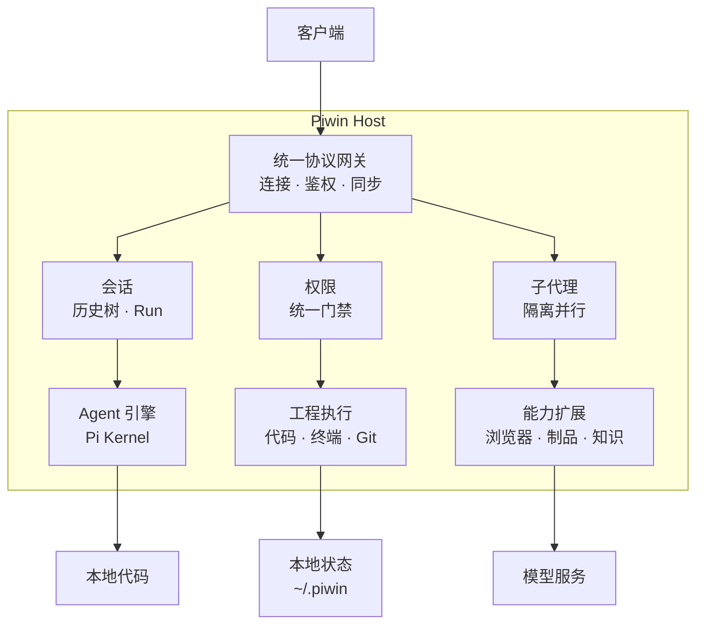

>一开始因为领鸡蛋，参与使用过超级多的agent，加上想要学习agent，于是直接搞一个大杂烩agent出来了；

这是一个面向个人使用的coding agent，基本上是通过调用pi agent的sdk实现的，作者马上改架构了，我头疼，不管了，先push吧；

本项目的架构图：

闲言碎语～
本项目是从领鸡蛋到充值完成的。
本项目市面上主流的coding agent（有鸡蛋领的）基本上都参与了
注册机免费白嫖的gork4.5、4.6；qoder送的cantus次数；claude 的疯狂周末（难以忘怀）,0731后 白嫖那个68元的不知姓名的谁谁谁，基本没花钱的google pro、 kiro的免费试用，gpt的焚决（开了好几个号，就活了两天），最近zcode送的glm5.3，我已经丧生的100多个的gpt免费号，anyrouter大善人（最近被403了），佬友们的送的token、workbuddy的Kimi K3友情参与；
付费：devin（20刀）、supergork（印度）、supergrok heavy(100刀)、cursor ultra（前面送的）、opencode go（为了ds0731)、gpt plus(20刀)、claude pro(20刀)
所以实际上参与本项目的coding agent包括：cursor(早期通过cursor++使用，repect)、devin、antigravity（全程参与前端UI设计）、grok build、kiro、codex、claude code/desktop、qoder(白嫖过)、workbuddy（打酱油的）、zcode；
后面因为有了heavy 鸡蛋已经不怎么领了
