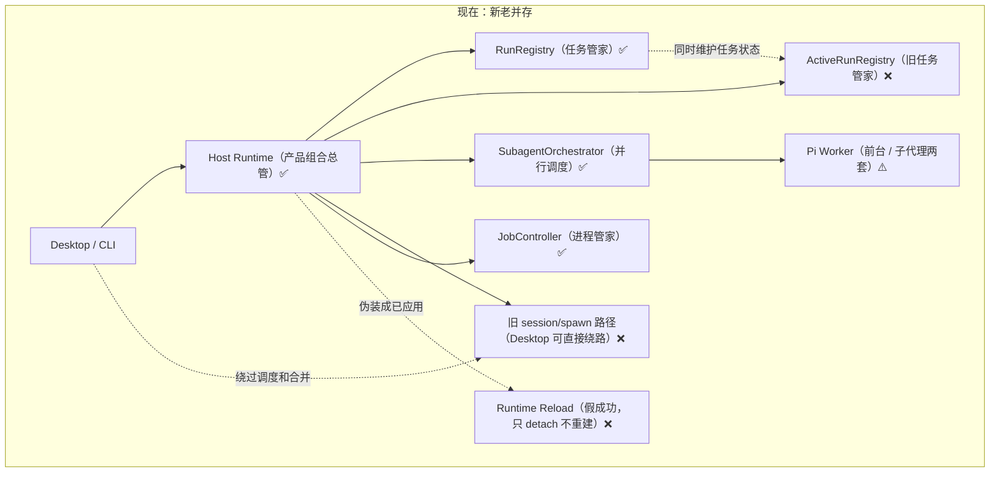
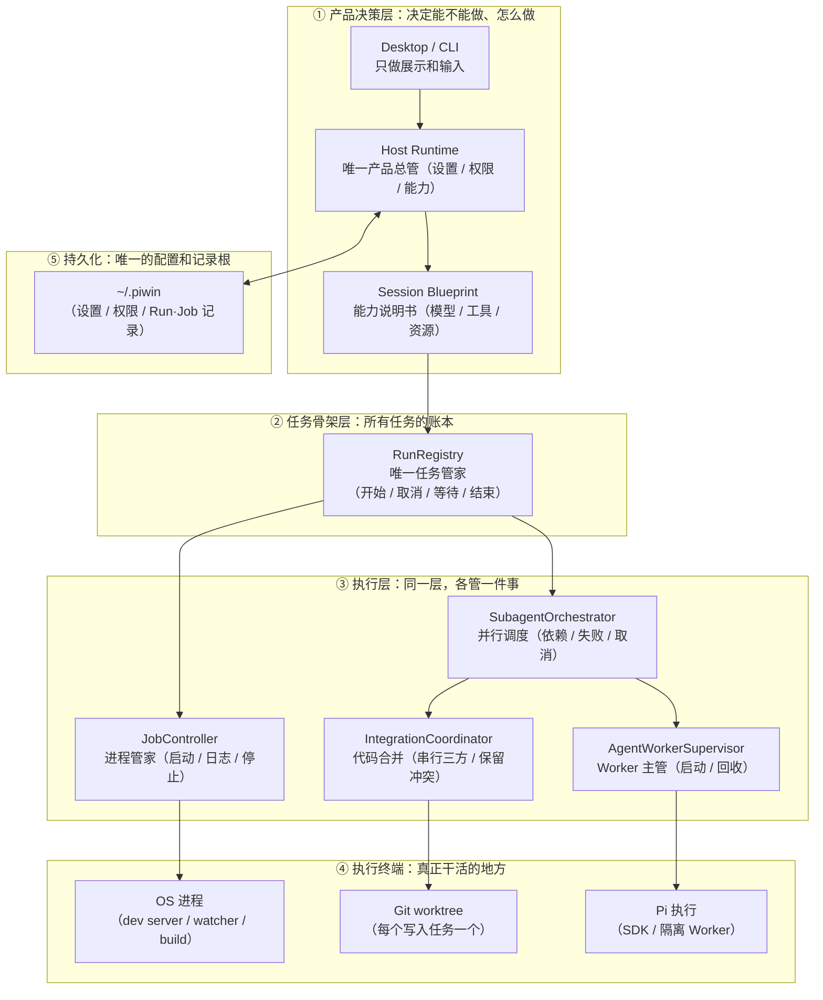
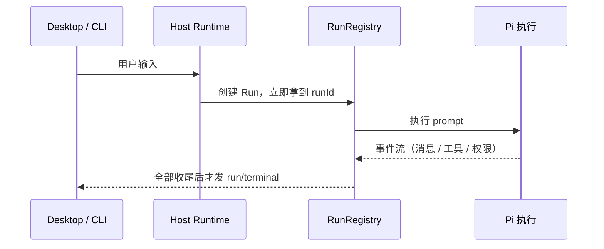
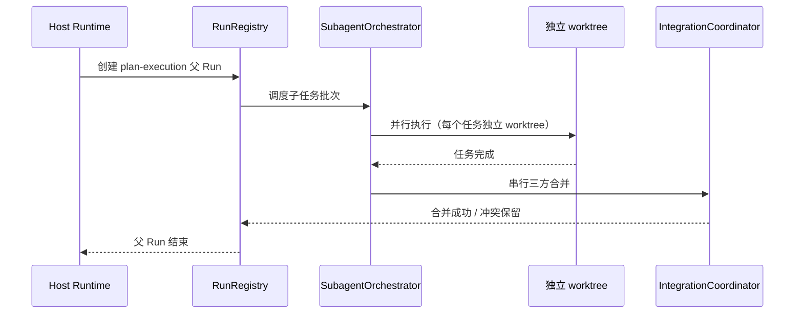
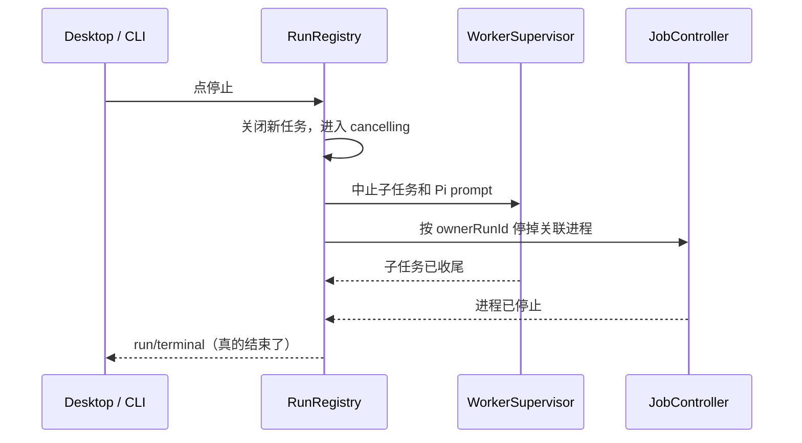

# piwin 分支在干什么？（快速版）

| Field | Value |
|-------|-------|
| 更新时间 | 2026-08-05 |
| 说明 | 给非技术读者的一页式说明：当前分支改了什么、要改到什么样子 |
| 详细版 | [clean architecture remediation plan](./superpowers/plans/2026-08-05-clean-architecture-remediation.md) |

> **一句话：** 这个分支不做新功能，而是在重新分配"谁有权管什么"。目标是把
> "很多地方都能管同一件事"改成 **"每件事只有一个管家"**。

---

## 1. 现在：新老架构并存（问题在哪）

每个节点名字后面都标了状态（不依赖颜色，任何 Markdown 渲染器都看得懂）：
✅ = 新地基已建好 · ❌ = 旧路径还没拆 · ⚠️ = 暂时分裂，需要统一。

> 图例（写在文字里，不靠颜色）：**✅ = 新地基已建好** · **❌ = 旧路径还没拆**
> · **⚠️ = 暂时分裂，需要统一**

**这张图要传达的核心：** 同一个用户动作（比如"跑一个计划""点停止"）现在可能经过
不同的入口、不同的管家，行为就不一致。这是本分支要解决的唯一问题。

---

## 2. 目标：一条流水线，每件事只有一个管家

> 这张图只画"主调用链"，所以全部用实线。还有两个**归属关系**不在图上画
> （避免和删除线混淆，用文字说明）：
> - Orchestrator 创建的 Run，都**登记**在 RunRegistry 里；
> - Job 通过 `ownerRunId` **归属**到某个 Run 名下。
>
> 为什么"执行终端"里既有 Pi 又有 OS 进程？因为一次任务可能同时需要：
> Agent 本身（Pi 执行）和它启动的辅助进程（dev server 等，归 JobController）。
> worktree 是并行写代码的隔离工作区，合并动作由 IntegrationCoordinator 串行处理。

### 三个模块是同一层吗？（重要澄清）

**不是。** RunRegistry 在"骨架层"，SubagentOrchestrator 和 JobController 才是同一层
（执行层）。用一句话记住：

| 模块 | 在哪一层 | 和谁产生关系 |
|------|---------|-------------|
| RunRegistry | 骨架层：所有任务的账本 | Orchestrator 创建的 Run 登记在它这；Job 的 `ownerRunId` 指向它 |
| SubagentOrchestrator | 执行层 | 管 Agent 怎么并行；创建 Run 时调用 RunRegistry |
| JobController | 执行层（和 Orchestrator 平级） | 管进程怎么启停；通过 `ownerRunId` 声明"这个进程属于哪个 Run" |

打个比方：RunRegistry 是"病历系统"，JobController 是"手术室"，SubagentOrchestrator
是"排班系统"。病历记录每一台手术（Job 绑定 Run）、每一次排班（Orchestrator 登记 Run），
但手术室和排班系统本身是平行的两个执行部门。

**每个"管家"只回答一个问题：**

| 管家 | 只管这一件事 | 不管的事 |
|------|-------------|---------|
| Host Runtime | 能不能做、怎么做（设置 / 权限 / 能力） | 不当 Pi 内核、不直接管进程 |
| RunRegistry | 一次任务何时开始、取消、结束 | 不启动进程、不合并代码 |
| JobController | 系统进程的启动 / 日志 / 停止 | 不管权限、不管 Agent 调度 |
| SubagentOrchestrator | 多个 Agent 的并行、依赖、失败、取消 | 不直接操作 Git |
| IntegrationCoordinator | 把改动安全并回主项目（串行三方合并） | 不自动重试、不覆盖冲突 |
| AgentWorkerSupervisor | 每个 Pi Worker 的启动和回收 | 不持有产品权限 |
| Session Blueprint | 这次会话用什么模型 / 工具 / 资源 | 不执行任务 |

---

## 3. 用三个流程看懂"一个动作怎么走"

### 3.1 普通聊天

### 3.2 Plan + 多个子代理并行

### 3.3 用户点"停止"

---

## 4. 现在最重要的结论

| 事实 | 影响 |
|------|------|
| 新地基已建好（Host Runtime / RunRegistry / JobController / Orchestrator） | 方向正确，不是推倒重来 |
| 旧路径还没拆完（旧 spawn / ActiveRunRegistry / 假 reload / 两套 Worker） | 行为仍可能不一致 |
| 接下来的重点是"删重复"，不是"加新机制" | 工作量集中在收口，而不是新增 |

> **给产品的一句话：** 现在代码里有两套管家在管同一件事，所以有时行为对不上。
> 这个分支在把旧的那套关掉，只留新的那一套——不会带来新功能，但会让
> "停止、并行、重载"这些操作变得可靠。

---

## 5. 相关文档

- [架构总览（正式版）](./architecture.md)
- [ADR 0030：安全并行子代理执行](./adr/0030-safe-parallel-subagent-execution.md)
- [干净架构修复方案（含每个 Unit 的任务清单）](./superpowers/plans/2026-08-05-clean-architecture-remediation.md)
