# Desktop streaming incident — architecture analysis (2026-08-08)

## Status and scope

- Architecture analysis only; this document does not change production code.
- Incident evidence: [Desktop WebContent memory incident](./2026-08-08-desktop-webcontent-memory-incident.md).
- Adopted decision: [ADR 0038 — Host egress delivery authority, flow control, and client recovery](../adr/0038-host-egress-flow-control-and-recovery.md).
- Delivery contract: [Host egress delivery and recovery specification](../specs/host-egress-delivery.md).
- Implementation sequence: [Host egress flow-control and Desktop renderer recovery execution plan](../plans/2026-08-08-host-egress-flow-control-execution-plan.md).
- Related decisions: ADR 0006, ADR 0015, ADR 0027, ADR 0030, ADR 0036,
  `docs/ipc-transport-discipline.md`, and
  `docs/specs/host-server-multi-client.md`.

## Architectural diagnosis

This was not fundamentally a CSS leak, a large transcript, or one missing
`React.memo`. It was an **unbounded end-to-end streaming architecture** whose
layers each implemented a local optimization but shared no delivery contract.

The system currently treats all of the following as if they had the same
delivery semantics:

- append-only model text/thinking/tool deltas;
- authoritative Run lifecycle transitions;
- replaceable Run/UI projections;
- permission and terminal control events;
- browser frames, logs, Jobs, pet state, and other telemetry.

They are all `HostPush`, but “belongs to the same TypeScript union” does not mean
“must become one transport frame, one native callback, and one React state
transition.” The absence of that distinction created write amplification at
the domain boundary, frame amplification at the transport boundary, and render
amplification at the UI boundary.

The architectural cost can be approximated as:

```text
work ≈ source event rate
     × semantic push amplification
     × attached client count
     × invalidated view surface
```

In the incident, about 103 source deltas/second became about 206 Tauri/WebView
evaluations/second, and each redundant Run projection invalidated the Run map
passed to every mounted transcript row. Parallel subagents and multiple clients
would multiply the same failure rather than merely reproduce it.

## Failure cascade

```mermaid
flowchart LR
  provider["Provider / Pi deltas<br/>~103 per second"]
  normalized["agent-host<br/>normalized AgentEvent"]
  eventPush["HostRuntime<br/>event HostPush"]
  runProjection["RunRegistry.noteAgentEvent<br/>unchanged run/updated"]
  batcher["CLI sidecar stream batcher<br/>timer repeatedly flushed"]
  jsonl["JSONL stdout<br/>~206 frames per second"]
  tauri["Rust host bridge<br/>one app.emit per frame"]
  webkit["WKWebView<br/>one evaluateJavaScript per event"]
  eventBuffer["AgentEvent rAF buffer"]
  runReducer["Immediate run/updated reducer"]
  globalMap["New runRecordsById identity"]
  transcript["All mounted transcript rows rerender"]
  oom["WebKit bmalloc/compressed retention<br/>renderer OOM"]

  provider --> normalized --> eventPush --> batcher
  eventPush --> runProjection --> batcher
  batcher --> jsonl --> tauri --> webkit
  webkit --> eventBuffer --> transcript
  webkit --> runReducer --> globalMap --> transcript --> oom
```



No arrow above violates the package dependency graph. The failure is instead
in the **semantic and operational contracts between valid layers**.

## Layer-by-layer findings

### 1. Domain authority publishes observations as state changes

ADR 0030 correctly says `RunRegistry` is the only Run lifecycle authority and
that UI snapshots are projections. The implementation violates the projection
half of that rule:

- `noteAgentEvent()` observes every normalized Agent event;
- it updates `firstTokenReceived` once and changes `phase` only on real phase
  transitions;
- nevertheless it invokes `onRunUpdated` for every observation, including
  same-phase deltas where the public Run projection did not change.

An authority should publish **revisions**, not polling echoes. A full Run record
is a replaceable snapshot of authoritative state; it is not a receipt for every
token. The raw `AgentEvent` already carries the streaming fact.

The correct invariant is:

```text
one semantic Run state change → at most one Run projection revision
zero semantic Run state changes → zero Run projection revisions
```

The UI must not become the Run authority as a workaround. Host-owned Run state
and terminality remain correct; only the publication discipline changes.

### 2. `HostPush` specifies shape but not delivery class

`packages/contracts/src/ipc.ts` defines a good normalized union, but the union
does not express whether a variant is:

- lossless and immediately ordered;
- append-coalescible while preserving all bytes;
- latest-value-wins;
- bounded/droppable diagnostics;
- replayable versus snapshot-recoverable.

Consequently, each implementation guesses:

- `host-serve-stream-batcher` hard-codes three `AgentEvent` delta types;
- `subagent/stream` carries the same kind of deltas but is classified as a
  non-stream push and therefore flushes the batcher;
- `run/updated` is replaceable state but is treated as an immediate barrier;
- `browser/frame`, `job/log`, and similar high-rate variants receive no common
  transport policy;
- the Desktop rAF buffer recognizes `event` only, while sibling variants bypass
  it.

This is why fixing only `run/updated` is necessary but not architecturally
sufficient. The next high-rate sibling variant can recreate the same failure.

### 3. Batching is located in an app, not in the transport authority

The only Host egress batcher currently lives in `apps/cli`. Desktop happens to
benefit because Tauri launches the CLI's `host serve`, but that is an incidental
composition:

```text
HostRuntime → apps/cli batcher → JSONL → src-tauri bridge → Desktop HostClient
```

No one layer owns the whole delivery path:

- `HostRuntime` owns semantic fan-out but no queue policy;
- the CLI owns partial delta coalescing;
- Rust owns JSONL-to-Tauri conversion;
- Desktop owns a second, narrower frame buffer.

ADR 0036 already plans public `@piwin/host-client` and
`@piwin/host-transport` packages. This incident shows that extraction is not
only a remote-access milestone; it is required to give the local data plane one
owner.

### 4. Backpressure stops at the wrong boundary

The Node JSONL writer can observe stdout backpressure, and the stream batcher
has some bounded stream backlog behavior. The Rust reader then drains the pipe
and calls `app.emit` for every line. `app.emit` reports that JavaScript
evaluation was scheduled; it does not wait for the WebContent process to render
or reclaim the payload.

Therefore the effective path is:

```text
bounded Node pipe → unbounded native evaluation queue → unbounded render work
```

The downstream WebView's capacity never propagates back to the producer. The
operating-system pipe cannot protect WebKit because Rust removes frames from it
faster than WebKit consumes their consequences.

The current `PushSink` contract reinforces this gap:

```ts
push(message: HostPush): void;
```

It expresses neither capacity nor disposition. `HostRuntime` synchronously
calls every attached sink and only isolates thrown errors. It cannot tell
whether a sink accepted, coalesced, dropped, queued, or should be disconnected.

ADR 0036 explicitly requires bounded per-client queues and slow-client
isolation. That requirement must apply to the local Desktop sink too.

### 5. The bridge duplicates protocol responsibilities

`apps/desktop/src-tauri/src/host_bridge.rs` is simultaneously:

- Host process supervisor;
- request correlation layer;
- JSONL parser;
- push data plane;
- Tauri event adapter.

It also broadcasts parsed response frames as `host-message` after satisfying
the pending Rust request. The Desktop listener discards those responses, but
they have already crossed the native/WebView boundary a second time.

Response duplication was not the incident's high-rate source, but it is another
symptom of missing lane ownership: request responses and unsolicited pushes
should not share an indiscriminate broadcast path.

### 6. Client state is normalized by type, but not isolated by subscription

The Desktop reducer owns transcript, active Run, all Run records, permissions,
plans, session state, and other live UI state. `runRecordsById` is recreated for
every Run push and passed in full to every chat row. This makes a global entity
map part of each row's render identity.

The UI needs a client-side projection boundary:

- normalized entities keyed by session/message/run;
- selectors that subscribe a component only to the entity fields it renders;
- a dedicated live-tail projection for the active response;
- immutable historical rows;
- a windowed transcript surface.

`requestAnimationFrame` batching alone is not enough. It limits commit cadence
for the event variants that enter that buffer, but cannot prevent unrelated
global state identity changes from invalidating history.

### 7. The local client lacks replay/snapshot recovery

The Host/WebContent process boundary worked: WebKit killed the renderer while
the Host continued running. That is a valuable architectural property.

However, automatic renderer reload is not a complete recovery protocol. Pushes
emitted while the WebView has no listener are missed. If a Run terminates or a
permission changes during that interval, the new UI can hydrate a transcript
but cannot prove continuous Run/push state from the old renderer.

ADR 0027 and ADR 0036 define sequencing, bounded replay, replay-too-old, and
snapshot hydration for remote clients. A renderer crash is semantically the
same as a short remote disconnect, so these guarantees are also local Desktop
requirements.

## ADR assessment

| Decision | Assessment after the incident |
| --- | --- |
| ADR 0006 — JSONL sidecar + Tauri events | Process boundary remains sound, but “one `HostServerMessage` → one Tauri event” is unsuitable for a high-rate data plane. JSONL framing can remain; native delivery must be bounded/batched or bypassed. |
| ADR 0015 — async turn via pushes | Correctly fixed blocking and Stop reachability. It made HostPush the primary data plane without defining symmetric outbound priority, coalescing, or backpressure. It needs an addendum, not reversal. |
| ADR 0027 — reusable stream batcher and multi-sink seams | Sequencing/replay direction is sound. The assumption that the existing stream batcher can be reused unchanged is disproved: it covers only a subset of high-rate variants and can be flushed by derived state. |
| ADR 0030 — RunRegistry single authority | The authority decision is correct. Emitting an unchanged full Run projection per Agent event contradicts the ADR's own “snapshots are projections” model. |
| ADR 0036 — Host Server/multi-client | Its bounded queue, filtering, replay, and snapshot requirements are validated by the incident. Phase 0 transport discipline should be pulled forward for the local sidecar before adding a second client. |

## Target architecture

The desired flow keeps raw normalized events inside the Host while putting one
explicit egress authority between domain services and transports:

```text
Pi / provider
    ↓
@piwin/agent-host
    normalize Pi payloads; preserve internal event semantics
    ↓
@piwin/host-runtime
    Run/session/tool authority; publish only semantic state revisions
    ↓
Host egress hub (@piwin/host-server / @piwin/host-transport)
    subscription filter
    delivery-class policy
    per-key coalescing
    control/data priority lanes
    bounded per-client queues
    sequence + replay + snapshot fallback
    metrics and overload policy
    ↓
JSONL batch / loopback WebSocket / private WebSocket
    ↓
@piwin/host-client
    decode, deduplicate, hydrate normalized client projections
    ↓
Desktop / CLI / mobile view
    entity selectors, live tail, windowed history, ≤1 visual commit/frame
```

### Delivery classes

The exact contract shape requires an ADR, but the semantics should be fixed
before choosing names:

| Class | Examples | Required behavior |
| --- | --- | --- |
| Control/lifecycle | permission request, Run terminal, error, abort acknowledgement | Lossless, ordered, low latency. Flush only dependent stream keys before the barrier. Never drop. |
| Append stream | text/thinking delta, tool output, child stream | Coalesce by `(sessionId, runId, message/tool id)` through concatenation while preserving all content and order. Flush by cadence/byte limit. |
| Replaceable projection | non-terminal `run/updated`, pet state, browser state/frame | Latest value wins per entity key. Intermediate snapshots need not become individual frames or React commits. |
| Bounded diagnostics | host logs, browser console/network telemetry | Bounded queue with explicit truncation/drop accounting. Must not starve control. |
| Durable hydration | transcript/session/plan snapshot | Versioned snapshot or paged query; used after replay is unavailable or too old. |

These classes are transport behavior, not Pi behavior. `agent-host` should keep
mapping Pi to normalized events and must not absorb product transport policy.

### Ordering must be scoped, not global

The current batcher treats every non-stream push as a global barrier. Correct
ordering is normally per session/run/entity:

- flush message `m1` deltas before `message/end(m1)`;
- flush tool `t1` output before `tool/end(t1)`;
- deliver a permission request immediately without flushing unrelated session
  streams;
- a terminal Run event is a barrier for that Run, not every active client
  stream.

Scoped barriers prevent one busy or control-heavy session from bursting every
other session's pending data.

### Sequencing and coalescing must be designed together

Transport sequencing cannot be bolted on independently of coalescing:

- assigning sequence numbers before deliberately dropping replaceable
  intermediate projections creates apparent gaps;
- assigning them after delivery makes replay client-specific;
- merged append deltas need a sequence range or another way to prove that all
  source content is represented;
- subscription filtering means not every global sequence is visible to every
  client.

The follow-up ADR should define a canonical semantic journal versus ephemeral
projections, where sequence numbers are assigned, and how a client distinguishes
“coalesced by policy” from “missed and must replay.” Snapshot hydration is the
escape hatch; replay must not try to retain an unbounded token history forever.

## Local transport direction

Two compatible stages are appropriate.

### Near term: bounded Tauri batch bridge

- Keep the Node sidecar and JSONL framing.
- Move egress policy out of `apps/cli` into the public Host transport/server
  layer.
- Have Rust deliver a bounded `host-message` batch at a fixed cadence/size,
  rather than one `app.emit` per JSONL line.
- Correlate responses in Rust only; do not broadcast them as pushes.
- Keep a control lane that can preempt stream batches without reordering a
  dependent terminal event.
- Target the main WebView explicitly and expose queue depth/coalescing metrics.

This removes the immediate WKWebView evaluation storm without changing the
Host deployment topology.

### Canonical medium term: direct HostClient transport

Implement ADR 0036 Phase 1 so the WebView connects through a loopback Host
Server transport. Tauri then owns lifecycle supervision and a one-time
authenticated endpoint handshake, not the streaming data plane:

```text
Tauri: start / stop / endpoint token
WebView HostClient: loopback WebSocket ↔ Host Server
```

The loopback listener must bind narrowly, use a per-launch credential, validate
the client/origin, and remain disabled outside the local launch contract. This
path aligns Desktop with CLI/mobile/private-remote clients and removes a
macOS-specific `evaluateJavaScript` hop from every push.

A WebSocket alone is not backpressure. The same bounded egress queue,
coalescing, replay, and overload policy remain required above it.

## Multi-client and subagent implications

The current `HostRuntime.pushSinks` fan-out makes cost proportional to client
count. A slow client may not synchronously block the Host today, but it can
accumulate an unbounded queue in its adapter. Adding clients before an egress
hub would convert this incident into a Host-wide resource problem.

Production client sockets should therefore not attach directly as raw
`HostRuntime` sinks. The Host Server should attach one broker/egress sink to the
runtime, ingest each semantic push once, and place subscription, sequencing,
coalescing, queueing, and per-client fan-out below that point. The existing
multi-sink surface may remain useful for controlled internal observers, but it
must not be a policy bypass around the broker.

Parallel subagents are an additional multiplier:

- each child event is emitted to the child session;
- it may also be emitted as `subagent/stream` to the parent;
- the current batcher does not classify `subagent/stream` as coalescible;
- default concurrency can be four;
- every attached client currently receives the fan-out unless it filters after
  delivery.

Filtering must happen at the Host egress boundary, before serialization and
native/network delivery. Filtering in React is far too late.

## Overload and failure policy

The system must define behavior before a client queue is full:

1. Coalesce append and replaceable classes according to their keys.
2. Drop/truncate only explicitly bounded diagnostic classes and increment a
   visible counter.
3. Preserve control/lifecycle events and reserve capacity for them.
4. If a client still cannot keep up, disconnect that client with a stable
   slow-consumer reason; do not slow or kill the Host Run.
5. On reconnect, replay from a bounded cursor or perform snapshot hydration.

The Host must remain able to finish and persist a turn even when every UI client
is disconnected. That follows directly from Host-first authority.

## Observability as an architecture requirement

The incident required unified WebKit logs to discover a 200/s evaluation rate.
The product should expose bounded internal metrics at the transport boundary:

- semantic pushes by variant;
- source-to-wire coalescing ratio;
- frames and bytes per client per second;
- queue depth/bytes and high-water mark;
- dropped/replaced diagnostic counts;
- replay size and snapshot fallback count;
- Desktop visual commit count and long-task count in test builds.

Metrics must be sampled or queried, not emitted as another high-rate HostPush.

Recommended budgets for native acceptance tests:

- at most one visual stream commit per animation frame;
- no unchanged Run projection push;
- bounded wire batches per client, independent of provider token chunking;
- bounded queue bytes under a 10 MB rapid tool-output fixture;
- no monotonic multi-gigabyte WebContent growth during a 30-minute
  tool/thinking-heavy run;
- a slow/disconnected secondary client cannot increase local-client latency or
  Host memory without bound.

## Repair program

### Slice A — restore semantic correctness

- Publish `run/updated` only when the Run projection revision changes.
- Make identical Desktop Run projections reducer no-ops.
- Add a regression test covering the production ordering of delta followed by
  Run observation.
- Classify the equivalent `subagent/stream` path in the same test matrix.

This is the critical hotfix, but it is not the final transport architecture.

### Slice B — establish one egress authority

- Write an ADR for HostPush delivery classes, scoped ordering barriers,
  sequencing/coalescing interaction, and overload policy.
- Move the CLI batcher into the planned transport/server package.
- Introduce bounded per-client queues and subscription filtering.
- Batch the Tauri bridge or replace its data plane with the authenticated
  loopback HostClient transport.

### Slice C — isolate client projections

- Normalize Desktop client entities and use keyed selectors.
- Separate the live response tail from immutable historical transcript rows.
- Window/virtualize history and unmount collapsed heavy detail.
- Retain rAF batching as the final visual scheduler, not as the primary
  transport defense.

### Slice D — make renderer restart a supported reconnect

- Implement Host instance identity, cursor/replay, replay-too-old, and snapshot
  hydration locally before enabling remote clients.
- On WebContent reload, hydrate current Run/permission/session projections
  before declaring continuity.
- Add a native test that intentionally terminates WebContent during an active
  run and verifies consistent recovery without duplicate transcript content.

## Non-solutions

- **Only remove the CSS mask.** Reduces compositor risk but leaves the event and
  render amplification intact.
- **Only debounce in React.** Native serialization and WKWebView evaluation have
  already happened.
- **Only add a larger memory limit or restart renderer sooner.** Converts data
  loss/state gaps into expected behavior instead of fixing flow control.
- **Drop arbitrary token/tool deltas.** Corrupts transcript content; append
  streams must be merged losslessly or recovered from a snapshot.
- **Let the UI infer canonical Run terminality.** Creates a second authority and
  breaks reconnect/multi-client consistency.
- **Throttle inside `agent-host`.** Pollutes the Pi boundary with product
  transport concerns and can hide events needed by Host recording/hooks.
- **Add a global Rust timer without ordering semantics.** Can let terminal or
  permission events overtake their dependent deltas.

## Bottom line

The existing process and package boundaries are mostly correct. The missing
boundary is an explicit **Host egress authority** between semantic Host state
and client transports.

The immediate bug is an unchanged Run projection emitted per delta. The
architectural bug is that no layer owns end-to-end delivery rate, coalescing,
priority, backpressure, subscription, replay, and overload behavior. ADR 0036
already points at the right destination; this incident makes that work a local
Desktop reliability prerequisite rather than a future remote feature.
