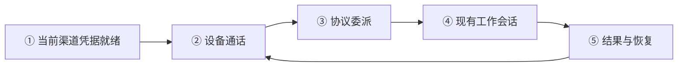
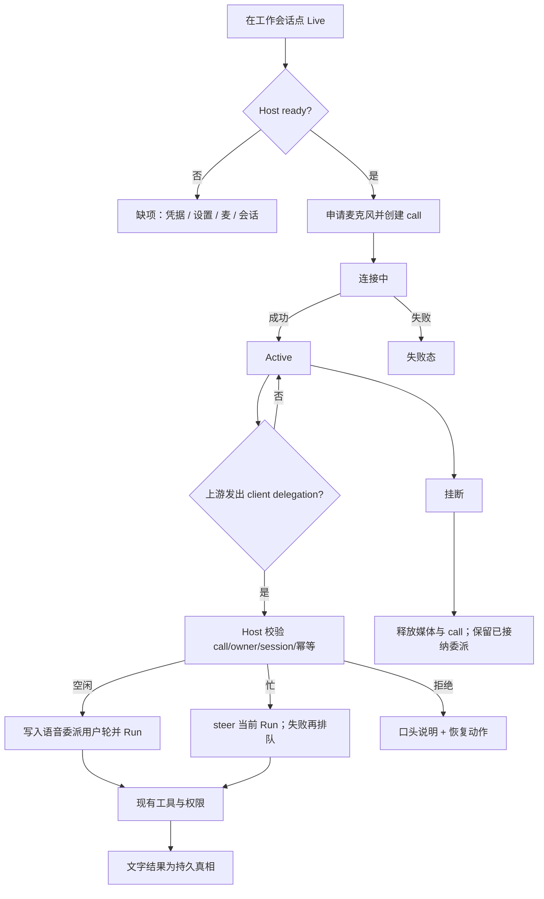

# 产品规格 — piwin Live（会话内实时语音工作）

2026-08-31：[稳定性修订](./2026-08-31-live-reliability.md) 已落地，包含当前适配器 HTTP 201 / 原生 connected 证据；真实设备说听验收与 Limited Beta 门禁不以此替代。

| 字段 | 值 |
|------|----|
| 状态 | **Dogfood implementation — call-create 201 与 SDP 兼容修复已验证，Desktop/Mobile 音频端到端验收进行中** |
| 日期 | 2026-08-28（同日修订：撤回 Platform Realtime MVP） |
| 产品名 | **piwin Live**（对外品牌；文件名保留历史 `codex-live`） |
| 一句话 | 用已登录的 Codex/ChatGPT 套餐账号，在当前工作会话里说、听、打断；明确工作指令交给同一个 Agent 会话执行。 |
| 配套架构 | [2026-08-28-codex-live-voice-lane.md](./2026-08-28-codex-live-voice-lane.md) |
| 执行计划 | [2026-08-28-piwin-live-execution-plan.md](../plans/2026-08-28-piwin-live-execution-plan.md) |
| 相关能力 | [Pi-native subscription OAuth](./2026-08-28-subscription-oauth.md) · [multi-client concurrency](./multi-client-concurrency.md) |
| 参考实现 | `@howaboua/pi-codex-conversion` voice 路径（鉴权与 call 形态证据，不是可直接粘贴的产品代码） |
| 语言模型分层 | [2026-08-31-live-language-layers.md](./2026-08-31-live-language-layers.md)（说话面 / 交接 / 手 / 回传） |

渠道、设置、建连材料与 Provider 结构以 [2026-08-29-live-provider-adapter.md](./2026-08-29-live-provider-adapter.md) 为准。会话准入、失败自关、声音由电脑直连上游，仍以本文为准。

本文是产品权威（会话与委派）。技术文定义代码落点；执行计划定义施工顺序。三者冲突时，先修文档再施工。产品负责人指示优先于过时 ADR（见 `AGENTS.md` §0.1）。

---

## 0. 审查结论与本次修订

### 0.1 为什么撤回「Platform Realtime + realtime-audio 模型」作为 Codex 主路径

| 错误假设 | 事实 |
|----------|------|
| MVP 要 Codex 用户配置 Platform API key 与 `realtime-audio` 模型 | 参考拓展**没有**这类目录；Codex 语音不依赖当前聊天模型，兼容渠道另行复用模型能力标记 |
| 官方 `api.openai.com/v1/realtime/calls` 是套餐 Live | 拓展实际打的是 **ChatGPT Codex backend** Live |
| 套餐 OAuth 只能用于编码模型 | 拓展用**同一份** `openai-codex` login 开语音 |

用户参考拓展的意图是：**套餐账号 → Live 通话 → 委派进工作会话**。  
「去找 Realtime audio 模型」不是产品需求，也无法由用户提供——本来就不存在那条配置面。

### 0.2 外部能力事实基线（已核源码）

`@howaboua/pi-codex-conversion`（抽检 3.0.23）：

1. `resolveCodexVoiceAuth` ← `getProviderAuth("openai-codex")`（Bearer + JWT 内 `chatgpt_account_id`）。
2. Call create：
   ```text
   POST {baseUrl}/realtime/calls?intent=quicksilver&architecture=avas
   baseUrl 默认 https://chatgpt.com/backend-api/codex
   Header: openai-alpha: quicksilver=v2
   Body JSON: { sdp, session: { model: "gpt-live-1-codex", instructions, audio.output.voice, delegation: { type: "client", ... } } }
   ```
3. 媒体：本机 `pi-codex-voice` helper 做 WebRTC；GipPity 远端是 Host 持 call、PCM 中继。
4. 委派：协议事件 `delegation.created`（`target: "client"`），再作为用户请求进入 Pi——**不是** Platform function tool，也**不是**关键词猜测。

### 0.3 仍保留的正确约束

- 对外名 **piwin Live**，不声称官方 Codex/ChatGPT Live 产品。
- 忙会话默认 **steer** 当前 Run；明确停止才 abort。挂断不误杀已接纳 Agent Run。
- 可浏览其他会话；Desktop 焦点会话/窗格与 paired Mobile owner 当前工作会话变化时改绑工作目标，不改绑持麦设备；空焦点保持旧绑且 Live 条须标出绑定目标；改绑失败可见。
- 无关键词委派；必须等 Host 接纳回执后才能口头宣称已交付。
- Desktop WebRTC 优先；Host **不**默认中继 PCM（GipPity 式中继不是 MVP）。
- 原始音频 / 闲聊 transcript 默认不持久化；委派文本持久化。
- owner、幂等、断线、Host 重启、权限等待、资源清理、a11y、量化门禁仍要。

### 0.4 明确接受的风险（owner 已选路径）

ChatGPT `backend-api/codex` Live（`quicksilver` / `avas` / `gpt-live-1-codex`）**不是**公开 Platform 文档契约。MVP 接受：

- 协议可能变更；adapter 必须隔离 + fixture/变更检测；
- 资格/限额错误语义可能粗糙，产品文案必须诚实（「依赖已登录的 Codex 套餐能力」）；
- Limited Beta 前仍要有泄漏扫描与原生证据；失败则停，**不**自动改回 Platform BYOK 冒充同一产品。

---

## 1. 产品定位

### 1.1 用户问题

编码时需要边看工作区边口头指挥 Agent。纯 ASR 只有输入；用户要的是低延迟说听打断，并把明确工作交给现有会话执行。

### 1.2 目标用户

- Desktop 上已能用 **Accounts → openai-codex** 登录套餐的用户。
- 需要「说话指挥当前会话」而不是另开一个语音聊天机器人。

### 1.3 MVP 不承诺

- 不承诺 OpenAI 官方长期支持该 backend Live 接口不变。
- 不承诺与 ChatGPT Voice / Codex 应用 UI 一致。
- Codex Live 不要求 Platform Realtime API key；OpenAI-compatible Live 可使用模型配置里标记的 `realtime-audio` 模型。
- CLI / Web 不持麦；Desktop 与已配对 Mobile 都可作为 owner。
- 不保存原始录音；不提供会议录音产品。
- 语音通道不获得 Agent/MCP/权限工具目录。
- 通话中不改绑持麦设备；Desktop 与 Mobile owner 的工作会话跟随当前焦点/当前工作会话（空焦点保持旧绑）。

### 1.4 可验收承诺

当前渠道的登录/密钥与设置就绪时，Desktop 或已配对 Mobile 用户可以（不另设 Live 开关）：

1. 在现有工作会话开始实时语音，听回复并可打断。
2. 静音 / 取消静音 / 挂断；键盘与读屏可用。
3. 明确工作指令经 Live 委派协议进入绑定会话，显示「语音委派」用户轮。
4. 该轮走现有 Run / 队列 / 权限；Voice 无旁路权限。
5. 通话中 Desktop 切换焦点会话/窗格，或 Mobile owner 切换当前工作会话时，Live 条跟着显示新的绑定目标；口头工作进入新目标；空焦点保持旧绑且条上仍能看出绑谁。
6. 失败时知道缺登录、麦权限、协议失败、改绑失败等，并有明确恢复动作。

---

## 2. 闭环模型与不变量



| 模块 | 用户看到什么 | 权威 |
|------|--------------|------|
| ① 资格 | 当前渠道凭据、音色、麦克风能力 | Host：Provider registry + Live settings |
| ② 通话 | 连接 / 聆听 / 说话 / 静音 / 挂断 | Host Call + owner shell 媒体 |
| ③ 委派 | 「已交给当前会话」或可恢复失败 | Host admission（协议事件 → 会话） |
| ④ 工作会话 | 用户轮、工具卡、权限、结果 | 现有 Session / Run / Permission |
| ⑤ 结果 | 文字结果、可选短口述、重试 | Session 为持久真相 |

**不变量**

1. 每个 call 绑定稳定 `ownerDeviceId` 与渠道；Desktop 焦点会话/窗格与 Mobile owner 当前工作会话变化时 owner 可改绑 `sessionId`（空窗格 / 空有效焦点保持原绑定，且 owner UI 必须标出绑定目标；改绑失败可见；成功改 session 后 Host 发短 retarget `append-context`；已接纳 Run 不因改绑取消）。持麦设备通话中不改绑。
2. Live 语音模型（`gpt-live-1-codex`）不看见 Agent 工具目录；工作只经 Host 接纳的委派进入会话。
3. 口头「已交给 Agent」只能在 Host 回执之后。
4. 同一 `~/.piwin` Host 同时最多一个活动 Live call（MVP）。
5. 原始音频、SDP、access token 不进 transcript / 日志 / HostPush journal / 配置。
6. 忙会话默认 **steer** 当前 Run（语音接管方向）。只有 Live 交出 `STOP_CURRENT_RUN` 才 abort。挂断仍不取消已接纳 Run。ASR 标签/纯语气词委派直接拒绝，不写用户轮。
7. Voice 不得 `bypass`、替用户点允许或调 MCP。
8. Host 重启、logout、绑定会话失效、owner 超时 → 结束通话并释放麦克风。

---

## 3. 资格与通道策略

### 3.1 MVP 发布通道（唯一）

```text
ready =
  openai-codex OAuth 凭证可用（可 refresh）
  ∧ owner Shell 报告 microphone + 对应媒体能力
  ∧ 当前没有其它活动 call
  ∧ 存在可绑定的工作会话
```

- Codex Live 不依赖 `ModelCapability = 'realtime-audio'`；OpenAI-compatible Live 复用模型配置里已有的该 capability。
- **不**要求用户选择 Platform channel ModelRef。
- 语音模型 id 产品固定为 Codex Live 通道模型（实现层 `gpt-live-1-codex`）；UI 可展示「Codex Live 语音」，不做成通用模型下拉。
- 音色等为 Live settings 可选字段，不冒充聊天模型选择。

### 3.2 计费与文案

设置与缺项说明必须写清：

- Live 使用 **已登录的 Codex / ChatGPT 套餐能力**；
- 登录后 Composer 可直接开始/结束，不另开设置开关，不消耗额外产品额度；
- 不是 Platform API key 计费面；
- 私有上游的第三方授权、协议或限额变化可能导致连接失败。

禁止文案：「用套餐开启官方 ChatGPT Voice」「已包含无限 Live」等无法核实的承诺。

### 3.3 明确不做的通道（MVP）

| 通道 | MVP |
|------|-----|
| Platform `api.openai.com` Realtime + API key | 不做 |
| Host PCM 默认中继 | 不做（仅研究/日后另案） |
| 关键词猜委派 | 不做 |
| 未登录套餐的匿名 Live | 不做 |

---

## 4. 用户旅程

### 4.1 首次配置

1. Settings → **Accounts**：完成 `openai-codex` 登录（复用现有 OAuth，不新建第二套登录）。
2. Settings → **Voice / Live**（或 Models → Speech 下的 Live 分区）：选择已准备凭据的渠道和音色，没有额外启用开关。
3. Composer Live 入口变为可用（未 ready 时说明缺项：凭据 / 设置 / 会话 / 媒体能力）。

### 4.2 一次完整通话



### 4.3 导航与多面板

- 可切换会话/面板；全局 Live 条显示当前绑定会话。
- Desktop：焦点停在哪个会话窗口，后续口头工作就进入哪个会话；Mobile owner：当前工作会话变化时同样 auto-rebind；不必挂断重开，不改绑持麦设备。
- 空窗格 / 空有效焦点不改绑，且 owner UI（Live 条 / 绑定标签）必须仍能看出当前绑定目标。
- 副窗格无法 bind、改走 primary resume 时，焦点回到 primary。
- 改绑失败须可见（错误 / Live 条），不得静默保持。
- 成功改绑且 session 实际变化后，Host 向语音层发短 retarget `append-context`；已接纳的 Run 不因改绑而取消；飞行中 admission 留在原会话。
- 任务进行中仍可继续说/打字：默认 steer 当前绑定会话的 Run，不必先停。

### 4.4 权限

- Live 条：`waiting-for-permission`。
- Desktop / Mobile 现有权限 UI；Voice 只简短提示一次，不代点允许。

---

## 5. 功能规格

### 5.1 配置与入口

| ID | 需求 | 验收重点 |
|----|------|----------|
| CFG-1 | Codex 登录后 Composer 直接可开/关 Live | 无设置开关；`speech.live.enabled` 忽略 |
| CFG-2 | 可选渠道音色 | 新输入严格校验；旧 Codex 音色读取时安全迁移 |
| CFG-3 | 资格展示：openai-codex 登录状态；兼容渠道复用模型配置 | OpenAI-compatible 渠道只显示已标记 `realtime-audio` 的模型 |
| CFG-4 | 本地麦克风测试 | 音频不离开设备、不落盘 |
| ENT-1 | Composer Live 始终可发现 | 未 ready 打开缺项说明 |
| ENT-2 | 无工作会话不可开始 | 引导先创建/发送到会话 |

### 5.2 通话模型

```text
phase: idle | starting | active | reconnecting | ending | ended | failed
activity (active/reconnecting):
  listening | user-speaking | assistant-speaking | muted |
  agent-working | waiting-for-permission
```

| ID | 需求 | 验收重点 |
|----|------|----------|
| CALL-1 | start 绑定 session/device | 稳定 callId + revision |
| CALL-2 | mute 只停 owner 上行 | 不拆通话 |
| CALL-3 | barge-in | 用户开口停远端播放 |
| CALL-4 | end 幂等 | 媒体释放 |
| CALL-5 | 单通话 | 并发 start 只成一个；同 idempotency key 同结果 |
| CALL-6 | 重连预算 | ≤10 秒 / 2 次 |
| CALL-7 | owner 离线 | 20 秒 grace 后结束 |
| CALL-8 | Host 重启 | call 不恢复；客户端清媒体 |

### 5.3 委派

上游启用 `delegation.type = "client"`。Host adapter 只接纳规范的 **client delegation** 事件（参考拓展：`delegation.created`），映射为内部 admission：

```text
VoiceDelegationAdmission {
  instruction: string
  providerDelegationId: string   // 幂等键来源
  callId: string                 // 产品 call
}
```

产品层仍可称工具语义为「委派到当前会话」；**实现不得**发明关键词路由，也不得把 Agent tool catalog 塞进 Live 会话。

| ID | 需求 | 验收重点 |
|----|------|----------|
| DEL-1 | 只接受活动 call 的上游委派事件 | 客户端不能伪造 |
| DEL-2 | `(callId, providerDelegationId)` 幂等 | 不产生第二用户轮/Run |
| DEL-3 | instruction 长度/空白校验 | 拒绝空/超大 payload |
| DEL-4 | 写入「语音委派」用户轮 | 持久化文本 + callId + source；无音频 |
| DEL-5 | 忙会话默认 steer 当前 Run；`STOP_CURRENT_RUN` 才 abort；steer 失败才排队 | 用户轮只持久化改写后的 brief；Agent 侧再包一层 handover。浏览其它会话不得把其回复喂进本通话 |
| DEL-6 | 现有权限与工具目录 | 无 Voice 旁路 |
| DEL-7 | Host 回执后才能口头宣称交付 | |
| DEL-8 | 回传仅去敏短状态 | 绑定会话 Run 结束后 Host 推 `append-context`；Desktop 经 data channel 发给 Live。无 diff/secret/原始工具输出 |

### 5.4 历史与隐私

| 数据 | MVP |
|------|-----|
| 原始音频 | 不落盘 |
| SDP / token | 长期凭据仅 Host；一次性 bootstrap 仅 owner 响应与媒体内存 |
| 闲聊 transcript | 默认不持久化 |
| 委派最终文本 | 持久化 |
| 诊断 | provider=openai-codex、phase、耗时、mapped error；无 token/SDP/音频 |

---

## 6. 界面与可访问性

### 6.1 Settings

**Accounts**：现有 openai-codex 登录/退出（Live 复用，不另开 OAuth 流）。

**Voice → Live**：

```text
piwin Live                                      [Beta]
套餐账号   ● 已登录 openai-codex   /   ○ 未登录 → 去 Accounts
音色       [可选 ▼]
麦克风     [测试麦克风]

Live 使用已登录的 Codex 套餐实时语音能力。
piwin 默认不保存录音；工作指令会作为「语音委派」写入绑定会话。
该能力依赖上游接口，可能随时变更。
```

### 6.2 Composer 与 Live 条

- Live 控件 ≥44×44px；`aria-label` + tooltip。
- 点击后 Live 条从本地媒体阶段立即常驻；不以 Host 已创建 call 作为首次显示条件。
- 通话条区分打开麦克风、连接、重连、聆听、用户说话、模型响应、Agent 工作、权限等待与失败。
- 活动通话时 Composer 按钮聚焦 Live 条；静音和挂断使用条内独立控件，避免同一按钮状态切换造成误挂断。
- 单一 `role="status"`；错误就地恢复；尊重 reduced motion。

### 6.3 Transcript

- 「语音委派」标签 + 最终指令。
- 不把每个 partial 闲聊写入历史。

---

## 7. 错误、恢复与清理

| 条件 | 错误码 | 恢复 |
|------|--------|------|
| 未登录 / token 失效 | `live-provider-auth` | Accounts 登录 / 重新登录 |
| 麦克风拒绝 | `live-microphone-denied` | 系统设置 / 重试 |
| WebRTC 不可用 | `live-media-unsupported` | 诊断 |
| 已有通话 | `live-call-busy` | 返回目标 / 挂断 |
| 会话不可用 | `live-session-unavailable` | 挂断并选会话 |
| Live call 参数被拒绝（HTTP 403；已知旧音色 `alloy` 会触发） | `live-provider-access-denied` | 不推断套餐资格；先验证 v3 音色与 wire shape |
| 上游拒绝/限额 | `live-provider-rejected` | 稍后 / 查套餐状态 |
| 协议失败 | `live-protocol-failed` | 重试 / 挂断 |
| owner 离线 | `live-owner-disconnected` | 本机重开 |
| 委派重复 | `live-delegation-duplicate` | 返回既有 Run |
| 委派拒绝 | `live-delegation-rejected` | 查看会话 / 重说 |

清理：停新委派 → 断 call → owner 释媒体 → 发终态。挂断不取消已接纳 Run。

---

## 8. 分期

| 阶段 | 范围 | 出口 |
|------|------|------|
| R0 | 本规格、ADR、architecture/PRD 对齐 | 文档无 Platform realtime-audio MVP 叙事 |
| R1 | 套餐 token → Codex backend call create + Desktop WebRTC + 委派事件探针 | Go/No-go |
| R2 | contracts + `@piwin/voice` + fake adapter 纵切 | 测试绿 |
| R3 | 真实 openai-codex adapter + Session admission + Desktop UI | dogfood，默认关 |
| R4 | 硬化 / Limited Beta 门禁 | §9–§10 |
| R5+ | 短口述结果、可选完整 transcript 等 | 另修订 |

---

## 9. MVP 验收剧本

1. 未登录点 Live → 指向 Accounts；登录后可开。
2. 麦权限允许/拒绝可恢复。
3. 会话 A 能听/说/打断/静音。
4. 切到 B，Live 条改绑 B（同一通话，不另开第二路）；改绑失败可见；A 上已接纳 Run 不取消；同一 Host 仍最多一路 Live。
5. 明确工作请求 → A 一条语音委派轮。
6. 空闲 Run / 忙时 steer，失败才排队。
7. 权限：Voice 只提示；Desktop UI 决定。
8. 结果以文字为准；Voice 仅短状态。
9. 同一 delegation id 重放不双写。
10. 挂断释媒体；不杀已接纳 Run。
11–15. 重连预算、owner grace、Host 重启、切换设置/logout、非 owner 只读。
16–20. 泄漏扫描、闲聊不持久化、键盘/读屏/缩放。

---

## 10. 量化门禁（Limited Beta）

| 指标 | 门槛 |
|------|------|
| 成功连接 | ≥50 次抽样，成功率 ≥95% |
| start→首音 p50 / p95 | 记录基线；明显劣化须解释 |
| end cleanup | ≥100 次，0 残留麦标/track/peer |
| 重复委派 | 100% 幂等 |
| 泄漏扫描 | logs/journal/transcript/config 无 token/SDP/音频 |
| 键盘/a11y | §9.3 全过 |

---

## 11. 决策摘要

| 项 | 决定 |
|----|------|
| 名称 | piwin Live |
| 凭证 | **openai-codex 套餐 OAuth**（复用 Accounts） |
| 上游 | ChatGPT Codex backend Live（`quicksilver` / `avas` / `gpt-live-1-codex`） |
| 非目标 | Codex 的 Platform Realtime BYOK、另造 realtime-audio 模型目录、默认 PCM 中继、关键词委派 |
| 媒体 | Desktop/Mobile 直连各自媒体；Host 持凭证创建 call |
| 工作闭环 | 上游 client delegation → Host admission → 现有 Session/Run/Permission |
