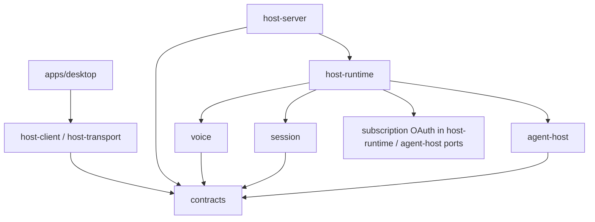

# 实现架构 — piwin Live

| 字段 | 值 |
|------|----|
| 状态 | **Ready for Spike — 技术边界按套餐 Live 重写** |
| 日期 | 2026-08-28（同日修订：撤回 Platform Realtime MVP） |
| 产品权威 | [2026-08-28-codex-live-product.md](./2026-08-28-codex-live-product.md) |
| 执行计划 | [2026-08-28-piwin-live-execution-plan.md](../plans/2026-08-28-piwin-live-execution-plan.md) |
| 首个 adapter | **openai-codex 套餐 Live**（ChatGPT `backend-api/codex`；证据来自 `@howaboua/pi-codex-conversion` voice） |
| 核心原则 | Host 权威；Desktop/配对 Mobile 持媒体；上游 wire 只在 adapter；委派复用 Session/Run/Permission |

文件名保留历史。代码与 UI 使用 `piwin Live` / `voice/live/*`。

渠道、设置、建连材料与双登记台以 [2026-08-29-live-provider-adapter.md](./2026-08-29-live-provider-adapter.md) 为准。本文保留 Codex wire 与 Host 权威边界。

---

## 1. 架构结论

```text
Desktop 或已配对 Mobile（媒体 owner）
   │ HostCommand / owner-only HostResponse / sanitized HostPush
   ▼
Host Server / Transport
   ▼
Host Runtime（Call 权威 + 委派编排）
   ├── @piwin/voice（通话域 + Codex Live adapter）
   ├── 现有 subscription OAuth（openai-codex token，仅 Host）
   └── 现有 Session admission → Run → Agent Host → Pi
```

### 1.1 关键决定

1. **凭证 = 套餐 OAuth（Codex 路径）。** Codex Live 复用 Host 已有的 `openai-codex` access token（及 refresh），不走 Platform API key。OpenAI-compatible Live 是独立渠道，复用模型配置中显式标记的 `realtime-audio` capability，不创建第二套模型目录。
2. **媒体不经 Host PCM 中继（MVP）。** Desktop/Mobile `getUserMedia` + `RTCPeerConnection`（Codex）或对应 PCM WebSocket Driver；Host 用凭证创建上游 session，并持有 call 控制 / 事件面。GipPity 式 PCM 中继是拓展的远程方案，不是 piwin MVP。
3. **长期 secret / token 不进 renderer。** owner Shell 只拿产品 `callId`、revision 和本次 start response 的一次性建连材料；长期凭证与原始事件留在 Host。
4. **Voice 不进 `agent-host`。** 实时语音是应用能力；只有委派进入现有 agent-host 路径。
5. **Provider-neutral contracts。** `@piwin/voice` 公开类型不出现 `quicksilver`、`avas`、chatgpt.com 路径字符串；这些只在 adapter 私有实现。
6. **委派 = 上游 client delegation 事件 → Host admission。** 禁止关键词猜测；禁止把 Agent tool catalog 注入 Live 会话。工作会话主模型走 session composer profile（`session/set-composer-profile` + prompt 解析 desired vs applied），**禁止** Live 管道（owner event / `LiveCallSlot` / `admit-voice-delegation`）携带工作 `ModelRef`。

### 1.2 上游 wire 事实（adapter 私有；勿升格为 contracts）

参考拓展抽检（实现可微调，但 Spike 必须证伪同一形状）：

```text
POST {codexBaseUrl}/realtime/calls?intent=quicksilver&architecture=avas
Authorization: Bearer <openai-codex access token>
chatgpt-account-id: <from JWT claim>
openai-alpha: quicksilver=v2
Content-Type: application/json

{
  "sdp": "<offer>",
  "session": {
    "model": "gpt-live-1-codex",
    "instructions": "<voice system prompt>",
    "audio": { "output": { "voice": "<voice id>" } },
    "delegation": { "type": "client", "ack_filler": <bool> }
  }
}
→ 201 + SDP answer body
```

默认 `codexBaseUrl`：`https://chatgpt.com/backend-api/codex`（与编码路径同源族）。

委派事件（概念）：`delegation.created`，`item.type=delegation`，`target=client`，文本在 `content[].input_text`。Adapter 归一化为内部 `VoiceDelegationEvent`，Host 再 admission。

### 1.3 为什么不做 Platform Realtime MVP

- 产品要的是套餐登录即用，不是再配一套 BYOK。
- Codex 参考拓展本身不需要「realtime-audio 模型」；兼容渠道的 `realtime-audio` 标记属于另一条 BYOK 配置路径。
- Platform Realtime 与套餐 Live 是不同计费/数据/协议面；混称会误导用户。

### 1.4 PCM 中继

仅当 R1 证明 Tauri WebView WebRTC **无法**与该 backend 完成协商时，才进入 No-go 评审。不得在同一 MVP 偷偷并行实现 Host PCM 拓扑。

---

## 2. 依赖方向与包职责



| 模块 | 职责 | 禁止 |
|------|------|------|
| `packages/contracts` | Live settings、commands、pushes、错误码、`voice-delegation` source | upstream URL、JWT、SDP、raw event |
| `packages/voice` | Call 状态机、adapter interface、**CodexLiveAdapter**、事件归一化、错误映射 | import Pi；直接读写 Session；持 Desktop DOM |
| `packages/host-runtime` | ready（OAuth+开关）、Call coordinator、owner/幂等/清理、delegation → session | 解析 raw upstream JSON（交给 voice adapter） |
| `host-server` / transport | admission、owner-only SDP response、sanitized push | journal SDP/token；代理音频 |
| `apps/desktop` | mic/speaker、RTCPeerConnection、Live UI | 持 access token；直接开 Agent Run |
| `agent-host` | 现有 Pi 编码 | 依赖 voice 或处理实时音频 |

创建 `packages/voice` 时同步更新 `docs/architecture.md` package map 与 boundary 检查。

---

## 3. 领域模型

### 3.1 Call 投影

```ts
export type LiveCallPhase =
  | 'starting'
  | 'active'
  | 'reconnecting'
  | 'ending'
  | 'ended'
  | 'failed';

export type LiveCallActivity =
  | 'listening'
  | 'user-speaking'
  | 'assistant-speaking'
  | 'muted'
  | 'agent-working'
  | 'waiting-for-permission';

export type LiveCallView = {
  callId: string;
  revision: number;
  phase: LiveCallPhase;
  activity?: LiveCallActivity;
  boundSessionId: string;
  boundSessionLabel: string;
  ownerDeviceId: string;
  /** Always openai-codex for MVP product view. */
  providerId: 'openai-codex';
  /** Product-fixed voice model label, not a user-picked ModelRef. */
  voiceModelId: 'gpt-live-1-codex';
  startedAt: string;
  endedAt?: string;
  errorCode?: LiveCallErrorCode;
};
```

### 3.2 内部委派事件（adapter → coordinator）

```ts
export type VoiceDelegationEvent = {
  callId: string;
  providerDelegationId: string;
  instruction: string;
};
```

Host 不信任 Desktop 自报的委派正文。

---

## 4. Contracts

### 4.1 Config

扩展 `SpeechConfig`（**无** realtime ModelRef）：

```ts
live?: {
  enabled: boolean; // default false
  voice?: string;   // optional Codex Live voice id
};
```

`ready` 聚合看 OAuth，不看聊天默认模型。

扩展 transcript / prompt source：`voice-delegation`（含产品 `callId`）。不得写入上游 event id、闲聊全文或音频元数据到通用 message 文本。

### 4.2 Commands

| Command | 输入 | 规则 |
|---------|------|------|
| `voice/live/status` | — | ready、缺项、sanitized call |
| `voice/live/start` | `sessionId`, `bootstrap`, `idempotencyKey` | owner-only `callId`/`revision`/bootstrap；MVP loopback Desktop 或已配对 Mobile |
| `voice/live/media-state` | `callId`, `expectedRevision`, media state | owner |
| `voice/live/set-muted` | `callId`, `expectedRevision`, `muted` | owner |
| `voice/live/end` | `callId`, `expectedRevision`, `reason` | owner；幂等 |

无 `audio-up` / `audio-down`。SDP 仅 response，不 journal。

### 4.3 Pushes

| Push | Audience | Journal |
|------|----------|---------|
| `voice/live-updated` | 已授权 shell，sanitized | 否 |
| `voice/live-owner-action` | owner only | 否 |

---

## 5. Host Runtime 编排

### 5.1 Start

```text
validate local owner + openai-codex token + session
  → reserve singleton slot (idempotency key)
  → CodexLiveAdapter.createCall(sdpOffer, token, AbortSignal)
  → install upstream event listener before publishing active
  → return owner-only SDP answer
  → wait Desktop media-state active
```

任一步失败进同一 cleanup；slot 仅在 cleanup 后释放。

### 5.2 Delegation admission

`VoiceDelegationAdmissionPort` → 现有 foreground / queued-turn：

1. call active + 绑定 session 仍在；
2. 规范化 instruction（byte cap）；
3. ledger：`(callId, providerDelegationId)` 幂等；
4. 空闲 foreground / 忙排队；
5. metadata：`source: 'voice-delegation'`, `callId`；
6. 持久化成功后才向 adapter 回执；
7. 只向 Voice 发 bounded 状态句。

`@piwin/voice` 不得 import session。

### 5.3 结束触发

owner end；媒体失败耗尽预算；上游协议失败；owner grace 20s；关 Live；logout / token 失效；会话归档；Host dispose。

结束不取消已接纳 Run。

---

## 6. Desktop

- Media controller：getUserMedia、RTCPeerConnection、mute、barge-in、unload/Host 切换 cleanup。
- UI：Composer Live、全局 Live 条、Accounts 复用、Voice→Live 设置分区。
- Mock 不能代替原生 WebRTC 证据。

---

## 7. Multi-client 与安全

| 主题 | MVP |
|------|-----|
| Start | loopback Desktop or authenticated paired Mobile only |
| owner | start 时固定 device/client |
| 非 owner | 只读 sanitized view |
| token | Host memory；refresh 走现有 OAuth |
| journal | 无 SDP/token/owner-action |
| abuse | 单 call、rate limit、payload cap、reconnect/delegation 预算 |

---

## 8. 测试与证据

| 层 | 必测 |
|----|------|
| contracts | live config 默认关；兼容渠道沿用 `realtime-audio` capability；command/push；voice-delegation source |
| voice | 状态机；adapter fixture（去敏）；委派归一化；错误映射 |
| host-runtime | OAuth ready；singleton；幂等委派；busy queue；logout/end cleanup |
| transport | audience；remote start reject；SDP 仅 response |
| Desktop | fake 流 + a11y；原生矩阵见产品 §10 |
| security | 泄漏扫描 |

真实 token 的 R1 smoke 证据写入 gitignored `docs/plans/evidence/`；仓库只留去敏结论。

---

## 9. R1 Go / No-go

必须回答：

1. 现有 openai-codex token 能否对 Codex backend Live create 拿到 SDP answer？
2. Tauri/WebView WebRTC 能否与该 answer 完成可听可说可打断？
3. 能否稳定收到 client `delegation` 事件并做假 admission 幂等？
4. abort / 断线 / 重复 end 能否确定性清理？
5. token 是否从未进入 renderer / 日志？

**No-go 后停止。** 不得把失败自动改写成 Platform BYOK「同名产品」，也不得默认上 PCM 中继。
