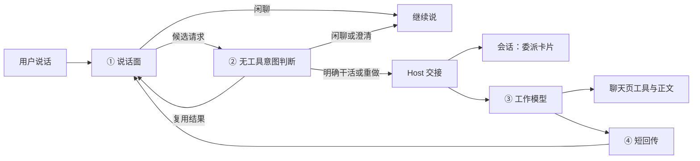

# 产品规格 — piwin Live 语言模型分层

| 字段 | 值 |
|------|----|
| 状态 | **已落地 — 说话面 / 无工具意图准入 / 工作交接 / 回传** |
| 日期 | 2026-08-31 |
| 一句话 | 语音模型管说话，独立无工具判断确认工作意图，Host 按判断机械交接；委派事件本身不等于授权。 |
| 产品权威 | [2026-08-28-codex-live-product.md](./2026-08-28-codex-live-product.md) |
| 配套架构 | [2026-08-28-codex-live-voice-lane.md](./2026-08-28-codex-live-voice-lane.md) · ADR 0065 |
| 参考 | `@howaboua/pi-codex-conversion` 的**层级**（说话面 / 交接 / 手 / 回传），不是它的 XML、TUI 报文或 `~/.pi` 提示词文件 |

本文只定语言模型边界。Call 绑定、steer、权限、媒体仍以 2026-08-28 产品规格为准。

2026-08-31 回传硬化：结果只由 Host 按实际 Run/委派关联推送；Desktop 不再读取页面最后一条助理气泡作为兜底。多个 steer 同属一个 Run 时只播一次最终结果；排队 Run 必须用实际 admission 回执绑定。见 [稳定性修订](./2026-08-31-live-reliability.md)。

---

## 0. 我们和参考拓展不是同一套产品

参考拓展把语音回合和 Pi 回合写进**同一条 TUI 时间线**，所以必须发明多种 custom message，还要教工作模型「按能说出口的句子写」。

piwin 不是这样：

| 我们的事实 | 推论 |
|------------|------|
| 工作模型写的是**聊天页**（工具卡、权限、Markdown） | 不要要求它为喇叭写稿 |
| 语音闲聊默认不落盘 | 不需要「闲聊进上下文再滤掉」；没写进去就没有 |
| 用户看得见会话，也能打字 steer | 工作模型可以正常写页面；语音只拿一句 takeaway |
| UI 已有「语音委派」 | 页面对用户诚实；语音模型不必念「我委托了后端」 |
| Host 权威、contracts 先行、三家 Live 渠道 | 分层落在 contracts + admission，不落在 Pi 自定义类型 |
| Host 不准关键词猜意图 | 独立语义判断返回受限决定；Host 不靠关键词或删口语前缀猜任务 |

要抄的是「两个模型各管一层」，不是他们的标签名和人设文件。

---

## 1. 用户应感到什么

一次通话里：

1. 闲聊、确认、口误纠正 — 只在耳机里结束，会话里不出现一句口语。
2. 明确要干活 — 会话里出现一条**委派卡片**（任务 brief），不是「我刚说的那句」气泡。
3. 任务跑着仍可继续说或打字 — 默认插进当前 Run（steer），不用先停。
4. 语音回复接上一句，像同一个人还在聊；不要突然变成「工作会话已结束，结果如下」。
5. 切去看别的会话 — Live 仍绑原会话；别人的回复不会被念出来。

---

## 2. 四层（按权威，不按文件）

```text
① 说话面     Live 语音模型     只听见用户 + 短回传
② 交接       无工具意图判断 → Host admission → 机械校验 / 写卡片 / steer
③ 手         工作会话模型      只看见 brief，为页面干活
④ 回传       Host → Live       一句可接话的结论，不是系统播报
```



各层**禁止看见**的东西：

| 层 | 可以看见 | 禁止看见 |
|----|----------|----------|
| ① 说话面 | 通话、用户口语、④ 的短结论 | Agent 工具目录、diff、完整助理长文、其它会话 |
| ② 交接 | 候选请求、同通话近期任务/短结果、绑定 session、Host 解析当前聊天模型 | 工具、项目文件/指令、其它会话；Live 事件和 call slot 不带 ModelRef |
| ③ 手 | brief、本会话工具与文件、用户打字 | 原始口语、Live 工具、喇叭稿要求 |
| ④ 回传 | 去敏后的短 takeaway + 成败 | 密钥、SDP、工具原文、其它会话正文 |

---

## 3. 三份合同，取代现在的一块 POLICY

今天 `PIWIN_LIVE_POLICY` 同时管「怎么说、何时交、工作模型怎么理解、结果怎么念」，所以糙。拆开：

### 3.1 说话面合同 → 只注入 Live `instructions`

身份（我们自己的，不装 Codex）：你是**当前这条工作会话**的说话面。页面上的 Agent 是同一条会话的手。对用户像同一个人；不要解释内部结构。

何时留在通话：寒暄、确认、口误、已经在通话里能答的问题。

何时交接：用户明确要求碰文件 / 工具 / 搜索 / 权限，或查询通话里没有的项目事实。候选文本保留请求、否定词和不确定性；不得把感叹、半句和说话偏好改成祈使任务。意图判断放行后才生成工作 brief。

忙碌时：可继续交谈，不强制填充沉默或重复确认。新工作指令经判断后 steer；明确停当前工作才交 `STOP_CURRENT_RUN`；「不用确认」「别说了」不等于停止工作。

回传说：接到自己上一句后面，只说新结论。不要念「工作会话结束了」。

渠道附录（单独一小段，不要写进主合同）：

- Codex：等 Host 回执后再口头说已接住；wire 是 client delegation。
- Gemini / OpenAI Realtime：工具名 `delegate_to_work_session`，参数是保留用户意图的候选请求；不能仅凭工具调用就说已开工。

### 3.1.1 意图准入（同日误执行修订）

一次无工具 completion 复用绑定会话选择的聊天模型，不创建 Session 消息或 Run，不加载 AGENTS.md、技能、工作文件或工具。输入是候选原意和同通话最近 12 条已接纳任务/短结果；输出仅允许以下严格 JSON 决定：

- `work + brief`：明确新任务或修改；忙时走现有 steer。
- `repeat + brief`：用户明确重做/再做一版，允许重复执行。
- `reuse + delegationId`：重复请求或问进展/结果，复用已有任务，包括已完成任务。
- `conversation`：确认、闲聊、说话偏好，仅回传 commentary，不生成工作消息。
- `clarify`：意图不完整，仅在语音里简短澄清。
- `stop`：明确停止当前工作，不是停止说话。

每通话串行判断，最多 8 个待判断候选；从候选到达到判断结束总预算 20 秒。无效 JSON、不存在的复用 ID、超时、模型不可用一律不执行。重复事件 ID 不重审/重执行；同一规范 brief 默认复用，明确 repeat 除外。停止/挂断使待判断结果失效，已接纳 Run 不因挂断取消。判断增加一次模型调用及相应成本/延迟，不宣称零延迟或绝对准确。

### 3.2 工作交接合同 → 只包进工作模型这一轮

页面是真相。这条 `voice_brief` 是语音交来的任务，不是用户打的字，也不是要你复述的口语。

按普通工作会话写：工具、文件、权限、页面可读的进度。不要为喇叭改文风，不要向语音层提问。用户看得到本页，也可以打字或再说话来 steer。

注入方式：每个 Live call **第一次**委派时写一条会话级 preamble；之后每轮只包 brief。打字发送仍是普通用户轮，不带这个壳。

### 3.3 回传合同 → 只走 `append-context`

结构化，不要现在这种英文播报：

```text
status: done | failed | incomplete
evidence: assistant-report; display-not-verified
takeaway: <最多约 600 字、去代码围栏>
continue: 接你上一句；一句结论；不要宣布系统状态
```

Host 继续做机械去敏（剪 fence、封顶、不传工具原文）。Run 完成和模型声称完成不是画面已渲染的证据；没有渲染确认时不得播报「已经在上面显示」。Codex 通过已知 context.append 回传，关掉自动 ack filler；工具渠道按原始 tool ID 回执。commentary 不显式触发额外语音生成。发送成功仍不等于上游收妥或用户听到。

---

## 4. 会话里怎么呈现（产品，不是模型）

保留一条 transcript 行（Run / 权限 / 重试需要身份），但**不要再长得像用户打字**：

| 现在 | 改为 |
|------|------|
| 右对齐用户气泡 + 角标「语音委派」 | 委派卡片：标签 + brief |
| 正文像用户原话 | 正文只显示意图判断放行的 brief，保留约束与否定 |
| 闲聊若被误交接就落一条用户轮 | 无工具判断先拦截闲聊/含糊片段，默认不落盘 |

工作模型的回复继续走现有助理气泡和工具卡。不要为 Live 再造一条「口述专用」时间线。

---

## 5. 明确不做

- 不把 AGENTS.md / 项目编码规矩抄进 Live instructions。
- 不在 Host 侧用关键词判断「这是不是任务」。
- 不要求工作模型改成口语体。
- 不引入 Pi custom message 类型或他们的 `<realtime_*>` 名字。
- 第一刀不做 `~/.piwin` 可编辑语音人设文件（以后要加再另开；默认合同留在 contracts）。
- 不把说话面合同和工具名糊回同一段字符串。

---

## 6. 落地切片（按好用程度）

做完用户就能感到变化的顺序：

| 切片 | 改什么 | 用户为什么觉得更好用 |
|------|--------|----------------------|
| A | 拆三份合同；Codex / Gemini 各挂附录 | 闲聊少进会话；说话不再像念政策 |
| B | 回传改成「接上一句的 takeaway」 | 听起来还是同一个人 |
| C | 第一次委派注入工作交接 preamble；每轮只包 brief | 页面回复不再把口语当引文 |
| D | 「语音委派」改成卡片，而不是用户气泡 | 看起来像交代任务，不像听写 |
| E | （已有）绑定会话 + 忙时 steer | 切会话不乱；跑着还能继续说/打 |

E 已在 2026-08-31 管道修复里开了头。A–D 是这次分层的正式工作。A+B 可以同一 PR：只动 contracts 和 Live 回传，不动 UI。C 动 Host prompt。D 动 Desktop 用户行。

---

## 7. 验收（比听感，不比像不像拓展）

1. 「今天天气怎么样」且不涉及工作区 → 只在通话里回答，会话不新开用户轮。
2. 「搜一下 X 并写进笔记」→ 一条委派卡片，brief 是任务句，不是「我是让你…」。
3. 跑着再说「改成只要官方文档」→ steer，不先停，不新开听写气泡。
4. 语音在结果出来后接上一句说结论，不出现「工作会话已结束」。
5. 通话中打开另一条会话 → 不把那条的助理正文念进耳机。
6. 打字发送仍是普通用户轮；工作模型不把它当成 voice_brief。
7. 「不用确认啦」「另外，说已经出来了」→ 不出现委派卡片、Run 或工作模型答「好」。
8. 「哇，一张…骑自行车的…HTML动画」→ 澄清或复用，不凭名词生成作品。
9. 同一句在任务完成后换 provider ID 再来 → 不重开 Run；「再做一版」仍可执行。
10. 慢判断途中挂断/停止、判断超时或坏 JSON → 没有晚到自动执行。

## 8. 同次动画格式修复

只对粘在普通段落后的规范 `artifact-html` 围栏、且下一行是 HTML 文档开头，统一围栏索引记录恢复标记，渲染投影补空行。原始存储文本、源码和 raw offset 不变，投影 offset 映射保持一致；代码块内示例、行内代码、引用/列表/缩进代码和普通 `html` 提及不自动提升。iframe/CSP 安全策略不变。此项修复显示格式，不充当渲染完成证明。

协议核对：公开 Platform Realtime 的工具结果按 call_id 关联，response.create 显式请求回复，见 [官方会话指南](https://developers.openai.com/api/docs/guides/realtime-conversations)。Codex 私有 context.append 仅依据本机已检查的参考实现，不把它说成公开 API 保证。
