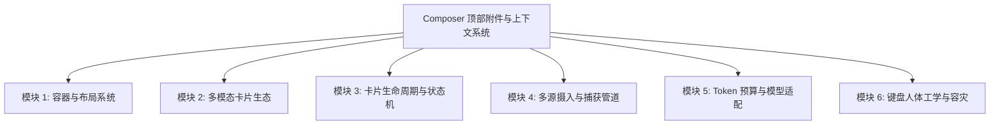
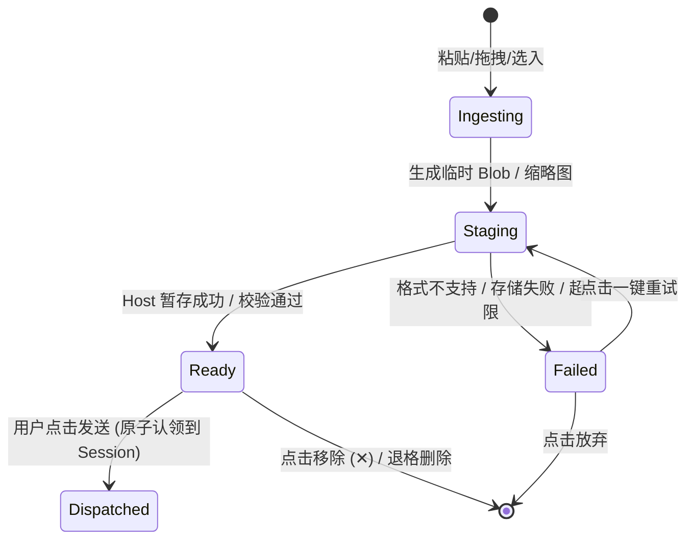

# PRD & 架构设计：Composer 顶部附件与上下文挂载搁板 (Attachment Shelf)

> **文档状态**：Draft  
> **责任领域**：Desktop UI / Host Transport / Media Pipeline / Contracts  
> **关联文档**：`docs/adr/0041-p0-p1-file-attachments.md`, `docs/adr/0045-draft-scoped-media-upload-and-recovery.md`, `docs/specs/desktop-ui-modernization.md`

---

## 1. 需求背景与原始诉求

### 1.1 用户原始诉求描述
- **核心形态**：输入框分为清晰的上下层级结构。当有**屏幕截图、剪贴板图片、拖拽文件或外部上下文卡片**进入时，**只统一展示在输入框上方（Top Shelf）**，与打字区清晰隔开。
- **目标体验**：打字输入框始终保持纯净文本编辑体验；用户在发送前能清晰看到所有挂载的实体卡片；支持灵活查看、删除、错误重试和多模态交互。

### 1.2 现有痛点分析
1. **输入区混排抖动**：若将图文混排在同一个输入框内，会导致光标计算复杂、换行与退格容易误删图元、输入框高度自适应剧烈抖动。
2. **上下文黑盒感**：用户拖入或 `@` 引用文件后，无法直观确认该文件是否准备就绪、占用了多少 Token、是否超过模型上下文限制。
3. **异构数据耦合**：纯文本 Prompt 与二进制媒体/结构化引用在数据流上混杂，导致异常处理（如图片上传失败）与文字草稿的生命周期互相阻塞。

---

## 2. 业界调研与竞品实现方案对比

在现代 Coding Agent 与 AI 交互终端中，“输入框上方独立挂载台”已经成为行业事实标准。

```text
┌────────────────────────────────────────────────────────────────────────────────────────┐
│ [🖼️ 截屏.png (56x56) ✕]   [📄 App.tsx:20-50 ✕]   [⚡ Terminal Err: 12L ✕]  [💬 PRD批注 ✕] │  ← ① Attachment Shelf (顶部挂载搁板)
├────────────────────────────────────────────────────────────────────────────────────────┤
│ Ask anything, @ to mention, / for actions...                                           │  ← ② Clean Textarea (纯净输入区)
│                                                                                        │
├────────────────────────────────────────────────────────────────────────────────────────┤
│ [+] [🧠 Gemini 3.7 Flash ▾]    [🛡️ Auto]               [⚡ 1.2k tok]   [🎙️]    [➡️ 发送] │  ← ③ Toolbar (底部控制栏)
└────────────────────────────────────────────────────────────────────────────────────────┘
```

### 2.1 主流竞品方案对标

| 产品 | 官方术语 | 呈现位置 | 支持的卡片类型 | 交互与生命周期特色 |
| :--- | :--- | :--- | :--- | :--- |
| **Antigravity** | `Attachment Shelf / Deck` | 输入框正上方，细分割线隔开 | 截图、图片、GIF、多模态附件 | 方形圆角缩略图，微型状态徽章，悬浮移除，自动适配多模态模型 |
| **Cursor** | `Context Pills Strip` | 输入框上方 | 图片、`@` 文件、代码选区、Git Diff、Docs | 紧凑胶囊药丸，支持键盘退格连携删除，实时计算 Context Tokens |
| **Windsurf (Cascade)** | `Cascade Context Tray` | 输入框上方 | 文件快照、选区、终端报错输出、规则卡片 | 自动提取报错上下文生成卡片，悬浮可查看代码高亮预览 |
| **Claude / ChatGPT** | `Attachment Preview Bar` | 输入框上方 | 图片、PDF、代码文件、文档 | 卡片式骨架屏上传进度，支持点击全屏 Lightbox 预览与错误重试 |
| **GitHub Copilot Chat** | `Context Reference Bar` | 输入框顶部 | 当前活动编辑器、选区、终端快照 | 随编辑器焦点智能隐式/显式切换，支持一键 Pin/Unpin |

### 2.2 为什么业界一致选择“上方独立搁板 (Top Shelf)”？

1. **认知模型契合“附件先于指令”**：在自然语言交互中，用户通常提供“参考材料（前置条件）+ 动作指令（Prompt）”，上方挂载材料、下方书写指令符合从上到下的阅读逻辑。
2. **纯文本核心（Text Core）保障极致输入性能**：使用标准原生 `<textarea>` 实现纯文本输入，性能极佳且完全兼容中文/日文 IME 输入法，零输入卡顿与光标错位风险。
3. **独立滚动视口（Independent Viewport）**：挂载 10+ 个文件或多张大图时，顶部搁板可以横向滚动或网格折叠，绝不挤压文字打字区域的高度。

---

## 3. 方案选型与推荐实现形式

### 3.1 方案对比矩阵

| 评估维度 | 方案 A：富文本图文混排 (Inline RichText) | 方案 B：底部工具栏气泡 (Bottom Toolbar Pills) | 方案 C：**顶部独立挂载搁板 (Top Shelf) [推荐]** |
| :--- | :--- | :--- | :--- |
| **实现复杂度** | 极高（需 ProseMirror / Lexical 深度定制） | 中等 | 适中且模块解耦清晰 |
| **IME 中文输入法稳定性** | 容易发生光标跳字、合成中断 | 稳定 | **绝对稳定（纯 Textarea 隔离）** |
| **视觉清晰度** | 混乱（大图打断文字段落） | 空间局促，与操作按钮拥挤 | **极佳（分层明确，结构清爽）** |
| **多类型卡片拓展性** | 弱（难以统一卡片尺寸与排版） | 弱（底部高度有限） | **极强（支持媒体、代码、终端、批注等多形态）** |
| **草稿与故障容灾** | 附件失败阻断整个编辑器 | 易被误触工具栏按钮遮挡 | **解耦隔离，支持单卡片独立重试与移除** |

### 3.2 推荐实现形式：三段式解耦架构（Top Shelf Architecture）

采用 **三段式垂直流式容器**：
1. **Top Tier (Attachment Shelf)**：动态高度容器，承载所有媒体缩略图、结构化代码引用、文档批注与诊断卡片。
2. **Middle Tier (Prompt Textarea)**：自适应高度的纯文本输入区，仅负责文本捕获、IME 保护、`@` / `/` 触发。
3. **Bottom Tier (Action Toolbar)**：加号菜单、模型/思考深度选择器、权限模式、Token 仪表盘、语音录入与发送/打断动作按钮。

---

## 4. 完整功能需求清单 (Functional Matrix)



### 模块 1：容器与布局系统 (Shelf Container & Layout)

| 需求编号 | 功能名称 | 详细规格说明 | 优先级 |
| :--- | :--- | :--- | :--- |
| **F1.1** | **零内容静默折叠** | 当附件列表及引用卡片为空时，Shelf 容器高度完全为 0，不占据任何内边距或边框像素。 | P0 |
| **F1.2** | **平滑过渡展开** | 当有卡片加入时，容器以 `height / opacity` 弹簧或淡入动画（150ms-200ms）平滑展开，避免界面突兀跳变。 | P1 |
| **F1.3** | **柔和分割线 (Hairline Divider)** | Shelf 底部与 Textarea 之间具备一条细微的分割线（如 `1px solid var(--line-soft)`），明确视觉边界。 | P0 |
| **F1.4** | **双模式排版 (Wrap / Scroll)** | 默认采用 **弹性换行（Flex Wrap）**，最大高度限制为 160px；超过最大高度后自动切换为内部纵向/横向顺滑滚动。 | P0 |
| **F1.5** | **拖拽进入高亮遮罩** | 外部文件拖拽进入 Composer 时，全区显示虚线高亮蒙层与提示文字：“释放以挂载到上下文”。 | P0 |

---

### 模块 2：多模态卡片生态 (Multimodal Card Types & Components)

| 需求编号 | 卡片类型 | 视觉规格与内容定义 | 专属交互动作 | 优先级 |
| :--- | :--- | :--- | :--- | :--- |
| **F2.1** | **视觉媒体卡片 (Media Card)** | - 尺寸：56×56px 正方形圆角缩略图。<br>- 裁切：`object-fit: cover` 居中裁切。<br>- 标识：GIF 动图显示 `GIF` 微标；超大图显示分辨率。 | 点击卡片弹出全屏 Lightbox 大图预览；右上角悬浮显示 `✕` 移除按钮。 | P0 |
| **F2.2** | **代码选区卡片 (Code Snippet Card)** | - 胶囊形态：`[代码图标] 文件名:起始行-结束行 · N行`。<br>- 示例：`[TS] composer-dock.tsx:20-55 · 35 lines`。 | 悬浮显示代码高亮语法浮层；点击跳转定位到编辑器对应行。 | P0 |
| **F2.3** | **整文件/目录卡片 (File/Folder Card)** | - 包含文件/文件夹专属类型图标、相对路径名称、文件大小。 | 悬浮显示完整路径；点击打开文件。 | P0 |
| **F2.4** | **终端与错误诊断卡片 (Diagnostics Card)** | - 包含红色警示图标、错误来源（如 `tsc / eslint`）、错误摘要。 | 悬浮展示完整堆栈与 Output 文本。 | P1 |
| **F2.5** | **文档与评审批注卡片 (Doc Comment Card)** | - 包含文档图标、文档标题、批注数量徽章（如 `Walkthrough.md · 3 comments`）。 | 点击可展开查看具体的批注评论列表。 | P1 |
| **F2.6** | **Web 元素与快照卡片 (Web Element Card)** | - 包含浏览器图标、CSS 选择器标签、DOM 节点名称及快照缩略图。 | 悬浮展示 DOM 选择路径与页面标题。 | P2 |

---

### 模块 3：卡片生命周期与异步状态机 (Lifecycle & Async Pipeline)



| 需求编号 | 功能名称 | 详细规格说明 | 优先级 |
| :--- | :--- | :--- | :--- |
| **F3.1** | **秒级本地乐观展示 (Optimistic Rendering)** | 用户粘贴或拖入瞬间，立即通过本地 `URL.createObjectURL` 生成临时预览卡片，零等待卡顿。 | P0 |
| **F3.2** | **后台异步暂存 (Draft-scoped Staging)** | 符合 ADR 0045 规范：后台通过 `media/upload-ticket` 暂存到 `~/.piwin/media/.staging/`，不阻塞用户打字与会话选择。 | P0 |
| **F3.3** | **状态徽标反馈** | - `Staging/Saving`：卡片显示半透明加载骨架与转圈 Spinner。<br>- `Ready`：恢复正常高亮。<br>- `Failed`：卡片呈现红色警戒边框与感叹号。 | P0 |
| **F3.4** | **局部容灾与独立重试** | 某个卡片上传失败时，**绝不禁用整个输入框**；在卡片下方提供独立的 “重试 / 移除” 动作，允许用户只重试失败项或忽略失败项继续发送文本。 | P0 |

---

### 模块 4：多源摄入与捕获管道 (Ingestion & Capture Pipeline)

| 需求编号 | 输入通道 | 触发场景与处理逻辑 | 优先级 |
| :--- | :--- | :--- | :--- |
| **F4.1** | **剪贴板智能分流 (Clipboard Paste)** | 焦点在输入框时按 `Cmd+V` / `Ctrl+V`：<br>1. 若剪贴板含图片位图 $\rightarrow$ 拦截并生成 Media 卡片进入 Shelf；<br>2. 若剪贴板含文件路径列表 $\rightarrow$ 解析并生成 File 卡片进入 Shelf；<br>3. 若为常规文本 $\rightarrow$ 保持普通文本粘贴到 Textarea。 | P0 |
| **F4.2** | **拖拽投放管道 (Drag & Drop)** | 1. 外部桌面/Finder 文件拖入；<br>2. 内部工作区文件树（File Tree）拖入；<br>3. 释放后自动区分文件类型并挂载到顶部。 | P0 |
| **F4.3** | **加号菜单挂载 (`+` Menu)** | 点击底部 `+` 弹出菜单：<br>- “添加图片 / 文件”：唤起系统原生文件选择对话框；<br>- “截取屏幕 (Screen Capture)”：调用截屏工具并将结果推入 Shelf。 | P0 |
| **F4.4** | **`@` 提及自动具象化 (Mention to Shelf)** | 在文本框输入 `@filename` 并回车确认后，可在保留文本提及的同时，自动在上方 Shelf 生成一个结构化 File Card。 | P1 |
| **F4.5** | **编辑器/终端外部推入 (IDE Context Push)** | 编辑器选区右键菜单 “Add to Chat Context”、终端报错气泡 “Fix in Chat”，直接将选区/错误作为卡片推入当前 Composer 的 Shelf。 | P1 |

---

### 模块 5：Token 预算与模型智能适配 (Model & Token Intelligence)

| 需求编号 | 功能名称 | 详细规格说明 | 优先级 |
| :--- | :--- | :--- | :--- |
| **F5.1** | **实时 Token 开销估算** | - 图片卡片：根据宽高像素按模型 Vision Grid 算法计算 Token（如 ~258 tokens/tile）；<br>- 代码/文本卡片：按字符估算 Token。<br>- 汇总增量并实时刷新底部 Token Ring 仪表。 | P1 |
| **F5.2** | **纯文本模型降级告警 (Text-only Fallback Warning)** | 当 Shelf 存在图片卡片，但用户选择的模型不支持 Vision 时：<br>1. Shelf 顶部弹出警示黄条：“当前模型不支持图片识别”；<br>2. 提供快捷按钮：“切换到推荐多模态模型” 或 “启用 Vision 自动文字描述代理 (Delegation)”。 | P0 |
| **F5.3** | **超限智能拦截** | 当挂载的文件/图片总体积或 Token 超过安全预算阈值时，卡片显示黄色超限角标，并在发送前给予用户友好确认提示。 | P1 |

---

### 模块 6：键盘人体工学与容灾 (Ergonomics, Shortcuts & Draft Recovery)

| 需求编号 | 功能名称 | 详细规格说明 | 优先级 |
| :--- | :--- | :--- | :--- |
| **F6.1** | **智能退格删除 (Smart Backspace Pop)** | 当 Textarea 中**没有任何文字且光标在第 0 位**时，按下 `Backspace`（退格键），自动高亮并移除 Shelf 中最后一个卡片（与 Slack/Discord/Cursor 保持一致）。 | P0 |
| **F6.2** | **全键盘焦点导航 (Keyboard Traversal)** | 支持通过快捷键或 `Shift+Tab` 将焦点从文本框转移到顶部卡片列表，利用方向键切换卡片，按 `Delete` 删除或按 `Space` 预览。 | P2 |
| **F6.3** | **跨会话草稿与状态持久化 (Draft Recovery)** | 用户在会话 A 中添加了 2 张截图和 1 个文件但未发送，切换到会话 B 再切回会话 A 时，所有卡片及上传就绪状态完整恢复，不丢失未发送草稿。 | P1 |

---

## 5. 系统改造范围与分层设计 (Scope of Changes)

按照 `piwin` 架构规范（Contracts $\rightarrow$ Packages $\rightarrow$ Host Runtime $\rightarrow$ Desktop UI），本次改造的系统受影响范围如下：

```text
packages/contracts
   └── 拓展卡片元数据定义 (CardKind, ShelfState, StagedAssetRef)
        │
packages/media & host-runtime
   └── 实现 Draft-scoped 暂存与上传凭证 (media/upload-ticket)
        │
apps/desktop/src
   ├── components/composer/
   │     ├── ComposerAttachmentShelf.tsx   (顶部挂载搁板核心容器)
   │     ├── MediaCardItem.tsx             (图片/媒体卡片)
   │     ├── ContextRefCardItem.tsx        (代码/文件/选区卡片)
   │     ├── DocCommentCardItem.tsx        (文档批注卡片)
   │     └── VisionWarningBanner.tsx       (纯文本模型告警条)
   ├── hooks/
   │     ├── use-composer-attachments.ts   (统一聚合图片、文件、批注状态机)
   │     └── use-composer-keyboard-pop.ts  (退格键连携删除逻辑)
   └── styles/
         └── region-composer.css           (平滑展开过渡、暗色圆角、滚动遮罩样式)
```

---

## 6. 实施路线图 (Implementation Roadmap)

### Phase 1：视觉与容器重构 (P0 核心可用)
- [ ] 提取独立的 `ComposerAttachmentShelf` 组件容器，替换分散渲染逻辑。
- [ ] 统一媒体截图卡片（`MediaCardItem`）的 56×56 圆角缩略图与右上角快速删除徽标。
- [ ] 实现 `Backspace` 智能退格删除最后一个卡片。
- [ ] 完善纯文本模型（Text-only）的视觉降级提示条与一键切换模型操作。

### Phase 2：多卡片生态与交互增强 (P1 体验进阶)
- [ ] 将代码选区卡片（`ContextRefChip`）、文档批注卡片（`DocCommentChip`）统一收纳进 `ComposerAttachmentShelf`。
- [ ] 支持卡片溢出时的弹性高度与平滑展开动画。
- [ ] 实现图片卡片点击弹出全屏 Lightbox 预览。
- [ ] 接入 Token 实时预估并在底部 Usage Ring 中联动。

### Phase 3：高级上下文与全键盘流 (P2 深度赋能)
- [ ] 支持从终端报错一键生成诊断卡片推入 Shelf。
- [ ] 全键盘 Tab / Arrow 焦点巡检与无障碍支持。
- [ ] 跨会话 Draft 暂存与崩溃恢复机制验证。

---

## 7. 验收标准 (Acceptance Criteria)

1. **输入隔离性**：在挂载 1~5 张图片或文件卡片时，文本框打字、中文 IME 输入、换行、光标移动毫无延迟与跳动。
2. **视觉层级感**：卡片严格收纳在输入框上方，与文本输入区界限清晰；无卡片时高度为 0，有卡片时平滑展开。
3. **操作便捷性**：可通过鼠标 `✕`、键盘首位 `Backspace` 秒级移除卡片；支持点击卡片放大看图。
4. **异常鲁棒性**：当大图上传失败或网络波动时，清晰展示红色错误原因，提供单项重试按钮，绝不导致文本框不可用。
