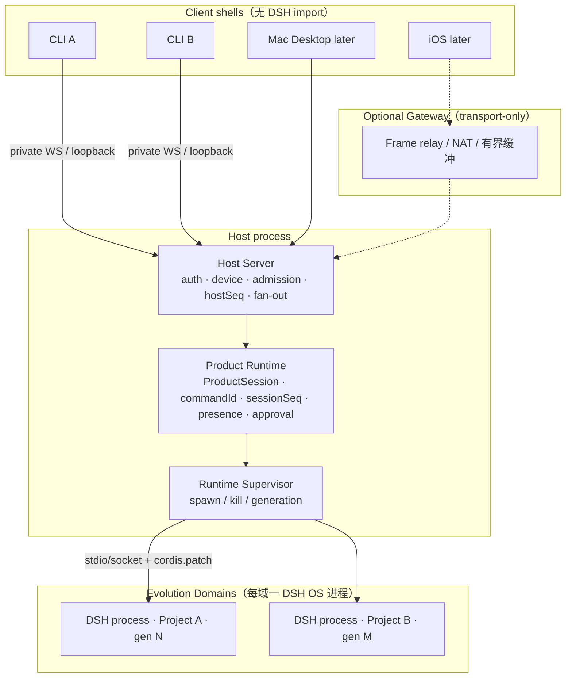
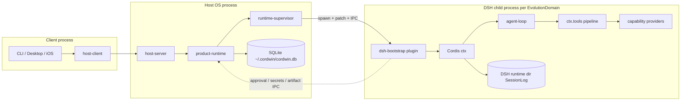
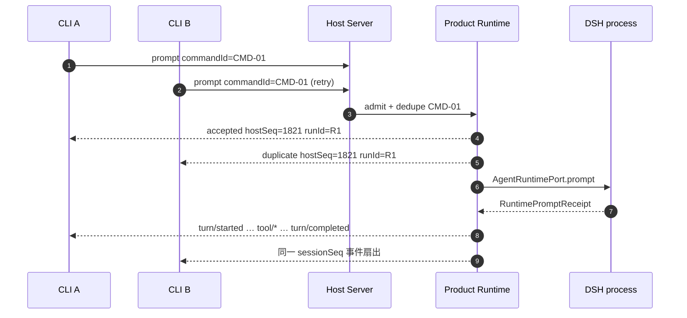
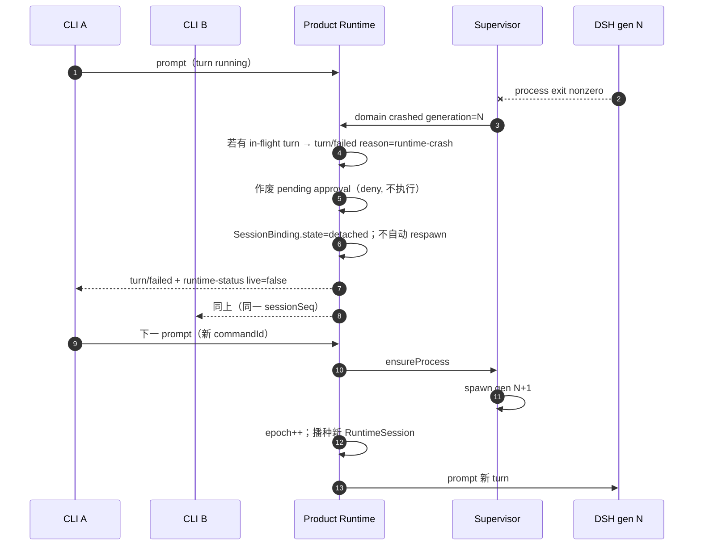
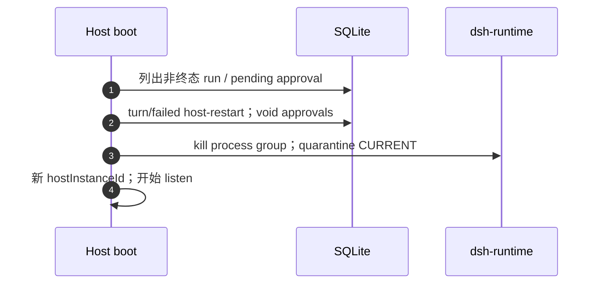

# cordwin：基于 DeepSeek Harness 的 Host-first 产品架构

| 字段 | 值 |
|------|----|
| 文档标题 | cordwin Product Architecture — DSH / Cordis Kernel, Option A, Host-first |
| 作者 | cordwin working group |
| 日期 | 2026-08-14 |
| 状态 | **Draft** |
| 工作名 | **cordwin**（placeholder；npm scope `@cordwin/*`；可在立项时改名） |
| 配置根 | `~/.cordwin` |
| 内核 | DeepSeek Harness（DSH / Cordis），零 Core fork |
| 与 piwin 关系 | **兄弟产品、独立仓库**。piwin 继续以 Pi 为内核；本文不删除、不替换 piwin 中的 Pi。 |
| 前稿 | `docs/specs/piwin-deepseek-harness-integration-spec.md`（salvage / rewrite，见 §1.3） |

> 本文是 **Draft**。不得标注为 Approved Architectural Baseline。锁定决策见 §4；未决分叉仅列于 §23。修订纳入了 DSH 上游已核实事实：官方 `headless` 是 one-shot runner；构造种子是 `SessionEvent[]`；官方 persistence 会 repair 中断 turn；`tools/pre-execute` 是 waterfall（allow 必须 `next()`）。

---

## 1. Overview

cordwin 是一个 **私有、用户自托管的 coding-agent shell**。它的产品形态与 piwin 相近（多端壳 + 可部署 Host + 项目/会话/权限/Artifact），但 **Agent 内核不是 Pi，而是 DeepSeek Harness（DSH / Cordis）**。

DSH 不是固定 `prompt/cancel` 微服务：Agent Loop、工具注册表、SessionLog、沙箱、甚至 UI 贡献都是 Cordis 插件，运行时可自省、可自修改。产品层必须把 DSH 当作 **可演化的 Runtime Graph**，同时把用户身份、多端续聊、命令幂等、事件游标、审批路由、密钥与 Artifact 留在 **Host / Product Runtime**。

本设计锁定 **Option A**：DSH 是唯一 Agent loop 与唯一工具执行运行时；产品向 DSH 进程注入 capability providers，并只挂 **一个** 文档化的 `tools/pre-execute` 审批钩子。产品 **不** 自建第二套工具执行器（Option B），也 **不** 把 DSH 封成黑盒微服务。多端拓扑是 **Host-first**：Gateway 若存在，只做传输。

---

## 2. Background & Motivation

### 2.1 为什么要做兄弟产品而不是改写 piwin

piwin 已经在 Pi 内核上建立了清晰的分层（`apps/*` 不导入 Pi；只有 `@piwin/agent-host` 碰 `@earendil-works/pi-*`；`@piwin/host-runtime` 是产品组合根；Host-first 见 ADR 0036）。这套边界是有效的，不应当被一次内核替换打散。

DSH / Cordis 的契约与 Pi 不同：

- 一切皆插件；`ctx.tools` 的执行管线是 `tools/pre-execute` → monotonic guards → `tools/execute` → `tools/post-execute`。
- SessionLog 是模型可见历史的唯一运行时事实源（`deriveMessages()` 从 log 投影）。
- 动态 Cordis package 的 blast radius 是 **整个 OS 进程**，不是单个 session。
- 官方仍处于 developer preview，公共缝会变；产品必须把 DSH 隔在 adapter + 子进程里。

因此正确做法是：**新仓库、新包名、新配置根**；从 piwin 借鉴 Host-first / contracts-first / 客户端不导入内核 的精神，而不是在 piwin 里删 Pi 或双内核并存。

### 2.2 当前痛点（前稿必须改写的部分）

前稿 `docs/specs/piwin-deepseek-harness-integration-spec.md` 抓住了 Evolvable Runtime、EvolutionDomain、三层会话、双平面、Generic Tool Card 等正确想法，但有三处结构性错误：

1. **把 Auth / Device / ACL / Presence / Command Ordering 放在 “Piwin Gateway”**。这与 piwin ADR 0036 以及本文锁定的 Host-first 冲突。Gateway 不得拥有会话或密钥。
2. **Status 写成 Approved Architectural Baseline**，且暗示 “Delete Pi SDK / Pi from piwin”。piwin 保留 Pi；本文是新仓 Draft。
3. **Product Transcript 与 DSH SessionLog 的双写未定义**。必须写清：客户端重放看谁、模型看见谁、进程死后用什么重建。

### 2.3 从 piwin 借鉴、但不复用其包

精神（不是代码依赖）：

- Host 是执行与数据权威；多端是壳（ADR 0036，`docs/specs/host-server-multi-client.md`）。
- 客户端永不导入内核包（`Agents.md` §1）。
- `commandId` 幂等、游标重放、snapshot hydration、权限三态 `auto | ask-all | bypass`（ADR 0015 / 0019）。
- Artifact 是产品域 + OCC；媒体落盘后再以原生图像内容进入模型，不把 base64 塞进文本。

新仓 **不** 依赖 `@piwin/*`。包名、协议类型、配置根全部独立。

### 2.4 从 DSH 必须尊重的事实

依据 DSH 官方 architecture / tool pipeline（developer preview，实现时以钉死的 DSH 版本为准）。下列为对照 `deepseek-ai/deepseek-harness` 已核实的事实，不是猜测：

- 能力通过 **多方法 seam** 替换：`ctx.fs`、`ctx.shell`、`ctx.subprocess`、`ctx.web`、`ctx.credentials`、`ctx.approval`、`ctx.subagents`。它们不是单一 `execute()`。
- `tools/pre-execute` 是 waterfall：listener 收 `(exec, next)`，返回 `PreToolDecision`：`allow` | `deny` | `ask`。文档与社区 `dsh-tool-policy` 均要求 **放行走 `next()`**；直接 `{ kind: 'allow' }` 会吃掉后续 pre-execute listener。`ask` 之后 DSH 走 `ctx.approval`；缺失或不可答 → **deny**（`unavailable`）。
- 参数在进入 policy 前已 log + freeze，**禁止改写 arguments**。
- `Session.create(id, seed?: readonly SessionEvent[])` / `ctx.sessions.create(id, { seed, meta })`。模型历史是 `deriveMessages()` 对 log 的投影。`ctx.agents.resume({ resumeSessionId })` 只用于官方 persistence 冷加载，**不是**产品续聊路径。
- 官方 `docs/subsystems/persistence.md`：冷加载 **不截断** 中断 turn，而是补一条合成 `turn/end { reason: { kind: 'interrupted' } }`。因此产品会话必须关掉官方 persistence，且 **永不 `load`/`resume` 上一代 SessionLog**。
- 官方 `dsh-headless` 是 **one-shot runner**（`headless-startup` + `headless-runner`，解析任务 positional，无 server）。**不能**作为长期驻留的 `AgentRuntimePort` 宿主。要无 Web UI，应叠在 `dsh-base` 上做 **自定义 product profile**。
- 官方 `dsh-base` 已挂：`session-persistence-jsonl`、`compaction-basic`、`approval`、`permission`、`sandbox` / `sandbox-policy` / `fs-sandbox` / `bash-sandbox`、`credentials`、`skill*`。产品 patch 必须按行 `disabled` 或替换，否则会双审批 / 双持久化。
- 进程内动态包影响同进程全部 session —— 这就是 EvolutionDomain 存在的原因。

---

## 3. Goals & Non-Goals

### 3.1 Goals

1. 独立仓库落地一个 Host-first、多端可续聊的 DSH 产品。
2. Option A：DSH 执行全部工具；产品注入 providers + 单一审批钩子。
3. `ProductSessionId` 是稳定续聊键；DSH 进程可冷启动、可换代。
4. 同一 `ProductSession` 至多一个 in-flight turn；多端 `commandId` 幂等。
5. Control Plane 稳定；Extension Plane 动态；未知工具用 Generic Tool Card，禁止丢弃。
6. EvolutionDomain 隔离自修改 blast radius；默认按 **project**。
7. 零 DSH core fork；只走 Public Services / 文档化 Cordis seams。
8. Product Event Log 是客户端重放源；DSH SessionLog 是模型可见运行时真相。

### 3.2 Non-Goals（v1 明确不做）

| Non-Goal | 原因 |
|----------|------|
| 改写或删除 piwin / Pi | 兄弟产品 |
| Option B（产品执行工具再回填 DSH） | 已否决 |
| 把 DSH 封成黑盒 `prompt/cancel` 微服务 | 扼杀演化 |
| Gateway 作为权威（会话/密钥/定序/审批） | Host-first |
| iOS App Store 抛光 | 协议先于壳 |
| Web 端嵌入 Cordis Client Runtime / 动态 UI | v1 全端 Generic Card |
| Level 3 组合级替换 Agent Loop | 后续 |
| 公网 Gateway SaaS / 多租户 | 私有单用户 Host |
| 东方美学 / ThemeRuntime 作为架构章节 | 客户端呈现，非内核 |
| 远程交互式 PTY | 需单独设计 |
| 多主复制 / CRDT 会话库 | 单 Host 权威 |
| 在 DSH 进程里跑产品 Host / 在 Host 进程里跑动态 Cordis 包 | 破坏隔离 |
| 以官方 `headless` profile 作为长期运行时 | 已核实：它是 one-shot runner，不是多 turn 宿主 |
| 启用官方 `session-persistence-*` 做产品续聊 | 官方冷加载会 repair 中断 turn，与 K11 冲突 |
| 启用官方 `compaction-*`（v1） | 折叠面与 Product Event Log 会分叉；v1 关掉 |
| MCP / Skills marketplace | 非 v1；DSH 自带 `ctx.skills` 可在 v1.1+ 再接 |
| steer / follow-up（ADR 0015 语义） | 被 `turn-in-progress` 显式拒绝取代 |
| Conversation Mode vs Agent Mode 产品面 | 前稿遗留；v1 只有一种会话 |
| 设备 pairing 注册 UX / 令牌轮换 | v1 仅 loopback + 启动 token；私有远程是 v1.1 |

### 3.3 v1 范围（必须能验收）

- **一个** Host Server，**v1 部署 = 本机 sidecar / loopback**（启动 token）。私有远程 + pairing 是 v1.1。
- **两个壳**：`apps/cli` 的两个进程连同一 Host（证明多端；不阻塞后续 Mac Desktop）。
- 同一 `ProductSessionId` 两端续聊、断线按 `ProductCursor` + `hostInstanceId` 重放。
- Option A：自定义 `cordwin` profile（`dsh-base` + 产品 patch，**不是**官方 `headless`）；包装官方 `fs`/`bash`；`web_search`/`web_fetch`；单一 `tools/pre-execute` 钩子。
- `media/register` 先落盘再 `session/prompt { mediaIds }`；图像以原生 content 进 DSH。
- Supervisor：DSH 空闲可冷；下次 prompt 拉起新进程并 `generation++` / `epoch++`。
- 中途崩溃 / Host 崩溃：**不**恢复 in-flight tool；turn 失败；**永不 load 上一代 SessionLog**；下一 turn 把 Product `CommittedTranscript` 映射为合法 `SessionEvent[]` 后 `sessions.create`。
- 默认 **一 project 一 DSH 进程**（K8 / PR-14 切片进 v1 闸门）。

非 v1：iOS 抛光、Web 动态 Cordis UI、Level 3、公网 Gateway、Desktop 完整 Tauri 体验、设备 pairing UX、MCP/Skills、compaction、官方 persistence 续聊。

---

## 4. Key Decisions

| # | 决策 | 理由 |
|---|------|------|
| K1 | **Option A**：DSH 唯一执行器；产品注入 providers + 一个 `tools/pre-execute` 钩子 | 避免第二套 tool runtime；钩子是唯一产品门禁；allow 之后由 DSH 执行 |
| K2 | **Host-first**：Auth / Device / ACL / Presence / 定序 / 事件日志 / 密钥在 Host Server + Product Runtime | 对齐 ADR 0036 精神；Gateway 只转发已认证帧 |
| K3 | **`ProductSessionId` 是续聊身份**；客户端不持有 DSH process / runtime session | 进程可冷、可崩、可换代；壳只认产品会话 |
| K4 | **三层会话**：ProductSession / RuntimeSession / SessionClientView + `SessionBinding` | 产品生命周期与 DSH 执行实体解耦 |
| K5 | **同一 ProductSession 至多一个 in-flight turn**；第二端并发 prompt **拒绝**（`turn-in-progress`），不静默串行 | 禁止两个 DSH loop 写同一会话；拒绝比隐式排队更可观测 |
| K6 | **客户端 `commandId` 幂等**；Host 去重 | iOS/CLI 重试不得二次 prompt |
| K7 | **客户端用 `ProductCursor` 重连**，不用 DSH 传输状态 | DSH 套接字对壳不可见 |
| K8 | **EvolutionDomain 保留，默认 isolation = `project`** | 自修改 blast radius = 进程；不信任的图不能共进程 |
| K9 | **Control Plane + Extension Plane**；v1 全端 Generic Tool Card | Native 不嵌 Cordis client；未知 schema 不得丢 |
| K10 | **双真相拆分**：Product Event Log = 客户端重放源；DSH SessionLog = 模型可见运行时真相 | 消除前稿 dual-write 含糊 |
| K11 | **DSH 崩溃 / 冷启动不恢复 in-flight turn**；`epoch++`，从已提交 transcript 播种 | preview 内核 + 工具副作用使 mid-tool resume 不安全 |
| K12 | **审批钩子内部消化 `ask`**：钩子对 DSH 只回 `allow`/`deny`；`ctx.approval` 换成 fail-closed stub | 避免 DSH 把 approval socket 绑到某设备 |
| K13 | **审批：在线观看端扇出，先答生效；全离线则一直 pending，禁止 timeout-allow** | 安全默认；离线不等于同意 |
| K14 | **密钥只在 Host**；永不进客户端、永不进 Gateway。EvolutionDomain **同时是 secret-trust 边界**（域内动态包视为已获该域密钥信任） | 客户端/Gateway 隔离不够；同进程自修改能读内存 |
| K15 | **零 DSH core fork**；只挂 public plugin / documented seam | preview 升级可跟随；猴子补丁不可维护 |
| K16 | **新仓、新名、新配置根**；不实现于 piwin 仓库 | 保护 Pi 产品线 |
| K17 | **持久化引擎 = SQLite**（Product DB） | 单机 Host、事务、游标扫描足够；与 piwin 会话库方向一致 |
| K18 | **v1 双壳 = CLI + CLI**；v1 传输 = loopback + 启动 token | 不把 Tauri / pairing 放进第一验收路径 |
| K19 | **Level 1 活突变 vs Level 2 晋升** 必须分存储；Level 3 不做；Level 2 是用户信任事件 | 进程死 Level 1 消失；晋升才写 Evolution Workspace |
| K20 | 主题 / 东方美学 **不是架构章节** | 客户端呈现细节，v1 不设计 |
| K21 | **自定义 `cordwin` profile** = `dsh-base` + 产品 `--patch`；禁用 HMR / web-app / headless-runner。官方 `headless` 只作“无 Host/HTTP/Web”参考 | 已核实：`dsh-headless` 是 one-shot，不能宿主 Control Plane |
| K22 | **产品会话禁用官方 session persistence**；换代后 **永不 `load`/`resume` 上一代 SessionLog**；只 `sessions.create` + Product 映射的 `SessionEvent[]`；旧 generation 目录隔离/删除 | 官方 persistence 会 repair 中断 turn，与 K11 冲突 |
| K23 | **v1 禁用官方 compaction**（`compaction-basic`、`command-compact`、`tool-result-pruner`） | `deriveMessages()` 走折叠面；否则再播种会膨胀或分叉 |
| K24 | **钩子 allow = `return next()`**；deny = `{ kind: 'deny' }`；永不返回 `ask`。默认 **包装** 官方 `fs-sandbox` / `bash-sandbox`（加根限制；勿再挂一份 `fs-local`），除非钉死版本没有 public wrap API | 直接 `{ kind: 'allow' }` 会跳过后续 pre-execute listener |
| K25 | **Sandbox / wrap 是硬墙**：项目外写文件与逃出 workspace 的 bash = **deny**，不可人审放行。官方 `sandbox-policy` 保持 `workspace-write`；`approval.policy` overlay 为非交互（`never`）。产品钩子仍是唯一 *交互* 门禁 | 人审 allow + `next()` 后官方 sandbox 仍可能 `ask`，零 answerer stub 会变成“用户点了允许却被 stub deny” |
| K26 | **`credentials-local` wrap，不替换**。`DSH_HOME` = generation 目录（空 credentials 文件）。模型 key 走 spawn env。IPC 只解析 env 未命中的 `CredentialRef`（POSIX env 名，不是 5 名闭集） | 替换整行会弄断官方 `llm-deepseek` / `web-search-deepseek` 的 `resolve(CredentialRef)` |
| K27 | **播种持久化完整 `request/header` 快照**（`provider` / `model` / `tools` / `systemPrompt` 文本）。禁止只存 hash | 官方 seed 校验要的是可重建 header，hash 变不出 `SessionEvent` |
| K28 | **`AgentRuntimePort` / `SessionEvent` 不进 `@cordwin/contracts`**。叶子包零 DSH 类型。Port + mapper 只在 `@cordwin/dsh-adapter` | 否则 CLI 会间接依赖 `@deepseek-ai/*`，违反 I-06 |
| K29 | **v1 打开官方 `tool-web.fetch`** + HTTP fetch provider；产品钩子对 URL 再做一层策略 | `dsh-base` 默认 `fetch: false`；不写 overlay 则 `web_fetch` 验收空转 |

---

## 5. Relationship to piwin（兄弟，不是 fork）

```text
piwin 仓库（继续存在）
  apps/desktop, apps/cli → @piwin/host-runtime → @piwin/agent-host → Pi

cordwin 仓库（本文，新建）
  apps/cli, apps/host    → @cordwin/product-runtime → @cordwin/dsh-adapter → DSH 子进程
```

- 可引用 piwin 文档作为 prior art，**禁止** 把 `@piwin/*` 加进 cordwin 依赖图。
- 可人工移植想法（权限三态、游标、OCC Artifact），必须在本仓重写类型与实现。
- 配置根分离：`~/.piwin` 与 `~/.cordwin` 互不 overlay。

---

## 6. Proposed Design

### 6.1 工作名与仓库骨架（proposed）

工作名 **cordwin**。建议仓库布局：

```text
cordwin/
  AGENTS.md
  package.json                  # pnpm workspace, type: module
  tsconfig.base.json            # strict, noUncheckedIndexedAccess, exactOptionalPropertyTypes
  apps/
    host/                       # 可部署 Host Server 入口
    cli/                        # v1 壳
    desktop/                    # later（Tauri 2）
    ios/                        # later
    gateway/                    # optional, transport-only
  packages/
    contracts/                  # @cordwin/contracts          叶子
    host-transport/             # @cordwin/host-transport
    host-client/                # @cordwin/host-client
    host-server/                # @cordwin/host-server        传输/认证/扇出
    product-runtime/            # @cordwin/product-runtime    产品组合根
    runtime-supervisor/         # @cordwin/runtime-supervisor 进程生命周期
    dsh-adapter/                # @cordwin/dsh-adapter        唯一可 import DSH 的仓内包
    dsh-bootstrap/              # @cordwin/dsh-bootstrap      注入 DSH 子进程的 Cordis 插件
    capability-fs/              # 纯 Node 实现，无 DSH import
    capability-bash/
    capability-web/
    capability-browser/
    capability-media/
    capability-artifact/
    session/
    project/
    permission/
    secrets/
    persist/                    # SQLite
    ui-kit/                     # later
```

依赖方向（单向向下，禁止环）：

```text
apps/cli, apps/desktop, apps/ios
    → host-client + host-transport + contracts + ui-kit

apps/host
    → host-server → product-runtime
                        ├── session / project / permission / secrets / persist
                        ├── capability-*（实现，供 bootstrap 与 Host 管理面使用）
                        ├── runtime-supervisor
                        └── dsh-adapter → DSH/Cordis（仅此 + dsh-bootstrap + DSH 子进程）

apps/gateway
    → host-transport + contracts     （禁止 product-runtime / dsh-adapter / secrets）

contracts  ↛  任何 @cordwin/*
capability-*  ↛  dsh-adapter / product-runtime / DSH
dsh-adapter  ↛  apps/* / host-server
dsh-bootstrap 可依赖 capability-* 与 DSH，禁止依赖 host-server / host-client
```

**硬边界**：客户端与 Gateway **永不** `import` `@deepseek-ai/*` 或 `@cordwin/dsh-adapter`。只有 `dsh-adapter`、`dsh-bootstrap` 以及被 Supervisor 拉起的 DSH 进程可以碰 Cordis。

### 6.2 运行时拓扑

```text
iOS / Mac / Windows / CLI / Web shells
        │  ClientCommandEnvelope / ProductEventEnvelope
        ▼
Host Server (Node)          传输、TLS、device 身份、admission、push 扇出、hostSeq
        ▼
Product Runtime             ProductSession、commandId 幂等、sessionSeq、presence、审批路由
        ▼
Runtime Supervisor          EvolutionDomain 进程生命周期、generation / epoch
        ▼
DSH process                 Cordis kernel、agent loop、tools、RuntimeSession
```



三种部署（**v1 只验收 1**）：

1. **Local（v1）**：CLI 拉起 loopback Host sidecar，启动 token，无外网监听。两只 CLI 都走 loopback。
2. **Private remote（v1.1）**：Host 听在 Tailscale / LAN / WireGuard；pairing / 设备表在那时才做。
3. **Optional relay（更后）**：壳 → Gateway → Host。Gateway 不存会话、不定序、不持密钥、不执行工具。

### 6.3 权威划分

| 权威 | 所有者 | 内容 |
|------|--------|------|
| 本机 sidecar 身份（v1） | Host Server | 启动 token；`userId` 由 Host 注入。**pairing / 远程 ACL 是 v1.1，PR-03 不实现** |
| 命令接纳、`commandId` 去重 | **仅 Product Runtime** | Host Server 只在 Product 接纳之后分配 `hostSeq` |
| `hostSeq` / `hostInstanceId` / egress | Host Server | 传输重放；见 §10.3 |
| ProductSession、transcript 投影、`sessionSeq` | Product Runtime | 客户端重放源 |
| Presence、审批路由 | Product Runtime | 先答生效；全离线 pending |
| EvolutionDomain、generation、进程 | Runtime Supervisor | 冷启动 / 崩溃换代 / 孤儿回收 |
| Agent loop、Turn/Step、当代 SessionLog、工具执行 | DSH 进程 | 模型可见真相（当代 only） |
| Artifact 版本 / OCC | Product Runtime + `capability-artifact` | DSH 只持 `ArtifactRef` |
| Provider 密钥 | Host `secrets` | 模型 key：spawn-time env。`credentials-local` **wrap**（不替换）：env 未命中才 IPC `credentials/resolve(CredentialRef)` |
| SessionClientView | 各设备 | UI 缓存，可丢 |

产品 **禁止** 实现 Agent loop。DSH **禁止** 成为多端身份或游标权威。`commandId` **只有一处**接纳实现，禁止 Host Server 再做一份。

---

## 7. 进程与包：谁在哪个地址空间



要点：

- Host 与 DSH **分进程**。动态 Cordis 包只活在 DSH 进程。Level 1 自修改弄崩 DSH，不得带崩 Host。
- `dsh-bootstrap` 在 DSH 进程内 `apply()`：包装官方 fs/bash、挂唯一 `tools/pre-execute` 钩子、`ctx.approval` 零 answerer + `approval.policy: never`、wrap（不替换）`credentials-local`、按 §7.1 挂闭集 IPC client。
- `capability-*` 是 **可单测的 Node 库**（路径规范化、根限制、argv 构造），**不是** DSH seam 表面。真正替换/包装发生在 `dsh-bootstrap` 的 per-seam 适配表。
- Supervisor spawn **必须**进独立 process group（posix `setpgid` + 父死 SIGHUP / `PR_SET_PDEATHSIG`，Windows Job Object `KILL_ON_JOB_CLOSE`）。IPC EOF = 子进程自毁。
- Supervisor ↔ DSH 通道定义见 §7.1。**永不**暴露给客户端（I-06）；契约测试断言客户端帧集合与 IPC 方法集合不相交。

### 7.1 Host ↔ DSH IPC 目录（实现契约）

**成帧**：Unix domain socket 上的 **4-byte big-endian length + JSON**（length-prefixed，不用 newline，避免 payload 内换行）。单帧上限 **1 MiB**（`artifact/commit` body 走独立流或分块，单块 ≤ 1 MiB，总 blob v1 上限 8 MiB）。`SecretMaterial.value` 上限 **8 KiB**。

**生命周期**：子进程连上 socket 后发 `runtime/hello`；Host 回 `runtime/hello-ok { generation, ipcVersion }`。socket 权限 `0600`。Host 进程退出或 socket EOF → bootstrap **取消当前 turn 并 `process.exit`**（不得在无权威下继续执行已 allow 的 bash）。

**版本**：`ipcVersion: 1`。不匹配则 Supervisor 拒绝 bind，表面 `runtime-incompatible`。

三类方向。方法是 **闭集**；未知 method → `{ error: { code: 'unknown-method' } }`，bootstrap **禁止**转发。

#### A. Host → DSH（control，`dsh-adapter` 调，bootstrap 执行）

| method | payload | 超时 | 取消 | 权威 |
|--------|---------|------|------|------|
| `session/create` | `{ runtimeSessionId, seed: AdapterSessionEvent[], meta: { cwd, seedLength }, productSessionId, epoch }` | 10s | 无 | DSH 创建新 Session；**禁止** `agents.resume`。`AdapterSessionEvent` 是 adapter 私有类型（钉死版本 fixture），**不是** contracts 导出 |
| `turn/prompt` | `{ runtimeSessionId, runId, text, media?: HostMediaRef[] }` | 接纳 5s；turn 本身不在此 RPC 等完 | `turn/cancel` | DSH loop |
| `turn/cancel` | `{ runtimeSessionId, runId }` | 5s | — | DSH AbortSignal |
| `inventory/query` | `{ evolutionDomainId }` | 5s | — | 当代 Cordis 图 |
| `policy/push` | `{ productSessionId, snapshot: PermissionSnapshot }` | 2s | — | 覆盖钩子进程内 allowlist / mode |

`history` **不**走 IPC 读 DSH log。产品 `session/history` 只读 Product Event Log。

#### B. DSH → Host（stream，bootstrap 推，adapter 订）

| method | payload | 说明 |
|--------|---------|------|
| `runtime/hello` | `{ generation, pid, ipcVersion }` | 握手 |
| `runtime/event` | `{ runtimeSessionId, epoch, event: RuntimeEvent }` | 已规范化的 turn/step/message/tool/inventory；**不是** DSH 原生内部形状暴露给壳 |
| `runtime/exiting` | `{ reason: 'ipc-eof' \| 'supervisor-kill' \| 'crash-imminent' \| 'idle' }` | 尽最大努力 |

流没有请求/响应配对；`runtime/event` 可丢 delta、不可丢终态（与 Host egress 相同原则）。

#### C. DSH → Host（call，bootstrap 调，Product Runtime 执行）

| method | payload | 超时 | 说明 |
|--------|---------|------|------|
| `approval/await` | `{ correlationId, productSessionId, runId, toolName, subject }` | 跟随 `exec.signal`；另有 operator deny-TTL（§11.5） | 唯一人审通道 |
| `credentials/resolve` | `{ ref: CredentialRef }` | 2s | 官方 `CredentialRef` = POSIX env 名。仅当 spawn env 与 generation-dir credentials 文件都未命中时调用 |
| `artifact/commit` | `{ artifactId, baseVersion, operation }` | 5s | OCC；冲突回 structured error |
| `artifact/get` | `{ artifactId, version? }` | 5s | 只返回 summary + 有界 body |

**不是**方法：`resolveSecret` 泛型、`hostCall(method: string)`、任意 SQL、读 `~/.cordwin` 外路径。

```ts
export type IpcVersion = 1;

/** 官方 seam：POSIX env-var 标识符。不是产品闭集。Host secrets 决定哪些名字能解析。 */
export type CredentialRef = string;

export type DshToHostCall =
  | { method: 'approval/await'; id: string; params: ApprovalAwaitParams }
  | { method: 'credentials/resolve'; id: string; params: { ref: CredentialRef } }
  | { method: 'artifact/commit'; id: string; params: ArtifactUpdateInput }
  | { method: 'artifact/get'; id: string; params: { artifactId: string; version?: number } };

export type HostToDshCall =
  | { method: 'session/create'; id: string; params: IpcCreateSession }
  | { method: 'turn/prompt'; id: string; params: IpcPrompt }
  | { method: 'turn/cancel'; id: string; params: IpcCancel }
  | { method: 'inventory/query'; id: string; params: { evolutionDomainId: string } }
  | { method: 'policy/push'; id: string; params: { productSessionId: string; snapshot: PermissionSnapshot } };
```

模型 API key 的 **首选**路径是 Supervisor 在 spawn 时写入子进程 env（不写 yaml、不写 log）。官方 `credentials-local` **保留并 wrap**：先走 env / generation-dir 空文件，**未命中**才 IPC `credentials/resolve({ ref })`。Host `secrets` 决定哪些 `CredentialRef` 允许解析以及注入哪些 spawn env。bootstrap **不得**把 IPC 再导出成动态插件可 import 的 `resolveSecret()`。动态包只能走已 wrap 的 `ctx.credentials`。

日志只记 `method` + `id` + `callId`，**永不**记 `SecretMaterial` 或 artifact 全文。

---

## 8. Option A：Capability Provider 注入

### 8.1 原则

DSH 把可替换能力叫 **seam**：Service Definition + Provider + Consumer（通常是 model-facing tool）。Seam 是 **多方法服务**（`ctx.fs.read/write/...`，`ctx.shell.exec`，…），不是单一 `execute(input)`。

Option A 的产品职责是：

1. Supervisor spawn 一份 **自定义 `cordwin` profile**：bundles = `[dsh-base]`，再叠产品 `--patch`。**不**加载 `dsh-web-app`，**不**加载 `dsh-headless`（后者是 one-shot runner，已核实）。
2. 产品 patch **插入** `@cordwin/dsh-bootstrap`，并按 §8.2 行表 `disabled` / wrap。
3. 不 fork DSH；不深层 import `packages/*/src/internal`。
4. **不** 在 Host 里执行 `bash`/`write` 再把字符串结果塞回 DSH（那是 Option B）。
5. 默认 **包装** 官方 `fs-sandbox`/`fs` 与 `bash-sandbox`/`tool-bash`：只加 workspace / media 根限制。仅当钉死版本没有可文档化的 wrap API 时，才整缝替换，且必须把官方 service definition 复制进 fixture。

DSH 仍走自己的 tool pipeline。产品只在文档化缝与 `ctx.tools.register`（Artifact）上出现。

### 8.2 自定义 profile 与 spawn 清单

Supervisor 为每个 EvolutionDomain 维护工作目录：

```text
~/.cordwin/dsh-runtime/<evolutionDomainId>/
  generation-<n>/
    cordis.patch.yml          # 本代 composition（产品 overlay）
    ipc.sock
    dsh.log
    # 不启用官方 session-persistence；此目录不作为续聊权威
  CURRENT -> generation-<n>
  quarantined/generation-<n-1>/   # generation++ 后旧目录立刻改名，永不 load
```

启动（示意）：

```text
dsh --profile cordwin --patch <generation>/cordis.patch.yml
```

`cordwin` profile 由本仓装入 DSH home：`dsh.profile.bundles = ['dsh-base']`。与官方 `headless` 相同之处只有「不要 Host/HTTP/Web、关掉 HMR」；**不**插入 `headless-startup` / `headless-runner`。Control Plane 由 bootstrap 的 IPC server 提供。

行级 overlay（row id 以钉死 DSH 的 `dsh --dump-config` 为准；下列 id 来自当前 `dsh-base` patch，实现时对照 fixture）：

| row id | 产品动作 | 原因 |
|--------|----------|------|
| `hmr` | `disabled: true` | 与 headless 相同；产品不靠 HMR |
| `session-persistence-jsonl` | `disabled: true` | K22；禁止 repair 中断 turn |
| `session-query-sqlite` | **保留**，官方默认 `openAt: never` | 精确读 / 标题 / 子代理 fork 继承仍走 `ctx.sessionQuery`。关掉 persistence 已足够满足 K22；整行 disable 会误伤 E-12 |
| `compaction-basic` | `disabled: true` | K23 |
| `command-compact` | `disabled: true` | K23 |
| `tool-result-pruner` | `disabled: true` | K23 |
| `approval` | 保留服务；**零** UI/ACP answerer；overlay `approval.policy: never` | 官方 ask 不得出现。若 sandbox 仍返回 `ask`，stub → deny。人审只走产品钩子 |
| ACP / Web 审批 answerer | 不装 `dsh-web-app`；若 base 有 ACP answerer 行则 `disabled` | 禁止设备绑定通道 |
| `permission`（permission-presets） | **保留** | 非交互收紧；不是人审 UI |
| `sandbox` / `sandbox-policy` / `fs-sandbox` / `bash-sandbox` | **保留**；`sandbox-policy` 默认 `workspace-write` | 硬墙（K25）。项目外写 / 逃出 workspace 的 bash = deny，不可人审放行 |
| `credentials` / `credentials-local` | **wrap，不替换** | 官方 `resolve(CredentialRef)` 热路径（env）必须活着。`DSH_HOME` = generation 目录，credentials 文件为空 |
| `tool-web` | overlay `fetch: true` + 官方 HTTP fetch provider | v1 要 `web_fetch`；base 默认 `fetch: false` |
| `skill` / `skill-filesystem` / `tool-skill` | `disabled: true`（v1） | Non-Goal |
| `cordwin-bootstrap` | **insert** | 钩子 + IPC client + 根限制 wrap + Artifact tool |

```yaml
# proposed overlay — 以钉死版本 dump-config 为准
- id: hmr
  disabled: true
- id: session-persistence-jsonl
  disabled: true
- id: compaction-basic
  disabled: true
- id: command-compact
  disabled: true
- id: tool-result-pruner
  disabled: true
- id: approval
  config:
    policy: never          # 非交互；人审只走产品钩子
- id: sandbox-policy
  config:
    mode: workspace-write
    workspaceRoot: '<project-root>'
- id: tool-web
  config:
    fetch: true            # v1 要 web_fetch；base 默认 false
- insert:
    - id: cordwin-bootstrap
      name: '@cordwin/dsh-bootstrap'
      config:
        ipcPath: '<generation>/ipc.sock'
        mediaRoot: '~/.cordwin/media'
        workspaceRoot: '<project-root>'
        generation: <n>
```

**不**替换 `credentials` 行。密钥 **不** 写入该 yaml。模型 key 走 spawn env；env 未命中的 `CredentialRef` 才 IPC。

**`DSH_HOME` 钉死在 generation 目录**（与 cwd / `sandbox-policy.workspaceRoot` 一起由 Supervisor 设置）。该目录放一份产品拥有的空 `settings.yaml` + 空 credentials 文件。若钉死版本支持，关掉 settings 热重载。R15 fixture：用户家目录的 `settings.yaml` **不能**把 `session-persistence-jsonl` 重新打开。

`generation++` 时 Supervisor **先**把旧目录 rename 到 `quarantined/`，再 spawn。产品代码路径上 **没有** `SessionPersistence.load` / `ctx.agents.resume`。调试人员可打开 quarantined JSONL，运行时不得。

### 8.3 两层 API：库 vs seam 适配（禁止把 `execute()` 当成 DSH 表面）

`CapabilityProvider.execute` **只**是 `@cordwin/capability-*` 的可单测库形状，供 Host 管理面与 bootstrap wrap 共用。**禁止**把它当作 DSH adapter 表面——否则实现者会发明第二套 tool runtime（误滑入 Option B）。

钉死 DSH 版本后，把它的 public service definition **逐字复制**进 `packages/dsh-adapter/fixtures/dsh-seams.<version>.ts`。在复制完成前，下表方法名是 **假定**，以 fixture 为准。

| Cordis service | 官方 row | 产品适配 | 方法映射（假定，以 fixture 为准） |
|----------------|----------|----------|-----------------------------------|
| `ctx.fs` | `fs-sandbox`（勿再挂一份 `fs-local`，base 已警告双注册） | **wrap**：调用前把路径限制在 workspace ∪ media root | 官方 fs 全方法；库层 `assertUnderRoot(path)` |
| `ctx.shell` / `ctx.subprocess` | `bash-sandbox` + `tool-bash`（win32 为 pwsh 对） | **wrap**：cwd 必须在 workspace | 官方 exec / spawn |
| `ctx.web` | `web` + `tool-web`（`fetch: true`）+ 官方 HTTP fetch + 一个 search provider | 保留官方；URL 策略在产品钩子 | 官方 search/fetch |
| `ctx.attachments` | `attachment-local` | wrap：根 = `~/.cordwin/media/<productSessionId>/` | 官方 put/get |
| `ctx.credentials` | **wrap** `credentials-local`（不替换） | env → 空文件 → IPC `resolve(CredentialRef)` | 官方 `resolve` / `describe` / `set` / `unset`；`set`/`unset` 在产品 wrap 里拒绝 |
| `ctx.approval` | 保留服务，**零 answerer**，`policy: never` | fail-closed stub → `unavailable` | 产品钩子永不 `ask` |
| Artifact | **无官方 seam** | `ctx.tools.register` 产品工具 `artifact_commit` / `artifact_get` | 工具体 IPC `artifact/*` |
| browser | v1 不装 | — | — |

```ts
/** 仅测试/库用。不是 DSH seam，不是 IPC 方法。 */
export interface CapabilityRootGuard {
  readonly workspaceRoot: string;
  readonly mediaRoot: string;
  resolvePath(input: string): string; // 失败则抛出 PathEscapesRootError
}
```

**不要**再提供开放的 `hostCall(method: string)` 或 `resolveSecret(ref)` 给插件代码。

### 8.3.1 EvolutionDomain 是 secret-trust 边界

Level 1 `cordis_define` / `cordis_run` 与产品 hook、credentials provider **同进程**。对 `cordis_*` 的 ask（即使 bypass）只挡住 **工具调用**。包一旦装上，可以：

- 读进程内存 / env 里的模型 key；
- 尝试调 IPC（只能打到闭集方法）；
- 尝试再挂一条 `tools/pre-execute`（DSH 允许；产品无法在不 fork 的前提下禁止）。

因此：

1. **一个 EvolutionDomain = 对该域已配置密钥的信任边界。** 不信任的代码用 `isolation: 'session'` 或独立项目。
2. 模型 API key：spawn-time env，不经通用 `resolveSecret`。
3. IPC 闭集 + 未知 method 拒绝（§7.1）。
4. keychain / 文件引用解析 **只**在 Host `secrets` 包；DSH 进程里没有 `file-ref` 实现可 import。
5. Level 2 晋升是 **用户信任事件**（产品命令，需人确认），不是 Agent 偷偷写盘。晋升后的插件与该域密钥同级信任。

K14（密钥不进客户端/Gateway）仍然必要，但 **不够**。

### 8.4 搜索 / 视觉（从旧稿 salvage）

- 搜索：Product Runtime 在创建 RuntimeSession 时告诉 bootstrap 是否启用外部 `web_search`。若当前模型声明 native search 且用户未强制外部，则 **不要** 同时挂外部工具，避免双调用。决策对象：

```ts
export interface SearchDecision {
  route: 'model-native' | 'external-tool';
  reason:
    | 'native-supported'
    | 'native-disabled'
    | 'native-unavailable'
    | 'policy-forced-external';
}
```

- 视觉：壳先发 `media/register`（§10.2）→ Host 写入 `~/.cordwin/media/<productSessionId>/` 并返回 `mediaId` → `session/prompt { mediaIds }` 只接受 Host 签发的 id → adapter 读字节并以 DSH 原生 image content 进入。**禁止** 把 base64 塞进文本。无视觉模型时再走 delegation 工具（非 v1 必需）。v1 上限：单文件 10 MiB，每 turn 最多 8 张，MIME ∈ `{image/png, image/jpeg, image/webp, image/gif}`。

### 8.5 Subagent

产品不自建第二套 agent kernel。编排（展示、依赖、是否允许委派）在 Product Runtime；执行基座是 DSH `ctx.subagents`。子代理必须落在 **同一 EvolutionDomain**（同进程图谱）。跨域委派 v1 禁止。子代理之间只传 `ArtifactRef`，不搬巨型文本。

---

## 9. 单一审批钩子

### 9.1 在 DSH 管线中的位置

```text
Model tool/call          （已写入 DSH SessionLog，参数冻结）
        ↓
tools/pre-execute        ← 产品唯一钩子（policy + 等人 + deny）
        ↓  allow | deny
monotonic guards         （DSH 自带，只可收紧）
        ↓
tools/execute            （DSH 执行 provider / tool body）
        ↓
tools/post-execute
        ↓
tool/result              （DSH SessionLog = 模型可见结果）
```

产品钩子是 `tools/pre-execute` waterfall 的一个 listener（建议 **prepend**，先于其他 hook）。契约（K24）：

| 产品判定 | 钩子必须 |
|----------|----------|
| deny | `return { kind: 'deny', reason }`（短接，不再 `next()`） |
| allow（含人审通过） | **`return next()`** — 把决策交给后续 pre-execute listener（sandbox-policy 等） |
| 需要人审 | 钩子内 `await approval/await`，再按上两行返回；**永不** `return { kind: 'ask' }` |

禁止 `return { kind: 'allow' }`：那会吃掉后续 pre-execute listener，悄悄违反「DSH 仍走自己的 pipeline」。waterfall **之后**的 monotonic guards / sandbox 仍会跑——它们不是跳过 `next()` 的理由。

人审不走 `ctx.approval`，因此 DSH 不会把审批绑到某设备。`ctx.approval` 保留服务但 **零 answerer**：任何仍返回 `ask` 的插件都会得到 `unavailable` → deny。fixture：伪造一个 sibling listener `return { kind: 'ask' }`，断言工具体未执行（K12）。

官方 `permission-presets` 与 sandbox 行保持启用，作为 **非交互硬墙**（K25）。`sandbox-policy` = `workspace-write`。wrap 在调用前拒绝 workspace ∪ media root 之外的路径。产品权限表对 wrap/sandbox 会拒绝的路径必须是 **deny**，不能 ask/allow——否则用户点允许后仍会被 stub 或 wrap 打回。`approval.policy: never`，零 answerer。**唯一交互门禁**是产品钩子。fixture：产品 allow + 项目外写 → **结构化 deny**（wrap 或 sandbox），永不出现“人审已 allow、stub 再 deny”。

### 9.2 请求形状

```ts
export type PermissionMode = 'auto' | 'ask-all' | 'bypass';
export type PermissionDecision = 'allow' | 'deny';
export type ApprovalScope = 'once' | 'session' | 'project';

export type PermissionSubject =
  | { kind: 'bash'; command: string; cwd: string }
  | { kind: 'file-write'; path: string; operation: 'write' | 'edit' | 'mkdir' | 'delete' }
  | { kind: 'web-fetch'; url: string; host: string }
  | { kind: 'web-search'; query: string }
  | { kind: 'browser'; action: string; url?: string }
  | { kind: 'self-mod'; tool: 'cordis_define' | 'cordis_run' | 'cordis_inspect'; summary: string }
  | { kind: 'unknown'; toolName: string; argsPreview: string };

export interface ApprovalRequest {
  readonly requestId: string;          // Host 生成，ULID
  readonly correlationId: string;      // = DSH callId，用于回钩子
  readonly productSessionId: string;
  readonly evolutionDomainId: string;
  readonly runtimeEpoch: number;
  readonly runId: string;
  readonly toolName: string;
  readonly subject: PermissionSubject;
  readonly mode: PermissionMode;
  readonly reason: string;
  readonly createdAt: string;
}

export interface ApprovalResponse {
  readonly requestId: string;
  readonly decision: PermissionDecision;
  readonly scope: ApprovalScope;
  readonly answeredBy: { deviceId: string; clientId: string };
  readonly answeredAt: string;
}
```

`requestId` 与 `commandId` 不是同一个东西：前者是 Host 为一次人审签发的相关 id；后者是客户端命令幂等键。

### 9.3 策略模式（产品 PolicyEvaluator，纯函数）

精神对齐 piwin ADR 0019，但实现重写在 `@cordwin/permission`：

| Mode | 未匹配 bash（cwd 在 workspace） | 项目内写文件 | 项目外写 / 逃出 workspace 的 bash | 公网 | 自修改工具 | deny 规则 |
|------|-------------|--------------|--------------|------|------------|-----------|
| `ask-all` | ask | ask | **deny** | ask | ask | 始终生效 |
| `auto` | allow¹ | allow | **deny** | ask | ask | 始终生效 |
| `bypass` | allow | allow | **deny** | allow | ask² | **始终生效** |

¹ `auto` 的 bash allow 必须先过 bundled deny / bundled ask；cwd 必须在 workspace。  
² 自修改（`cordis_define` / `cordis_run`）在 v1 **即使 bypass 也 ask**。这是产品策略，不是 DSH 默认。Level 1 探活也不应在无人确认时改同域图谱。  
³ **K25**：sandbox / wrap 会硬拒的路径，产品表不得写成 ask/allow。人审不能越过 workspace 墙。

规则合并：bundled → user global `~/.cordwin/permissions.json` → project shared → project local。任意层 deny 胜出。未信任项目丢弃其 `allow`。`bypass` 在未信任项目降级为 `auto`。

PolicyEvaluator **零 IO**。ApprovalBroker 才碰 presence、push、remember allowlist。

### 9.4 钩子伪代码

```ts
// @cordwin/dsh-bootstrap — 跑在 DSH 进程
ctx.on('tools/pre-execute', async (exec, next): Promise<PreToolDecision> => {
  const subject = classifySubject(exec.name, exec.arguments);
  const verdict = policy.evaluate({ subject, mode, projectTrust }); // 纯

  if (verdict === 'deny') {
    return { kind: 'deny', reason: verdict.reason };
  }
  if (verdict === 'allow') {
    return next(); // K24：禁止 return { kind: 'allow' }
  }

  // ask：IPC 到 Host ApprovalBroker，阻塞此 listener，不返回 kind:'ask'
  const answer = await hostIpc.request('approval/await', {
    correlationId: exec.callId,
    productSessionId,
    toolName: exec.name,
    subject,
  }, { signal: exec.signal });

  if (answer.decision === 'allow') return next();
  return { kind: 'deny', reason: answer.reason ?? 'user-denied' };
});
```

Host 侧 `approval/await`：

1. 持久化 `ApprovalRequest`（进程重启后仍 pending）。
2. 发 `permission/request` ProductEvent（计入 `sessionSeq`）。
3. 对当前订阅该 `ProductSessionId` 的在线连接扇出。
4. `permission/respond` 是 **control-lane**，不排队在 prompt 后面。
5. **先到的合法 respond 赢**；其余收到 `permission/resolved`。
6. 全离线：请求留在 DB，钩子继续等（跟随 DSH 的 `exec.signal`）。**禁止** timeout-allow。
7. 用户 cancel turn / DSH signal abort：Broker 以 deny 解除钩子，原因 `cancelled`。
8. Host 崩溃：见 §11.4 —— turn 失败，pending 审批作废，不自动放行。
9. **operator deny-TTL**（默认 24h，可配）：到期 **deny**（永不 allow），发 `permission/cancelled` reason=`operator-ttl`。I-16 仍成立。

Remember：`scope: 'project'` 写入项目 allowlist（bash = 整串精确匹配；path = 路径前缀）。`session` 只活在本 ProductSession 内存。`once` 不记。

**策略快照新鲜度**：钩子进程内持有一份 `PermissionSnapshot`（mode + remember allowlist + trust）。Host 在 remember 提交后立刻 `policy/push` 覆盖该快照，同一 turn 的下一 tool 即生效。`PermissionMode` 热改 **不** 进当前 RuntimeSession：写入 ProductSession 元数据，**下一次 epoch / 下一次 `session/create`** 才加载（对齐 ADR 0019 “next session”）。

```ts
export interface PermissionSnapshot {
  mode: PermissionMode;
  projectTrust: 'trusted' | 'untrusted';
  bashAllowlist: string[];      // exact
  fileWriteAllowlist: string[]; // path-prefix
  revision: number;
}
```

### 9.5 映射到产品事件

```ts
// Host → 各壳
{ kind: 'permission/request', payload: ApprovalRequest }

// 壳 → Host（control-lane command）
{ type: 'permission/respond', requestId, decision, scope }

// Host → 各壳（含输家）
{ kind: 'permission/resolved', requestId, decision, answeredByDeviceId }
```

DSH **不得** 把 approval 绑到某个 `deviceId`。钩子只认 `requestId` / `correlationId`。

### 9.6 超时 / deny / cancel

| 情况 | 钩子返回 | 产品事件 | 工具体 |
|------|----------|----------|--------|
| policy deny | `deny` | 无 request，可记 `permission/auto-denied` | 不跑 |
| 用户 deny | `deny` | `permission/resolved` | 不跑 |
| 用户 allow | `return next()` | `permission/resolved` | DSH 执行（仍过后续 waterfall + guards） |
| turn cancel / abort | `deny` reason=cancelled | `permission/cancelled` | 不跑 |
| 全离线 | 一直等 | request 保持 pending | 不跑 |
| operator deny-TTL | `deny` reason=operator-ttl | `permission/cancelled` | 不跑 |
| Host IPC 断开 | `deny` reason=broker-unavailable | turn 随后失败 | 不跑 |
| 超时自动 allow | **禁止** | — | — |

非交互 CLI（无 TTY 且无第二端在线）：`ask` → `deny`（与 piwin `resolveNonInteractiveDecision` 同精神）。若第二端在线，CLI 发起的 turn 仍可在那一端点审批。

---

## 10. 多端协议：附着、续聊、重放

### 10.1 信封

```ts
export const PROTOCOL_VERSION = 1 as const;

export interface ClientCommandEnvelope<T extends ProductCommand = ProductCommand> {
  protocolVersion: typeof PROTOCOL_VERSION;
  commandId: string;          // 客户端生成，幂等键（UUID v4）
  clientId: string;
  deviceId: string;
  productSessionId?: string;  // 会话无关命令可空
  sentAt: string;
  payload: T;
  // userId 禁止由客户端填写；Host 从 device token 注入
}

export interface HostCommandReceipt {
  commandId: string;
  outcome: 'accepted' | 'duplicate' | 'rejected';
  hostInstanceId: string;
  hostSeq: number;            // 本 Host 实例内全局单调，fan-out **之前**分配
  sessionSeq?: number;        // 若该命令产生了会话事件
  error?: { code: string; message: string };
}

export interface ProductEventEnvelope<T = unknown> {
  protocolVersion: typeof PROTOCOL_VERSION;
  hostInstanceId: string;
  hostSeq: number;
  sessionSeq?: number;        // 会话事件必填且 UNIQUE(product_session_id, session_seq)
  productSessionId?: string;
  evolutionDomainId?: string;
  runtimeEpoch?: number;
  runtimeSessionId?: string;
  runId?: string;
  kind: ProductEventKind;
  createdAt: string;
  payload: T;
}

export type ProductEventKind =
  | 'session/created'
  | 'session/updated'
  | 'session/runtime-status'
  | 'turn/accepted'
  | 'turn/started'
  | 'turn/phase'
  | 'turn/completed'
  | 'turn/cancelled'
  | 'turn/failed'
  | 'message/user'
  | 'message/assistant-delta'
  | 'message/assistant-completed' // payload 必须带 provider + model，见 §12.3
  | 'tool/call'
  | 'tool/updated'
  | 'tool/result'
  | 'permission/request'
  | 'permission/resolved'
  | 'permission/cancelled'
  | 'inventory/updated'
  | 'extension/event'
  | 'presence/updated'
  | 'artifact/updated'
  | 'host/replay-too-old'
  | 'host/instance-changed'
  | 'host/snapshot';
```

`hostSeq` 与 `sessionSeq` 分离：慢客户端拖死的是它自己的 egress 队列，不能阻塞 Host 接受下一命令。`hostSeq` 在 **fan-out 之前**由 Host Server 分配（ADR 0038 精神）。每个 Host 进程启动生成新的 `hostInstanceId`（ULID）；旧 `(hostInstanceId, hostSeq)` 在新实例上无效。

### 10.2 命令面（Control Plane 的产品投影）

```ts
export type ProductCommand =
  | { type: 'host/hello'; protocolVersion: 1; lastHostInstanceId?: string; lastHostSeq?: number }
  | { type: 'host/status' }
  | { type: 'session/create'; projectId: string; title?: string }
  | { type: 'session/list'; projectId?: string; includeArchived?: boolean; maxItems?: number }
  | { type: 'session/archive'; productSessionId: string }
  | { type: 'session/attach'; productSessionId: string; lastSessionSeq?: number }
  | { type: 'session/prompt'; productSessionId: string; text: string; mediaIds?: string[] }
  | { type: 'session/cancel'; productSessionId: string; runId?: string }
  | { type: 'session/history'; productSessionId: string; cursor?: ProductCursor; limit?: number }
  | {
      type: 'media/register';
      productSessionId: string;
      filename: string;
      mimeType: string;
      sha256: string;
      byteSize: number;
      /** CLI：已在 Host 可读路径；或后续 upload ticket。v1 CLI 用绝对路径仅限 loopback。 */
      source: { kind: 'host-path'; path: string } | { kind: 'bytes-base64'; data: string };
    }
  | { type: 'permission/respond'; requestId: string; decision: PermissionDecision; scope: ApprovalScope }
  | { type: 'presence/declare'; productSessionId: string; role: 'viewer' | 'foreground' }
  | { type: 'inventory/query'; productSessionId: string }
  | { type: 'artifact/get'; artifactId: string; version?: number };

export interface HostStatus {
  protocolVersion: 1;
  hostInstanceId: string;
  deploymentMode: 'loopback' | 'private-remote' | 'relayed';
  capabilities: HostCapabilityFlag[];
  remoteCeiling: RemoteCapabilityCeiling;
}

export type HostCapabilityFlag =
  | 'push-sequencing'
  | 'snapshot-hydrate'
  | 'media-register'
  | 'dsh-runtime';

/** v1 loopback 全开。private-remote（v1.1）默认全 false，直到显式打开。 */
export interface RemoteCapabilityCeiling {
  allowSecretEdit: boolean;
  allowPluginInstall: boolean;
  allowProcessSpawn: boolean;
  allowDestructiveBash: boolean;
}
```

`media/register`：Host 校验 MIME/大小/hash，写入 `~/.cordwin/media/<productSessionId>/<mediaId>`，返回 `{ mediaId, byteSize, mimeType }`。`session/prompt.mediaIds` **只**接受本 Host 为该会话签发的 id；未知 id → `rejected` / `unknown-media`。loopback 允许 `host-path`；非 loopback 必须走 bytes 或后续 upload ticket。文本 prompt **仍然禁止**内嵌 base64 图像。

`AgentRuntimePort` **只**存在于 `@cordwin/dsh-adapter`（K28）。`@cordwin/contracts` 只放 `CommittedTranscript` 与产品信封。壳与 contracts **禁止** import `@deepseek-ai/*` 或 `SessionEvent`。

```ts
// packages/dsh-adapter — 不是 contracts 公共面
export interface AgentRuntimePort {
  createSession(input: RuntimeCreateSessionInput): Promise<RuntimeSessionRef>;
  prompt(input: RuntimePromptInput): Promise<RuntimePromptReceipt>;
  cancel(input: RuntimeCancelInput): Promise<void>;
  /** 产品 history 不调用此方法。保留给调试；v1 adapter 可 throw not-implemented。 */
  history(input: RuntimeHistoryInput): Promise<RuntimeHistory>;
  respond(input: RuntimeInteractiveResponse): Promise<void>; // 预留；v1 审批不走这条
  subscribe(input: RuntimeSubscription): AsyncIterable<RuntimeEvent>;
  queryInventory(domainId: string): Promise<RuntimeInventory>;
  subscribeExtensions(domainId: string): AsyncIterable<RuntimeExtensionEvent>;
}

export interface RuntimeCreateSessionInput {
  runtimeSessionId: string;
  /** mapper 输出。类型来自钉死版本 fixture，不从 contracts 再导出。 */
  seed: AdapterSessionEvent[];
  meta: { cwd: string; seedLength: number };
  productSessionId: string;
  epoch: number;
}
```

`respond` 留在端口上是为了 DSH 其他交互（ask-user 工具）。**权限审批不走 `respond`**，走钩子内部的 Host Broker。**产品续聊永不调用 `ctx.agents.resume`。** Product Runtime 调 Port 时传入 `CommittedTranscript`；adapter 内部映射为 `AdapterSessionEvent[]`。

### 10.3 Snapshot + Cursor + 订阅过滤

```ts
export interface ProductCursor {
  productSessionId: string;
  sessionSeq: number;         // 客户端已应用到的最后一条
}

export interface TransportCursor {
  hostInstanceId: string;
  hostSeq: number;            // 该连接在其订阅集合上见到的最后 hostSeq
}

export interface SessionSnapshot {
  productSessionId: string;
  title: string;
  projectId: string;
  permissionMode: PermissionMode;
  runtime: RuntimeStatusView;
  latestSessionSeq: number;
  pendingApproval?: ApprovalRequest;
  transcript: TranscriptPage; // 有界最新页
  inventoryRevision: string;
}

export interface RuntimeStatusView {
  residency: 'cold' | 'activating' | 'resident-idle' | 'resident-busy' | 'suspending';
  turn: 'idle' | 'running' | 'waiting-permission' | 'cancelling';
  runId?: string;
  evolutionDomainId: string;
  runtimeEpoch: number;
  generation: number;
  live: boolean;
}
```

**两条游标，禁止混用：**

| 命令 | 游标 | 范围 |
|------|------|------|
| `host/hello` | `(hostInstanceId, hostSeq)` | 该连接 **当前已订阅集合** 上的传输重放 |
| `session/attach` | `sessionSeq` | **一个** `ProductSessionId` 的会话事件 |

规则：

1. `hostSeq` 全局单调，但 hello 重放 **按订阅过滤**。未订阅会话的事件 **不会** 发给该连接，也 **不** 占用该连接必须连续的“可见 seq”。实现：每条出站帧带全局 `hostSeq`；客户端以 `(hostInstanceId, lastSeenHostSeq)` 为游标；重放时 Host 只发送 `hostSeq > last` **且** 匹配订阅的事件。中间被过滤掉的序号不算缺口——客户端不得要求 `hostSeq` 在自己的流里稠密。
2. 若 `lastHostInstanceId !== current`：发 `host/instance-changed`，然后走 snapshot hydrate，**不是** `replay-too-old`。
3. Journal 窗口：每个订阅 **最近 10_000 条**或 **24h**（先到为准）留在内存 journal。超出 → `host/replay-too-old`，必须 snapshot。
4. `session/attach` + 可选 `lastSessionSeq`：若仍在 `product_event` 中（SQLite 全量保留会话事件，不像传输 journal 那样裁切）且 `sessionSeq` 连续：补发 `sessionSeq > last`。缺口或客户端瞎报 → snapshot。
5. **禁止** 在 cursor 过旧或 instance 已变时假装连续。
6. 打开历史 **不** 拉起 DSH（`live: false`）。下一次 `session/prompt` 才 wake Supervisor。

`host/status` 返回 `HostStatus`（`protocolVersion`、`hostInstanceId`、`deploymentMode`、`capabilities`、`remoteCeiling`）。v1 loopback 的 `remoteCeiling` 全 true（本机用户即权威）。

### 10.4 Presence

```ts
export interface PresenceRecord {
  deviceId: string;
  clientId: string;
  connectionId: string;
  productSessionId: string;
  role: 'viewer' | 'foreground';
  lastSeenAt: string;
}
```

- 心跳由 Host Server 连接生命周期维护；断线即离线。
- `foreground` = 最近一次 `presence/declare` 或向该会话发 prompt 的连接。
- 审批扇出对象 = 订阅了该会话的 **所有在线 viewer**，不限于 foreground。Foreground 只影响 UI 焦点提示。
- 先答赢。输家收到 `permission/resolved`。

### 10.5 幂等与定序



规则：

- `commandId` 在 Host DB 有唯一约束，**只由 Product Runtime 接纳**。Host Server 在 Runtime 返回 accepted/duplicate 之后才写 `hostSeq`。
- 去重时比较 `payload_hash`（canonical JSON SHA-256）。同 id 不同 hash → `rejected` / `command-conflict`（R6）。
- 同一 ProductSession 的 mutation 命令（prompt）单队列。
- Control-lane：`session/cancel`、`permission/respond`、`presence/declare` **插队**。
- 不同 `commandId` 的第二个 prompt 在 turn 未结束时 → `rejected` / `turn-in-progress`。
- 无 steer / follow-up 命令（Non-Goal）。

---

## 11. Turn 生命周期、取消、崩溃

### 11.1 状态机

```text
                    prompt accepted
   idle ────────────────────────────► accepting
                                         │
                         runtime ready   │
                                         ▼
                                    running ◄──────────────┐
                                       │                   │
                    tool ask           │                   │ user allow
                                       ▼                   │
                              waiting-permission ──────────┘
                                       │
                    user deny / cancel │
                                       ▼
                                  cancelling
                                       │
                    DSH turn/end       ▼
                         completed | cancelled | failed ──► idle
```

不变量：每个 ProductSession 至多一个 `runId` 处于非终态。

### 11.2 正常路径

1. Host 接纳 prompt，写入 `message/user`（此时已在 Product Event Log，即使 DSH 稍后崩溃用户消息也不丢）。
2. 若 domain 进程 cold：Supervisor spawn，`generation++`，必要时 `epoch++`，用 Product transcript 播种 RuntimeSession（§12.4）。
3. `AgentRuntimePort.prompt` → DSH `turn/start`。
4. Product Runtime 订阅 DSH 事件，投影为 ProductEvent（delta 可合并；终态不可丢）。
5. 工具经 §9 钩子；allow 后 DSH 执行。
6. `turn/end` → Product 写 `turn/completed`，释放锁，可按策略把进程标为 resident-idle 或立即 cold。

### 11.3 取消

- 任一端发 `session/cancel`（control-lane）。
- Product Runtime 调 `AgentRuntimePort.cancel` → DSH AbortSignal。
- 钩子若在等审批，Broker 以 `cancelled` deny 解开。
- 已进入 tool body 的调用：合作式取消；**不保证** 已发生的副作用回滚（bash 可能已跑完前半）。
- 两端都看到 `turn/cancelled`。`runId` 终态后，迟到的旧 `runId` 事件丢弃。

### 11.4 DSH 崩溃 / Host 看见进程消失



| 问题 | v1 答案 |
|------|---------|
| 另一端看见什么 | `turn/failed` + `session/runtime-status`（detached / cold） |
| epoch 是否增加 | 是，下一次 bind 时 `runtimeEpoch++`；`generation++` 在新进程 |
| in-flight tool 是否重试 | **否**。副作用可能已发生；重试不安全 |
| 用户消息是否还在 | 是，已在 Product Event Log |
| 半截 assistant / 半截 tool | 不进入下一 epoch 的模型历史；可在产品 transcript 标为 failed/incomplete |
| 是否自动把 DSH 拉起来 | 否。下一 prompt 或显式 reload 才 wake |
| 是否 `load` 上一代 SessionLog | **否**（K22）。旧 generation 目录已 quarantine |

### 11.4.1 Host 崩溃 / SIGKILL（孤儿执行器）

Supervisor 与 Product Event Log 同在 Host OS 进程；DSH 是 **子进程**。Host 被 SIGKILL 时，若未进同一 process group / Job Object，已 allow 的 `bash` 会在无产品权威下继续跑。

**Spawn 合同**（§7）：

- posix：`setpgid(0,0)` + `PR_SET_PDEATHSIG=SIGHUP`（Linux）或包装进程监听父 ppid；socket EOF → bootstrap 取消 turn 并退出。
- Windows：Job Object `KILL_ON_JOB_CLOSE`。
- 子进程启动后必须先连 IPC；连不上则立即退出。

**Host 启动对账**（在接受任何客户端命令之前）：

1. 读 `session_binding` 中 `state ∈ {active, recovering}` 或 `product_session` 上非终态 `run`。
2. 对每个非终态 run 写 `turn/failed` reason=`host-restart`，作废 pending approval。
3. 扫描 `~/.cordwin/dsh-runtime/*/CURRENT/ipc.sock`（及残留 pid 文件）：向 process group 发 SIGTERM，2s 后 SIGKILL；rename `CURRENT` → `quarantined/`。
4. 新 `hostInstanceId`。旧传输游标全部作废（`host/instance-changed`）。
5. **不**自动 respawn DSH。



### 11.5 空闲冷启动（非崩溃）

与崩溃相同换代机制，但没有 `turn/failed`：

- idle TTL 到（默认 10 分钟）或内存压测 → Supervisor 杀掉空闲 DSH（process group）。
- `ProductSession` 不变；`SessionBinding` 标 detached；旧 generation quarantine。
- 下次 prompt：新进程、新 `generation`、新 `runtimeSessionId`、`epoch++`、从 Product `CommittedTranscript` **映射**为 `SessionEvent[]` 后 `sessions.create`。
- pending 审批会 pin residency（有人审就不能因 idle 杀进程）。Busy turn 同样不可驱逐。
- **operator deny-TTL**（默认 24h）到期则 deny 并解除 pin，**永不 allow**。

---

## 12. 持久化切分与再水合

### 12.1 谁存什么

```mermaid
flowchart LR
  subgraph ProductDB["~/.cordwin/cordwin.db（SQLite）"]
    U[Device token v1 / Pairing v1.1]
    P[Project / Trust]
    E[EvolutionDomain registry]
    S[ProductSession + binding 历史]
    C[CommandRecord + payload_hash]
    L[ProductEvent log]
    A[Artifact + versions OCC]
    R[Permission remember]
    M[Media index]
  end

  subgraph ProductFs["~/.cordwin/ 文件"]
    MED["media/&lt;session&gt;/"]
    ART["artifacts/ blobs"]
    PLUG["plugins/&lt;domain&gt;/  Level 2"]
    CFG["config.json · permissions.json"]
  end

  subgraph DshDir["~/.cordwin/dsh-runtime/&lt;domain&gt;/generation-N/"]
    SL[DSH SessionLog]
    TS[Turn / Step ledger]
    GOAL[Goal / subagent 运行时]
    L1[Level 1 动态包 内存为主]
  end

  ProductDB --- ProductFs
  DshDir -.->|"进程死后不可作为客户端重放源"| ProductDB
```



| 数据 | 权威 | 进程死 | Host 死 | 用途 |
|------|------|--------|---------|------|
| ProductEvent / sessionSeq | Product DB | 存活 | 存活 | **客户端重放** |
| CommandRecord | Product DB | 存活 | 存活 | 幂等 |
| ProductSession 元数据 | Product DB | 存活 | 存活 | 标题、权限、绑定 |
| Artifact blob + version | Product FS + DB | 存活 | 存活 | OCC |
| Media bytes | Product FS | 存活 | 存活 | 预览 + 模型图像 |
| Level 2 plugins | Product `plugins/` | 存活 | 存活 | 跨代加载 |
| DSH SessionLog | **禁用官方 persistence**；内存 only | **丢弃**；目录 quarantine | 同上 | 当代 `deriveMessages()` 而已 |
| Level 1 动态包 | DSH 内存 | **消失** | 消失 | 探活 |
| Presence | 内存 | 清空 | 清空 | 连接生命周期 |
| 审批 pending | Product DB | 存活（但执行作废） | 存活 | 展示；不自动 allow |

官方 persistence 若保持启用，冷 `load` 会给打开的 turn 补 `turn/end { interrupted }` 并允许 `agents.resume` —— 与 K11 直接冲突。因此产品会话 **关掉** `session-persistence-jsonl` / sqlite，**永不**把 generation 目录当续聊权威。换代后的模型历史只来自 Product → `SessionEvent[]` 映射。

v1 **同时关掉 compaction**（K23）。Product Event Log 存完整已提交轮次；播种同一集合。不做 `transcript/compacted` 事件。若未来打开 compaction，必须先把折叠面写入 Product Event Log，再改播种器——另开 ADR。

### 12.2 足以“恢复一个 turn”的东西 —— v1：没有

要安全 resume 一个 in-flight turn，需要同时满足：工具幂等、参数未执行完可重入、模型流可续、审批状态与进程内 Cordis 图一致。DSH preview + bash/write 副作用使这组条件不成立。官方 persistence 的 `interrupted` 修复保留半截执行，正是我们要避开的。

因此：

- **Resume-a-turn**：v1 不做。不 `load`、不 `resume`、不读上一代 log。
- **Continue-from-transcript**：做。下一 turn 在新 epoch、新 `runtimeSessionId` 里，模型看见 mapper 产出的合法 seed。

### 12.3 `CommittedTranscript` 与 `SessionEvent[]` 映射

产品存储的是 `CommittedTranscript`，**不是** DSH `SessionEvent`。`@cordwin/dsh-adapter` 是唯一 mapper，输出钉死版本 `SESSION_FORMAT_VERSION` 下能通过 seed 校验的 `SessionEvent[]`。

官方构造：`ctx.sessions.create(id, { seed, meta })`。seed/load 校验 **拒绝** 缺少 provider/model 的 `request/header` 与 `assistant/message`。构造器会写 `session/end-seed`。`ctx.agents.resume({ resumeSessionId })` **禁止**出现在产品路径。

```ts
export interface CommittedTranscript {
  productSessionId: string;
  items: CommittedTurn[];
}

export interface CommittedRequestHeader {
  provider: string;
  model: string;
  tools: string[];          // 当时模型可见工具名；mapper 按钉死版本补全 schema
  systemPrompt: string;     // 渲染后的全文，不是 hash
}

export interface CommittedTurn {
  user: { content: unknown; createdAt: string };
  assistant?: {
    content: unknown;
    header: CommittedRequestHeader; // K27：足以重建合法 request/header
    completedToolPairs: Array<{
      callId: string;
      name: string;
      arguments: string; // 模型原文 JSON string
      result: { content: unknown; isError: boolean; error?: { name: string; code: string } };
    }>;
  };
  crashNote?: 'runtime-crash' | 'host-restart';
}

export interface AssistantCompletedPayload {
  header: CommittedRequestHeader;
  content: unknown;
  usage?: unknown;
}
```

每条 `message/assistant-completed` **必须**带完整 `header`（含 `systemPrompt` 文本）。缺 header 的轮次不得进入 seed（与悬挂 tool 同等，视为不完整）。**禁止**只存 `systemPromptHash`——hash 变不出官方 seed 校验要的 header。

Mapper 最少发出（顺序锁在钉死版本 `SESSION_FORMAT_VERSION` fixture：同 step 成对 tool，无 chunk）：

1. 对每个完整 turn：`user/message` → `request/header`（`header` 快照原文）→ `assistant/message`（组装后的完整消息，**不要** chunk）→ 成对的 `tool/call` + `tool/result`。
2. 可选 crash 注记：`user/message` `source: inject`，文本说明上一 turn 失败。
3. 不发：`assistant/chunk`、悬挂 `tool/call`、未 resolved 的 permission、Level 1 动态注册。
4. 新 generation 的 **第一轮 live** header 仍是 DSH 自己的 `reason: 'initial'`（当代工具/persona）；历史 header 只用于 seed 里已完成的 assistant 消息。

Golden test：对新 session 调 DSH `deriveMessages()`（或 fixture 等价物），断言与 Product 完整轮次一致，**不只**比 Product Event 相等。

### 12.4 再水合算法

```ts
export interface RehydratePlan {
  productSessionId: string;
  evolutionDomainId: string;
  newGeneration: number;
  newEpoch: number;
  transcript: CommittedTranscript;
  promotedPlugins: Level2PluginRef[];
  workspaceRoot: string;
  permissionSnapshot: PermissionSnapshot;
}

async function bindAfterWake(plan: RehydratePlan): Promise<SessionBinding> {
  const seed = mapper.toSessionEvents(plan.transcript); // SessionEvent[]
  const proc = await supervisor.ensureProcess(plan.evolutionDomainId); // 新 generation 目录
  const runtime = await port.createSession({
    runtimeSessionId: newId(),
    seed,
    meta: { cwd: plan.workspaceRoot, seedLength: seed.length },
    productSessionId: plan.productSessionId,
    epoch: plan.newEpoch,
  });
  // 禁止：port.resume(oldRuntimeSessionId) / SessionPersistence.load
  return { /* ... runtimeEpoch: plan.newEpoch ... */ };
}
```

播种必须让 DSH 的 “model-visible ⇒ logged” 不变量成立。产品不得在 DSH 背后塞一份只有 Host 知道的隐藏 prompt。

### 12.5 SQLite 草表（v1 必做，不是“类型占位”）

`host_seq INTEGER PRIMARY KEY` 表示 **单个 Host 数据根** 上的全局序号。Host 进程重启后 `hostInstanceId` 变了，传输游标作废；`host_seq` 可继续递增（保存在 DB），但 hello 必须先比 instance。

会话事件的 `session_seq` **禁止 NULL**。非会话事件（纯 host 级）`product_session_id` 与 `session_seq` 皆 NULL。

```sql
CREATE TABLE host_state (
  id INTEGER PRIMARY KEY CHECK (id = 1),
  host_instance_id TEXT NOT NULL,
  next_host_seq INTEGER NOT NULL
);

CREATE TABLE device (
  device_id TEXT PRIMARY KEY,
  token_hash TEXT NOT NULL,
  created_at TEXT NOT NULL,
  revoked_at TEXT
  -- v1：仅 sidecar 启动 token 一行。pairing 列 v1.1 再加
);

CREATE TABLE project (
  id TEXT PRIMARY KEY,
  root_path TEXT NOT NULL UNIQUE,
  trust TEXT NOT NULL, -- trusted | untrusted
  created_at TEXT NOT NULL
);

CREATE TABLE evolution_domain (
  id TEXT PRIMARY KEY,
  project_id TEXT,
  isolation TEXT NOT NULL,
  generation INTEGER NOT NULL,
  state TEXT NOT NULL,
  created_at TEXT NOT NULL,
  updated_at TEXT NOT NULL
);

CREATE TABLE product_session (
  id TEXT PRIMARY KEY,
  project_id TEXT NOT NULL,
  title TEXT NOT NULL,
  permission_mode TEXT NOT NULL,
  created_at TEXT NOT NULL,
  updated_at TEXT NOT NULL,
  archived INTEGER NOT NULL DEFAULT 0
);

-- 当前绑定（热路径）
CREATE TABLE session_binding (
  product_session_id TEXT PRIMARY KEY,
  evolution_domain_id TEXT NOT NULL,
  runtime_process_id TEXT,
  runtime_session_id TEXT,
  runtime_epoch INTEGER NOT NULL,
  generation INTEGER NOT NULL,
  state TEXT NOT NULL,
  updated_at TEXT NOT NULL
);

-- 换代审计（崩溃取证）
CREATE TABLE session_binding_history (
  id INTEGER PRIMARY KEY,
  product_session_id TEXT NOT NULL,
  evolution_domain_id TEXT NOT NULL,
  runtime_session_id TEXT,
  runtime_epoch INTEGER NOT NULL,
  generation INTEGER NOT NULL,
  ended_reason TEXT NOT NULL, -- cold | crash | host-restart | superseded
  ended_at TEXT NOT NULL
);

CREATE TABLE command_record (
  command_id TEXT PRIMARY KEY,
  device_id TEXT NOT NULL,
  product_session_id TEXT,
  payload_hash TEXT NOT NULL,
  first_host_seq INTEGER NOT NULL,
  receipt_json TEXT NOT NULL,
  created_at TEXT NOT NULL
);

CREATE TABLE product_event (
  host_seq INTEGER PRIMARY KEY,
  host_instance_id TEXT NOT NULL,
  session_seq INTEGER,
  product_session_id TEXT,
  kind TEXT NOT NULL,
  created_at TEXT NOT NULL,
  payload_json TEXT NOT NULL,
  CHECK (
    (product_session_id IS NULL AND session_seq IS NULL)
    OR (product_session_id IS NOT NULL AND session_seq IS NOT NULL)
  )
);

CREATE UNIQUE INDEX product_event_session
  ON product_event(product_session_id, session_seq)
  WHERE product_session_id IS NOT NULL;

CREATE TABLE approval_request (
  request_id TEXT PRIMARY KEY,
  product_session_id TEXT NOT NULL,
  correlation_id TEXT NOT NULL,
  state TEXT NOT NULL, -- pending | resolved | cancelled
  expires_at TEXT,     -- operator deny-TTL
  request_json TEXT NOT NULL,
  response_json TEXT
);

CREATE TABLE permission_remember (
  project_id TEXT NOT NULL,
  kind TEXT NOT NULL, -- bash | file-write
  key TEXT NOT NULL,
  created_at TEXT NOT NULL,
  PRIMARY KEY (project_id, kind, key)
);

CREATE TABLE artifact (
  artifact_id TEXT PRIMARY KEY,
  type TEXT NOT NULL,
  current_version INTEGER NOT NULL,
  created_at TEXT NOT NULL
);

CREATE TABLE artifact_version (
  artifact_id TEXT NOT NULL,
  version INTEGER NOT NULL,
  blob_path TEXT NOT NULL,
  created_at TEXT NOT NULL,
  PRIMARY KEY (artifact_id, version)
);

CREATE TABLE media_asset (
  media_id TEXT PRIMARY KEY,
  product_session_id TEXT NOT NULL,
  sha256 TEXT NOT NULL,
  mime_type TEXT NOT NULL,
  byte_size INTEGER NOT NULL,
  path TEXT NOT NULL,
  created_at TEXT NOT NULL
);
```

---

## 13. EvolutionDomain 与三级演化

### 13.1 实体

```ts
export type IsolationGrain = 'user' | 'project' | 'session';

export interface EvolutionDomain {
  id: string;
  ownerId: string;
  projectId?: string;
  isolation: IsolationGrain; // 默认 'project'
  state: 'starting' | 'running' | 'restarting' | 'stopped';
  generation: number;
  runtimeProcessId?: string;
  createdAt: string;
  updatedAt: string;
}

export interface SessionBinding {
  productSessionId: string;
  evolutionDomainId: string;
  runtimeProcessId?: string;
  runtimeSessionId?: string;
  runtimeEpoch: number;
  projectId: string;
  userId: string;
  state: 'creating' | 'active' | 'recovering' | 'detached' | 'archived';
  updatedAt: string;
}
```

- 默认：一个 project 一个 domain、一个 DSH 进程。同项目的多个 ProductSession **共享** 图谱（A session 晋升的 Level 2 工具，B session 下次 wake 也能用）。
- **共享图的活突变是受信任项目的明确产品行为，不是漏洞。** Session A 的 Level 1 `cordis_run` 会立刻改变同进程 Session B 正在跑的 turn 所见工具集。v1 **不**按 domain 串行化 turn（那会比 K5 更严，伤害同项目并行）。CLI / UI 在同项目第二会话上要有警告。不信任代码用 `isolation: 'session'`。见 R13。
- `isolation: 'session'` 用于不信任或实验；一会话一进程，更贵。
- 不信任的项目不得与受信任项目共进程（E-05）。

### 13.2 Level 1 / 2 / 3

```text
Level 1 Live          cordis_inspect / define / run
                      内存；gen 结束即消失
                         │ 多 turn 验证后
                         ▼
Level 2 Promote       写入 ~/.cordwin/plugins/<domain>/
                      更新 domain profile；跨重启
                         │ 以后
                         ▼
Level 3 Replace loop  替换 ctx.agentLoop 等核心插件
                      非 v1
```

晋升是 **产品命令**（可由 Agent 经受审批的工具触发），由 Product Runtime 写文件系统并在 **下一次 generation** 加载。禁止在 Host 进程执行动态包。禁止通过改 DSH 源码实现晋升。

---

## 14. 客户端呈现：双平面与 Generic Card

Control Plane 固定。Extension Plane 用 `inventory/query` + `extension/event` 推 schema。

```ts
export interface ToolNode {
  name: string;
  knownRenderer?:
    | 'bash'
    | 'read'
    | 'edit'
    | 'artifact'
    | 'browser'
    | 'web_search'
    | 'web_fetch';
  // 这是可选美化，不是闭合枚举。未知 name 必须走 generic（E-02）。
  // 后续可加 DSH presentCall 的 card 标签（terminal/diff/search）。
  generic: {
    title?: string;
    description?: string;
    input: unknown;
    output: unknown;
    status: 'running' | 'completed' | 'failed' | 'denied';
  };
}
```

- 已知工具可走专用卡。
- 未知 / 动态工具 **必须** 走 Generic Card，完整保留 input/output/status。
- iOS / v1 CLI / v1 Web：**不** 嵌 Cordis client runtime。
- Web 动态 UI 是后续增强，不是协议前提。

主题与视觉风格属于壳，不进入 Host 或 DSH。

---

## 15. Artifact 域（产品 OCC）

```ts
export interface ArtifactRef {
  artifactId: string;
  version: number;
  type: string;
  summary?: string;
}

export interface ArtifactUpdateInput {
  artifactId: string;
  baseVersion: number;
  operation: { kind: 'patch'; patch: unknown } | { kind: 'replace'; body: string };
}
```

- DSH 工具体调用 Host `artifact/commit`。`baseVersion` 不匹配 → 冲突，工具得到 structured error，由模型重读再试。
- 不把整份 Artifact 塞进 SessionLog；log 里只有 ref + summary。
- HTML 渲染按不受信任处理（沙箱 iframe + CSP）；细节可后置，但权威与 OCC 必须在 v1 数据模型里。

---

## 16. API / Interface 对照

没有“旧产品 API 可改”——这是绿场。对 DSH 公共面的 **使用方式** 如下。

| DSH 面 | 产品用法 |
|--------|----------|
| `tools/pre-execute` | 唯一产品门禁钩子 |
| `ctx.approval` | 替换为 fail-closed stub |
| `ctx.fs` / `ctx.shell` / `ctx.web` / `ctx.credentials` | wrap 官方 fs/bash；`credentials-local` wrap（env 优先，未命中才 IPC） |
| `ctx.sessions` / SessionLog | 当代模型真相；换代后丢弃，改由 Product 播种 |
| `ctx.subagents` | 唯一子代理执行基座 |
| `ctx.agentLoop` | v1 不替换（Level 3） |
| DSH Web UI / client Cordis / official `headless` runner | v1 不启用。运行时是自定义 `cordwin` profile（`dsh-base` + 产品 patch） |
| 内部 `packages/*/src/internal` | **禁止** |

`AgentRuntimePort` 由 `@cordwin/dsh-adapter` 实现，供 Product Runtime 调用。适配器把 DSH session/event 译成 `RuntimeEvent`，再由 Product Runtime 写成 `ProductEventEnvelope`。壳永远只看见后者。

---

## 17. Hard Invariants

重写前稿 I-\* / E-\*。所有把权威放在 Gateway 上的条目已改写或删除。

### 17.1 拓扑与身份

- **I-01** `ProductSession` 永不以 DSH session id 或 OS pid 为永久标识。
- **I-02** 客户端重放与 UI 续聊的权威是 **Product Event Log**（`sessionSeq`），不是 DSH SessionLog，不是 Gateway 缓冲。
- **I-03** DSH SessionLog 是 **当代** 模型可见 `assistant/tool/turn/step` 的运行时真相。换代后必须由 Product `CommittedTranscript` 映射为合法 `SessionEvent[]` 后 `sessions.create`，不得 `load`/`resume` 上一代 log。
- **I-04** Host Server + Product Runtime 是 Auth / Device / ACL / Presence / 命令定序 / 密钥的权威。Gateway 不得拥有其中任何一项。
- **I-05** 产品与 Gateway **禁止** 实现 Agent loop 或第二套工具执行器。
- **I-06** Host **禁止** 把 DSH 内部接口暴露到不可信网络。壳只说 `ClientCommandEnvelope`。
- **I-07** 每条客户端命令必须带全局唯一 `commandId`；Host 对其幂等。
- **I-08** 同一 `ProductSession` 至多一个 in-flight turn。
- **I-09** 客户端重连必须使用 `ProductCursor` 与 `(hostInstanceId, hostSeq)`，不得使用 DSH 传输游标。
- **I-10** 运行时故障恢复与 rebind **不得** 改变 `ProductSessionId`。
- **I-11** 打开历史不得仅仅因为 attach 就 spawn DSH。
- **I-19** 产品会话禁止启用官方 `session-persistence-*`。换代后禁止 `load` / `agents.resume` 上一代 SessionLog。只允许 `sessions.create` + mapper 产出的 `SessionEvent[]`。
- **I-20** `hostSeq` 必须在 fan-out 之前分配，且与 `hostInstanceId` 一起出现在每条出站帧上。实例变更与 `replay-too-old` 是两种 hydrate 原因。
- **I-21** Host↔DSH IPC 方法是闭集。未知 method 必须拒绝。该通道不得出现在客户端帧集合中。
- **I-22** Host 启动必须对账非终态 run、作废审批、杀掉/隔离残留 DSH process group，然后才 listen。

### 17.2 工具与权限（Option A）

- **I-13** 全部 model-facing 工具走 DSH tool pipeline。产品不得在 Host 执行工具再伪造 `tool/result` 给模型（Option B 禁止）。
- **I-14** 产品对工具调用的唯一 **交互** 门禁是注入的 `tools/pre-execute` 钩子。allow 必须 `return next()`；deny 返回 `{ kind: 'deny' }`；永不返回 `ask`。allow 之后由 DSH 执行（含后续 waterfall listener 与 monotonic guards）。
- **I-15** 人审在钩子内通过 Host Broker 完成；钩子永不返回 `ask`。DSH 不得把审批通道绑到某设备。
- **I-23** EvolutionDomain 是 secret-trust 边界。Level 2 晋升是用户信任事件。
- **I-16** 禁止 timeout-allow。全离线则 pending。cancel / 崩溃则 deny 且不执行。
- **I-17** 密钥不得进入客户端 push、Gateway 日志或 `cordis.patch.yml`。
- **I-18** Artifact 是产品域对象，修改必须 OCC。

### 17.3 演化

- **E-01** 产品不得冻结 Cordis 插件图谱，也不得假设工具集静态。
- **E-02** 未知工具 / 未知扩展事件必须保留并用 Generic Card 渲染，禁止静默丢弃。
- **E-03** Cordis 运行时突变的 blast radius 必须限制在所属 EvolutionDomain。
- **E-04** 互不信任的 EvolutionDomain **不得** 共享可自修改的 DSH OS 进程。
- **E-05** 动态 Cordis package **必须** 在 DSH 子进程执行，禁止在 Host / Gateway / 客户端执行。
- **E-06** 运行时自修改不得导致 Host Server 重启。
- **E-07** 产品不得拦截或重新解释 Cordis `provide` / `inject` 语义；只挂文档化事件与替换 provider 行。
- **E-08** Level 1 与 Level 2 必须在生命周期与存储上分离。Level 2 输出标准插件 + profile，禁止改 DSH core。
- **E-09** DSH 核心源码修改必须为零。
- **E-10** DSH 升级不得强迫客户端修改公开命令/事件协议（变化消化在 `dsh-adapter`）。
- **E-11** Native 客户端不嵌入 Cordis client runtime。v1 Web 亦不做动态 UI。
- **E-12** 产品不得自建子代理内核；DSH `ctx.subagents` 是执行基座。
- **E-13** 注入模型的信息在派发前必须能在 **当代** DSH SessionLog（含 seed）中重建。

---

## 18. Alternatives Considered

### 18.1 Option B — 产品 Port 执行工具，结果回填 DSH

产品在 `pre-execute` 一律 deny 或绕过 execute，自己跑 bash/fs，再把 stdout 写成 DSH `tool/result`。

| 优点 | 缺点 |
|------|------|
| 权限与执行同在 Host，看似好控 | 立刻变成第二套 tool runtime |
| 与 piwin Host-tool 模型更像 | 破坏 DSH SessionLog 不变量（模型可见必须从 log 重建） |
| | 并行、sandbox、Code Mode 子调用、post-execute 全部要复刻 |
| | 动态新工具无法“注入 provider 即可用” |

**否决。** 与 K1 / I-13 冲突。审批可以在 Host，执行必须在 DSH。

### 18.2 DSH-as-black-box microservice

只暴露 `prompt/cancel/history`，把 Cordis 图藏起来。

| 优点 | 缺点 |
|------|------|
| 集成面小 | 无法注入 provider / 单一钩子 |
| 短期省事 | 动态工具、inventory、自修改、Level 2 全部变成私有协议 |
| | 进程隔离与 EvolutionDomain 仍要做，省不下 Supervisor |

**否决。** 前稿 §0.1 的纠偏成立，应保留。

### 18.3 Gateway-first（前稿）

Gateway 做 Auth / Presence / 定序。

| 优点 | 缺点 |
|------|------|
| 公网中转叙事简单 | 密钥与会话权威离开 Host |
| | 与 ADR 0036 精神相反；无 Gateway 的 LAN 部署变畸形 |
| | Gateway 崩溃或作恶即可改写游标 |

**否决。** Gateway 只转发已认证帧。

### 18.4 每个客户端一个 DSH 进程 / 一份会话库

| 优点 | 缺点 |
|------|------|
| 实现简单 | 多端续聊变成多主合并 |
| | 审批、turn 锁、commandId 无法全局去重 |

**否决。** 多端 = 一 Host 扇出，不是复制。

### 18.5 崩溃后尝试 resume in-flight turn

见 K11。收益是少一次用户重试；代价是重复副作用与双历史。官方 persistence 的 `interrupted` 修复正是这条路。v1 明确选择失败 + 新 epoch + 禁用官方 persistence。

### 18.6 用官方 `ctx.approval` answerer 做 Host Broker（仍是 Option A）

钩子 `return { kind: 'ask' }`，Host Broker 实现为 `approval/request` waterfall 的一个 answerer（官方 cookbook：ask → `ctx.approval`；无 answerer → `unavailable`）。DSH 仍执行工具。只要 answerer 只走 Host IPC、不绑 `deviceId`，多端先答仍然成立。

| 优点 | 缺点 |
|------|------|
| 对齐官方 cookbook；`approval/asked|decided` 进 DSH SessionLog | 任何插件都能 `ask`，从而打到我们的 answerer 或在 stub 缺失时漏到别的 answerer |
| 产品钩子更瘦 | 必须保证 **零** UI/ACP answerer；漏装一行就变成设备通道 |
| | 与“一个钩子消化 ask”相比，门禁分裂成 pre-execute + approval 两处 |

**保留 K12（钩子内 await，永不返回 `ask`）。** 理由不是“官方 ask 不合法”，而是：**禁止任何插件发出 `ask` 去触发一条可能绑 UI 的通道**。fail-closed stub 让漏网的 `ask` 变成 deny。

**推荐：Option A + Host-first + crash → new epoch + 自定义 `cordwin` profile。**

---

## 19. Security & Privacy

### 19.1 威胁模型（单用户私有 Host，多设备）

| 威胁 | 缓解 |
|------|------|
| 未配对设备连 Host | **v1 无外网监听**。v1.1 pairing + 可撤销 device token；非 loopback 要 TLS |
| 客户端伪造 `userId` / 抬权 | 身份只从 token 注入；命令带 capability ceiling |
| Gateway 被攻破 | 无密钥、无会话库、无工具执行；日志脱敏 |
| 模型诱导破坏性 bash / 写密钥文件 | 钩子 + bundled deny；`~/.ssh`、`~/.cordwin`、`.env` deny |
| 自修改逃逸到其他项目 | EvolutionDomain 进程隔离；默认 project grain |
| 自修改读取本域 credentials / 调用 IPC | 域 = secret-trust 边界；IPC 闭集；无通用 `resolveSecret`；模型 key 走 spawn env |
| 动态包在 Host 执行 | E-05；只在 DSH 子进程加载 |
| 审批在用户看不见时通过 | 禁止 timeout-allow；全离线 pending |
| 密钥进 transcript / push | SecretMaterial 永不写入 ProductEvent；adapter 红线测试 |
| Artifact HTML XSS | 沙箱 iframe + 默认禁外部资源 |
| 路径穿越读 media 外文件 | media/artifact 根校验；fs provider 限制 workspace |
| 未信任项目把 mode 改成 bypass | 降级 auto |

这是 **审批层 + 进程隔离**，不是 OS sandbox。Seatbelt/Landlock 不在 v1。

### 19.2 认证

- **v1**：本机 sidecar，loopback + 启动时一次性 token（stdio 或文件，权限 0600）。`device` 表只有这一行。**没有** enrollment 状态机、pairing UX、令牌轮换。PR-03 只做这件事。
- **v1.1**：私有远程 + device pairing（短时 enrollment）→ 可撤销凭证。`HostStatus.remoteCeiling` 默认拒绝改密钥、装插件、开进程、破坏性 bash。
- Host 路径对远程客户端不透明：只用 id 与相对路径。v1 CLI loopback 的 `media/register host-path` 是唯一例外。

---

## 20. Observability

| 信号 | 内容 | 注意 |
|------|------|------|
| `host/log` | 接纳、去重、拒绝、IPC 错误 | 无密钥 |
| domain metrics | generation、进程 RSS、spawn 次数、crash 次数 | per EvolutionDomain |
| turn metrics | accept → first token；tool 计数；审批等待时长 | 直方图 |
| egress | 每连接队列深度、drop、replay-too-old | 防慢客户端 |
| approval metrics | pending 数、先答设备、cancelled | |
| 审计 | ProductEvent 已是审计日志 | 保留策略后续定 |

告警（单用户 Host，先日志后告警）：DSH 连续崩溃、审批挂起超过 N 分钟、IPC 断开、磁盘上 Product DB 不可写。

结构化日志字段：`commandId`、`runId`、`productSessionId`、`evolutionDomainId`、`generation`、`epoch`、`requestId`。禁止记录 `SecretMaterial`、Authorization、完整 `.env`。

---

## 21. Risks

| ID | 风险 | 严重度 | 缓解 |
|----|------|--------|------|
| R1 | **双真相漂移**：Product transcript 与 DSH SessionLog 播种不一致，模型“失忆”或看见错误工具结果 | High | 播种白名单（§12.3）；golden tests：崩溃 → 再 prompt → 模型历史断言；禁止把 delta 当完成 |
| R2 | **审批在断线时丢失或被自动放行** | High | pending 落库；禁止 timeout-allow；Host 重启后 in-flight turn 失败并作废审批；IPC 断 = deny |
| R3 | **自修改逃出 EvolutionDomain**（写到全局 DSH home、改别的 domain 目录） | High | 每域独立 working dir；fs provider 禁出域；Level 2 只写 `plugins/<domain>`；禁止共享进程 |
| R4 | **钩子死锁**：钩子等 Broker，Broker 等 DSH idle / Host 等钩子返回 | High | 审批走 control-lane 与独立 IPC method；Host 事件循环永不 join DSH turn 来处理 respond；超时只用于诊断，不 allow |
| R5 | **命令重排 / 双 prompt**：两端同时发不同 commandId | Med | 会话单锁；第二份 `turn-in-progress`；`commandId` 唯一索引 |
| R6 | **同 commandId 不同 payload** | Med | 去重时校验 payload hash；冲突则 `rejected` / `command-conflict` |
| R7 | **DSH preview 缝变更** 导致 adapter 碎 | Med | 钉版本；adapter 契约测试；禁止 internal import |
| R8 | **in-flight bash 已产生副作用，用户再发同样 prompt** | Med | 不自动重试；transcript 标明 crash；留给用户决定 |
| R9 | **慢客户端背压** 拖死 Host | Med | 有界 per-connection 队列；丢 delta、保终态；snapshot 逃生 |
| R10 | **Level 1 工具在 Generic Card 之外被丢** | Low | E-02 测试：注册未知工具，两端都能看到 raw I/O |
| R11 | **credentials IPC 被本机其他用户读** | Med | socket 权限 0600；不写明文 key 文件 |
| R12 | **把 piwin 包或 Pi 拖进本仓** | Low | CI 禁 `@piwin/*` 与 `@earendil-works/pi-*` |
| R13 | **同域两会话并行：A 的 Level 1 突变改写 B 的活工具集** | Med | 受信任项目的明确行为；UI 警告；不信任用 `isolation: 'session'`；不按域串行（保持 K5） |
| R14 | **Host SIGKILL 留下孤儿 DSH 继续 bash** | High | process group / PDEATHSIG / Job Object；IPC EOF 自毁；启动对账杀 CURRENT |
| R15 | **官方 persistence / compaction 被误开** | High | profile fixture 断言 persistence/compaction row `disabled`；`DSH_HOME` 钉 generation 目录；用户家 `settings.yaml` **不能**重开 persistence；CI 扫 `agents.resume` / `SessionPersistence.load` |
| R16 | **开放 `hostCall` 被动态包滥用** | High | 已改为闭集 IPC；未知 method 拒绝；无 `resolveSecret` 导出 |

---

## 22. Rollout Plan

本仓从零开始，没有“对 piwin main 的 feature flag”。节奏：

1. **内部 CLI 单进程**：Host sidecar + 一个 CLI，DSH 先 mock，再换真 adapter。
2. **双 CLI loopback**：验收 commandId、游标、turn 锁、审批先答。v1 无外网监听。
3. **真 DSH 自定义 `cordwin` profile**（`dsh-base` + 产品 patch，**不是** official headless）：filesystem + bash + web_search/web_fetch + 钩子。
4. **崩溃 / 冷启动演练**：杀进程、断言 epoch 与播种。
5. **v1.1**：Mac Desktop 壳 + 私有远程 / pairing（同一协议）。
6. **以后**：iOS、可选 Gateway、Level 3、Web Cordis UI。

回滚：DSH 版本钉在 adapter；升级失败则 Supervisor 拒绝 spawn 并表面 `runtime-incompatible`，不影响 Product DB。不存在“部分会话用新内核”的混代协议。

---

## 23. Open Questions

下列为真正未锁的分叉。§4 K1–K29 已锁项不再列出。

1. **v1.1 是否把 Mac Desktop 当作第二验收壳，而不是长期停在双 CLI？** 架构不挡。默认：双 CLI 过关后再加 Desktop。
2. **单 Host 多 Unix 用户** 是否在范围内？默认否：一个数据根、一个 OS 用户。

已拍板（勿再打开）：Option A、Host-first、默认 project 隔离、崩溃不恢复 in-flight turn、SQLite、双 CLI + loopback 做 v1、禁止 timeout-allow、自定义 `cordwin` profile、禁用官方 persistence 与 compaction、allow=`next()`、包装官方 fs/bash、种子为 `SessionEvent[]` mapper、IPC 闭集、pairing 非 v1、sandbox 硬墙（K25）、credentials wrap（K26）、完整 header 快照（K27）、Port 不进 contracts（K28）、v1 打开 `tool-web.fetch`（K29）。

DSH 跟版：每个 cordwin 版本 **钉死** 一个 DSH 精确版本 + seam fixture。上游大改就冻升级——这是策略，不是问题。

---

## 24. References

### 24.1 本设计直接依据

- 前稿（salvage / rewrite）：piwin `docs/specs/piwin-deepseek-harness-integration-spec.md`
- Host-first：piwin `docs/adr/0036-host-server-multi-client-deployment.md`
- 多端实现规格：piwin `docs/specs/host-server-multi-client.md`
- 分层精神：piwin `Agents.md`、`docs/architecture.md`
- 异步 turn / 单 run：`docs/adr/0015-async-desktop-turn-transport.md`
- 权限三态：`docs/adr/0019-permission-rule-engine.md`（**注意**：同号还有 `0019-session-auto-naming.md`，不要打开错文件）
- egress / instance / replay：`docs/adr/0038-host-egress-flow-control-and-recovery.md`
- 会话驻留：`docs/adr/0040-host-session-runtime-residency.md`
- Artifact / 媒体：`docs/adr/0005-artifact-and-media.md`

### 24.2 DSH / Cordis（上游，preview）

- DeepSeek Harness：`https://github.com/deepseek-ai/deepseek-harness`
- 官方 architecture：`docs/architecture.md`（Cordis、profile/bundle、turn flow、seams）
- Tool pipeline：`docs/tool-execution-pipeline.md`（`tools/pre-execute` waterfall → guards → execute）
- Tools subsystem：`docs/subsystems/tools.md`（`PreToolDecision`、`next()`）
- Sessions：`docs/subsystems/session.md`（`SessionEvent[]` seed、`deriveMessages()`）
- Persistence：`docs/subsystems/persistence.md`（冷加载 repair `interrupted`；`agents.resume`）
- Approval：`docs/subsystems/approval.md`（`unavailable` fail-closed；answerer waterfall）
- Official headless patch：`packages/bundle/headless/cordis.patch.yml`（one-shot runner）
- Official base bundle：`packages/bundle/base/cordis.patch.yml`（row ids）
- Cordis：`https://github.com/cordiverse/cordis`

### 24.3 明确丢弃的前稿内容

- Status: Approved Architectural Baseline
- Gateway 作为 Auth/ACL/Presence/Ordering 权威
- “Delete Pi from piwin”
- 主题 / 东方美学作为架构章节
- Product Transcript 与 SessionLog 含糊双写
- I-03/I-04/I-06/E-06/E-07 等把权威或禁令写在 Gateway 上的表述

---

## PR Plan

绿场仓库的引导序列。每一 PR 应可独立审查、合并后保持 `typecheck` + 该包测试为绿。不针对 piwin main。

### PR-00 — 仓库脚手架

- **标题**：chore: bootstrap cordwin workspace
- **影响**：根 `package.json`、`pnpm-workspace.yaml`、`tsconfig.base.json`、`AGENTS.md`、空 `packages/contracts`、CI typecheck
- **依赖**：无
- **说明**：ESM、strict、禁止 `@piwin/*` 与 `@earendil-works/pi-*` 的 CI grep。写入配置根 `~/.cordwin` 约定。

### PR-01 — `@cordwin/contracts` 协议类型

- **标题**：feat(contracts): command/event envelopes and session types
- **影响**：`packages/contracts`（`ClientCommandEnvelope`、`ProductEventEnvelope`、`ProductSession`、`SessionBinding`、`EvolutionDomain`、`ProductCursor`、`ApprovalRequest`）
- **依赖**：PR-00
- **说明**：只放类型与纯辅助，含 `HostStatus`、`TransportCursor`、闭集 IPC 方法 union、`CommittedTranscript`（含 `CommittedRequestHeader.systemPrompt`）、`media/register`。**不含** `AgentRuntimePort` / `SessionEvent`。无 Node IO。带 round-trip 测试。

### PR-02 — SQLite 持久化

- **标题**：feat(persist): Product DB schema and event log
- **影响**：`packages/persist`
- **依赖**：PR-01
- **说明**：§12.5 **全部**表（含 `payload_hash`、`UNIQUE(product_session_id, session_seq)`、`session_binding_history`、media/artifact/domain/project/device）。`commandId` 唯一 + hash 冲突。按 `sessionSeq` 扫描与 snapshot 查询。

### PR-03 — Host Server 传输（依赖 persist）

- **标题**：feat(host-server): loopback transport, startup token, hostSeq journal
- **影响**：`packages/host-server`、`packages/host-transport`、`apps/host`
- **依赖**：**PR-02**（journal / replay 读 SQLite）
- **说明**：loopback WebSocket + 启动 token（**无 pairing**）。`hostInstanceId`、`host/hello`、订阅过滤重放、`replay-too-old`、`host/instance-changed`、`HostStatus`。Host Server **不**做 `commandId` 去重，只在 Product 接纳后写 `hostSeq`。

### PR-04 — Product Runtime：会话与 turn 锁（mock 内核）

- **标题**：feat(product-runtime): ProductSession, turn lock, sole commandId authority
- **影响**：`packages/product-runtime`、`packages/session`、`packages/project`
- **依赖**：PR-02、PR-03
- **说明**：`session/create|list|archive|attach|prompt|cancel`。**唯一** `commandId` 接纳点。内核为 in-process mock。启动对账：非终态 run → `turn/failed`。

### PR-05 — 第一只 CLI 壳

- **标题**：feat(cli): host-client prompt and event subscribe
- **影响**：`apps/cli`、`packages/host-client`
- **依赖**：PR-04
- **说明**：本机拉起 Host sidecar，发 prompt，打印 Generic 事件流。不 import DSH。

### PR-06 — 第二只 CLI：多端续聊

- **标题**：feat(cli): second client attach, cursor replay, turn-in-progress
- **影响**：`apps/cli`、`host-server` egress、测试
- **依赖**：PR-05
- **说明**：两进程同一 `ProductSessionId`。重复 `commandId` 不双发；hash 冲突拒绝。第二 prompt → `turn-in-progress`。instance 变更走 snapshot。

### PR-07 — 权限类型与 ApprovalBroker

- **标题**：feat(permission): policy evaluator and pending approval broker
- **影响**：`packages/permission`、`product-runtime`、contracts 事件
- **依赖**：**仅 PR-04**（不依赖双 CLI）
- **说明**：纯 `evaluate` 测试。Broker：pending 落库、operator deny-TTL、禁止 timeout-allow。`policy/push` 快照类型先定义；真 IPC 在 PR-10。

### PR-07b — 最小 media/register（赶在真 turn 之前）

- **标题**：feat(media): register command and media_asset table
- **影响**：`capability-media`、`product-runtime`、cli
- **依赖**：PR-04
- **说明**：`media/register` + 根校验 + 大小/MIME 上限。prompt 只接受已签发 id。完整 Artifact OCC 仍在 PR-13。

### PR-08 — Runtime Supervisor

- **标题**：feat(supervisor): EvolutionDomain process lifecycle and generation
- **影响**：`packages/runtime-supervisor`
- **依赖**：PR-04
- **说明**：spawn/kill **process group**、idle TTL、crash 通知、`generation++`、quarantine 旧目录、启动杀孤儿。先用 mock binary。v1 切片：默认 **一 project 一进程**（原 PR-14 的隔离部分前移）。

### PR-09 — `@cordwin/dsh-adapter` + 自定义 profile + IPC

- **标题**：feat(dsh-adapter): AgentRuntimePort over cordwin profile
- **影响**：`packages/dsh-adapter`
- **依赖**：PR-08，钉死的 DSH 版本
- **说明**：§7.1 IPC。`session/create` 吃 `SessionEvent[]`。**禁止** `agents.resume` / 官方 persistence。自定义 `cordwin` profile（`dsh-base` + patch），**不是** official headless。seam fixture 复制官方 public types。客户端协议不变。

### PR-10 — `dsh-bootstrap` + wrap + 单一钩子

- **标题**：feat(dsh-bootstrap): wrap official fs/bash, pre-execute hook, closed IPC
- **影响**：`packages/dsh-bootstrap`、`capability-fs`、`capability-bash`、`capability-web`、`secrets`
- **依赖**：PR-07、PR-09
- **说明**：patch 按 §8.2 禁 persistence/compaction/HMR/skills；保留 `session-query-sqlite`（`openAt: never`）。`approval.policy: never` + 零 answerer。`sandbox-policy: workspace-write`。`tool-web.fetch: true`。钩子 `next()` / deny。`approval/await`。**wrap** `credentials-local`（env 优先，未命中才 IPC `CredentialRef`）。`DSH_HOME` = generation 目录。fixture：产品 allow + 项目外写 → 结构化 deny；用户家 `settings.yaml` 不能重开 persistence。deny 则 DSH 无副作用。

### PR-11 — 端到端真 turn

- **标题**：feat: end-to-end prompt through DSH to both CLIs
- **影响**：`product-runtime` 换 mock → adapter；`apps/cli`；验收脚本
- **依赖**：PR-06、PR-07b、PR-10
- **说明**：录制 LLM fixture。两端 Generic Card。未知工具不得丢。`mediaIds` 以原生 image content 进 DSH。

### PR-12 — 崩溃与冷启动换代

- **标题**：feat(runtime): crash and cold rebind with SessionEvent seed
- **影响**：`runtime-supervisor`、`product-runtime`、`dsh-adapter`、persist
- **依赖**：PR-11
- **说明**：kill -9 DSH → `turn/failed`、审批作废、不重试 tool、quarantine 目录。下一 prompt `epoch++` / `generation++`。golden：`deriveMessages()` 匹配 `CommittedTranscript`，无悬挂 tool/call，无 `load` 旧 log。Host 启动对账杀孤儿。idle TTL cold 无 failed turn。

### PR-13 — Artifact OCC（media 已在 07b）

- **标题**：feat(artifact): product-owned store with OCC
- **影响**：`capability-artifact`、persist、bootstrap tool 注册
- **依赖**：PR-11
- **说明**：`artifact_commit` 经闭集 IPC。`baseVersion` 冲突 structured error。

### PR-14 — Level 1/2 分家（隔离已在 PR-08）

- **标题**：feat(evolution): level-2 workspace and promotion as trust event
- **影响**：`product-runtime`、`~/.cordwin/plugins`
- **依赖**：PR-12
- **说明**：Level 1 不写盘。晋升是用户确认的产品命令。无 Level 3。跨项目不共进程（巩固 PR-08）。

### PR-15 — Presence 与审批路由打磨

- **标题**：feat(presence): foreground declare and first-answer-wins
- **影响**：`host-server`、`product-runtime`、cli
- **依赖**：PR-07、PR-11
- **说明**：两端同时在线，先答赢。operator TTL deny。`policy/push` 后同一 turn remember 生效。

### 建议合并顺序

```text
PR-00 → PR-01 → PR-02 → PR-03 → PR-04 → PR-05 → PR-06
PR-04 → PR-07
PR-04 → PR-07b
PR-04 → PR-08 → PR-09 → PR-10 → PR-11 → PR-12 → PR-13
                                      → PR-14
PR-07 + PR-11 → PR-15
```

**v1 验收闸门** = PR-12 + PR-15 + **PR-08 的「一 project 一进程」** 合并后：双 CLI、一 loopback Host、一 ProductSession、Option A（自定义 profile + wrap + 钩子）、`media/register`、崩溃/Host 重启换代且 **不 load 旧 SessionLog**、先答审批。PR-14 的 Level 2 晋升可稍晚，但隔离切片必须已在闸门内。其后 Desktop / iOS / pairing / Gateway 另开序列。
