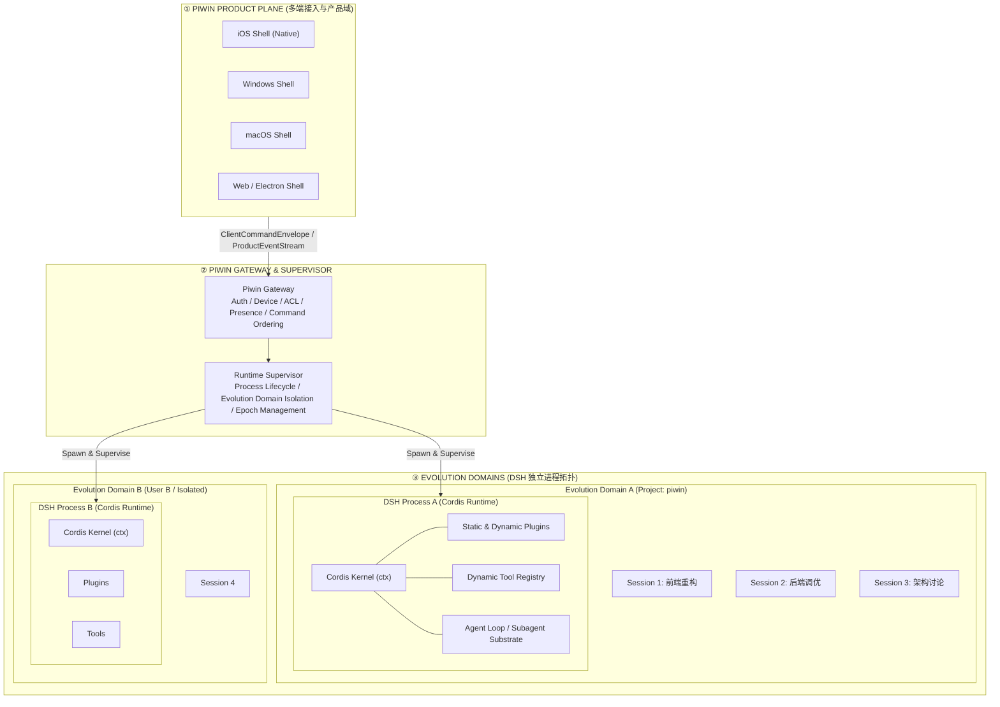
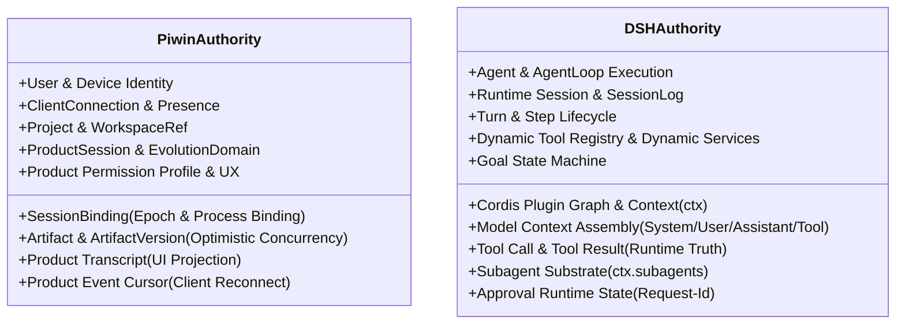
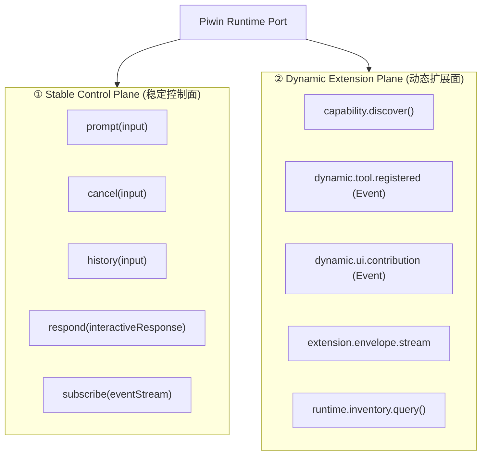
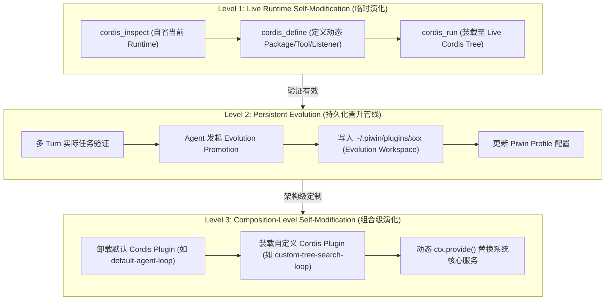
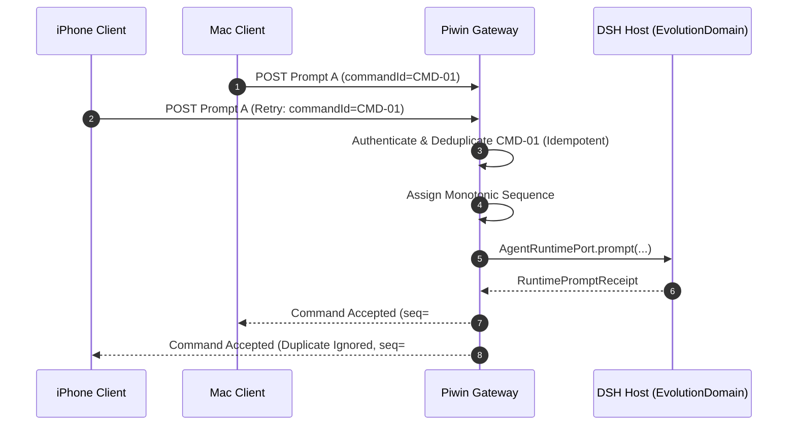
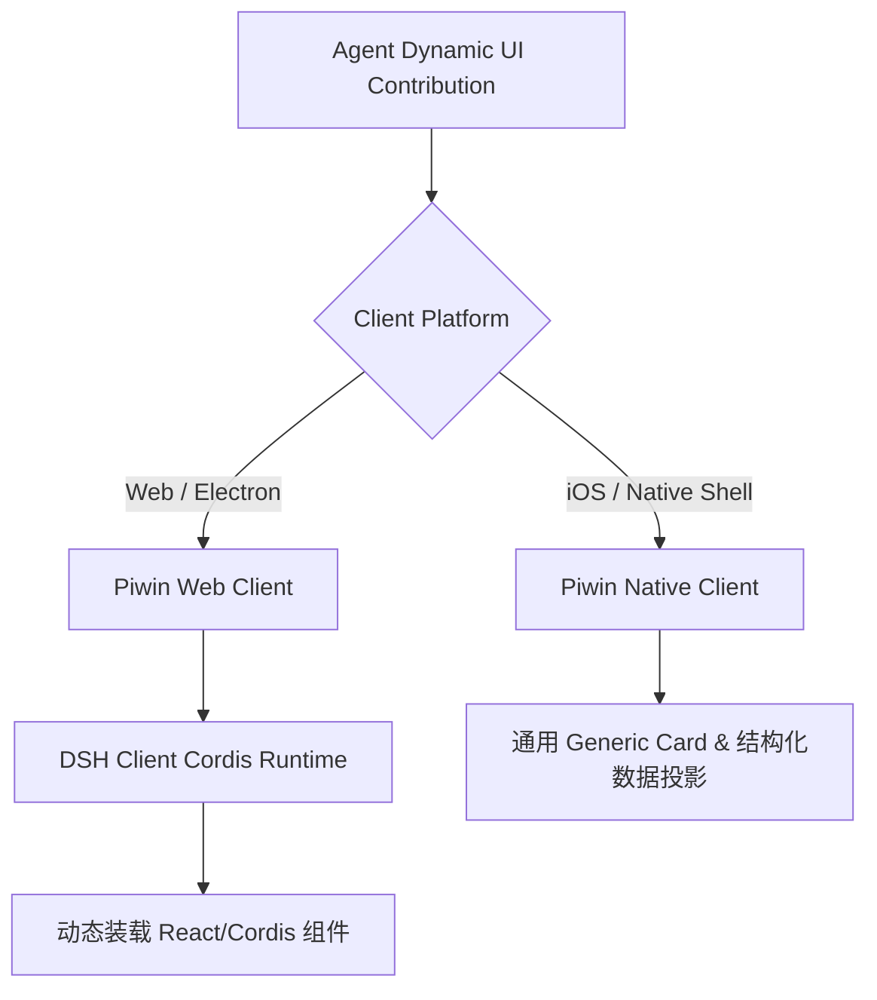
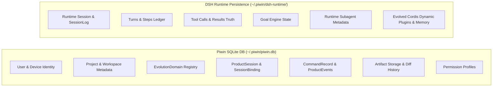

# Piwin × DeepSeek Harness Detailed Design Spec v0.1

> **Status**: Approved Architectural Baseline  
> **Date**: 2026-08-14  
> **Document Role**: Piwin Platform Specification + DSH Evolvable Runtime Integration Specification  
> **Target Subsystems**: `@piwin/gateway`, `@piwin/runtime-supervisor`, `@piwin/contracts`, `@piwin/dsh-adapter`, `@piwin/artifact`, `@piwin/ui-kit`, `DeepSeek Harness (Cordis Runtime)`

---

## 0. 核心架构跃迁与总原则 (Paradigm Shift & Core Principles)

### 0.1 核心思想纠偏：拒绝“黑盒 Agent 微服务”假设
系统设计的首要前提是彻底摒弃将 DSH 当作静态黑盒服务的错误认知：

```text
【错误认知：静态黑盒 Agent 微服务】
Piwin  ── fixed API (prompt/cancel) ──>  [ Black-box DSH ]
(误认为 DSH 具有固定的工具集、固定的事件集、固定的 UI 节点与固定的行为模式)

【正确认知：可变 Runtime Graph 与 Evolvable Agent Runtime】
DSH Runtime (t0) ── Agent 自修改 (cordis_define/run) ──> DSH Runtime (t1)
                                                       ├─ 新增 Cordis Service
                                                       ├─ 新增/替换 Tool
                                                       ├─ 新增 Pre/Post Listener
                                                       ├─ 动态 Policy / 沙箱调整
                                                       ├─ 动态 Client UI 贡献
                                                       └─ 动态替换 Core 插件实现
```

- **DSH 的本质**：基于 Cordis 微内核的 **可自省、可自修改的可变运行时图谱（Evolvable Agent Runtime）**。
- **Piwin 的本质**：提供用户身份、多端同步、数据持久化、项目域、版本化 Artifact 与隔离编排的 **产品平台（Product Platform）**。

---

## 1. 最终系统定义：三层拓扑与 Runtime Supervisor (System Topology)

为了包容 Cordis 进程级自修改的 Blast Radius，系统正式划分为 **产品平面（Product Plane）**、**控制网关（Gateway & Supervisor）** 与 **演化域（Evolution Domains）**：



---

## 2. 权威模型 (Authority Model)

系统坚决杜绝双写与双重事实源（No Dual Truth）：



---

## 3. 一级实体：EvolutionDomain 与三层会话 (EvolutionDomain & Session Model)

### 3.1 核心实体：EvolutionDomain (演化域)
**为什么必须引入 EvolutionDomain？**  
DSH 官方警告：动态 Cordis package 活在共享的 DSH process 中，其注册的全局服务、监听器和工具会影响同一进程内的所有 Session。因此，自修改的 Blast Radius 是 **Runtime Process** 而非单一 Session。

```typescript
export interface EvolutionDomain {
  id: string;
  ownerId: string;
  projectId?: string;
  profileId: string;
  isolation: 'user' | 'project' | 'session';
  runtimeProcessId: string;
  state: 'starting' | 'running' | 'restarting' | 'stopped';
  generation: number; // 标识 Cordis Runtime 世界的宿主代数（Incarnation）
  createdAt: number;
  updatedAt: number;
}
```

- **能力共享机制**：在同一个 `EvolutionDomain`（如 `Project: piwin`）内部，前端 Session、后端 Session 与架构讨论 Session 共享同一个可自修改的 Cordis 运行时图谱，一个 Session 进化出的工具与能力可即时赋能同域下的其他 Session。

### 3.2 升级后的 SessionBinding
```typescript
export interface SessionBinding {
  productSessionId: string;
  evolutionDomainId: string; // 归属的演化域
  runtimeProcessId: string;  // 绑定的 DSH 操作系统进程 ID
  runtimeSessionId: string;  // DSH 内部会话 ID
  runtimeEpoch: number;      // 会话级恢复纪元
  projectId: string;
  userId: string;
  state: 'creating' | 'active' | 'recovering' | 'detached' | 'archived';
  createdAt: number;
  updatedAt: number;
}
```

### 3.3 三种会话划分
1. **ProductSession (产品会话)**：Piwin 用户级生命周期、标题、模式、权限配置与跨端同步单元。
2. **RuntimeSession (DSH 运行时会话)**：DSH 进程内的执行实体，拥有完整的 Turn、Step、SessionLog、Goal、Subagent 拓扑。
3. **SessionClientView (客户端视图投影)**：设备本地的 UI 缓存投影，包含可视节点、待审批交互请求与呈现模式。

---

## 4. 动态绑定与 Epoch / Generation 双代数机制 (Binding, Epoch & Generation)

系统引入两个层次的生命周期代数：
- **`EvolutionDomain.generation`**：表征整个 Cordis Runtime 进程的重生代数（如配置热重载、扩展升级重启）。
- **`SessionBinding.runtimeEpoch`**：表征单个 ProductSession 与 DSH Runtime 实例的绑定代数（如单个会话跨进程迁移恢复）。

```text
ProductSession X (永久不变)
      │
      ├── 绑定到 EvolutionDomain (Project: piwin, Gen 1)
      │     └── DSH Process 8820 / Session A1 (Epoch 1)
      │
      └── DSH 崩溃或热重启
            ↓
          Runtime Supervisor 自动恢复
            ↓
          DSH Process 9104 (Domain Gen 2) / Session A2 (Epoch 2)
```
- 客户端持有稳定的 `ProductSessionId`，对底层进程与会话重建完全透明。

---

## 5. 防腐层与双平面契约 (Control Plane + Extension Plane)

Gateway 与 DSH 之间的通信端口必须采用 **双平面架构**，杜绝静态封装扼杀动态演化：



```typescript
export interface AgentRuntimePort {
  // 1. Control Plane
  createSession(input: RuntimeCreateSessionInput): Promise<RuntimeSessionRef>;
  prompt(input: RuntimePromptInput): Promise<RuntimePromptReceipt>;
  cancel(input: RuntimeCancelInput): Promise<void>;
  history(input: RuntimeHistoryInput): Promise<RuntimeHistory>;
  respond(input: RuntimeInteractiveResponse): Promise<void>;
  subscribe(input: RuntimeSubscription): AsyncIterable<RuntimeEvent>;

  // 2. Extension Plane
  queryInventory(domainId: string): Promise<RuntimeInventory>;
  subscribeExtensions(domainId: string): AsyncIterable<RuntimeExtensionEvent>;
}
```

---

## 6. 自进化的三层阶梯与 Promotion Pipeline (Three Levels of Evolution)

必须严格区分并支持自进化的三种形态：



### 6.1 Level 1：Live Runtime Self-Modification（即时临时演化）
- Agent 通过 `cordis_inspect`、`cordis_define`、`cordis_run` 动态向 `ctx.tools`、`ctx` 服务树挂载临时能力。
- **生命周期**：内存级，不写持久化配置文件，进程重启后自动重置，适合短期探测。

### 6.2 Level 2：Persistent Evolution & Evolution Workspace（持久化晋升）
- Piwin 为每个项目/用户开辟 **Evolution Workspace**（`~/.piwin/plugins/` 或 `.piwin/plugins/`）。
- **晋升流程**：当临时动态包验证有效后，Agent 可触发晋升，将其持久化为标准 TypeScript 模块（含 `package.json` 与 `src/index.ts`），并 patch 入演化域的 Profile 配置中，跨重启持久生效。

### 6.3 Level 3：Composition-Level Self-Modification（组合替换）
- **理念遵循**：Cordis 架构无特权核心（Privileged Core），Agent Loop、Tool Registry、Session Log 均是 Cordis 插件。
- Agent 自进化**严禁直接修改 DSH Core 源码**，而是通过 Cordis 的生命周期替换插件（如替换 `ctx.agentLoop`）。

---

## 7. 客户端命令协议与单一逻辑流 (Command Ordering & Idempotency)

```typescript
export interface ClientCommandEnvelope<T> {
  protocolVersion: 1;
  commandId: string; // 客户端生成，全局唯一幂等键
  userId?: never;   // 严格由 Gateway 从 Auth Token 注入，防伪造
  clientId: string;
  deviceId: string;
  productSessionId: string;
  expectedRevision?: number;
  sentAt: string;
  payload: T;
}
```



---

## 8. 产品事件流与动态扩展 Envelope (Product Event Stream)

```typescript
export interface ProductEventEnvelope<T = unknown> {
  protocolVersion: 1;
  sequence: bigint; // Product Cursor (客户端断线重连标尺)
  productSessionId: string;
  evolutionDomainId?: string;
  runtimeEpoch?: number;
  runtimeSessionId?: string;
  kind: string;
  createdAt: string;
  payload: T;
}
```

---

## 9. 动态工具面与 UI 泛型渲染 (Dynamic Tool Architecture & UI)

### 9.1 工具列表拒绝静态冻结
- 系统严禁定义不可扩展的 `type PiwinTool = 'bash' | 'read' ...` 静态枚举。
- DSH 执行自修改后，随后的 `request/header` 与工具事件中自动携带新工具的 Schema。

### 9.2 UI 双轨渲染模型
```typescript
export interface ToolNode {
  name: string;
  knownRenderer?: 'bash' | 'read' | 'edit' | 'artifact' | 'browser' | 'web_search';
  generic: {
    title?: string;
    description?: string;
    input: unknown;
    output: unknown;
    status: 'running' | 'completed' | 'failed';
  };
}
```
- **已知工具**：渲染为高精度的专用 UI 卡片（如 Artifact Split-View、Playwright 实时画面）。
- **未知/动态生成工具**：自动降级为 **Generic Tool Card**，完整展示输入、输出与执行状态，**严禁因 Schema 未定义直接丢弃**。

---

## 10. 双轨客户端自修改支持体系 (Client Evolution: Web vs Native)

DSH 的动态 Cordis 包支持 **Host Half + Browser/Client Half**。面对不同客户端形态，采取清晰的双轨策略：



1. **Web / Electron 客户端**：内嵌 DSH Client Cordis 运行时，完全支持 Agent 动态注入 UI Slot、扩展卡片与交互控件。
2. **iOS / 原生客户端**：不引入庞大脆弱的动态 JS 引擎，以通用的结构化卡片与语义节点呈现动态能力，保障极致的原生流畅度。

---

## 11. 统一工具管线与受控自修改门禁 (Tool Pipeline & Safety Gate)

```text
Model ToolCall (e.g. cordis_define / cordis_run / bash)
      ↓
DSH Tool Resolution
      ↓
tools/pre-execute Hook (Cordis Event)
      ↓
Piwin Policy Verification (Auto-Review / Ask-All / Sandbox)
      ↓
Is Self-Modification / High-Risk Tool?
      ├─ Yes ──> Trigger DSH Answerable Request (用户交互审批)
      └─ No  ──> Check Sandbox Rules
      ↓
Approval Resolved / Pass
      ↓
tools/execute (Capability Provider / Cordis Runtime Mutation)
      ↓
tools/post-execute Hook
      ↓
DSH tool/result -> SessionLog & Runtime Inventory Updated
```

---

## 12. Artifact 域详细设计 (Artifact Domain & Optimistic Concurrency)

Artifact 属于 **Piwin Product Plane**，DSH 仅通过引用与摘要操作：

```typescript
export interface ArtifactRef {
  artifactId: string;
  version: number;
  type: ArtifactType;
  summary?: string;
}

export interface ArtifactUpdateInput {
  artifactId: string;
  baseVersion: number;
  operation: PatchOperation | ReplaceOperation;
}
```

```text
Subagent A (Base v7) ─── Submits Mutation ───> Commit Success (v7 -> v8)
Subagent B (Base v7) ─── Submits Mutation ───> Conflict! (currentVersion = 8, Rejected)
```

---

## 13. Subagent 体系架构与 DSH Substrate (Subagent Architecture)

```mermaid
graph TD
    PO[Piwin Orchestrator<br/>(Presentation / Scheduling / Dependencies)]
    PO -->|Delegation Policy| CTX_SUB[DSH ctx.subagents<br/>(Execution Substrate)]
    CTX_SUB --> DSH_CHILD[DSH Child Session (同 EvolutionDomain)]
    CTX_SUB --> CODEX[Codex Subagent]
    CTX_SUB --> ACP[ACP Subagent]
```

- Piwin Orchestrator 负责多任务图谱呈现与调度。
- DSH `ctx.subagents` 是唯一的底层子代理执行权威。
- 子代理间流转轻量 `ArtifactRef`（如 `{ id: "doc", version: 3 }`），严禁跨 Agent 搬运巨型 Token 文本。

---

## 14. 智能搜索与视觉路由 (Search & Vision Resolvers)

### 14.1 搜索路由决策
```typescript
export interface SearchDecision {
  route: 'model-native' | 'external-tool';
  reason: 'native-supported' | 'native-disabled' | 'native-unavailable' | 'policy-forced-external';
}
```
- 动态排查模型原生搜索能力，避免原生能力与外部 `web_search` 工具同时挂载导致模型重复调用。

### 14.2 视觉能力委托
- 图片素材统一落盘于 `~/.piwin/media/`。
- 模型支持原生视觉时以 `ImageContent` 原生注入；不支持时自动路由至 OCR/Vision Delegation 工具。

---

## 15. 持久化数据切分与演化资产库 (Persistence Architecture)



---

## 16. 主题与东方美学沉浸系统 (Theme Runtime)

- 采用 DSH ThemeRuntime 与 Piwin UI-Kit 深度融合。
- 主题资产（水墨晕染、呼吸微光、毛笔拟物、印章审批）纯粹作为 **Client Presentation Layer** 实现，**严禁侵入 Agent 运行时与 Cordis 容器**。

---

## 17. 上游升级隔离守则 (Upstream Upgrade Discipline)

- Piwin 仅依赖 DSH 官方导出的 **Public Services**、**Documented Cordis Seams** 与 **Event Contracts**。
- **严禁**：深层相对导入 `deepseek-harness/packages/*/src/internal` 或对 AgentLoop 打猴子补丁（Monkey Patching）。所有定制化均通过标准 Cordis Plugin 组合注入。

---

## 18. 遗留系统淘汰边界 (Legacy Retirement Boundary)

```text
[ 彻底淘汰 (Delete) ]
├── Pi SDK / Pi RPC Agent Host
├── Pi Agent Worker Process
├── Pi-native Event Mapper & Context Assembly
├── Pi Tool Scheduler & Fake History Generator
└── Pi-native Subagent Fork Runtime

[ 长期演进 (Retain & Evolve) ]
├── Piwin Gateway & Runtime Supervisor
├── EvolutionDomain Isolation Engine
├── Project / Workspace Domain
├── Artifact Service & Optimistic Concurrency Engine
├── Multi-Platform UI (Desktop/Mobile/Web)
└── Capability Service Providers (Browser/Terminal/Media)
```

---

## 19. 系统硬性不变式 (Hard Invariants)

### 19.1 基础架构与会话不变式
- **I-01**: `ProductSession` 绝不使用 DSH Session ID 作为其永久标识符。
- **I-02**: DSH `SessionLog` 是模型可见的 `assistant/tool/turn/step` 状态的唯一运行时事实源。
- **I-03**: Piwin Gateway 严禁实现自己的 Agent Loop。
- **I-04**: Piwin Gateway 绝不将 DSH 内部接口直接暴露给不可信客户端网络。
- **I-05**: 每一个客户端下发的命令必须具备全局唯一的 `commandId` 以实现幂等。
- **I-06**: 同一 `ProductSession` 的并发命令必须由 Gateway 完成确定性定序。
- **I-07**: 客户端断线重连必须使用 Piwin `ProductCursor`，而不是 DSH 底层传输状态。
- **I-08**: Artifact 必须保持为 Piwin 独立产品域对象。
- **I-09**: Artifact 的修改必须强制执行版本化乐观并发控制（OCC）。
- **I-10**: Piwin 任务编排必须将 DSH Subagent 作为底层执行基座，严禁自建子代理运行内核。
- **I-11**: Conversation Mode 与 Agent Mode 必须共享同一个底层 DSH 运行时会话。
- **I-12**: Product Transcript 仅是呈现投影，绝不能作为模型历史事实源。
- **I-13**: 注入模型上下文的所有信息，在模型派发前必须在 DSH 运行时状态中可完整重建。
- **I-14**: Piwin 工具能力必须接入 DSH Tool Pipeline，严禁建立独立的外部工具执行器。
- **I-15**: 权限与 Auto-Review 逻辑必须在 DSH Tool Execution 边界处执行。
- **I-16**: DSH 核心源码修改必须为零（Zero Core Modifications），所有接入通过 Cordis Plugin 与 Service Seams 完成。
- **I-17**: DSH 的版本升级绝不得要求 Piwin 客户端修改公开命令与事件协议。
- **I-18**: 运行时故障恢复与 Rebinding 绝不改变 `ProductSession` 的身份标识。

### 19.2 自进化与 Cordis 专属硬性不变式 (Evolution Invariants)
- **E-01**: Piwin **绝不得冻结** DSH 的 Cordis 插件图谱（Plugin Graph）。
- **E-02**: Piwin **绝不得假设** 运行时工具集合是静态不变的。
- **E-03**: Piwin 遇到未知的动态运行时能力与事件时，**必须保留并使用通用卡片渲染**，严禁静默丢弃。
- **E-04**: 任何 Cordis 运行时突变（Runtime Mutation）的 Blast Radius **必须严格限制在其所属的 EvolutionDomain 内**。
- **E-05**: 互不信任的演化域（EvolutionDomain）**绝不得共享** 同一个具备自修改能力的 DSH 操作系统进程。
- **E-06**: Piwin Gateway **绝不得拦截或重新解释** Cordis 内部的 `provide` / `inject` 依赖注入语义。
- **E-07**: 动态 Cordis Package **必须在 DSH 运行时进程内执行**，严禁在 Piwin Gateway 进程内执行。
- **E-08**: 运行时自修改（Runtime Self-Modification）**绝不得导致** Piwin Gateway 或 Server 发生重启。
- **E-09**: Piwin Web/Electron 客户端 **应当保留** DSH Client Cordis 运行时，以支持动态前端组件贡献。
- **E-10**: 原生客户端（如 iOS）面对无法动态执行代码的 UI 贡献时，**必须优雅降级** 为结构化通用数据卡片。
- **E-11**: 临时运行时演化（Level 1）与持久化晋升演化（Level 2）**必须在生命周期与存储模型上严格分离**。
- **E-12**: 持久化晋升（Persistent Promotion）**应当输出** 为标准的 Cordis 插件与 Profile 组合配置，严禁通过直接篡改 DSH Core 源码实现。
