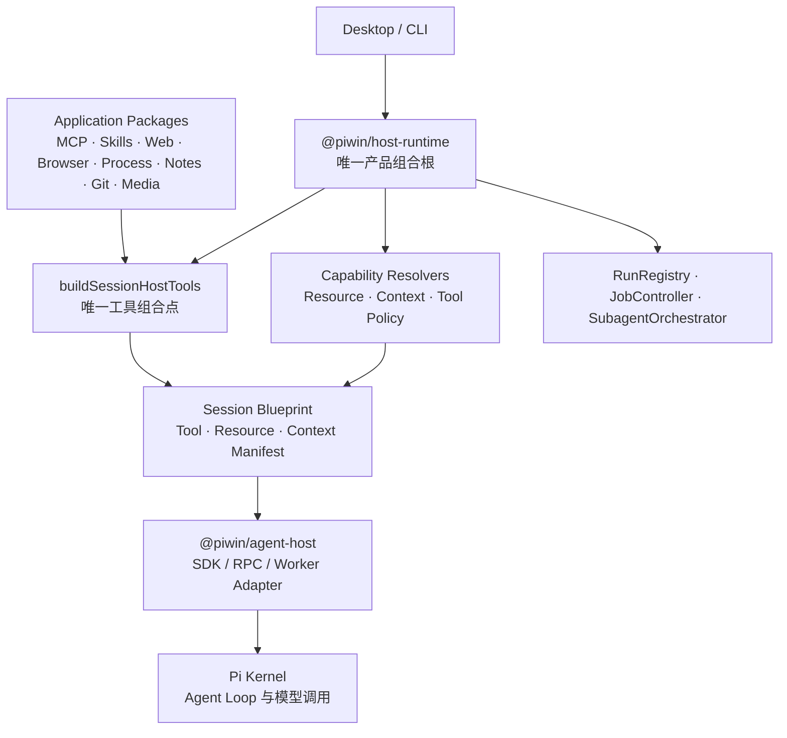

# 工具接入面与运行时边界收敛改造方案

| 字段 | 值 |
|---|---|
| 状态 | Completed — repair spec implemented and verified |
| 日期 | 2026-08-05 |
| 基础分析 | [`2026-08-05-tool-surface-re-integration.md`](./2026-08-05-tool-surface-re-integration.md) |
| 相关架构 | [`architecture.md`](../../architecture.md)、[`runtime-refactor.md`](../../specs/runtime-refactor.md) |
| 修复 spec | [`2026-08-05-tool-surface-reintegration-repair-spec.md`](../specs/2026-08-05-tool-surface-reintegration-repair-spec.md) |
| 主要范围 | `contracts`、`host-runtime`、`agent-host`、`mcp`、`skills`、工具提供包、Desktop、CLI |
| 方案类型 | 收敛式接入改造，不是产品能力重写 |

## 实施记录

### 2026-08-05 — Phase 1.1 contracts 与边界基础

- `ToolResult` 已进入 `@piwin/contracts`，并成为 `HostToolExecutionResult` 的正式结果契约；结果支持结构化 `details`、取消、重试和 Job/Run 关联字段。
- 新增 Host-local `HostToolRegistration`、静态 `HostToolPermissionSpec`/`ToolPermissionDeclaration` 和显式 `toolFamilyIndex`；descriptor 仍只包含 `name`、`description`、`parameters`。
- `@piwin/tools-web` 不再导出原通用 `HostToolDefinition`；Web provider 现在只通过 Host-owned registration 接入。
- RPC worker proxy 的调用契约已引用 `ToolResult`；`SessionBlueprint` 将误称的 `hostToolRegistrations` 修正为 `hostToolDescriptors`。
- 初始 contracts 批次未切换生产 executor 返回类型，避免引入临时 string adapter；后续切换已记录在下方 Phase 1.2 / Phase 2 / Phase 3 执行记录中。

### 2026-08-05 — Phase 1.2 / Phase 2 / Phase 3 执行记录

- 所有当前生产 Agent 工具族已切换为 `HostToolRegistration`：Filesystem/Bash、Process、Subagent、MCP、Web、Browser、Notes、Flashcards、Plan、Image Generation；生产 executor 统一返回 `ToolResult`，不保留 string adapter。
- `HostToolDescriptor` 继续只投影 `name`、`description`、`parameters`；family、permission spec 和 executor 留在 Host-local registration。`HostToolExecutionRouter` 在构造时校验显式 family index，`descriptorsFromTools` 是唯一模型可见 descriptor 投影。
- `process_start` 使用 Host execution context 中的真实 `runId` 绑定 run-lifetime Job，并在成功/失败结果中返回 `details.jobId` / `details.runId`；Subagent 与 MCP 结果分别返回 Run、selector 等结构化细节。
- Tool Surface 已按 `(sessionId, runtimeGenerationId)` 缓存并复用：descriptor 编译、SDK/RPC 工具执行和 Worker proxy 共享同一 generation surface；合并规则集在 surface 构建时冻结，`PermissionMode` 通过 Host 的动态 getter 在每次执行时读取。
- 已删除未接线的 MCP bridge、`attachToolsToPiSession` 旧适配面，以及重复的 gated bash/file 生产路径和对应测试，避免第二条执行链回流。
- 已补充 generation surface 单次构建和动态 `PermissionMode` 回归测试；当前验证通过：`pnpm typecheck`、`pnpm --filter @piwin/host-runtime test`、`pnpm test:architecture` 和 workspace 全量 `pnpm test`。

### 2026-08-05 — Phase 4 / Phase 5 / Phase 6 收口记录

- `resolveToolPolicyDetails` 已接入 Blueprint compiler；它接收配置可用性、子 Agent capability、项目 trust 和本代次真实 family index，生产路径不再维护第二套手写 family 判断。MCP enabled server、Web search source、Process enabled 状态和真实 registration 均参与最终 Manifest。
- MCP config 现在与 generation surface 成对冻结并传入 Blueprint compiler；surface、direct/gateway executor 和 `enabledMcpServerIds` 不再各自从磁盘读取。
- `ResourceCatalog → resolveResourceActivations → ResourceManifest` 已接入主链；disabled ids、source precedence、project trust 和 catalog revision 进入 generation snapshot。`contextManifest` 继续由 Host 在 Blueprint 编译阶段发现并冻结。
- `SessionHostToolExecutionPort` 改为只读取创建阶段显式注册的 generation surface；没有已注册的 `(sessionId, runtimeGenerationId)` 直接拒绝，不会在工具调用时重新加载配置或拼装工具。
- Desktop runtime 页面改为一次初始读取 + `session/runtime-updated` HostPush；Subagent cancel marker 改为 `fs.watch` + `AbortSignal`，不再使用定时轮询。
- Notes、Flashcards、DocCards、Subagent batch 与 Job command 已移入独立 handler；`HostRuntime` 的 command switch 只保留 transport-level `host/ping` / `host/status`。
- 删除了仍维护旧工具名白名单但无生产调用的 Subagent capability resolver 与旧 tool manifest builder，避免恢复第二套 capability/name 枚举。
- 全量验证通过：`pnpm test`、`pnpm typecheck`、`pnpm test:architecture`；本轮 workspace 测试覆盖 23 个 workspace package，Host Runtime 853 tests、Agent Host 132 tests 全部通过。

### 2026-08-05 — Post-review repair spec 收口记录

- R1–R3：generation prepare/commit/abort/rollback、旧代次资源保留、立即安全收紧和 generation-scoped MCP snapshot 已接入主链；候选失败不会覆盖 active surface。
- R4–R5：规则集在 generation 创建时冻结，`PermissionMode` 通过 session → host → config 优先级在每次 admission 动态读取；所有 Agent-facing tools 统一经过 Host admission gate，executor 不再持有 permission gate 参数。
- R6–R7：ResourceCatalog 按 `(kind, resourceId)` 输出 shadow/duplicate diagnostics；family index 必须来自真实 registration，删除 `FAMILY_CUSTOM_TOOLS` 和 name-only fallback。
- R8–R9：ToolResult details/cancelled/retryable 在 SDK/RPC 保持无损；runtime UI 区分 rebuilding/failed；可选能力降级通过 `host/log` 暴露。
- 最终验证：`pnpm typecheck`、`pnpm test:architecture`、workspace `pnpm test` 通过；本次涉及源码单独通过 Prettier。根目录格式检查仍受既有两个 HTML 原型语法错误影响。

## 0. 结论

本方案不新增通用聚合包、全局工具注册中心或第二个产品组合根。

当前设计已经有一个正确的工具组合点：

```text
buildSessionHostTools
        ↓
HostToolRegistration[]
        ↓
descriptorsFromTools
        ↓
Session Blueprint
        ↓
PiSdkAdapter / PiRpcAdapter
```

问题不是“缺少一层”，而是这条主链仍有重复事实源、旧路径、隐式权限、错误的
Run 关联和未接入的 resolver。改造目标是把现有组合点真正变成唯一事实源。



## 1. 不可妥协的架构决策

### 1.1 组合根不变

- `@piwin/host-runtime` 仍是唯一产品组合根。
- `buildSessionHostTools` 仍是唯一 Host 工具组合点，可以拆文件、改名或拆内部阶段，
  但不能再出现第二条生产组合路径。
- `@piwin/agent-host` 只负责 Pi SDK、RPC Worker、Pi 事件和工具适配。
- 应用包不导入 Pi，不创建 Pi Session，不决定产品权限。

### 1.2 不新增的东西

本方案明确不做：

- `@piwin/capability`、`@piwin/agent-resources` 等新的通用聚合包；
- 另一个 `ToolRegistry`、Service Locator 或配置驱动的动态工具框架；
- 让每个应用包各自维护一套 Agent 接入协议；
- 把 MCP、Skills、Browser、Process 合成一个“大能力包”；
- 重写 Pi Kernel 或更换异步传输风格；
- 让 Worker 直接执行文件、网络、MCP 或进程副作用。

### 1.3 运行时身份必须显式

以下三个身份永远分开：

```text
product session       sessionId
live Agent runtime    runtimeGenerationId
execution lifecycle  runId
```

工具调用、Worker frame、Job owner 和事件归属使用真实 `runId`。
不能从 Pi 的 opaque `toolCallId`、RPC request id 或“当前 Session 的 active Run”推断。

### 1.4 Runtime Generation 冻结边界

一个 Runtime Generation 创建时，一次性冻结：

- 工具 descriptor；
- Host-local 的工具 family 索引；
- 工具的静态 permission spec 和 subject builder；
- 合并后的 `PermissionRuleSet` 快照；
- `rulesRevision`、配置 revision 和项目 trust 输入；
- ResourceManifest；
- ContextManifest；
- HostToolExecutionRouter 使用的 generation surface；
- `sessionId` 和 `runtimeGenerationId`。

权限模式不在冻结清单内。每次工具调用在执行边界读取一次当前
`PermissionMode`（包括 session override / agent mode），然后由 Rule Engine 计算本次
调用的 `allow / ask / deny`。一次调用开始后，模式变化不影响该调用；下一次调用读取最新模式。

因此，冻结的是规则输入和工具权限事实，不是有效权限模式，也不是最终决策。
工具端口不得在第一次调用时重新读取当前配置并重新拼装工具。安全撤销可以立即阻断
旧 Runtime；工具 schema、资源和能力变更通过新 Runtime 生效。

## 2. 接入模型

### 2.1 应用包只提供能力，不直接接入 Pi

应用包按职责分为三类：

| 类型 | 负责 | 例子 |
|---|---|---|
| Resource Inventory | 扫描和描述可加载资源 | Skills、Extensions、Prompts、Context |
| Tool Provider | 提供工具描述、权限声明和执行器 | MCP、Web、Browser、Notes、Process |
| Domain Service | 提供产品数据和领域操作 | Session、Project、Git、Media、Artifact |

这些能力最终由 `host-runtime` 的唯一组合点接入当前 Session。

### 2.2 工具注册拆成静态描述和运行时注册

原通用 `HostToolDefinition` 同时承担 descriptor、权限包装和 executor，边界不够清楚。
改造后概念上拆成两部分：

```text
HostToolDescriptor       JSON-safe，可进入 Blueprint / RPC
├── name
├── description
└── parameters

HostToolRegistration     Host-local，包含真实执行能力
├── descriptor
├── family
├── permissionSpec
├── execute(args, signal, executionContext)
└── optional result / progress hooks
```

要求：

- `HostToolDescriptor` 是唯一模型可见 schema 来源；
- `HostToolDescriptor` 不包含 family、permission、risk 或其他产品元数据；
- `HostToolRegistration` 的 executor 永远留在 Host 进程；
- SDK 和 RPC 从同一份 descriptor 派生 Pi custom tool；
- Worker 只通过 `HostToolExecutionPort` 请求父进程执行；
- family 索引和 permission spec 只存在于 Host-local 的 Tool Surface；
- 通用工具注册类型不能继续由 `tools-web` 这个具体领域包拥有。

### 2.3 Tool Family 显式声明

每个工具注册时显式声明 family，例如：

```text
browser_snapshot  → browser
process_start     → process
web_fetch         → web-fetch
mcp__server__tool → mcp
```

`toolFamilyIndex()` 只做索引、校验和一致性测试，不通过工具名猜测 family。
所有 policy、subagent ceiling、Manifest 和 UI 投影都从实际注册结果派生。

### 2.4 权限声明与权限决策分离

工具注册只声明静态权限事实：

```text
permissionSpec
├── action / domain
├── risk kind
├── rememberable
└── subject builder（需要参数时）
```

具体 `allow / ask / deny` 仍由 Host Rule Engine 根据运行时参数决定：

```text
Tool args
  ↓
PermissionSubject
  ↓
Bundled + User + Project Rules
  ↓
PermissionMode
  ↓
allow / ask / deny
```

例子：

- `bash` 根据完整 command 生成 subject；
- `write_file` 根据解析后的绝对路径生成 subject；
- `web_fetch` 根据 hostname 生成 subject；
- MCP 根据 `serverId.toolName` 生成 subject。

不要把最终有效决策固化在 descriptor 的 `defaultDecision` 中。默认策略属于 Host
Rule Engine，工具 registration 只描述风险和所需权限事实。

`PermissionMode` 不进入 Tool Descriptor、Tool Surface 的冻结 mode 字段或 Blueprint 的
有效决策结果；它在每次 Tool Port 执行开始时读取一次。

## 3. 运行时执行边界

### 3.1 唯一执行路径

```text
HostToolRegistration[]
        ↓
SessionHostToolExecutionPort
        ↓
1. 校验 sessionId
2. 校验 runtimeGenerationId
3. 校验 runId 是否存在且仍被 RunRegistry 接纳
4. 校验 tool 是否在冻结的 Tool Surface 中
5. 生成 PermissionSubject
6. 读取当前 PermissionMode（本次调用只读一次）
7. 执行统一 Rule Engine
8. 使用原始 AbortSignal 执行 executor
9. 返回稳定 ToolResult
```

### 3.2 Run 身份传播

`BackendPreparedPrompt.runId` 已存在，改造后生产执行路径必须提供它。

身份传播规则：

1. `session/prompt` 接受请求时先创建 `runId`。
2. Host 生成带 `runId` 的 `BackendPreparedPrompt`。
3. SDK backend 将该身份绑定到当前 prompt 的工具执行上下文。
4. RPC session/create frame 携带 `sessionId` 与 `runtimeGenerationId`；prompt 和 `tool-call`
   frame 显式携带真实 `runId` 与 `runtimeGenerationId`。
5. `WorkerTaskRunner` 使用 `taskRunId`，不能重新生成 transport id 代替。
6. `SessionHostToolExecutionPort` 缺少真实 `runId` 时拒绝副作用执行。

`RunEventCorrelator` 只负责无显式身份事件的展示归属和兼容投影，不再负责把 transport
id 翻译成产品 Run 身份。

### 3.3 ToolResult 统一切换

当前工具统一返回字符串，无法稳定表达 Job、Subagent、取消、重试和结构化错误。
`ToolResult` 必须在 Phase 1 进入 `contracts`，并在每个工具族完成迁移后成为该族生产
executor 的唯一返回类型：

```text
ToolResult
├── output
├── details
├── error code
├── cancelled / retryable
└── jobId / runId（适用时）
```

`output` 可以继续承载文本，但 executor 不再返回裸 `string`。迁移按工具族逐个完成：

```text
process_* → subagent → mcp → 其他工具
```

每个工具族完成切换后，立即删除该族的 string adapter、旧返回类型和旧测试辅助层。
生产路径不允许长期存在 `fromStringToolResult`、`Promise<string>` executor 或两套结果形态。
测试 fixture 如需文本快捷构造，必须隔离在测试目录，不得导出到生产 API。

## 4. 模块改造方案

### 4.1 MCP

保留当前 hybrid exposure，但收敛执行路径：

```text
MCP Config + Metadata Catalog
              ↓
        McpToolExecutor
          ├── cached direct descriptor
          └── mcp_gateway descriptor
```

`@piwin/mcp` 负责：

- 配置读取和校验；
- Server 生命周期；
- Transport 连接；
- Metadata cache；
- `tools/list` 和 `tools/call`。

`host-runtime` 负责：

- 编译真实 `enabledMcpServerIds`；
- 决定 direct/gateway exposure；
- 将 MCP selector 转成 PermissionSubject；
- 将 MCP descriptor 编入当前 Runtime 的 ToolManifest。

必须删除未接线的 `createMcpSessionBridge` 生产导出，避免出现第二套 MCP 组合路径。

### 4.2 Skills / Extensions / Prompts / Context

保留现有 scanner，不新建 `agent-resources` 包：

```text
Scanner
  ↓
ResourceCatalog
  ↓
ResourceActivation
  ↓
ResourceManifest / ContextManifest
  ↓
Session Blueprint
```

`ResourceCatalog` 必须统一处理：

- canonical resource id；
- bundled/user/project/mapped source；
- disabled ids；
- source precedence；
- shadow / duplicate diagnostics；
- project trust；
- resource catalog revision。

Skills 仍然是资源，不变成 Agent Tool。

### 4.3 Web / Browser

- Web 是否进入 Manifest，取决于是否存在有效的 enabled provider，而不是仅判断
  `config.web` 是否存在。
- Browser 工具全部从实际 registration 派生，禁止维护独立的 11/10/4 三套列表。
- Browser 除 navigate 外，其余工具也必须声明清晰的 permission metadata。
- Browser 状态继续通过 BrowserHostPush 传输，不伪装成 AgentEvent。

### 4.4 Process / Filesystem / Bash

- `process_*` 保留为模型产品语言，但全部调用同一个 `JobController`。
- `process_start` 绑定真实 `ownerRunId`，Run 结束时由 JobController 清理。
- `buildHostFilesystemTools` 与 SDK 的 gated `bash/write/edit` 选择一条生产路径；
  不能让两套工具同时存在但行为不同。
- 文件写入和 Bash 的权限仍由 Host 统一门控。
- Job 不是 Agent Worker；Agent Worker 仍只归 `agent-host` 管理。

### 4.5 Notes / Flashcards / Plan / Subagent

- 保留现有精确 schema 和领域实现。
- 权限包装迁移为统一 permission metadata + subject builder。
- 将 `notes/*`、`flashcards/*`、`subagent/batch-*` 从 `host-runtime.ts` 的大 switch
  移到各自 command handler。
- Plan execution 和 Subagent batch 必须进入同一个 RunRegistry Run tree。
- Subagent task 使用真实 task Run，不再额外制造一个重复的 foreground session Run。

### 4.6 Session / Media / Artifact / Domain Services

- Session、Project、Git、Media、Artifact 仍作为领域服务，不强行改造成 Agent Tool。
- Media 继续由 Host 做落盘和路径安全；图片通过原生 `ImageContent` 进入 Pi。
- Artifact 保持纯策略和渲染协议，不进入工具组合列表，除非明确新增 Agent-facing tool。

## 5. 异步和传输模型

本方案不替换 `async/await`，而是明确每种异步责任：

| 场景 | 规定模型 |
|---|---|
| 普通对话 | Host 接受请求并立即返回 `runId`，Pi 负责 Agent Loop，Host Push 事件 |
| 单次工具调用 | `execute(args, signal, executionContext)`，一次调用、可取消 |
| Job | 返回 `jobId`，JobController 管理状态，Job Push 或 `job/wait` 返回结果 |
| Subagent | 返回父 Run，调度器使用 work-conserving `Promise.race`，取消使用 RunRegistry/AbortSignal |
| MCP | 单次有边界的 `tools/call`，生命周期管理器负责连接复用 |
| RPC | 保留 pending map + timeout + push；只补齐真实 Run/Generation identity |
| Desktop runtime 状态 | `run/updated` 和 `session/runtime-status` Push 派生，不用 3 秒轮询 |

stdio reader loop、queue-drain、rAF 合并和 RPC pending map 不因为“存在循环”而删除。
它们属于各自正确的传输或调度边界。

Subagent 当前基于 `setInterval` 的 cancel-store 轮询应在后续阶段改成 RunRegistry cancellation
event 或 AbortSignal；取消不能由第二套生命周期状态机长期维护。

## 6. 分阶段执行计划

### Phase 0 — 前置条件和冻结

**目标：** 防止在旧、新生命周期路径并存时继续扩展工具面。

**动作：**

- 验证 runtime authority cutover 的 deletion gates，而不是把原分析文档中的前提当成已完成事实；
- 暂停新增模型工具和新的 MCP exposure；
- 建立 architecture test，记录当前活跃工具、descriptor 和生产组合路径；
- 确认 `host-runtime` 是唯一组合根，`agent-host` 没有应用包依赖。

**退出门：**

- 明确旧 `ProcessRegistry`、旧 Run 路径、RPC fallback 是否仍可执行；
- 明确每个工具的当前生产入口；
- 未完成的前置删除门必须先补齐或标记为阻塞，不能静默跳过。

### Phase 1 — Contracts 与 Tool Registration 基础

**目标：** 建立 descriptor、registration、family、permission 的单一语义。

**动作：**

- 在 `contracts` 中固定 JSON-safe `HostToolDescriptor`；
- 在 `contracts` 中固定 `ToolResult`，并建立按工具族迁移的结果契约清单；
- 将通用工具注册契约从 `tools-web` 具体包中抽离；
- 为每个 Host-local registration 补齐显式 family；
- 增加静态 permission spec 和动态 subject builder；
- 让 `descriptorsFromTools` 成为唯一 descriptor 投影；
- 新增 `toolFamilyIndex` 和工具 family 完整性架构测试。

**退出门：**

- Browser、Notes、Flashcards、Process、Web、Plan、Filesystem 的实际工具数量与 family index 一致；
- 不再存在 name-only descriptor；
- Pi custom tool schema 不包含 family、permission 或 risk 字段；
- SDK/RPC descriptor 字段完全一致；
- 未改变运行行为的工具权限声明全部补齐。

`ToolResult` 只在本阶段建立为正式契约，不引入任何生产 string adapter。具体 executor
返回类型在 Phase 5 按工具族原子切换；每个工具族的 producer、router、SDK/RPC projection
和测试必须在同一迁移单元内完成。

### Phase 2 — 清理重复路径并收敛组合点

**目标：** 只留下一个可执行工具组合路径。

**动作：**

- 删除未接线的 `createMcpSessionBridge` 生产路径；
- 删除未调用的 `parametersForHostTool`、`toPiCustomTools`、`attachToolsToPiSession` 等旧适配面；
- 合并或明确删除 `gated-bash-tool` / `gated-file-tools` 的重复生产路径；
- 将 Notes、Flashcards、Subagent、Job 的 inline command handler 移出 `host-runtime.ts`；
- `HostRuntime` 只调用唯一的工具组合点，不直接拼装每个领域工具。

**退出门：**

- 工具 descriptor 不再来自第二套旧 helper；
- `host-runtime.ts` 不再拥有各领域 command 的重复 inline 分支；
- 所有应用工具均能定位到唯一注册入口和唯一 executor。

### Phase 3 — Runtime Generation 冻结与真实 Run 身份

**目标：** 让 SDK、RPC、Tool Port、Job 和事件使用同一组运行时身份。

**动作：**

- 将 Tool Surface 与 `(sessionId, runtimeGenerationId)` 绑定并冻结；
- `SessionHostToolExecutionPort` 改为读取冻结的 generation surface，不在首次调用时按当前配置懒构建；
- generation surface 只冻结规则集快照和 permission spec，不冻结当前 PermissionMode；
- `BackendPreparedPrompt.runId` 在生产执行路径中改为必备；
- SDK prompt context、RPC prompt/tool-call frame 传递真实 `runId` 和 `runtimeGenerationId`；
  session/create 只建立带 generation identity 的 Session，不伪造一个 Run。
- `WorkerTaskRunner`、Job owner、crash terminal event 使用真实 task Run；
- 缺失或过期身份的 tool call 一律拒绝；
- `RunEventCorrelator` 不再承担 transport id 到 product Run id 的翻译。

**退出门：**

- 并发前台/Plan/Subagent 场景不会通过 Session 推断错 Run；
- stale generation 无法执行副作用；
- `process_start` 创建的 Job 总能追溯到 owner Run；
- SDK/RPC conformance test 使用同一组身份。

### Phase 4 — Permission 与 Resource Resolver 接入主链

**目标：** 让策略和资源 resolver 真正决定 Blueprint 内容。

**动作：**

- 将 `resolveToolPolicy` 接入 live Blueprint compiler；
- 将 `resolveResourceActivations` 接入 ResourceCatalog + trust + disabled ids；
- 将 `resolveContextManifest` 接入 AGENTS/CLAUDE/SYSTEM 等上下文发现；
- 让 `enabledMcpServerIds` 来自真实 enabled MCP 配置；
- 以真实配置、项目、MCP 和资源内容计算 revision；
- Web provider 不可用时不再向 Agent 广告对应工具；
- Permission Router 根据具体参数生成 PermissionSubject，再调用统一 Rule Engine。

**退出门：**

- `enabledMcpServerIds` 不再恒为空；
- `contextManifest` 不再恒为空；
- project resource 的 trust 规则与实际 loader 一致；
- disabled capability 不会进入新 Runtime 的模型 schema；
- 旧的手写 resource/tool policy 分支删除；Blueprint compiler 只保留对 resolver 的组装投影。

### Phase 5 — Async / Push / Lifecycle 收口

**目标：** 消除错误的轮询和第二套取消状态机。

**动作：**

- Desktop runtime 页面从 3 秒轮询改为 HostPush 派生；
- Subagent cancel-store 轮询迁移到 filesystem event + AbortSignal；
- Run terminalization 前确保子 Run、Job、Worker 已完成 join；
- 保留正确的 `Promise.race` 调度、queue-drain、RPC pending map 和 rAF 合并；
- 按工具族完成结构化 ToolResult cutover，顺序为 `process_* → subagent → mcp → 其他 Agent tools`；
- 每个工具族切换时，同时修改 producer、router、SDK/RPC 适配和该族测试；完成后立即删除
  该族的裸 string 返回类型和旧测试辅助层；
- 不新增、不保留生产 string adapter。

ToolResult 迁移的最小结果要求：

| 工具族 | 结构化结果要求 |
|---|---|
| `process_*` | `details.jobId`、Job 状态或稳定的 Job 错误码 |
| `subagent` | `details.runId`、批次状态或任务错误摘要 |
| `mcp` | `details.selector`、server/tool 标识和结构化 MCP 错误 |
| 其他 Agent tools | `output` 保持文本语义，`details` 仅承载必要的领域信息 |

**退出门：**

- UI 不再轮询 Runtime 状态；
- 取消路径有明确的 Run → Job/Worker/Tool 向下传播；
- parent Run 不会在 descendant 未收尾时 terminalize；
- 长任务结果包含稳定的 `runId` / `jobId` 或结构化错误信息。
- 生产代码不存在 string adapter、`Promise<string>` executor 或旧 ToolResult 投影。

### Phase 6 — 删除门和最终验证

**目标：** 防止旧路径以后重新被调用。

**删除门结果：**

- [x] 旧 ProcessRegistry / ActiveRunRegistry
- [x] name-only Host tool descriptor
- [x] 工具名多处手写枚举
- [x] 从 toolCallId 推断 sessionId / runId
- [x] session-runtime 轮询
- [x] 未接线 MCP bridge
- [x] 重复 filesystem/bash gate
- [x] HostRuntime inline domain command 分支
- [x] 生产 string adapter / `Promise<string>` executor

## 7. 测试与验证矩阵

### Contracts / architecture

- descriptor schema 只能来自真实 registration；
- descriptor schema 不包含 family、permission 或 risk 元数据；
- family index 与实际工具集合完全一致；
- ToolResult 类型和 executor 返回类型一致，生产代码无 string adapter；
- SDK/RPC descriptor parity；
- permission spec 完整性；
- public exports 不暴露旧适配面。

### Runtime / identity

- `(sessionId, runtimeGenerationId, runId, toolName)` 全量校验；
- stale generation tool call 被拒绝；
- 缺失 runId 被拒绝；
- 并发 Session/Plan/Subagent 的 Run 归属不串线；
- Worker crash 使用真实 Run terminal code。

### Module golden cases

- MCP cached direct 与 gateway 共用 executor；
- disabled MCP server 不进入新 ToolManifest；
- ResourceCatalog source precedence / shadow / disabled golden cases；
- untrusted project 不加载 project executable resources；
- web provider 为空时不广告 web tool；
- Browser 全部实际工具都进入正确 family；
- process Job 具备正确 ownerRunId 和清理行为。

### Required commands

```bash
pnpm --filter @piwin/contracts test
pnpm --filter @piwin/host-runtime test
pnpm --filter @piwin/agent-host test
pnpm --filter @piwin/mcp test
pnpm --filter @piwin/skills test
pnpm --filter @piwin/desktop test
pnpm --filter @piwin/cli test
pnpm test:architecture
pnpm typecheck
```

## 8. 提交和实施纪律

每个阶段按关注点拆分提交：

1. contracts / architecture tests；
2. dead code 和重复路径删除；
3. tool registration / family；
4. permission metadata；
5. Run identity / Runtime freeze；
6. Resource/MCP resolver；
7. Push/lifecycle cleanup；
8. final deletion gate 和文档。

任何阶段发现需要新增 Product Host daemon、第二套跨 Host Job 控制面或新的 Pi 依赖边界，
必须暂停并单独写 ADR，不能在本方案中顺手扩展。

本方案完成标准不是“所有工具都能调用”，而是：每个工具、资源、Job 和 Agent Runtime
都只有一个可证明的入口、一个权限决策点、一个执行身份来源和一条可取消的生命周期路径。
