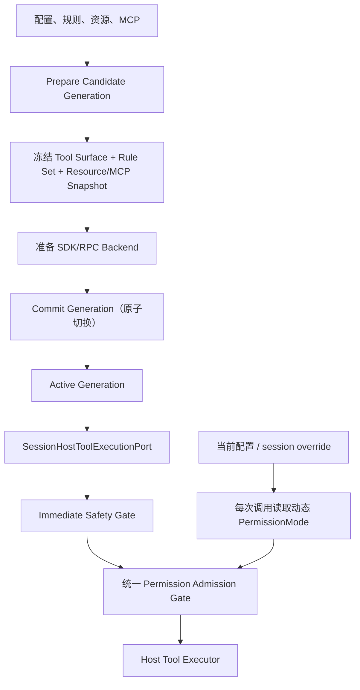

# Tool Surface Reintegration 修复 Spec

| 字段 | 值 |
|---|---|
| 状态 | Implemented — 2026-08-05 |
| 日期 | 2026-08-05 |
| 目标分支 | `dev-1` |
| 适用范围 | 工具接入面、Runtime Generation、权限、MCP、资源快照及其验证 |
| 上位方案 | [`2026-08-05-tool-surface-reintegration-execution.md`](../plans/2026-08-05-tool-surface-reintegration-execution.md) |
| 相关架构 | [`architecture.md`](../../architecture.md)、[`ADR 0019`](../../adr/0019-permission-rule-engine.md) |

## 0. 修复结论

本 spec 是对工具接入面收敛改造的补充修复，不引入新的产品聚合包，也不改变
`@piwin/host-runtime` 作为唯一产品组合根的架构。

本 spec 记录的运行时语义已全部闭环，修复结果如下：

| 编号 | 优先级 | 问题 | 修复结果 |
|---|---|---|---|
| R1 | P1 | 候选 generation 在激活前覆盖当前 tool surface | 候选准备与当前激活原子分离，失败可回滚 |
| R2 | P1 | 权限收紧只记录状态，没有阻断旧 generation | 旧 generation 的新副作用调用立即 fail-closed |
| R3 | P1 | MCP executor 重新读取磁盘配置，绕过 generation 快照 | MCP 调用绑定 generation-scoped config 与 server allowlist |
| R4 | P1 | `PermissionMode` 只在 filesystem 生效 | 所有 Agent-facing tool 使用同一个动态 mode resolver |
| R5 | P1 | `permissionSpec`/`subjectBuilder` 未成为真实决策来源 | Host 统一 admission gate，executor 不再自行决定权限 |
| R6 | P2 | ResourceCatalog 没有真实 shadow/duplicate diagnostics，ID 跨 family 冲突 | 按 `(kind, resourceId)` 建索引并输出稳定诊断 |
| R7 | P2 | family/name 静态 fallback 仍存在 | 生产编译要求真实 family index，删除第二事实源 |
| R8 | P2 | SDK/RPC ToolResult 投影丢失结构化字段 | ToolResult 在双模式端到端无损传递 |
| R9 | P2 | runtime UI 和可选能力错误缺少完整状态/诊断 | `rebuilding`/`failed` 可见，错误不再静默吞掉 |

在 R1–R5 完成并通过专项测试前，不能把原执行计划标记为最终完成。

## 1. 目标与非目标

### 1.1 目标

1. 让 Runtime Generation 的准备、激活、失败和清理具有事务语义。
2. 保证安全配置收紧在新 Runtime 生效前也能阻断新的副作用调用。
3. 保证 descriptor、permission、MCP、resource、ToolResult 都遵守明确的冻结边界。
4. 保证 SDK 与 RPC 两种 Host 模式走同一条 Host-owned tool execution path。
5. 删除或封闭所有会重新引入第二条执行路径的 fallback、静态名单和隐式加载。
6. 让测试能够覆盖“候选编译期间”“候选失败”“配置变更后旧代次调用”这些真实边界。

### 1.2 非目标

- 不新建 `@piwin/capability`、`@piwin/agent-resources` 或通用 `ToolRegistry` 包。
- 不增加第二个产品组合根；`host-runtime` 仍是唯一组合点。
- 不让 UI、应用包或 Worker 直接导入 Pi 或执行文件、网络、MCP、进程副作用。
- 不重写 Pi Kernel，不改变 SDK/RPC 的双模式职责。
- 不把异步 `async/await`、RPC pending map、queue-drain 或 work-conserving scheduler
  改成另一种风格；本 spec 只修复错误的生命周期和调用边界。
- 不在本 spec 中扩展新的产品工具能力。

## 2. 目标架构与不变量



以下规则是验收不变量：

### 2.1 组合根不变

- `buildSessionHostTools` 是唯一生产工具组合点。
- `HostToolRegistration` 是 Host-local 的唯一执行注册事实源。
- `HostToolDescriptor` 是唯一模型可见 schema 来源，只包含 `name`、`description`、
  `parameters`。
- `agent-host` 只负责 Pi SDK、RPC Worker、Pi 事件适配和 Host tool proxy。

### 2.2 Generation 冻结边界

Generation 创建时冻结：

- descriptor；
- 真实 `HostToolFamilyIndex`；
- Host-local permission spec 与 subject builder；
- bundled + user + project 合并后的 `PermissionRuleSet`；
- `rulesRevision`、settings/config revision、project trust 输入；
- ResourceCatalog / ResourceManifest；
- MCP generation snapshot 和 enabled server allowlist；
- `sessionId` 与 `runtimeGenerationId`。

Generation 不冻结最终有效的 `PermissionMode`。每次工具调用开始时，读取一次当前
mode，再结合冻结的规则集计算本次 `allow / ask / deny`。一次调用开始后，mode 变化
不影响该调用；下一次调用读取最新 mode。

### 2.3 安全收紧优先于 schema 更新

配置变化导致的安全收紧必须在旧 Runtime 上立即阻断新的副作用调用。正在执行的调用
不强制中断，除非已有明确的 AbortSignal；新调用返回稳定的 `tool-disabled` 结果。

### 2.4 单一权限决策来源

所有 Agent-facing tool 都经过 Host admission gate：

```text
registration.permissionSpec
        ↓
subjectBuilder(args, context)
        ↓
frozen PermissionRuleSet
        ↓
current PermissionMode
        ↓
allow / ask / deny
```

executor 只负责参数校验和实际领域操作，不再自行决定是否 ask、allow 或 deny。
领域差异（bash、文件、web、process、MCP、notes）可以保留为 Rule Engine 的纯策略，
但必须由同一个 admission gate 调用。

## 3. 修复工作包

### WP0 — 先固定 contracts 和 Host-local 边界

#### 修改内容

1. 保持 `HostToolDescriptor` 纯净，禁止把 `family`、`risk`、`permissionSpec` 或
   `runtimeGenerationId` 投影给模型。
2. `HostToolRegistration.permissionSpec` 在生产注册中必须存在并实际参与决策。
3. 对需要规则匹配的工具，`subjectBuilder` 必须存在；只读工具也必须明确返回
   `undefined` 或只读 subject，不允许依赖工具名猜测。
4. `permissionSpec.action` 作为稳定审计/策略 key；具体规则匹配使用 subject，
   不把最终 decision 固化进 descriptor。
5. 将 `HostToolExecutionRouter` 的生产权限 gate 改为必经路径。测试可以注入 fake gate，
   但生产 `SessionHostToolExecutionPort` 不得省略。
6. 扩展 Host-local 的 safety predicate，使其能够接收 registration、args 和 execution
   context，而不是只能根据 tool name 判断。

#### 交付文件范围

- `packages/contracts/src/tool-registration.ts`
- `packages/contracts/src/tool-result.ts`
- `packages/host-runtime/src/tools/host-tool-execution-router.ts`
- `packages/host-runtime/src/tools/session-host-tool-port.ts`
- 各工具工厂及其 colocated tests

#### 完成门

- 每个生产 registration 都有可审计的 family 和 permission spec。
- 生产代码中不再存在“声明了 permissionSpec 但 executor 绕过 Host gate”的路径。
- `pnpm typecheck` 通过，所有 registration implementer 都被编译器覆盖。

### WP1 — Runtime Generation 事务化

#### 现状问题

候选 generation 在 `composeSessionHostToolsForSession` 期间就写入当前 session 的
tool port。候选仍在编译或创建 backend 时，旧 generation 可能已经无法执行；候选失败
也可能留下 tool surface 和 MCP config 缓存。

#### 目标状态

将 Runtime Replacement 拆成三个显式阶段：

```text
prepareCandidate → commitCandidate → disposeOld / cleanup
        └──────────── abortCandidate on any failure
```

#### 具体行为

1. `prepareCandidate`：
   - 生成 descriptor、family index、permission snapshot、resource snapshot、MCP snapshot；
   - 编译 Blueprint；
   - 创建 candidate backend，但只绑定 pending generation surface；
   - 不改变 port 的 active generation；
   - 不允许 candidate backend 在 commit 前执行有效工具调用；
   - 不覆盖当前 generation 的 MCP/runtime cache。
2. `commitCandidate`：
   - 根据 `when: now | after-current-run` 等待或取消当前运行；
   - 确认 candidate backend 已准备完成；
   - 原子更新 session 的 active generation pointer 和 active tool surface；
   - 发布 `session/runtime-updated`；
   - commit 成功后再清理旧 backend 和旧 surface。
3. `abortCandidate`：
   - 删除 pending surface；
   - 删除 candidate MCP/resource cache；
   - dispose candidate backend；
   - 保持旧 generation 的 active pointer 和执行能力不变；
   - 将失败原因写入 `candidateError` 和 Host diagnostic。
4. 旧 generation 的执行期间，candidate 编译、MCP discovery 或 backend 创建失败，
   旧 tool call 必须仍然成功或按旧规则正常决策。
5. commit 后旧 generation 的 tool call 必须稳定返回 `tool-not-available` 或
   `tool-disabled`，不得重新读取当前配置拼装工具。

#### 建议的 Host-local 状态

```text
sessionId → {
  active: { generationId, surface },
  pending: Map<generationId, PreparedGeneration>
}
```

`SessionHostToolExecutionPort` 只执行 active generation；pending generation 只能被
candidate backend 用于准备，不能被外部 tool call 执行。

#### 交付文件范围

- `packages/host-runtime/src/session-runtime-replacement.ts`
- `packages/host-runtime/src/host-runtime.ts`
- `packages/host-runtime/src/tools/session-host-tool-port.ts`
- `packages/host-runtime/src/tools/session-host-tool-port.test.ts`
- `packages/host-runtime/src/session-runtime-replacement.test.ts`

#### 必测场景

- `after-current-run` 等待期间，旧 tool call 不受 candidate 编译影响；
- candidate compile 失败，旧 generation 仍可执行；
- candidate backend 创建失败，pending surface/MCP cache 全部清理；
- commit 前 candidate tool call 被拒绝；
- commit 后旧 generation 被拒绝，新 generation 成功；
- commit 重复或 stale candidate commit 不会覆盖当前 active generation。

### WP2 — Immediate Safety Gate

#### 目标

将 `IMMEDIATE_TIGHTENING_DOMAINS` 从“状态计算结果”变成实际执行门。

#### 具体行为

1. `SessionRuntimeController` 为每个 session 保存：
   - active generation 的安全输入 revision；
   - 当前 pending tightening domains；
   - 受影响的 tool family/risk 集合。
2. Settings 或外部 runtime input 变更后，Host 立即更新 safety gate；不等待 candidate
   compile 完成。
3. safety gate 的最小阻断规则：

| 收紧域 | 旧 generation 立即阻断 |
|---|---|
| `permissions` | 所有非只读 permissionSpec |
| `web` | `web`、`browser`、network risk 工具 |
| `process` | `process` 和 command risk 工具 |
| `notes` / `flashcards` | 对应 mutation 工具 |
| `subagents` | subagent/delegate 工具 |
| `mcp` | 被删除、禁用或 trust 收紧的 server/tool |

只读查询可以继续，正在执行的调用不被强制杀掉。无法确定影响范围时，按受影响范围
更大的方向 fail-closed，不得放行副作用调用。

4. 阻断结果统一为：

```text
{ ok: false,
  code: 'tool-disabled',
  message: <stable user-safe message>,
  details: { domain, runtimeGenerationId } }
```

5. candidate commit 成功后，active safety gate 与新 generation snapshot 对齐并清除旧
   pending gate。candidate 失败时，旧 gate 继续生效。

#### 交付文件范围

- `packages/contracts/src/session-runtime.ts`
- `packages/contracts/src/settings.ts`（如 MCP 需要纳入 runtime input domain）
- `packages/host-runtime/src/sessions/session-runtime-controller.ts`
- `packages/host-runtime/src/sessions/session-runtime-status.ts`
- `packages/host-runtime/src/tools/host-tool-execution-router.ts`
- `packages/host-runtime/src/tools/session-host-tool-port.ts`
- `packages/host-runtime/src/host-runtime.ts`

#### 必测场景

- permission/process/web 配置收紧后，旧 generation 的新副作用调用返回 `tool-disabled`；
- 只读 filesystem/process 查询仍可执行；
- candidate 编译失败时，旧 safety gate 不丢失；
- 新 generation commit 后，旧 gate 清理且新规则接管；
- SDK 与 RPC 对同一个 gate 返回相同 `ToolResult`。

### WP3 — 统一 Permission Admission 与动态 mode

#### Mode 语义

`PermissionMode` 不进入 generation 冻结清单。每次调用使用以下优先级读取当前值：

```text
session / agent-mode override
        > CLI 或 Host runtime override
        > 当前 config.permissions.preset / mode
        > safe fallback 'auto'
```

所有工具族都必须通过同一个 resolver 获取这个值；不得只在 filesystem 传入
`getPermissionMode`。

#### Admission 流程

```text
Port 校验身份
  → safety gate
  → registration.permissionSpec
  → subjectBuilder(args, context)
  → frozen rules + current mode
  → interactive ask / non-interactive deny
  → executor
```

规则要求：

1. `PermissionRuleSet` 使用 generation 创建时冻结的合并结果；规则文件变更不会让旧
   generation 在中途换规则。
2. `PermissionMode` 在每次调用只读取一次。
3. `ask` 由 Host interactive gate 处理；CLI/non-interactive 按现有约定转为 deny。
4. executor 不再调用 `evaluateBashPermission`、`evaluateWebPermission`、
   `evaluateProcessPermission` 或 MCP assert 来决定是否执行；这些纯策略改为 admission
   gate 的内部策略。
5. MCP 继续保留“enabled server 是信任边界”的语义，但显式 deny/ask 规则仍由同一
   admission gate 执行。
6. 参数解析失败发生在 permission subject 构造前时，返回 `invalid-input`，不得以
   空 subject 绕过权限。

#### 迁移要求

- `permissionSpec.subjectBuilder` 成为生产调用点，不再是装饰字段。
- 所有具有副作用的 registration 补齐正确 action/risk/subject。
- 删除 executor 内部重复的 permission prompt/wrapper，避免一次调用双重 ask。
- 只读工具也通过 admission gate，但 gate 可以直接给出 allow；不能绕过 port/router。

#### 必测矩阵

至少覆盖：

| family | mode | 规则 | 期望 |
|---|---|---|---|
| filesystem/bash | auto / ask-all / bypass | bundled deny/ask/no-match | 与 ADR 0019 一致 |
| process | 三种 mode | process rule / no rule | mode 与 action 一致 |
| web/browser | 三种 mode | host rule / private host | deny/ask/allow 一致 |
| MCP | 三种 mode | server trust + selector rule | explicit deny/ask 不被 bypass 绕过 |
| notes/flashcards | 三种 mode | mutation/read | mutation 不得无门禁执行 |
| subagent/image generation | 三种 mode | network/delegate policy | 使用同一个 dynamic mode |

### WP4 — MCP Generation Snapshot

#### 目标

MCP 配置只能在 generation composition/discovery 边界读取；工具执行期间不得再次从
磁盘加载当前配置。

#### Snapshot 形状

Host-local snapshot 至少包含：

```text
McpGenerationSnapshot
├── revision
├── config document（深冻结或不可变副本）
├── enabledServerIds
└── server config fingerprints
```

#### 具体行为

1. `loadMcpConfig` 只允许出现在 generation preparation、显式 Settings/MCP 管理命令或
   独立 health/discovery 边界。
2. `mcp_gateway`、cached direct tool 和 lifecycle `callTool` 不得在 execute 内调用
   `loadMcpConfig` 或隐式 `refreshConfig`。
3. lifecycle manager 的连接可以复用，但连接必须绑定
   `(serverId, configFingerprint, generation policy)`；磁盘配置更新不能悄悄改变旧
   generation 的执行目标。
4. call 前验证 selector/serverId 属于该 generation 的 enabled allowlist；未知、禁用、
   删除的 server 返回稳定 `mcp-failed` 或 `tool-disabled`，不得尝试当前配置中的同名
   server。
5. MCP 配置保存必须触发 runtime invalidation；如纳入 `SettingsDomain`，加入 `mcp`
   domain；否则必须建立等价的 Host runtime input change event。不能只更新 Settings UI。
6. MCP 配置变更造成安全收紧时，先更新 immediate safety gate，再异步准备新 generation。

#### 必测场景

- generation A 创建后新增 server B，A 看不到 B；
- generation A 创建后禁用 server A，旧 generation 新调用被 safety gate/allowlist 拒绝；
- generation A 创建后修改同名 server 的 command/env，A 继续使用原 snapshot；
- generation B 创建后才能看到新配置；
- cached direct 和 gateway 对同一个 snapshot 的 selector 结果一致。

### WP5 — ResourceCatalog 真正实现与按 family 隔离

#### 目标

Catalog 必须保留所有候选资源，用于生成 active manifest 和诊断；不能在 scanner 阶段
先静默丢掉重复项。

#### 规则

1. 资源唯一键是 `(kind, normalizeResourceId(resourceId))`，不是裸 `resourceId`。
   skill、extension、prompt 可以拥有同名 ID，不得互相覆盖或互相 disable。
2. 每个 family 的 disabledIds、allowlistedIds、family enabled 开关独立应用。
3. Catalog 保留 winner 和 loser：
   - winner 进入 activation candidate；
   - loser 留在 catalog，不进入 active manifest；
   - 输出 `shadowed` 或 `duplicate-id` diagnostic。
4. source precedence 必须由一个常量显式表达，不能依赖三个 scanner 的遍历副作用。
   修复阶段保持当前扫描顺序的兼容语义：`bundled → user → project → mapped`，先出现
   者为 winner；若后续需要 project 覆盖 user，另行修改 ADR/测试，不在本修复中隐式改变。
5. resource catalog revision 必须包含所有候选、winner/loser、诊断和有效配置输入；
   资源变化不能继续使用 placeholder revision。
6. `createPiResourceLoader` 不得既使用已去重 summary 又宣称能生成完整 shadow diagnostics。
   主链应使用保留候选的 catalog，UI summary 可以从 catalog 投影。

#### 交付文件范围

- `packages/contracts/src/resource.ts`
- `packages/contracts/src/resource-manifest.ts`
- `packages/skills/src/skill-scanner.ts`
- `packages/host-runtime/src/extension-scanner.ts`
- `packages/host-runtime/src/prompt-scanner.ts`
- `packages/host-runtime/src/pi-resource-loader.ts`
- `packages/host-runtime/src/capabilities/resource-policy-resolver.ts`
- `packages/host-runtime/src/blueprint-compiler.ts`

#### 必测场景

- 同一 family 的 bundled/user/project/mapped shadow 顺序和 diagnostics；
- 不同 family 使用相同 ID 时互不影响；
- 只禁用 skill 不会禁用同名 prompt；
- untrusted project 的 project resource 不进入 active manifest，但仍可在 catalog 诊断；
- `diagnostics` 不再恒为空。

### WP6 — 删除静态 family fallback

#### 目标

生产 policy/compiler 只接受真实 registration 派生的 family index。

#### 具体行为

1. 删除 `FAMILY_CUSTOM_TOOLS` 作为生产 policy 来源。
2. 删除通过 `mcp__` 前缀推断 family 的生产逻辑。
3. 当 production compiler 收到 descriptors 却没有真实 family index 时，fail closed 并
   返回稳定配置错误；不得退回静态名单。
4. 所有 production caller 在 compile 前提供实际 registration/family index。
5. 如测试仍需要最小 fixture，fixture 直接构造 `HostToolRegistration` 并调用
   `toolFamilyIndex`，不复制一份工具名表。

#### 删除门

```text
FAMILY_CUSTOM_TOOLS                 = zero production references
custom name allowlist fallback      = zero production references
mcp__ prefix family inference       = zero production references
compile without family index        = fail-closed, not fallback
```

### WP7 — ToolResult 与 SDK/RPC 无损投影

#### 目标

`ToolResult` 是 Host、SDK、RPC、Worker proxy 之间唯一的结构化结果，不再把错误和输出
拆成两套不等价字段。

#### 具体行为

1. Worker tool-result frame 传递完整 `ToolResult`，至少保留：
   - `ok`、`output`；
   - `code`、`message`；
   - `details`；
   - `cancelled`、`retryable`。
2. SDK adapter 和 Worker proxy 不得丢失 `details.jobId`、`details.runId`、MCP selector
   或其他领域结构化信息。
3. Pi-facing projection 可以把 `output` 格式化成文本，但 Host/Worker 内部必须保留原始
   ToolResult；模型文本不是结构化结果的替代品。
4. 结果 details 必须是 JSON-safe 的有限结构；不得把 Error、AbortSignal、client 或
   secret 放入 details。
5. 增加 SDK/RPC conformance test，使用同一 fixture 断言深相等的 ToolResult。

#### 交付文件范围

- `packages/contracts/src/tool-result.ts`
- `packages/agent-host/src/rpc-sdk-worker-protocol.ts`
- `packages/agent-host/src/rpc-sdk-worker-client.ts`
- `packages/agent-host/src/rpc/worker-session-runtime.ts`
- `packages/agent-host/src/backends/pi-backend-tool-adapter.ts`
- `packages/agent-host/src/rpc/worker-proxy-tool-factory.ts`

### WP8 — UI 状态和错误诊断收口

#### 具体行为

1. Desktop runtime 页面明确展示：
   - `live`；
   - `stale`；
   - `rebuilding`；
   - `failed` 及 `candidateError`；
   - `lazy-shell`。
2. `failed` 不得被显示成 lazy shell；用户能区分“没有 runtime”和“重建失败”。
3. composition 中的可选能力失败必须至少进入一个可观察出口：
   - `candidateError`；
   - `host/log` / generation diagnostic；
   - 或明确的 catalog/status diagnostic。
4. fail-closed 仍然允许，但不能用空数组/静默 catch 把“配置错误”“能力未启用”和
   “扫描失败”混成同一种状态。
5. 不在 UI 中重新解析 Pi-native event；继续消费 HostPush。

#### 交付文件范围

- `apps/desktop/src/settings/pages/session-runtime-page.tsx`
- 对应测试
- `packages/host-runtime/src/tools/build-session-host-tools.ts`
- `packages/host-runtime/src/host-runtime.ts`
- 相关 diagnostic contract（若现有 HostPush 无法承载）

## 4. 实施顺序与提交边界

按以下顺序实施，避免在事务语义未完成前继续扩大工具面：

| 阶段 | 内容 | 提交边界 | 进入下一阶段的门 |
|---|---|---|---|
| F0 | contracts、domain/revision、测试 fixture | contracts / test | typecheck green，旧 API 使用点列清 |
| F1 | Generation prepare/commit/abort | host-runtime lifecycle | R1 全部集成测试通过 |
| F2 | Immediate Safety Gate | runtime/port/router | R2 旧代次安全调用全部被阻断 |
| F3 | Unified Permission Admission + dynamic mode | permission/tool families | R4/R5 matrix 全通过，无 executor gate 残留 |
| F4 | MCP snapshot/lifecycle | mcp + host-runtime | R3 mutation-after-compose 测试通过 |
| F5 | Resource catalog + family policy | skills/host-runtime/contracts | R6/R7 diagnostics/fallback gate 通过 |
| F6 | ToolResult wire parity + UI/diagnostics | agent-host/desktop | R8/R9 通过 |
| F7 | 删除门、文档、最终验证 | all touched packages | 所有 deletion gate 和 full suite 通过 |

每个阶段保持小提交，建议按以下关注点拆分：contracts、lifecycle、permission、MCP、
resource、transport/UI、cleanup/docs。不得把无关的依赖升级或 UI 重构混入修复。

## 5. 测试与验收矩阵

### 5.1 必须新增的回归测试

- generation candidate 编译期间旧 surface 可执行；
- candidate 编译/创建失败后旧 surface、旧 MCP snapshot 和旧 safety gate 保持有效；
- candidate commit 前不可执行，commit 后旧 generation 不可执行；
- immediate tightening 对旧 generation 的 side-effect tool 返回 `tool-disabled`；
- current mode 在 filesystem、process、web、MCP、notes、subagent、image generation
  全部生效；
- MCP 配置在 compose 后变化不会改变旧 generation 的 server/tool 视图；
- resource catalog 产生 shadow/duplicate diagnostics；
- 同名跨 resource kind 不互相禁用；
- production compiler 无 family index 时 fail-closed；
- SDK/RPC ToolResult 深相等，保留 details/cancelled/retryable；
- runtime UI 正确显示 rebuilding/failed 和 candidate error；
- optional capability failure 有可观测 diagnostic。

### 5.2 删除和静态检查门

```text
旧 buildToolsForSession / execute-time lazy compose       = zero production references
candidate prepare 阶段修改 active surface                 = zero
execute 阶段 loadMcpConfig / refreshConfig                 = zero
production permissionSpec 仅声明不使用                    = zero
executor 内部重复 permission decision                     = zero
FAMILY_CUSTOM_TOOLS / name-only production fallback       = zero
ToolResult 结构字段在 SDK/RPC 投影中丢失                    = zero
静默 catch（无日志、无 diagnostic、无可解释 fallback）     = zero in touched paths
```

### 5.3 必须执行的命令

```bash
pnpm typecheck
pnpm test:architecture
pnpm test
pnpm --filter @piwin/contracts test
pnpm --filter @piwin/host-runtime test
pnpm --filter @piwin/agent-host test
pnpm --filter @piwin/mcp test
```

若某包没有独立 test script，使用 workspace 全量测试覆盖，并在实施记录中说明。

## 6. 文档与完成定义

实施完成后必须同步：

1. 更新 `docs/architecture.md`，统一“权限由 Host admission gate 决策”的描述，不能
   同时保留“executor 自己检查”和“Router 统一检查”两种权威说法。
2. 更新 ADR 0019 的 implementation notes，明确 frozen rules + dynamic mode + immediate
   safety gate 的边界。
3. 更新原 execution plan 的状态和实施记录，列出本 spec 的修复提交和验证结果。
4. 在删除门中加入：
   - candidate early registration 零残留；
   - execute-time MCP config reload 零残留；
   - permissionSpec 未接入零残留；
   - ToolResult projection 丢字段零残留；
   - resource diagnostics 假实现零残留。

本 spec 的“完成”不是“类型检查通过”这一项，而是同时满足：

- R1–R5 的 P1 问题全部关闭；
- R6–R9 的 P2 问题有实现和回归测试；
- SDK/RPC 行为一致；
- 所有 required commands 通过；
- deletion gates 通过；
- 文档与实际权限、代次、MCP、资源语义一致。

## 7. 实施记录

- Runtime generation 已采用 prepare → commit → abort/rollback 生命周期；候选 surface、后端代次、MCP transport 和旧代次资源均按事务边界管理。
- 权限链已收敛为 immediate safety gate → unified Host admission gate → executor；规则集按 generation 冻结，`PermissionMode` 每次调用动态读取。
- MCP executor 只使用 generation-scoped snapshot，不在调用阶段 reload/refresh 磁盘配置；资源 catalog 输出 shadow/duplicate diagnostics，并按 `(kind, resourceId)` 隔离策略。
- 删除了生产 string adapter、旧 MCP permission helper、重复 executor permission options 和静态 family/name fallback；SDK/RPC 继续共享同一 Host execution port 与 ToolResult 契约。
- Desktop runtime 已区分 `live`、`stale`、`rebuilding`、`failed`，可选能力降级通过 `host/log` 可观察。

最终验证：`pnpm typecheck`、`pnpm test:architecture`、workspace `pnpm test` 通过；本次涉及源码的 Prettier 检查通过。根目录 `pnpm format:check` 仍被仓库既有两个 HTML 原型语法错误阻断，未纳入本次修复范围。
