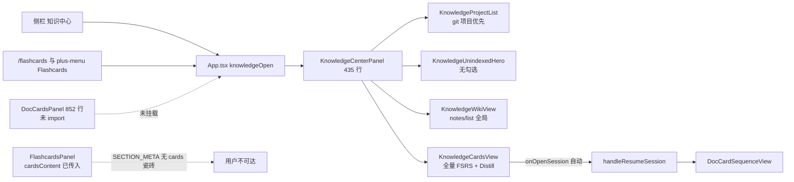
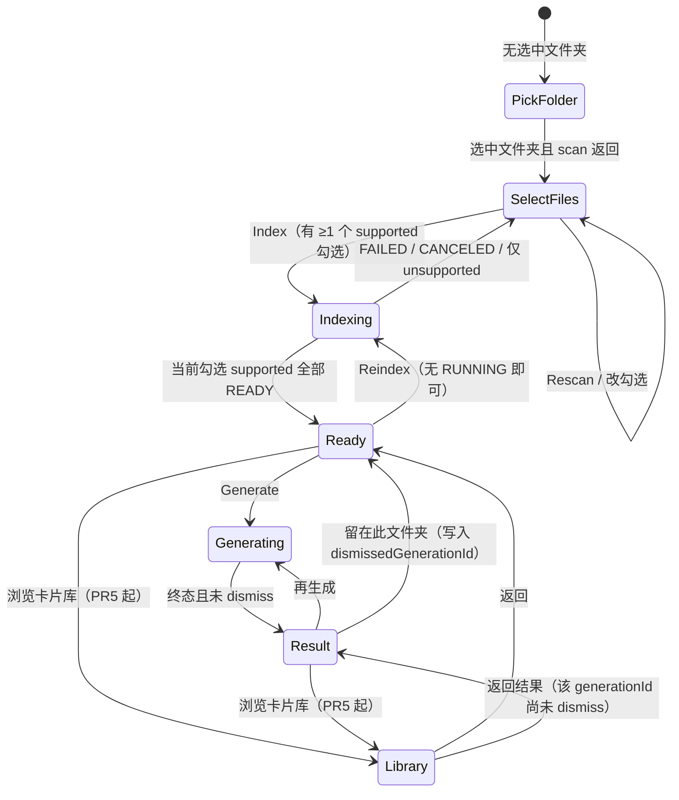

# Knowledge Center 产品闭环修复（仅 UI / IA）

| 字段 | 值 |
|------|----|
| 作者 | TBD |
| 日期 | 2026-08-17 |
| 状态 | Draft |
| 范围 | Desktop overlay IA + 状态机；不改双流水线、不改 CardStore、不改 Job 队列 |
| 权威口径 | [`docs/notes/2026-08-16-doccards-v2-product-decisions.md`](docs/notes/2026-08-16-doccards-v2-product-decisions.md) |
| 执行计划 | [`docs/plans/2026-08-16-doccards-rag-flashcard-execution-plan.md`](docs/plans/2026-08-16-doccards-rag-flashcard-execution-plan.md) |

---

## Overview

Host 双流水线（Ingest / Generate）已经能走通：`scan-folder` → `index-folder` → `generate` → CardStore → 展示会话指针。用户在 Desktop 上完成不了同一条环，是因为挂载面 `KnowledgeCenterPanel` 是一个「当前 git 项目 + Wiki/Search + 全量 FSRS」的 IDE 工作台，盖在三步学习产品之上。

本设计把同一个 overlay 收成 **文件夹作用域的学习环**：选本地文档文件夹 → 勾选文件并入库 → 生成闪卡 → 先看结果页 → 用户主动打开聊天翻卡器。不新开应用，不重写 Host，不造第二套卡片库 / 任务队列。

**Lock 11 的 UI 读法：** Host 在 `created>0` 时仍然调用 `openDoccardReviewSession` 创建指针会话。Desktop **不再**自动 `resume` / `onOpenSession`。`created=0` 仍然不开会话。实现者不得「配合结果页」去关掉 Host 开会话。

---

## Background & Motivation

### 产品对象 vs 当前默认对象

锁定口径第 1 条：必须先选本地**文档文件夹**，`workspaceName = basename(canonicalPath)`。

挂载实现把对象当成了当前 git 仓库：

```72:73:apps/desktop/src/KnowledgeCenterPanel.tsx
  const initialSelected = props.projectPath || (props.recentProjects?.[0]?.path ?? '');
  const [selectedPath, setSelectedPath] = useState<string>(initialSelected);
```

`App.tsx` 打开 overlay 时始终传入 `projectPath={state.projectPath}`。用户点侧栏「知识中心」会直接落到当前仓库，而不是「选一个笔记/文档文件夹」。

### 已核实的产品缺陷（对照 HEAD，不重新争论）

| # | 现象 | 代码事实 |
|---|------|----------|
| 1 | 默认对象是 git 项目 | 上表 `initialSelected`；`KnowledgeProjectList` 把 `activeProjectPath` + `recentProjects` 排在 mounted folders 前面 |
| 2 | 没有文件勾选 | KC `handleStartIndexing` 只发 `{ type: 'doccards/index-folder', folderPath }`，不传 `includeFiles`。契约与 Host **已经**接受 `includeFiles` |
| 3 | 两套复习 UI，且到期 FSRS **没有可达入口** | KC `KnowledgeCardsView` 内嵌全量 FSRS。规格新批次复习面是 `chat-thread.tsx` 的 `DocCardSequenceView`。`FlashcardsPanel` 虽作为 `cardsContent` 传给 `RightPanel`，但 `SECTION_META` 无 `cards` 瓷砖，`ALLOWED_KINDS` 不持久化 `'cards'`，`App.tsx` 从不 `openRightTab('cards')`。`/flashcards` 与 plus-menu「Flashcards」打开的是 **KC Cards tab**（即将删掉的内嵌 FSRS） |
| 4 | ~~顶栏五芯片条~~ **已做完** | HEAD `KnowledgeCenterPanel.tsx`（435 行）只有单个设置 `IconButton`（`data-testid="knowledge-config-btn"`）。KC 测试已断言该按钮，不再断言芯片。设置表单仍在 `settings/pages/knowledge-page.tsx` |
| 5 | Wiki 空态撒谎；工作台默认错 | `KnowledgeWikiView` 在 `notes.length === 0` 时写「项目知识库已就绪」。`notes/list` 是**全局**笔记，不是当前文件夹 |
| 6 | `sliceCount` = 文件数 | `projectStats[path].sliceCount = scannedFiles.length`，左侧渲染成「N 切片」 |
| 7 | Generate 不看 READY 门闩；KC **丢掉** `documents` | `KnowledgeCardsView` 只 `disabled={isGenerating \|\| busy}`。`selectedDocumentsReady()` 已在 `doccards-progress.ts`，只有孤儿 `DocCardsPanel` 在用。KC `loadProjectData` 拉了 `index-status.documents` 却只用来算 `isReady`，**不存** `DocumentManifest[]` |
| 8 | 更接近规格的向导没挂载 | `DocCardsPanel.tsx`（852 行）全仓库只有自己引用自己；`App.tsx` 挂的是 `DeferredKnowledgeCenterPanel` |
| 9 | Hero 用仓库 Wiki 口吻 | 「Build Knowledge Base for {folder}」「立即开始分析与构建索引」 |
| 10 | 没有结果页 | `handleStartGeneration` 在 `job.sessionId` 存在时立刻 `onOpenSession`；`created===0` 写入 `knowledge-action-error`（`role="alert"`）。测试 `opens the review session after generate completes` **锁死了自动跳转** |

### 读代码后对 brief 的校正

1. **索引完成后默认 tab 不是 Wiki。** `App.tsx` 的 `knowledgeInitialTab` 默认 `'doccards'`，KC 把它映射成 `viewTab='cards'`。用户先看到 Cards 画廊 + Distill。问题仍成立：一级 IA 是 Wiki-vs-Cards 工作台，不是循环；Wiki 文案与 `notes/list` 仍错。
2. **Host 契约缺口比 brief 预想的更小。** `includeFiles`、`created` / `skipped` / `createdCardIds` / `sessionId` / `COMPLETED_DEGRADED` 都已在 `packages/contracts/src/ipc.ts` 与 `doc-rag-v2.ts`。唯一建议的薄封装是 **COMPLETED_DEGRADED 后补开会话**（可选，见 § API）。
3. **芯片条已不在循环铬上。** 本修理不再把「删芯片」当工作项。
4. **`FlashcardsPanel` 挂载 ≠ 可达。** 删 KC 内嵌 FSRS 之前，必须先把右栏 Cards 瓷砖接到 `openRightTab('cards')`，并把 `/flashcards` / plus-menu 指过去。否则「去知识卡片复习到期卡」是死链。

### 当前挂载拓扑（HEAD）



---

## Goals & Non-Goals

### Goals

- 用户在 Desktop overlay 内独立走完：选文件夹 → 勾选文件 → Index → Generate → 结果页 → 主动打开展示会话。
- 左栏对象 = 文档文件夹（最近挂载优先）。当前 git 项目不自动选中。
- 右栏是状态机，不是 Wiki / Cards 一级 tab。
- 新批次复习只走 `DocCardSequenceView`。本 overlay 内嵌 FSRS 删除——**且仅在**右栏 Cards 瓷砖已接到 `FlashcardsPanel` 之后删除。
- Settings → Knowledge 保持唯一表单；overlay 维持现有单个设置按钮。
- 文案诚实：文件 / 已入库文件 / 库内卡片；禁止把文件数叫「切片」。
- 不增长 `KnowledgeCenterPanel.tsx` 职责；抽出纯状态机 + stage 视图。
- 复用 `DocCardsPanel` 的文件清单 / Forget，而不是第三套实现；消除双 UI。

### Non-Goals

- 翻卡视觉打磨（`DocCardSequenceView` 本轮只保证仍是规范复习面）。
- 聊天直接出卡（`flashcard_create` / `flashcard_batch_create`）。
- STALE / 文件过期 / 磁盘变更自动灭 Generate。
- 新 agent kernel、dashboard、知识图谱。
- 后端 parser / reranker HTTP 完备性。
- Mobile Knowledge Center 重设计（Desktop-first）。
- 把 Settings 表单搬进向导。
- 新卡片存储或新 Job 队列。
- 删已经不存在的芯片条。
- 本轮不修 Host `HOST_RESTARTED` 遗留 RUNNING 标记。

---

## 方案比较与推荐

### A. Loop-first Knowledge Center（推荐）

保留一个 overlay。左栏改成文档文件夹。右栏改成阶段状态机。聊天翻卡器仍是新批次规范复习面。KC 画廊降级为该文件夹的卡片库。Wiki/Search 降为次级抽屉。到期 FSRS 走右栏 `FlashcardsPanel`（本轮补上真实入口）。

| 优点 | 风险 |
|------|------|
| 用户点「知识中心」看到的就是环 | 要改现有 KC 测试（含自动跳转锁） |
| 复用 scan / index / generate 客户端、进度环、文件清单、Forget | 必须拆文件；必须先接线右栏 Cards，再删内嵌 FSRS |
| 一次替换，回滚 = revert Desktop IA PR 链 | 文案与 IA 测试面较大 |

### B. 重挂 DocCardsPanel，KC 留作以后的库

`DocCardsPanel` 更接近规格：有勾选、传 `includeFiles`、用 `selectedDocumentsReady`、**不**自动 `onOpenSession`、有 Forget。仍有能力芯片条、仓库口吻、无结果页。侧栏仍打开 KC。852 行再堆结果页会破线。**并不显著更便宜。**

### C. 现在拆成两个产品

本轮产品面过大。拒绝。

### 推荐

**做 A。**

---

## Proposed Design

### 信息架构

#### 命名

| 位置 | zh-CN | en | 决策 |
|------|-------|-----|------|
| 侧栏 / slash `/knowledge` / `desktopCopy.knowledgeCenter` | 知识中心 | Knowledge Center | **保留壳入口名** |
| Overlay 内 kicker / 空态标题 | 从文件夹学习 | Learn from folder | 改循环文案，不改壳 |
| 一级 CTA | 选择文件夹 / 入库 / 生成闪卡 / 打开复习会话 | Choose folder / Index / Generate cards / Open review session | 停用「构建知识库」「Repo Wiki」「批量提炼」作主 CTA |
| 右栏新瓷砖 | 知识卡片 | Flashcards | `FlashcardsPanel`：到期队列 FSRS |

#### 入口重定向（删内嵌 FSRS 的前置条件）

今天三条路都进 KC Cards tab（内嵌 FSRS）：

| 入口 | HEAD | 本轮之后 |
|------|------|----------|
| 侧栏「知识中心」 | `handleOpenKnowledge()` → KC，`initialSubTab` 默认 `doccards`→Cards | 仍开 KC overlay；**忽略** `initialSubTab`；进入循环状态机 |
| `/knowledge`、`/doccards` | `{ kind: 'knowledge', subTab: 'doccards' }` → KC | 仍开 KC overlay（循环）。不选 Wiki/Cards tab |
| `/flashcards`、`/cards` | `{ kind: 'knowledge', subTab: 'cards' }` → KC Cards / 内嵌 FSRS | **改开右栏** `openRightTab('cards')` → `FlashcardsPanel`（到期队列） |
| `/notes`、`/wiki` | `{ kind: 'knowledge', subTab: 'wiki' }` → KC Wiki | 开 KC overlay（循环）。不再落地 Wiki 一级 tab。搜索是 overlay 内次级抽屉 |
| plus-menu「Doc Cards」 | `onOpenKnowledge('doccards')` | 开 KC overlay |
| plus-menu「Flashcards (知识卡片复习)」 | `onOpenKnowledge('cards')` 经 App → `composer-dock.tsx` → plus-menu | **改** `onOpenCardsPanel()` → `openRightTab('cards')`。新 prop，不重载 `onOpenKnowledge('cards')` |
| plus-menu「Repo Wiki」 | `onOpenKnowledge('wiki')` | 开 KC overlay；文案改为「从文件夹学习 / Learn from folder」（或「搜索文件夹」）。禁止再写 Repo Wiki |

废弃 `knowledgeInitialTab` / `KnowledgeCenterPanel.initialSubTab` 的产品含义（prop 可留一版以免断编译，但编排器不再切 Wiki/Cards）。

接线文件（必须写进 PR5a，见 PR Plan）：

| 文件 | 改动 |
|------|------|
| `apps/desktop/src/right-panel-sections.tsx` | `SECTION_META` 增加可见 `{ id: 'cards', labelEn: 'Flashcards', labelZh: '知识卡片' }`（用现有 `IconCards`） |
| `apps/desktop/src/right-panel-memory.ts` | `ALLOWED_KINDS` 加入 `'cards'`，折叠后能恢复该 tab |
| `apps/desktop/src/App.tsx` | 新增 `handleOpenCardsPanel` → `openRightTab('cards')`；把它传进 **composer dock**（`onOpenCardsPanel={handleOpenCardsPanel}`）。`handleOpenKnowledge` 不再因 `'cards'` 去 KC。**过渡一期：** 若仍有调用方走 `handleOpenKnowledge('cards')`，该分支必须转调 `handleOpenCardsPanel()`，避免漏改的入口重新打开内嵌 FSRS |
| `apps/desktop/src/composer-dock.tsx` | 新增可选 `onOpenCardsPanel?: () => void`（**不要**把 Flashcards 塞进已有的 `onOpenKnowledge('cards')`）。原样传给 `composer-plus-menu`。slash 路径若经 dock / `use-composer-media`，同样调这个 prop |
| `apps/desktop/src/slash/slash-parse.ts` | `/flashcards` `/cards` 不再返回 `kind: 'knowledge'`。新增 `kind: 'cards-panel'`（或等价 command），由 `use-composer-media.ts` 调 `onOpenCardsPanel` |
| `apps/desktop/src/slash/slash-types.ts` + `slash-parse.test.ts` | 同步联合类型与断言 |
| `apps/desktop/src/slash/slash-catalog.ts` | Flashcards 描述改为到期复习，不再写「打开知识中心」 |
| `apps/desktop/src/composer-plus-menu.tsx` | 新增 `onOpenCardsPanel`；Flashcards 项只调它；Wiki 项改文案并开 KC |
| `apps/desktop/src/composer-plus-menu.test.tsx` | 断言 Flashcards 调 `onOpenCardsPanel`，不调 `onOpenKnowledge('cards')` |
| `apps/desktop/src/hooks/use-composer-media.ts` | 处理新 slash kind → `onOpenCardsPanel` |
| `apps/desktop/src/right-panel-home.tsx` / `right-panel-plus-menu.tsx` | 无逻辑改动（读 `SECTION_META`）；补测试点瓷砖能打开 `cardsContent` |

`RightPanel.sectionContent` 的 `case 'cards'` 与 `App.tsx` 的 `cardsContent={<DeferredFlashcardsPanel .../>}` **已经存在**，不要重写面板，只补入口。

**禁止**在 PR5a 合入之前删除 `KnowledgeCardsView` 的 FSRS 块。PR5 依赖 PR5a。

#### 主对象

| 对象 | 身份 | 真源 | UI 角色 |
|------|------|------|---------|
| Folder | `folderPath`（canonical）；`workspaceName = basename`；`folderKey = sha256(path).slice(0,16)` | 用户挑选的本地目录 | 左栏一行 |
| File | `relativePath`；supported / unsupported + reason | `doccards/scan-folder` | 清单勾选；unsupported 不可勾 |
| Index job | `IngestionJob` | Host 进程内 `Map` + `index-status` | 阻塞 Generate；可取消 |
| Generate job | `GenerationJob` | 同上 | 进度 + 结果页。关闭 overlay = 卸载；重开须重新 poll |
| Card | `FlashcardRecord` | `~/.piwin/flashcards/cards/*.md` | 库画廊；翻卡器现查 |
| Display session | `{ sequenceId, cardIds, generationId, workspaceName }` | transcript 指针，无正反面 | 用户从结果页打开 |

#### 默认选中规则（打开 overlay）

`App.tsx` 仅在 `knowledgeOpen` 时挂载 `DeferredKnowledgeCenterPanel`。**关闭 overlay = 卸载 = React state 清空。** 不存在「本次 overlay 会话里组件未卸载则保持」——那只在 overlay 一直开着时成立。

每次 **mount**：

1. `loadRecentFolders()`（`piwin.doccards.recent_folders`）第一项 → 选中，scan，并 poll `index-status` + `generation-status`。
2. 否则进入 `pick-folder`。**不要**用 `props.projectPath`，**不要**用 `recentProjects[0]`。

当前 git 项目只作为空态**次级建议**：「把当前项目当作文档文件夹」——点了才 mount + 写入 recent folders。未点 = 未选中。

左栏 = `loadRecentFolders()` 的文档文件夹。不再把 `recentProjects` 整表渲染成知识库。`activeProjectPath` 若已在 recent 里可标「当前项目」，但不因此排第一或自动选中。

#### Wiki / Search 放哪

- 不是一级 tab，也不是 `KnowledgeLoopStage`。
- Ready / Result 上的次级「搜索此文件夹」打开**抽屉**，只复用 `KnowledgeWikiView` 的 `doccards/retrieve`。
- **删除**把 `notes/list` 第一篇笔记当文件夹 Wiki 默认体。
- 空检索：「这个文件夹还没有检索结果」/ “No matching passages in this folder.” 提供「去生成闪卡」或关闭。不要提「Wiki 笔记」。

#### 文件夹卡片库放哪

`userView === 'library'` 时的画廊：`DocCardItem` + 导出 / `open-source` / 送到聊天。不做 FSRS。

**PR5 之前不展示「浏览卡片库」按钮**（Ready / Result 次级动作隐藏）。避免点进仍带 FSRS 的旧 `KnowledgeCardsView`，也避免空壳。PR5 落地 `KnowledgeLibraryView` 后再打开该按钮。

#### 到期 FSRS 放哪

`FlashcardsPanel`，经 **PR5a** 补上的右栏 Cards 瓷砖。KC 库页脚在 PR5 起链 `openRightTab('cards')`（通过 App 注入的 `onOpenCardsPanel`）。overlay 内不再做 `mode === 'review'`。

### 右栏状态机

`Search` 是抽屉，`ReviewSession` 是离开 overlay 去聊天——**都不是** `KnowledgeLoopStage`。PR1 测试只锁下面七态。



打开复习会话：**不是**状态迁移。编排器调用 `onOpenSession(sessionId)`；Host 已在 generate 时建好指针会话。overlay 可保持挂载或随用户关——重开后若 job 仍在且未 dismiss，仍显示 Result。

纯模块：`apps/desktop/src/knowledge/knowledge-loop-state.ts`（无 React）。

```ts
export type KnowledgeLoopStage =
  | 'pick-folder'
  | 'select-files'
  | 'indexing'
  | 'ready'
  | 'generating'
  | 'result'
  | 'library';

export type GenerateBlockReason =
  | 'no-folder'
  | 'no-supported-selected'
  | 'indexing'
  | 'generating'
  | 'selected-not-ready'
  | null;

export type KnowledgeLoopInput = {
  folderPath: string | null;
  selectedSupported: string[];
  documents: DocumentManifest[];
  indexJob: IngestionJob | null;
  generationJob: GenerationJob | null;
  userView: 'loop' | 'library';
  /** 用户点「留在此文件夹」后写入的 job.id。null = 未 dismiss。 */
  dismissedGenerationId: string | null;
};

export type KnowledgeLoopView = {
  stage: KnowledgeLoopStage;
  primary: 'pick-folder' | 'index' | 'generate' | 'open-review' | null;
  generateEnabled: boolean;
  generateBlockReason: GenerateBlockReason;
  indexEnabled: boolean;
  reindexEnabled: boolean;
  showOpenReview: boolean;
  resultKind: 'none' | 'created' | 'zero' | 'degraded' | 'failed' | 'canceled';
};

export function deriveKnowledgeLoop(input: KnowledgeLoopInput): KnowledgeLoopView { /* 纯函数 */ }

export function generateDisabledCopy(
  reason: GenerateBlockReason,
  extras: { mineruMissing?: boolean },
  locale: 'zh-CN' | 'en',
): string | null { /* 纯函数 */ }
```

**READY 判定不在本模块重写。** 调用方先算：

```ts
const selectedReady = selectedDocumentsReady(input.selectedSupported, input.documents);
```

`deriveKnowledgeLoop` 只读这个布尔（或在函数第一行调用 `selectedDocumentsReady`，禁止第二套路径/状态比较）。

终态集合：`COMPLETED | COMPLETED_DEGRADED | FAILED | CANCELED`。

派生优先级（测试按此顺序锁）：

| 优先级 | 条件 | stage |
|--------|------|-------|
| 1 | `folderPath` 空 | `pick-folder` |
| 2 | `userView === 'library'` | `library` |
| 3 | ingestion `PENDING` \| `RUNNING` | `indexing` |
| 4 | generation 存在且非终态 | `generating` |
| 5 | generation 终态 **且** `generationJob.id !== dismissedGenerationId` | `result` |
| 6 | 有勾选 supported 且 `selectedDocumentsReady(...)` 且无 RUNNING | `ready` |
| 7 | 其余（已选文件夹） | `select-files` |

「留在此文件夹」= 编排器 `setDismissedGenerationId(generationJob.id)`，下一拍落到 `ready` 或 `select-files`。再 Generate 会换新 `job.id`，自然再次进入 `generating` → `result`。

**「浏览卡片库」不是 PR1 状态机的输出。** `KnowledgeLoopInput` 没有 `cardCount` / `cards`，纯函数不得假装看见 `cards.length`。PR1 **不要**在 `KnowledgeLoopView` 上加 `showBrowseLibrary`。画不画该按钮是编排器标志：PR5 之前恒 `false`；PR5 起由编排器用 `cards.length`（面板 state，不进 deriver）决定。`userView === 'library'` 仍可在 PR1 测试（输入里已有 `userView`），但产品在 PR5 前不会把 `userView` 设成 `'library'`。

`reindexEnabled`：有文件夹且 ingestion / generation 都不是 RUNNING。无 STALE。上次 FAILED / CANCELED 不钉死。

结果表：

| `GenerationJob` | resultKind | primary | 打开会话按钮 |
|-----------------|------------|---------|--------------|
| `COMPLETED` 且 `(created ?? createdCardIds.length) > 0` 且有 `sessionId` | `created` | `open-review` | 有，点击才 `onOpenSession` |
| `COMPLETED` 且 created=0 | `zero` | 无（「再生成」次级） | **无** |
| `COMPLETED_DEGRADED` 且 created>0 | `degraded` | 无（主 CTA 空；PR5 起编排器另画「浏览卡片库」，不是 deriver.primary） | 「重试打开会话」仅当可选命令已实现；否则无 |
| `FAILED` | `failed` | 无 | 无 |
| `CANCELED` | `canceled` | 无 | 无 |

`created=0` **禁止**调用 `onOpenSession`。UI **禁止** `session/create` 当补开会话。

#### Overlay 重开与 Host 重启

| 事件 | 行为 |
|------|------|
| overlay 关闭 | `DeferredKnowledgeCenterPanel` 卸载。`dismissedGenerationId`、`generationJob`、`documents` 全部丢 |
| overlay 再开 / 换文件夹 | 对当前 `folderPath` poll `doccards/index-status` **和** `doccards/generation-status`。进程内仍有终态 generation job → 恢复 Result（`dismissedGenerationId` 从 null 起，等于未 dismiss）。仍有 RUNNING index/generate → 恢复 Indexing / Generating |
| Host 重启 | 进程内 `Map` 空，status 返回 `job: null`。**不**恢复 Result。有 READY documents → Ready；否则 SelectFiles / Library（若已有卡）。可接受 |

#### KC 必须持有的 `documents` 状态

`KnowledgeCenterPanel` 新增并保持：

```ts
const [documents, setDocuments] = useState<DocumentManifest[]>([]);
```

刷新时机：

1. `scan-folder` 成功之后（立刻再打 `index-status`，写入 `documents`）
2. `index-status` 的每次 poll / terminal / cancel
3. `selectedPath` 变化（先清空再拉）

**不要**再用 `documents` 算完 `isReady` 后扔掉。PR1 的纯函数可以先测假数据；编排器接线从第一次消费 `deriveKnowledgeLoop` 的 PR 起就必须存 `documents`（PR3，见 PR Plan）。PR1 **不**改 `KnowledgeCenterPanel`。

### 逐步用户流（含锁定边角）

#### 第一次打开，无文件夹

- 左栏空 +「添加文档文件夹」。
- 右栏 `pick-folder`：标题「从文件夹学习 / Learn from folder」。
- 主按钮：选择文件夹…（`pickProjectDirectory`）。
- 次级：若 `projectPath` 有值，「使用当前项目（可选）」。
- 无 Wiki、无 FSRS。设置仍是顶栏单个齿轮（已存在）。

#### 选中文件夹，0 个 supported

- `select-files`。清单空；unsupported 列出 `unsupportedReason`。
- Index / Generate 禁用。`no-supported-selected`。
- 次级：重新扫描；知识设置。

#### 混合 supported / unsupported

- 默认勾选**全部 supported**。unsupported 只读、不可勾。
- Index：「入库所选 N 个文件」。
- 0 个 supported 勾选：不发 `index-folder`。Host 对 `includeFiles: []` 或过滤后 0 个 supported 抛 `NO_SUPPORTED_FILES`。
- **payload 只含已勾选的 supported `relativePath`，永不含 unsupported，永不发 `[]`。** 全选 supported 也建议显式传该数组，避免与 Host「省略 = 当时全部 supported」漂移。

#### Index 运行中

- `indexing`。`DocCardsProgressRing` + `ingestionProgress()`。
- Generate 禁用：「正在入库…」。
- 取消：`doccards/cancel-index`（契约已有，两面板都没挂；本轮补上）。
- Reindex 禁用。

#### Index COMPLETED / COMPLETED_DEGRADED

- `selectedDocumentsReady(selectedSupported, documents)` 全 true → `ready`。
- FTS-only 仍算 READY；Ready 上只读一行检索质量。
- 主：生成闪卡。Topic 可选；placeholder：「留空则按文件夹名检索」。
- 次：搜索此文件夹、重新扫描。**PR5 前无「浏览卡片库」。**
- 三级：知识设置、重新入库。

#### Index FAILED

- 回 `select-files`。失败文件标 `DocumentManifest.status === 'FAILED'`。
- 去掉失败文件后剩余都 READY → `ready`（口径第 20 条）。
- 上次 FAILED 不钉死 Generate。

#### Host 重启遗留

`index-status.job === null`。看 `documents` READY。`HOST_RESTARTED` 仅是错误码联合成员，host-runtime 尚未标记遗留 RUNNING。本修理不改 Host。

#### 只选 unsupported 点 Index

UI 禁用。绕过则 Host `NO_SUPPORTED_FILES`。删除 `waitForDoccardsIndexJob` 成功后无条件 `setIsReady(true)`。

#### Ready，topic 空

不传 `topic`。Host：`topic = input.topic?.trim() || workspaceName`。禁止把绝对路径当 query。

#### Generate 运行中

`generating`。进度环。不跳走。不 `onOpenSession`。

#### created>0

结果页。**不**调用 `onOpenSession`。Host **已经**建好指针会话（Lock 11）。

主：「打开复习会话」（有 `sessionId`）。次：再生成、留在此文件夹。PR5 起加浏览卡片库。

改写 `KnowledgeCenterPanel.test.tsx` 的自动跳转用例。

#### created=0

`COMPLETED`，`created=0`，无 `sessionId`。结果页说明可能都是重复。无打开会话按钮。`role="status"`，**不得**进 `knowledge-action-error` / `role="alert"`。

#### COMPLETED_DEGRADED

卡已在库。结果页说明会话没打开。不自动 `onOpenSession`。PR5 前主路径是「留在此文件夹」+ 可选「重试打开会话」。卡片不回滚。

#### 同一文件夹再 Generate

新 `generationId` + `sequenceId` + 新 chat。旧展示会话保留。新 job.id ≠ `dismissedGenerationId` → 再次 Result。

#### Reindex

三级。无 STALE。无 RUNNING 即可。只处理当前勾选；未勾选不从索引删。

#### Forget

`doccards/forget-folder` → `deleteBySourceFolder`（只删卡）。`rebind-folder` 本轮不暴露。Forget 仅 Library 页脚危险区（PR5）。`ConfirmDialog` 复用 `DocCardsPanel` 文案结构。

### 布局

按钮层级：

- **主**：选文件夹 / 入库 / 生成 / 打开复习会话。
- **次**：重新扫描、再生成、搜索此文件夹；（PR5 起）浏览卡片库。
- **三级**：知识设置、重新入库、取消。
- **破坏性**：遗忘。永不跟主按钮并排。

顶栏：文件夹名 + 单个设置齿轮（已有）+ Reindex + 关闭。无 Wiki/Cards tab strip（PR4 去掉）。

#### 1. 空 / 选文件夹

```
┌─────────────┬──────────────────────────────────────────────┐
│ 文档文件夹   │  从文件夹学习                           ⚙    │
│ [+]         │   选一个本地笔记或文档文件夹。                 │
│ （空）       │   [ 选择文件夹… ]     使用当前项目（可选）      │
└─────────────┴──────────────────────────────────────────────┘
```

#### 2. 扫描 + 清单 + Index

```
│ 📄 Notes    │  已选 6 / 8 个支持文件 · 2 个 PDF 需 MinerU    │
│   未入库     │  ☑ notes/srs.md     md   READY?               │
│             │  — slides.pdf       pdf  需 MinerU            │
│             │  [ 入库所选 6 个文件 ]    重新扫描               │
```

#### 3. 入库中

```
│  📄 Notes    │   入库 2/8 · 切块中                    [取消] │
│    入库中…   │   生成闪卡（禁用：正在入库…）                    │
```

#### 4. Ready

```
│  📄 Notes    │  6 个文件已入库 · 库内 0 张卡片                 │
│  6 文件 · 0 卡│  检索质量：仅关键词（未配置 Embedding）        │
│             │  主题（可选，留空则用「Notes」）                 │
│             │  [ 生成闪卡 ]                                  │
│             │  搜索此文件夹     重新入库                       │
```

PR5 前此处无「浏览卡片库」。

#### 5. 结果

```
│              │  已创建 12 张卡片 · 跳过 3 张重复               │
│              │  [ 打开复习会话 ]                               │
│              │  再生成     留在此文件夹                         │
```

`created=0`：主按钮位换成说明，无会话按钮，`role="status"`。

`COMPLETED_DEGRADED`：说明会话没打开；可选「重试打开会话」；无自动跳。

#### 6. 库（PR5）

```
│              │  本文件夹 12 张卡片     导出 MD / Anki          │
│              │  画廊（无 FSRS toggle）                         │
│              │  去知识卡片复习到期卡 ↗     遗忘此文件夹卡片     │
```

「去知识卡片复习到期卡」= `onOpenCardsPanel()`。PR5a 未合入则本按钮不存在（PR5 依赖 PR5a）。

### 文案规则（zh + en）

| 禁用 | 改用 |
|------|------|
| Build Knowledge Base / 构建知识库 | Index these files / 入库这些文件；Learn from folder / 从文件夹学习 |
| Repo Wiki / 项目知识库已就绪 | Search this folder / 搜索此文件夹；诚实空检索 |
| N slices / N 切片（文件数） | N files / N 个文件 |
| Distill Cards / 批量提炼闪卡 | Generate cards / 生成闪卡 |
| Select repository / 选择项目 | Choose a document folder / 选择文档文件夹 |
| Knowledge Bases / 知识库 / 目录 | Document folders / 文档文件夹 |

Generate 禁用原因：

| reason | en | zh |
|--------|----|----|
| `indexing` | Indexing… | 正在入库… |
| `generating` | Generating cards… | 正在生成闪卡… |
| `no-supported-selected` | Select at least one supported file | 请至少选择一个支持的文件 |
| `selected-not-ready` | Index the selected files first | 请先入库所选文件 |
| `no-folder` | Choose a folder first | 请先选择文件夹 |
| mineru hint | PDF needs MinerU in Knowledge settings | PDF 需要在知识设置里启用 MinerU |

搜索空态（抽屉）：

- en: “No matching passages in this folder.”
- zh: 「这个文件夹还没有检索结果。」

禁止「Wiki 笔记」「所有代码与文档切片已建立 RAG」。

统计：已选文件 = checkbox；已入库文件 = READY ∩ selected；**不展示 chunk 数**（`DocumentManifest` 无 `chunkCount`）；库内卡片 = `list-by-folder.records.length`。

### 组件 / 文件计划

目标：编排器不膨胀；硬顶 1000 行；新职责在 ~400 前拆。

| 文件 | HEAD 行数 | 本轮 |
|------|-----------|------|
| `KnowledgeCenterPanel.tsx` | **435** | 编排器。删 `isReady`、自动 `onOpenSession`、Wiki/Cards tab。存 `documents` + `dismissedGenerationId`。mount / 换文件夹时 poll 两个 status。`request` 改为 `HostCommand` 子集，不用 `any`。目标 <400 |
| `knowledge/knowledge-loop-state.ts` | 新 | 纯派生。PR1 **只加此文件 + 测试，不接线** |
| `knowledge/knowledge-loop-state.test.ts` | 新 | 含 dismiss / remount 输入 |
| `knowledge/KnowledgeFileChecklist.tsx` | 新 | 受控：`files` / `unsupported` / `selected` / `documents`（READY 标记）/ `disabled`。不带路径输入框 |
| `knowledge/KnowledgeReadyView.tsx` | 新 | topic + Generate + 检索质量。无库按钮直到 PR5 |
| `knowledge/KnowledgeResultView.tsx` | 新 | created/zero/degraded/failed；不自己跳会话 |
| `knowledge/KnowledgeLibraryView.tsx` | PR5 | 画廊 + 导出；无 FSRS |
| `knowledge/KnowledgeProjectList.tsx` | **213** | 只列文档文件夹；`sliceCount` → `fileCount`。页脚 Embedding 按钮 HEAD 已不渲染 |
| `knowledge/KnowledgeUnindexedHero.tsx` | **155** | 仅 `pick-folder` |
| `knowledge/KnowledgeWikiView.tsx` | 281 | 抽屉；删谎言与 `notes/list` 默认体 |
| `knowledge/KnowledgeCardsView.tsx` | 368 | PR5a **之前保持 FSRS**。PR5 删 FSRS / 停用该一级面 |
| `DocCardsPanel.tsx` | 852 | PR2 抽出 checklist；PR5 删除。不迁自由文本路径 |
| `DocCardSequenceView.tsx` | 147 | 不动 |
| `doccards-generate-client.ts` / `doccards-index-job.ts` | — | 传非空 `includeFiles`（supported 勾选） |
| `doccards-progress.ts` | 74 | 唯一 READY 实现 |
| `knowledge-capabilities.ts` | 86 | 检索质量一行 |
| `settings/pages/knowledge-page.tsx` | 448 | 不改表单 |
| `App.tsx` | — | 仍挂 KC。PR5a：`openRightTab('cards')` + slash/plus-menu 改道。废弃 `knowledgeInitialTab` |
| `FlashcardsPanel.tsx` | 470 | 不改实现；PR5a 只补入口 |
| `styles/region-knowledge.css` | — | 去 tab strip；加 result / checklist |

新视图的 `request` 类型（禁止 `any`）：

```ts
import type { HostCommand, HostResponse } from '@piwin/contracts';

export type DoccardsHostRequest = (
  command: Extract<
    HostCommand,
    {
      type:
        | 'doccards/scan-folder'
        | 'doccards/index-folder'
        | 'doccards/index-status'
        | 'doccards/cancel-index'
        | 'doccards/generate'
        | 'doccards/generation-status'
        | 'doccards/cancel-generation'
        | 'doccards/list-by-folder'
        | 'doccards/retrieve'
        | 'doccards/open-source'
        | 'doccards/forget-folder'
        | 'doccards/open-review-session'
        | 'config/get'
        | 'flashcards/rate';
    }
  >,
) => Promise<HostResponse>;
```

`doccards/open-review-session` 仅在可选命令合入后加入该 Extract。未合入则不要出现在 Desktop 调用里。

编排器（PR3 起）：

```ts
const selectedReady = selectedDocumentsReady(selectedSupported, documents);
const view = deriveKnowledgeLoop({
  folderPath: selectedPath || null,
  selectedSupported,
  documents,
  indexJob: indexingJob,
  generationJob,
  userView,
  dismissedGenerationId,
});
```

### 仍留在 Settings 的东西

Embedding、MinerU/Unstructured、Reranker、extraction/flashcard LLM。向导一行检索质量。点齿轮走现有 `onConfigureEmbedding`。

---

## API / Interface Changes

### 现有命令（不改语义）

| 命令 | UI 用法 |
|------|---------|
| `doccards/scan-folder` | 清单 |
| `doccards/index-folder` | `{ folderPath, includeFiles }`。`includeFiles` = 已勾选 **supported** 子集，非空。0 勾选 = 不发 |
| `doccards/index-status` | `{ job, documents }`。把 `documents` **存进 state**。门闩用 `selectedDocumentsReady`，不用 job 名字 |
| `doccards/cancel-index` | 入库中取消 |
| `doccards/generate` | `{ folderPath, includeFiles, topic? }`。空 topic 省略 |
| `doccards/generation-status` | mount / 换文件夹 / 生成中 poll。恢复 Result / Generating |
| `doccards/cancel-generation` | 与 cancel-index 对称 |
| `doccards/list-by-folder` | 库 |
| `doccards/retrieve` | 搜索抽屉 |
| `doccards/open-source` | 库 / 翻卡器 |
| `doccards/forget-folder` | 库危险区 |
| `config/get` | 检索质量 |
| `session/create` | **Desktop 禁止**用来补开会话或当 fallback |

锁定事实（与代码一致，保持）：

- `includeFiles: []` 在 `folder-rag.ts` 是错误；省略 = 全部 supported。
- generate 无选中则 Host 扫描全部 supported，0 个 → `NO_SUPPORTED_FILES`。
- created=0 → `COMPLETED`，无 `sessionId`。
- persist 后开会话失败 → `COMPLETED_DEGRADED` + `createdCardIds`，无 `sessionId`，卡保留。
- `HOST_RESTARTED` 仅类型成员，runtime 未实现。

### 可选契约：`doccards/open-review-session`

主环不需要。仅改善 COMPLETED_DEGRADED 的「重试打开会话」。

**不要让 Desktop 调 `session/create` 当 fallback**——`presentation` 会关 `flashcards-write`，但**不会**追加指针消息，`DocCardSequenceView` 不出现。

若做，形状：

```ts
| {
    id?: string;
    type: 'doccards/open-review-session';
    workspaceName: string;
    sequenceId: string;
    generationId: string;
    cardIds: string[];
    topic?: string;
  }
```

Host：

- `topic = input.topic?.trim() || workspaceName`（满足 `OpenDoccardReviewSessionInput.topic`）。
- 调用现有 `openDoccardReviewSession`。
- 成功：返回 `{ sessionId }`，并 **patch 该 folderKey 上现有 `GenerationJob.sessionId`**，这样 Result 的 CTA 从「重试」变成「打开复习会话」，不必再 Generate。
- Desktop-local：sidecar → `host-runtime` 直接调 `handleKnowledgeCommand`。**本轮不必**把该命令加入 host-server 远程 allowlist（那边现在也不包含其它 doccards 命令）。

必须改的文件（不是「约 20 行」）：

- `packages/contracts/src/ipc.ts` — `HostCommand` 联合
- `packages/contracts/src/ipc.test.ts`
- `packages/host-runtime/src/commands/knowledge-commands.ts` — `TYPES` set + `switch` + 测
- `packages/host-runtime/src/commands/knowledge-commands.test.ts`（或 generation-jobs 测：成功后 `generation-status.job.sessionId`）
- Desktop：`DoccardsHostRequest` + `KnowledgeResultView` 重试按钮

禁止 doc-rag import flashcards；禁止 UI 写 transcript。

零契约时：degraded 只「留在此文件夹」，PR5 后可去库。不阻塞主环。

**不改：** scan / index / generate 形状、CardStore、Job 队列、`CreateSessionInput.presentation`、`DocumentManifest`（不加 chunkCount）。

---

## Data Model Changes

无持久化 schema。

- 卡片真源仍是 `~/.piwin/flashcards/cards/*.md`。
- 最近文件夹仍是 `localStorage['piwin.doccards.recent_folders']`。不要把 git `recentProjects` 写入，除非用户明示当作文档文件夹。
- overlay 的 `dismissedGenerationId` **只活在挂载期内**。不写 localStorage。
- Forget 仍只删卡。

---

## Alternatives Considered

A / B / C 见上。

### 备选 D：KC 原地加 checkbox，不抽状态机

否决。编排器已同时管 scan/index/generate/tab/默认项目。

### 备选 E：自动跳转 + toast

否决。结果页已锁定。

### 备选 F：本轮让「去知识卡片」做 no-op / 链到 Settings

否决。用户指令选 option (1)：恢复真实右栏入口。死链或假链接会在删 FSRS 后让到期复习消失。

---

## Security & Privacy Considerations

- 选文件夹走 `pickProjectDirectory`。不迁 `DocCardsPanel` 自由文本路径。
- `includeFiles` 只发 scan 的 supported `relativePath`。
- Forget 有确认。
- 不展示 API key。
- 展示会话继续关 `flashcards-write`（`blueprint-compiler.ts`）。
- 把代码仓库当文档文件夹允许，但是**明示**，不是打开知识中心的默认值。

---

## Observability

- 真错误才用 `role="alert"`。
- created=0 用 `role="status"`。
- 进度走现有 push / poll。
- renderer 若打日志：只 `job.id` + `status` + `created`。

---

## Rollout Plan

- **无 feature flag。** 不半挂 `DocCardsPanel` + KC。
- **PR2 单独合入 main 不是可演示的环**——勾选仍会自动跳进会话。PR2 之后必须紧接 PR3，或两条在同一发布列车。不要把「能勾文件但一生成就被拽走」留给用户。
- PR1 纯模块、**不接线**，避免用新谓词偷偷改 `isReady` 可见性。
- PR5 前隐藏「浏览卡片库」。
- PR5 **依赖 PR5a**。先有右栏 Cards，再删 KC FSRS。
- **回滚：** revert Desktop IA 链。可选 Host 命令留下无害。
- Desktop-first。不改 CLI。
- 手动冒烟（PR5 后）：
  1. 打开知识中心 → 不自动选中当前 git 仓库。
  2. 勾选子集 Index → payload 只有那些 supported 路径。
  3. Generate → 结果页 → 点打开会话 → `DocCardSequenceView`。Host 已先建会话。
  4. created=0 → 无会话按钮，无 `role=alert`，overlay 不关。
  5. `/flashcards` 与 plus-menu Flashcards → 右栏 `FlashcardsPanel`，不是 KC。
  6. 关 overlay 再开同一文件夹（Host 未重启）→ 仍看到 Result。
  7. Settings → Knowledge 仍可用。

---

## Tests

现有 Host / doc-rag / generation 测试不重写。

| 用例 | 放哪 | 断言 |
|------|------|------|
| 七态 CTA / generateEnabled / dismiss | `knowledge-loop-state.test.ts` | 表驱动。`dismissedGenerationId === job.id` → 不是 result。新 job.id → 再进 result |
| 不在状态机里重写 READY | 同上 | 对 FAILED 文件，结果与 `selectedDocumentsReady` 一致 |
| 重写自动跳转 | `KnowledgeCenterPanel.test.tsx` | 点 Generate 后 `onOpenSession` **未被**调用；created>0 出现 `open-review-session-btn`；再点按钮才 `onOpenSession('session-review')` |
| created=0 | KC 或 `KnowledgeResultView` | 无打开按钮；`onOpenSession` 未调用；文案在 `role="status"`；**没有** `knowledge-action-error` / `role="alert"` |
| COMPLETED_DEGRADED | 同上 | 不自动 `onOpenSession`；卡数展示；无打开按钮除非重试成功 |
| CardsView 按钮测 | 迁到 `KnowledgeResultView.test.tsx` | 保留「有 sessionId 时按钮打开会话」；不要跟 FSRS 测试一起删 |
| Index payload | checklist / KC | 取消 `b.md` 后 `includeFiles ===` 剩余 supported，无 unsupported、无 `[]` |
| 默认文件夹 | `KnowledgeCenterPanel.test.tsx` | `projectPath` 有值、recent folders 空 → pick-folder，不 scan 该 git 路径 |
| 左栏文案 | `KnowledgeProjectList.test.tsx` | 不再期望「12 切片」 |
| slash / plus-menu | `slash-parse.test.ts`、`composer-plus-menu.test.tsx` | `/flashcards` → cards-panel；plus-menu Flashcards 不调 `onOpenKnowledge('cards')` |
| 右栏瓷砖 | `right-panel.test.tsx` 或 home 测 | `SECTION_META` 含 cards；点开渲染 `flashcards-panel` |
| 孤儿 | PR5 | `grep DocCardsPanel` 无生产 import；顺带 grep `docs/specs/doc-flashcards.md` 与执行计划，避免仍把该面板写成挂载面 |

删除 in-panel FSRS 时：改/删 `KnowledgeCardsView`「switches to FSRS review mode」——**仅 PR5**。

---

## Open Questions

无阻塞项。已拍板：

- 结果页，用户点打开复习会话。Host 仍在 created>0 时建指针会话。
- 内嵌 FSRS 删除，但先接右栏 `FlashcardsPanel`（option 1）。
- 壳名保留。
- `doccards/open-review-session` 可选。
- 「浏览卡片库」藏到 PR5。
- PR1 不接线。PR2 不可单独当演示环。

---

## Key Decisions

1. **做方案 A。** B/C 否决。
2. **状态机纯函数 + `dismissedGenerationId`。** 关掉撒谎的 `isReady`。
3. **Generate 门闩只走 `selectedDocumentsReady(selected, documents)`。** KC 必须持久化并刷新 `documents`。状态机不重写 READY。
4. **`includeFiles` = 非空的已勾选 supported 路径。** 永不 `[]`，永不 unsupported。
5. **新批次复习 = `DocCardSequenceView`。** 到期 FSRS = 右栏 `FlashcardsPanel`。先 PR5a 接线（App → **composer-dock** → plus-menu 的 `onOpenCardsPanel`；遗留 `handleOpenKnowledge('cards')` 转调），再 PR5 删 KC FSRS。
6. **Wiki/Search 是抽屉。** 切断 `notes/list`。空态不提 Wiki 笔记。
7. **壳名保留。** `/flashcards` 改道右栏；`/knowledge` 仍开 overlay。
8. **`open-review-session` 可选。** Desktop 禁止 `session/create` fallback。成功须回写 `job.sessionId`。Desktop-local，不管远程 allowlist。
9. **PR5 删除 `DocCardsPanel`，并核对 docs 不再把它写成挂载面。**
10. **不展示 chunk 计数。**
11. **Lock 11 = Host 仍开会话；Desktop 不再自动 resume。**
12. **关闭 overlay = 卸载。** 重开靠 poll 恢复未过期的进程内 job。Host 重启后无 Result。
13. **芯片条已不存在。** PR4 不再删芯片。
14. **PR1 不接线。** PR2 不是可演示环。库按钮是编排器标志（PR5 前 false），**不**进 `KnowledgeLoopView`。

---

## Risks

| 风险 | 严重度 | 缓解 |
|------|--------|------|
| 改默认选中打断「打开即当前仓库」习惯 | 中 | 空态「使用当前项目（可选）」；recent folders |
| PR2 单独上 main，用户被勾选后仍自动跳 | 高 | 文档写明不可演示；PR3 紧随；发布列车一起走 |
| 先删 FSRS 再接线，到期复习消失 | 高 | PR5 依赖 PR5a；PR5a 未合禁止删 FSRS |
| 重开 overlay 丢 Result | 中 | mount 时 poll `generation-status`；Host 重启丢 Result 为明示可接受 |
| 忘掉存 `documents` | 高 | PR3 强制 state；测试 READY 门闩 |
| 删 `DocCardsPanel` 后文档仍指向它 | 低 | PR5 grep specs/plans |
| `KnowledgeCenterPanel` 膨胀 | 中 | PR1 先纯模块；编排器目标 <400 |

---

## References

- [`docs/notes/2026-08-16-doccards-v2-product-decisions.md`](docs/notes/2026-08-16-doccards-v2-product-decisions.md)
- [`docs/plans/2026-08-16-doccards-rag-flashcard-execution-plan.md`](docs/plans/2026-08-16-doccards-rag-flashcard-execution-plan.md)
- [`docs/adr/0018-notes-flashcards-local-rag.md`](docs/adr/0018-notes-flashcards-local-rag.md)
- [`docs/specs/doc-flashcards.md`](docs/specs/doc-flashcards.md) — PR5 须核对是否仍把 `DocCardsPanel` 写成挂载面
- `packages/contracts/src/ipc.ts`
- `packages/contracts/src/doc-rag-v2.ts`
- `packages/host-runtime/src/commands/knowledge-commands.ts`
- `packages/host-runtime/src/commands/doccards-generation-jobs.ts`
- `packages/host-runtime/src/doccards-review-session.ts`
- `apps/desktop/src/KnowledgeCenterPanel.tsx`（HEAD 435 行）
- `apps/desktop/src/DocCardsPanel.tsx`（未挂载，852 行）
- `apps/desktop/src/DocCardSequenceView.tsx`
- `apps/desktop/src/FlashcardsPanel.tsx`
- `apps/desktop/src/right-panel-sections.tsx`
- `apps/desktop/src/right-panel-memory.ts`
- `apps/desktop/src/slash/slash-parse.ts`
- `apps/desktop/src/composer-plus-menu.tsx`
- `apps/desktop/src/composer-dock.tsx`
- `apps/desktop/src/settings/pages/knowledge-page.tsx`

---

## PR Plan

每条可独立 review。禁止半挂 DocCardsPanel + KC。PR1 不接线。PR2 不可单独演示环。

### PR 1 — 纯阶段状态机 + 测试（不接线）

- **标题：** `test(desktop): add Knowledge Center loop stage deriver`
- **文件：** 仅 `knowledge/knowledge-loop-state.ts` + `knowledge-loop-state.test.ts`
- **依赖：** 无
- **说明：** 锁七态、`dismissedGenerationId`、`selectedDocumentsReady` 委托、created=0 / degraded 的 `resultKind`。**禁止**改 `KnowledgeCenterPanel`。禁止用新谓词替换 `isReady` 的可见性。`KnowledgeLoopView` **不含** `showBrowseLibrary`（库按钮是编排器标志，PR5 才画）。

### PR 2 — 文件清单 + 选中文件 Index

- **标题：** `feat(desktop): index only checked supported files in Knowledge Center`
- **文件：** `KnowledgeFileChecklist.tsx` + 测试；`DocCardsPanel` 改用抽出组件（过渡）；KC 的 index/generate 传 `includeFiles`；`select-files` 不再走无勾选 hero
- **依赖：** PR 1（类型/谓词可 import，仍不必让编排器切 stage）
- **说明：** 默认勾选全部 supported。0 勾选不发命令。payload 无 unsupported、无 `[]`。**本 PR 不是可演示环：自动 `onOpenSession` 仍在。不要让 main 停在本 PR 而不紧接 PR 3。**

### PR 3 — 停自动跳 + 结果页 + `documents` state

- **标题：** `feat(desktop): Knowledge Center result page instead of auto-opening review session`
- **文件：**
  - `KnowledgeReadyView.tsx`、`KnowledgeResultView.tsx` + 测试
  - `KnowledgeCenterPanel.tsx`：存 `documents`（scan / index poll / 换文件夹刷新）；`dismissedGenerationId`；mount 与换文件夹 poll `generation-status` + `index-status`；删除 `if (job.sessionId) onOpenSession(...)`；created=0 不再 `setActionError`
  - `KnowledgeCenterPanel.test.tsx`：重写自动跳转（见 Tests）
  - 把 `KnowledgeCardsView` 的「打开复习会话按钮」测迁到 ResultView
  - 可选同 PR：`doccards/open-review-session`（完整文件列表见 § API）
- **依赖：** PR 2 之后立即合入。也可与 PR 2 做成 stacked pair。Ready 门闩需要 PR 2 的勾选 + 本 PR 的 `documents`
- **说明：** 隐藏「浏览卡片库」。created=0 → `role=status`。COMPLETED_DEGRADED 不自动打开。Host 仍在 created>0 时建会话。

### PR 4 — IA：默认文件夹、Wiki 降级、文案（无芯片工作）

- **标题：** `fix(desktop): Knowledge Center is a folder learning loop, not a repo wiki`
- **文件：**
  - `KnowledgeCenterPanel.tsx`：忽略 `projectPath` 自动选中；recent = `loadRecentFolders()`；去掉 Wiki/Cards tab strip
  - `KnowledgeProjectList.tsx`：去掉 git recents 主列表；`sliceCount` → `fileCount`
  - `KnowledgeProjectList.test.tsx`：删除「12 切片」
  - `KnowledgeUnindexedHero.tsx` + 测试：去掉「构建知识库」
  - `KnowledgeWikiView.tsx`：抽屉；诚实空检索；去掉 `notes/list` 默认体
  - `App.tsx`：废弃 `knowledgeInitialTab` 产品含义（PR5a 会改 slash；本 PR 只要 overlay 不再切 tab）
  - `region-knowledge.css`：去 tab strip
- **依赖：** PR 3（否则 IA 改完仍自动跳）
- **不做：** 删除芯片条（HEAD 已是单齿轮）。

### PR 5a — 恢复右栏 Cards 瓷砖并改道 `/flashcards`

- **标题：** `feat(desktop): restore Flashcards inspector tile and route /flashcards to it`
- **文件：** `right-panel-sections.tsx`、`right-panel-memory.ts`、`App.tsx`、**`composer-dock.tsx`**（新可选 `onOpenCardsPanel`，下传到 plus-menu）、`slash-parse.ts`、`slash-types.ts`、`slash-parse.test.ts`、`slash-catalog.ts`、`composer-plus-menu.tsx`、`composer-plus-menu.test.tsx`、`use-composer-media.ts`、右栏相关测试
- **依赖：** 无硬依赖 PR 4；建议在 PR 5 之前、可与 PR 4 并行
- **说明：** `SECTION_META` 增加可见 `cards`；`ALLOWED_KINDS` 含 `'cards'`；`openRightTab('cards')` 渲染已有 `FlashcardsPanel`。`/flashcards` 与 plus-menu Flashcards **不再**开 KC。App 把 `handleOpenCardsPanel` 传进 dock，**不要**重载 `onOpenKnowledge('cards')`。过渡一期：`handleOpenKnowledge('cards')` 转调 `handleOpenCardsPanel()`，避免漏改入口回到内嵌 FSRS。本 PR **不删** `KnowledgeCardsView` FSRS。

### PR 5 — 库 + 删内嵌 FSRS + 删孤儿 DocCardsPanel

- **标题：** `refactor(desktop): folder card library without in-panel FSRS; remove unmounted DocCardsPanel`
- **文件：** `KnowledgeLibraryView.tsx`；停用/删除 `KnowledgeCardsView` FSRS 与对应测试；打开「浏览卡片库」+ `onOpenCardsPanel` 链；Library Forget；删除 `DocCardsPanel.tsx`；grep 生产 import **以及** `docs/specs/doc-flashcards.md`、执行计划里把它写成挂载面的句子
- **依赖：** PR 2（抽出）、PR 4（库是次级）、**PR 5a（到期复习入口已存在）**
- **说明：** 无 PR 5a 不准合本 PR。回滚本 PR 不得把 DocCardsPanel 重新挂进 `App.tsx`。

### 合入顺序外说明

- Host 流水线 / CardStore 不动，除非 PR 3 选择加 `open-review-session`。
- PR 4 与 PR 5 不要揉成大爆炸。
- PR 5a 与 PR 5 不要对调。
